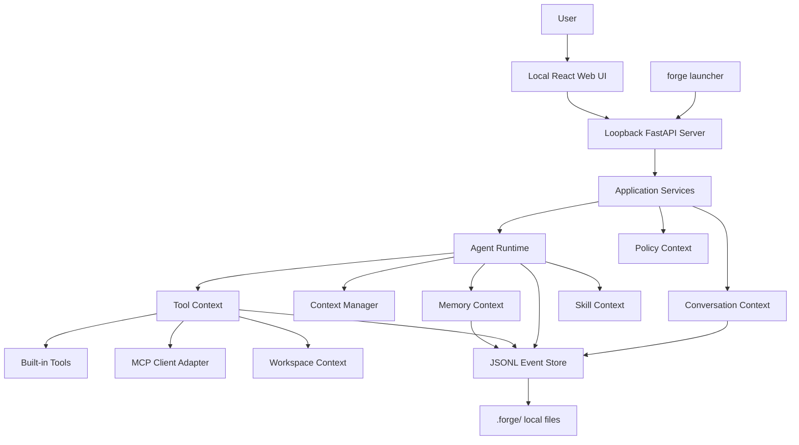

# ForgeCLI 概要设计

## 1. 背景与定位

ForgeCLI 是一个本地优先、由浏览器控制的对话式软件工程 Agent，面向开发者在真实代码仓库中完成长期、复杂、可恢复的软件工程任务。

用户执行 `forge` 启动只监听本机的 Runtime，并在浏览器项目中心进入交互式会话。Agent 读取上下文、提出计划、执行修改、运行验证、解释结果，并在需要时请求确认。ForgeCLI 不应被设计成单纯的“输入目标后自动跑完”的任务执行器。

### 1.1 产品目标

- 通过本地 Web 对话完成代码理解、修改、调试、测试、Review、提交说明等工程任务。
- 支持长任务会话恢复，避免上下文丢失和中断后重来。
- 通过 mode policy 控制自治程度，让用户可在 plan、accept_edits、auto、full_access 之间切换。
- 通过本地事件日志和状态快照实现可审计、可恢复、可复盘。
- 通过 MCP、内置工具、Skills 扩展能力。
- 以企业生产可用为目标，具备权限、安全、审计、质量门禁和发布流程。

### 1.2 非目标

- 首版不做完整 IDE 替代。
- 首版不默认做云端托管或多人协作平台。
- 首版不引入完整分布式 Multi-Agent 系统。
- 首版不追求完全无人值守自动开发，默认保留人机协作和审批。

## 2. 设计原则

### 2.1 Conversation-first

Web 控制面的核心入口是持续会话。用户执行一次 `forge` 启动本地服务，之后所有项目、会话、配置和审批都在浏览器完成。一次用户输入不一定对应一个完整任务，而是一个 turn。Agent 应根据当前会话、工作区状态、用户意图和模式策略决定回答、探索、规划或执行。

### 2.2 Mode-gated autonomy

Agent 的能力不是全局开关，而是由模式控制：

- 只读分析时不允许写文件。
- 执行模式可写文件但高风险操作需审批。
- `auto` 模式允许连续推进，但必须受预算、权限和安全策略限制，且红线命令一律拒绝。
- review/debug 模式改变 Agent 的目标函数和输出结构。

### 2.3 优先本地存储

本地 Runtime 的会话存储优先使用追加式 `jsonl` 事件日志和 `state.json` 快照。它比数据库更适合持续对话、版本管理、人工排查和轻量恢复。

### 2.4 轻量DDD领域设计

采用轻量 DDD 思路划分领域边界。核心领域模型不依赖具体 LLM、MCP SDK、终端库或文件系统实现，基础设施可替换。

### 2.5 Human-in-the-loop

企业级工程 Agent 必须把用户确认作为架构能力，而不是临时交互：

- 高风险工具调用前审批。
- 需求歧义时澄清。
- 计划重大变更时确认。
- 自动重试超过阈值时停止并解释。

### 2.6 Sub-Agent first, Multi-Agent ready

首版优先做 Sub-Agent：主控 Agent 派发隔离上下文的辅助任务，Sub-Agent 只返回报告，不拥有最终写权限。Multi-Agent 作为架构演进方向保留接口。

### 2.7 框架可用但不框架绑定

ForgeCLI 不应从第一天就把 LangChain、LangGraph、AutoGen 等框架作为系统架构本身。企业级 CLI Agent 的核心控制面必须由 ForgeCLI 自己定义，包括会话事件、权限审批、上下文压缩、工具协议、MCP 接入、状态恢复和审计。

Agent 开发框架可以作为执行引擎或适配层接入，但不能替代核心领域模型。推荐原则：

- 核心领域模型、事件日志、权限策略和 Tool Registry 由 ForgeCLI 自有实现。
- LangGraph 可作为复杂 Agent workflow 的可选编排引擎。
- LangChain 可选择性使用模型、工具、文本处理等生态组件，不直接使用其高层 Agent Executor 作为核心。
- AutoGen 适合作为后续 Multi-Agent 实验或企业多角色协作能力，不进入 MVP 主路径。
- 所有框架能力必须通过 ForgeCLI 的 `AgentLoop`、`ToolRuntime`、`EventStore`、`PolicyContext` 适配。

## 3. 用户场景

### 3.1 代码理解

用户询问某个模块、调用链、错误原因或重构影响范围。Agent 读取代码、搜索符号、总结结构，不修改文件。

适用模式：`plan`、`accept_edits`。

### 3.2 计划设计

用户提出需求，Agent 分析仓库、识别改动面、输出实现计划和测试策略，不执行修改。

适用模式：`plan`。

### 3.3 受控实现

用户确认计划后，Agent 修改代码、运行测试、根据失败结果迭代修复，并汇报最终 diff 和验证结果。

适用模式：`accept_edits`。

### 3.4 有限自治

用户给出明确任务，允许 Agent 在预算内连续执行多个步骤。Agent 遇到高风险、歧义、连续失败或预算耗尽时暂停。

适用模式：`auto`。

### 3.5 Review 与 Debug

Agent 审查当前 diff、PR 评论、CI 日志或测试失败，优先输出风险和修复建议，也可在授权后执行修复。

适用模式：`review`、`debug`。

## 4. 交互模式

模式是**权限边界**，只回答"要不要询问人类"，不回答"Agent 该做什么"——做什么由模型按
turn 判断（ADR-0009 决策 3）。裁决核心是**规则引擎**（`deny → ask → allow`），以当前普通用户
身份运行、OS 非 root 权限当外墙；可用平台（macOS Seatbelt / Linux bubblewrap）再叠加 **Bash
沙箱**做 containment，Windows 等无沙箱平台回退到 rule-engine-only（ADR-0009 决策 14）。模式是
一道"问不问"的梯度，默认 `accept_edits`：

| 模式 | 文件编辑 + 文件操作命令(区内) | 其他命令（含 git 写） | 动工作区外读/写 | 典型用途 |
| --- | --- | --- | --- | --- |
| `plan` | 不暴露 | 不暴露 | 不暴露 | 需求分析、方案设计；产出计划待批准 |
| `accept_edits`（默认） | 自动 | 询问（once/always/deny） | 询问 | 连续改代码，命令逐条把关 |
| `auto` | 自动 | 自动 | 询问 | 让 Agent 在本项目内自主推进 |
| `full_access` | 自动 | 自动 | 自动 | 需要跨工作区、且知情授权 |

裁决是一个**规则引擎**（`deny → ask → allow`，首个匹配即决定，ADR-0009 决策 3）；上表四档
只是往 allow 集预填内容的**预设**，用户可用 glob 规则语法（`Bash(npm run *)`、`Read(~/.ssh/**)`）
精确追加 allow/ask/deny。命令先经规范化解析（复合命令按 `&&`/`|` 拆解、`$(...)` 替换扫描、
包装器剥离）再匹配，防 `git status && rm -rf ~` 一类靠组合绕过。git 写不做硬性限制，按普通
命令走（accept_edits 问、auto 起放行）。两道防线横切所有模式：**OS 非 root 权限**当外墙（故
**启动即拒绝 root**）；**主动的执行前高危 deny**（`rm -rf ~`、`rm -rf ./*`、`mkfs`、`curl|sh`，
以及写系统/凭证目录、`.git/hooks`、`.npmrc`、`.forge/` 等"写入即执行"类路径）在所有模式下
直接拒绝，`full_access` 也不豁免——因为 OS 不拦你删自己的家目录。完整口径见 ADR-0009。

`review`、`debug` 不是权限模式，而是改变 Agent 目标函数和输出结构的**任务模式**，与
上表正交，属 Beta 阶段能力。

模式不是独立 Agent，而是 Policy。它影响同一个 Orchestrator 的工具权限、上下文策略、输出结构和是否自动继续。

模式、配置、模型、session、恢复和审批都通过 Web 控件调用 application services。输入框可用 `/` 打开快捷操作面板，但 slash 文本不再承担配置菜单职责。裸 `forge` 只启动本地服务，Typer 层不承载业务流程。

## 5. 总体架构



### 5.1 分层

- `interfaces`：极薄 CLI 启动器、本地 Web API、React 静态资源和共享 runtime 组合根。
- `application`：会话用例、Agent turn 编排、审批流程、恢复流程。
- `domain`：Session、Message、Plan、ToolInvocation、ModePolicy、MemoryItem 等核心模型。
- `infrastructure`：LLM Provider、MCP SDK、Shell、Git、文件系统、日志、遥测。

### 5.2 领域上下文

- Conversation Context：会话、消息、turn、模式切换。
- Configuration Context：用户配置、项目配置、企业策略、配置合并和迁移。
- Agent Context：主控 Agent、Sub-Agent、计划、反思、执行状态。
- Policy Context：权限、预算、风险分级、审批。
- Tool Context：工具注册、工具调用、MCP 接入、结果归一化。
- Workspace Context：仓库状态、文件、diff、git、测试命令。
- Memory Context：会话摘要、项目记忆、用户偏好、经验沉淀。
- Skill Context：Skill manifest、触发、指令注入、资源加载。
- Artifact Context：日志、补丁、报告、测试输出、快照。

## 6. Agent 开发框架选型

### 6.1 选型结论

ForgeCLI 的推荐方案是：

```text
ForgeCLI 自有控制面 + 可替换 AgentLoop 编排内核 + 可选 LangGraph 后端
```

也就是说，首版必须先实现稳定的本地控制面，然后在 Agent Runtime 内预留框架适配接口。复杂 workflow 可以优先评估 LangGraph，但不把 LangGraph 的 checkpoint、message schema、tool schema 直接暴露为 ForgeCLI 的公共协议。

### 6.2 为什么不直接使用框架搭完整系统

LangChain、LangGraph、AutoGen 能提升 Agent 编排效率，但它们不能直接解决 ForgeCLI 的核心生产问题：

- CLI 会话的持续对话体验。
- 本地 `jsonl + state.json` 可恢复存储。
- 企业级权限审批和危险命令管控。
- 工具调用审计和 artifact 管理。
- MCP、内置工具、Skills 的统一权限模型。
- 与 git/workspace/diff/test 流程深度集成。
- 长任务中断恢复、上下文压缩和用户可解释 inspect。

这些能力必须是 ForgeCLI 的产品内核，而不是框架默认行为。

### 6.3 框架对比

| 框架 | 适合使用的位置 | 优点 | 风险 | ForgeCLI 策略 |
| --- | --- | --- | --- | --- |
| LangGraph | Agent 编排、状态图、Plan-Act-Reflect 流程 | 状态机清晰，适合可恢复长流程和复杂分支 | checkpoint 和状态模型可能与本地 event store 重叠 | V1 优先评估作为 `AgentLoop` 后端 |
| LangChain | LLM provider、prompt、output parser、部分工具生态 | 生态丰富，接入快 | 抽象层较厚，依赖面大，高层 Agent 不易控 | 选择性使用底层组件，不作为核心 Agent Runtime |
| AutoGen | 多角色协作、Multi-Agent 原型 | 多 Agent 对话模型成熟 | 对 CLI 人机协作、权限和本地审计不够贴合 | V2 Multi-Agent 实验，不进入 MVP |
| CrewAI 等任务编排框架 | 角色化任务流 | 上手简单 | 更偏任务自动化，不适合作为 Claude Code 风格交互内核 | 暂不作为主路径 |
| 自研轻量 Runtime | CLI turn、权限、存储、工具协议 | 可控、可审计、贴合产品 | 需要自行实现编排能力 | MVP 必选控制面 |

### 6.4 框架引入阶段

- MVP：自研轻量 Runtime，完成会话、模式、工具、审批、事件日志和恢复。
- Alpha：稳定 `AgentLoop` 边界（只产出意图、不执行副作用），使编排内核可替换。
- Beta：对 plan/act/debug/review 等复杂流程试点 LangGraph 后端。
- V2：评估 AutoGen 或自研 Multi-Agent Runtime，用于跨角色、跨任务、后台长期 Agent。

### 6.5 AgentLoop 编排内核

无论是否使用 LangGraph，ForgeCLI 对 application 层只暴露统一内核（字段口径见 ADR-0010 §4）：

```text
AgentLoop：LoopInput -> LoopDecision | LoopAction | LoopStop
```

`LoopAction` 只能返回：

- assistant message
- plan update
- tool request
- approval request
- context compaction request
- sub-agent task
- final turn state

框架内部不得直接写文件、直接执行 shell、直接写长期记忆或直接修改 session state。所有副作用必须回到 ForgeCLI application service 处理。

## 7. Agent 架构

### 7.1 主控 Agent

`OrchestratorAgent` 是唯一能做最终决策的 Agent。它负责：

- 理解用户输入和当前模式。
- 决定是否回答、探索、规划或执行。
- 调用工具或派发 Sub-Agent。
- 合并观察结果。
- 判断是否需要用户确认。
- 维护计划、上下文和状态。

### 7.2 Sub-Agent

Sub-Agent 是主控 Agent 的辅助单元，通常无写权限。首版建议提供：

- `ResearchAgent`：隔离式代码搜索和技术调研。
- `PlannerAgent`：复杂任务计划生成和计划修订。
- `ReviewerAgent`：代码风险审查和测试缺口识别。
- `DebugAgent`：失败日志分析和修复建议。
- `MemoryAgent`：任务结束后提炼可复用项目知识。

### 7.3 Multi-Agent 引入条件

Multi-Agent 指多个 Agent 具备相对独立目标、状态、工具权限和生命周期。只有满足以下条件时才建议引入：

- 大型仓库需要前端、后端、测试、文档等角色并行协作。
- 企业平台需要多个长期后台 Agent 监听 CI、PR、Issue、告警。
- 需要跨项目、跨团队共享 Agent 状态。
- 需要多角色交叉验证或投票来降低高风险变更。
- 单主控 + Sub-Agent 已无法满足吞吐或组织边界。

首版不实现完整 Multi-Agent，但 Agent Runtime 应避免写死单 Agent 假设。

## 8. 本地存储方案

默认存储结构：

```text
.forge/
  sessions/
    <session_id>/
      events.jsonl
      state.json
      summary.md
      artifacts/
      checkpoints/
  memory/
    project.md
    user.json
    skills.jsonl
  config.toml
```

### 8.1 JSONL 事件日志

`events.jsonl` 采用 append-only 方式记录：

- 用户消息
- Agent 消息
- 模式切换
- 工具调用请求和结果
- 审批请求和审批结果
- 计划创建和计划变更
- 上下文压缩
- 错误和恢复点

### 8.2 State 快照

`state.json` 保存当前会话快照，便于快速恢复：

- 当前模式
- 当前计划
- 最近摘要
- token budget
- 未完成工具调用
- 最近 checkpoint

### 8.3 数据库使用边界

SQLite 不作为首版默认依赖。以下场景可引入：

- 企业审计和复杂查询。
- 多用户共享。
- 服务端化。
- 大量历史 session 检索。
- 需要事务性索引。

## 9. 工具、MCP 与 Skills

### 9.1 Tool Registry

所有工具通过统一注册中心暴露：

- 内置工具：文件、搜索、shell、git、测试、diff。
- MCP 工具：通过 MCP Client Adapter 接入。
- Skill 工具：由 Skill 声明可用资源和行为约束。

工具必须声明：

- 名称和描述
- JSON Schema 输入
- 结果结构
- 风险等级
- 超时
- 是否允许并发
- 是否需要审批

### 9.2 MCP 接入

MCP server 通过 allowlist 管理。接入流程：

1. 读取 MCP 配置。
2. 启动或连接 server。
3. 拉取 tools/resources/prompts。
4. 转换为 ForgeCLI ToolSpec。
5. 包装权限、审计、超时和错误处理。

### 9.3 Skills 接入

Skill 是可复用能力包，包含：

- 触发条件
- 任务说明
- 推荐工具
- 资源文件
- 示例流程
- 安全限制

Skill 不应绕过 Tool Registry，也不应直接获得额外权限。

## 10. 上下文与记忆

### 10.1 上下文

上下文分为：

- 当前用户输入
- 会话摘要
- 当前计划
- 最近工具观察
- 相关文件片段
- 项目记忆
- Skill 指令
- 模式策略

Context Manager 每轮按 token budget 组装，超过阈值时压缩历史。

### 10.2 记忆

记忆分层：

- Session Memory：当前会话短期事实。
- Project Memory：项目约定、测试命令、架构说明。
- User Memory：用户偏好。
- Skill Memory：任务模式经验。

长期记忆必须有来源、作用域、更新时间和可撤销标识。

## 11. 安全与权限

生产可用 CLI Agent 必须默认保守：

- 默认只允许访问当前 workspace。
- 写文件、删除文件、安装依赖、联网、push、发布均需权限策略控制。
- shell 命令按风险分级。
- 敏感信息不写入日志。
- MCP server 必须可配置、可禁用、可审计。
- `auto` 模式必须有步骤、时间、token 和工具调用预算。

## 12. 非功能性要求

| 类别 | 要求 |
| --- | --- |
| 可恢复性 | 任意 turn 后中断可恢复 |
| 可审计性 | 所有工具调用和审批进入事件日志 |
| 可解释性 | 关键决策、风险和测试结果可追踪 |
| 可扩展性 | LLM、MCP、工具、Skill 可替换 |
| 安全性 | 高风险操作默认审批，敏感数据脱敏 |
| 性能 | 常规 turn 启动延迟小于 2 秒，长任务状态写入小于 100 ms |
| 稳定性 | 工具失败隔离，不破坏会话状态 |
| 可测试性 | 核心领域逻辑无外部依赖，可单元测试 |

## 13. 演进路线

### MVP

- CLI 对话入口。
- session 存储：`events.jsonl` + `state.json`。
- plan / accept_edits / auto / full_access 四档权限模式（默认 accept_edits）。
- 文件、搜索、shell、git、测试基础工具。
- 基础上下文压缩。
- 人工审批。

### V1

- auto/review/debug 模式。
- MCP 接入。
- Skills 加载。
- Sub-Agent：Research、Reviewer、Debug。
- 项目记忆和用户偏好。
- run inspect、resume、compact。

### V2

- 多模型路由。
- 向量检索记忆。
- 企业审计存储。
- 团队共享配置。
- Multi-Agent Runtime。
- 后台任务监听 CI、PR、Issue。
