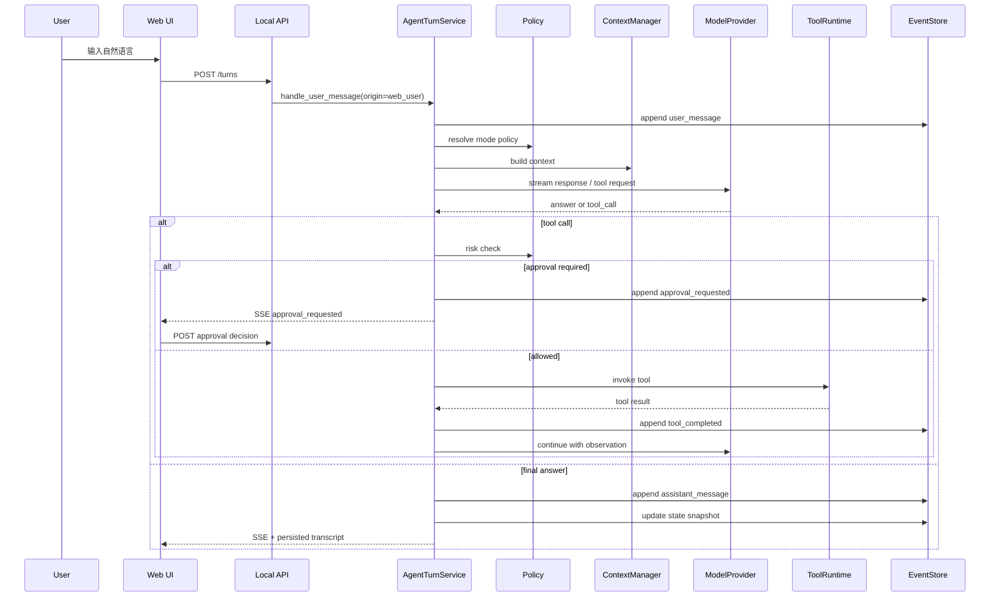

# ForgeCLI 详细设计

## 1. 模块结构

代码结构：

```text
src/
  forgecli/
    interfaces/
      cli/
        app.py
      runtime/
        llm_wiring.py
        tool_wiring.py
      web/
        app.py
        server.py
        runtime.py
        events.py
        approval.py
    application/
      services/
        conversation_service.py
        agent_turn_service.py
        approval_service.py
        session_service.py
        resume_service.py
        config_service.py
        tool_service.py
      agent_loop/
        agent_loop.py
        builtin_agent_loop.py
    domain/
      config/
      conversation/
      agent/
      policy/
      tool/
      workspace/
      memory/
      skill/
      artifact/
    tools/
      registry.py
      runtime.py
      builtin/
        filesystem_tool.py
        search_tool.py
        shell_tool.py
        git_tool.py
        test_tool.py
      mcp/
        mcp_tool_adapter.py
    infrastructure/
      config_sources/
        file_config_source.py
        env_config_source.py
      agent_frameworks/
        langgraph_adapter.py
        langchain_adapter.py
      llm/
      mcp/
      shell/
      git/
      filesystem/
      storage/
      telemetry/
    shared/
      errors.py
      result.py
      ids.py
tests/
```

这是目标结构，不要求 MVP 第一天全部创建。MVP 骨架仅创建当前阶段需要的目录和文件，未来阶段开始时再补齐对应模块，避免空目录和空 adapter 带来维护噪音。AutoGen 仅作为 V2 Multi-Agent 候选，不进入 MVP 骨架。

依赖方向：

```text
interfaces -> application
application -> domain
application -> tools
tools -> domain
tools -> infrastructure adapters
infrastructure adapters -> domain/application ports
domain -> shared
```

项目采用 `src/forgecli + tests` 布局，React/TypeScript 源码位于 `web/`，构建产物进入 Python package。`domain` 不依赖 Typer、FastAPI、React、LLM SDK、MCP SDK 或具体文件系统。`tools` 是 Agent 能力层，不是普通基础设施；具体 shell、git、filesystem、MCP client 才属于基础设施适配器。

### 1.1 模块边界说明

配置、工具和 Agent 主循环都是一等模块，不应被简单归入 `infrastructure`。

- `domain/config`：定义配置值对象和校验规则，例如模型、权限、MCP、存储、上下文预算。
- `application/services/config_service.py`：负责配置加载、合并、查询、更新和迁移。
- `infrastructure/config_sources`：只负责从文件、环境变量、交互式命令输入等来源读取配置。
- `tools`：负责 Tool Registry、Tool Runtime、内置工具定义和 MCP tool 适配，是 Agent 能力面的一部分。
- `infrastructure/shell`、`infrastructure/git`、`infrastructure/filesystem`：只是工具实现依赖的底层适配器。
- `application/agent_loop`：定义 `AgentLoop` ReAct 内核与 `BuiltinAgentLoop`（ADR-0010）。
- `infrastructure/agent_frameworks`：放第三方框架适配器，例如 LangGraph、LangChain。AutoGen 适配器只在 V2 Multi-Agent 阶段需要时创建。

因此，工具系统不属于普通基础设施。工具对 Agent 来说是业务能力和安全边界，必须有自己的 registry、schema、权限和审计。基础设施只提供工具执行所需的底层能力。

## 2. Agent 开发框架适配

### 2.1 设计立场

ForgeCLI 可以使用 Agent 开发框架，但不能把第三方框架的数据模型作为系统核心模型。核心原因是 ForgeCLI 的生产级能力集中在 CLI 会话、权限审批、本地可恢复存储、工具审计和工作区安全，这些必须由自有领域模型保障。

推荐结构：

```text
AgentTurnService
  -> AgentLoop（MVP 唯一实现：BuiltinAgentLoop）
  -> ToolRuntime
  -> EventStore
  -> PolicyContext
```

这里的 `AgentLoop` 不是另一个 Agent，而是“单个 turn 或一段内部推理流程如何被编排”的内核。
它只产出结构化意图，副作用一律由 `AgentTurnService` 执行——正是这条边界（而不是某个
预留的 adapter 接口）保证了编排内核将来可替换：换掉它时，事件日志、权限审批和工具运行时
都不需要重写。MVP 不预先抽象编排适配层，理由见 ADR-0010 §3。

Agent 主循环以受控 ReAct 为基石：模型只生成回答、计划、工具请求或继续观察的意图，
副作用由 `AgentTurnService` 按 mode policy、approval 和 Tool Runtime 执行。完整主架构见
`docs/adr/2026-07-01-0010-采用受控ReAct作为Agent主循环架构.md`。

### 2.2 AgentLoop 接口

`AgentLoop` 是编排隔离层。application 层只依赖它，不直接依赖 LangGraph、LangChain 或
AutoGen。字段口径以 ADR-0010 §4 为准，本节只作索引。

输入 `LoopInput`：

- `user_intent`：用户消息、slash command、审批回复或系统恢复事件。
- `resume_state`：由 `events.jsonl + state.json` 还原，不依赖第三方 checkpoint。
- `context_package`：本轮模型上下文。
- `mode` / `mode_policy`：当前模式能力边界。
- `tool_catalog`：当前允许暴露给模型的工具清单。
- `budgets`：本轮 step / model call / token 预算；tool call 数量作为运行指标统计，不作为固定总数上限。

输出（每次迭代三选一）：

- `LoopDecision`：可审计的决策摘要，不含 raw chain-of-thought。
- `LoopAction`：`answer` / `request_tool`，只表达意图。
  （早先这里还列着 `ask_user` / `request_approval` / `request_compaction`。三者都没有
  也不会有构造点：审批由 `ApprovalService` 承担，压缩由 `WindowManager` 承担，向人提问
  由 `ask_user` 工具承担（ADR-0043 决策 1）。一张列着三个不存在动作的表，读起来像三条
  已经接好的路。）
- `LoopStop`：以统一 `LoopStopReason` 表达正常完成、可恢复暂停或阻塞停止。

约束：

- `AgentLoop` 不直接写文件。
- `AgentLoop` 不直接执行 shell。
- `AgentLoop` 不直接写 `events.jsonl`。
- `AgentLoop` 不直接写长期 memory。
- `AgentLoop` 不绕过 Tool Registry 调用 MCP。
- `AgentLoop` 只返回意图，由 `AgentTurnService` 执行副作用。

### 2.2.1 AgentLoop 和 AgentTurnService 的分工

`AgentTurnService` 负责产品级控制流：

- 接收用户输入。
- 解析 slash command。
- 加载配置和模式策略。
- 构建上下文。
- 调用 `AgentLoop`。
- 执行审批、工具调用、事件写入和状态快照。

`AgentLoop` 负责模型级编排：

- 判断本轮应该回答、规划、调用工具还是反思。
- 组织 prompt、分支或循环。
- 生成结构化意图。
- 在 debug/review 等复杂流程下决定下一步。

该分工保证编排内核只影响“怎么思考和编排”，不接管“怎么落盘、怎么审批、怎么执行副作用”。

### 2.3 BuiltinAgentLoop

MVP 默认实现，也是当前唯一实现：ForgeCLI 自研的轻量 ReAct 循环。

职责：

- 普通对话 turn。
- `plan` 模式只读规划。
- `accept_edits` / `auto` / `full_access` 模式下的工具请求。
- 基础 reflection。
- 简单 Plan-Act 循环。

优势：

- 依赖少。
- 行为可控。
- 易于测试。
- 便于验证 ForgeCLI 自有事件和权限模型。

`BuiltinAgentLoop` 的目标不是替代所有框架，而是在 MVP 阶段提供最小、透明、可调试的 Agent 编排能力。等核心闭环稳定后，复杂流程可逐步迁移到 LangGraph adapter。

当前实现补充约定：单轮不按工具调用总次数截断。工具调用次数仍作为运行指标统计，但不会因为达到一个
固定总数而停止；重复相同调用、安全策略连续拒绝、模型调用和整体循环步数仍可触发各自的安全处理。
工作区快照在工具边界与模型请求边界检查，发现的新增、修改、删除会以 `workspace_changed` 事件记录，
并在下一次模型请求中注明是本 agent 还是外部参与者（其他 agent 或人类）造成的变化。

### 2.4 LangGraphWorkflowAdapter

LangGraph 适合在 Alpha/Beta 阶段引入，用于复杂 workflow：

- plan -> execute -> observe -> reflect。
- debug 分支。
- review 分支。
- auto 模式下的预算循环。
- Sub-Agent 并行只读探索。

接入要求：

- LangGraph state 必须从 ForgeCLI `AgentState` 映射而来。
- LangGraph checkpoint 不作为唯一恢复来源；ForgeCLI `events.jsonl` 仍是审计源。
- LangGraph node 不能直接执行真实工具，只能产出 `ToolRequest`。
- LangGraph interrupt 需要映射为 ForgeCLI `ApprovalRequest` 或 `UserInputRequired`。
- LangGraph 版本升级需要兼容性测试。

适合的 node：

- `intent_node`
- `plan_node`
- `tool_decision_node`
- `reflection_node`
- `compact_node`
- `sub_agent_dispatch_node`

`LangGraphWorkflowAdapter` 的作用是把 ForgeCLI 的 `AgentState`、`ContextPackage`、`ToolCatalog` 映射到 LangGraph 的 graph state，并把 LangGraph 输出映射回 ForgeCLI 的 `WorkflowResult`。它不是新的存储系统，也不是新的权限系统。

### 2.5 LangChain 使用边界

LangChain 可选择性使用：

- model provider 适配。
- prompt template。
- output parser。
- text splitter。
- 部分 retriever 组件。

不建议首版使用：

- 高层 Agent Executor。
- 直接绑定 LangChain tool schema 为 ForgeCLI tool schema。
- 依赖 LangChain memory 作为 ForgeCLI 记忆系统。

原因：

- ForgeCLI 需要更严格的权限、审计和本地状态恢复。
- 高层 Agent 抽象容易绕过 mode policy。
- LangChain memory 与 ForgeCLI 的 `jsonl + state + project memory` 职责重叠。

### 2.6 AutoGen 使用边界

AutoGen 更适合 V2 的完整 Multi-Agent 能力，不进入 MVP。

适合场景：

- 多角色协作开发。
- 多 Agent 交叉 Review。
- 前端、后端、测试 Agent 并行。
- 企业平台后台 Agent。

首版暂不采用的原因：

- ForgeCLI 当前核心是单用户本地对话。
- Multi-Agent 会显著增加状态、权限、调度和冲突解决复杂度。
- Sub-Agent 已能覆盖首版大部分隔离探索和审查需求。

`FutureAutoGenWorkflowAdapter` 只是预留命名，表示未来如果引入 AutoGen，必须通过同样的 workflow adapter 接口接入。首版不实现该 adapter，不应让代码依赖 AutoGen 的 agent/session/message 模型。

### 2.7 框架依赖治理

引入任何 Agent 框架前必须满足：

- 有 ADR 记录。
- 有最小 POC。
- 有可替换 adapter。
- 有版本锁定。
- 有回滚方案。
- 有关键 E2E。
- 不改变 ForgeCLI 公共事件 schema。

## 3. 领域模型

### 3.1 Session

`Session` 表示一次持续对话。

核心字段：

- `session_id`
- `workspace_root`
- `created_at`
- `updated_at`
- `current_mode`
- `status`: active / paused / completed / failed
- `state_version`
- `summary`

> 2026-08-17 按 ADR-0022 §6.1 移除 `active_plan_id`: 计划是项目级状态, 活动指针归
> `~/.forge/projects/<project_id>/plans/index.toml`, 不随会话走.

### 3.2 Message

`Message` 表示会话消息。

字段：

- `message_id`
- `role`: user / assistant / tool / system / sub_agent
- `content`
- `created_at`
- `metadata`

### 3.3 AgentTurn

`AgentTurn` 表示一次用户输入到 Agent 响应的完整处理过程。

字段：

- `turn_id`
- `session_id`
- `input_message_id`
- `mode`
- `context_snapshot_id`
- `tool_invocations`
- `output_message_id`
- `status`

### 3.4 Plan 与 TodoList

> 2026-08-17 按 ADR-0022 修订. 原设计把方向与执行状态放在同一个 `PlanStep` 上, 实践中
> 无法回答"以谁为准", 因此拆成两个概念.

`Plan` 是可选对象, 只在复杂任务, `plan` 模式或需要连续执行时产生; `TodoList` 是执行期的
防漂移清单, 可以脱离 `Plan` 独立存在. 两者都是**项目级持久化状态**, 落在
`~/.forge/projects/<project_id>/plans/`, 跨会话存活.

| | `Plan` | `TodoList` |
| --- | --- | --- |
| 回答 | 整个大方向 | 当前该做哪一步 |
| 谁裁决 | 人 (ADR-0023 的四选一评审) | 无需裁决 |
| 批准后 | 不再变动, 要变就是新 revision | 允许随时纠正 |

`PlanDocument` 字段:

- `plan_id`
- `revision`
- `title`
- `goal`
- `context`
- `approach`
- `steps`
- `risks`
- `acceptance`
- `status`: proposed / approved / rejected / superseded
- `template_version`

`PlanStep` 字段:

- `title`
- `detail`

**`PlanStep` 不带 `status`, `requires_approval`, `expected_output`, `evidence`.**
状态跟踪整体归 `TodoList`; 审批是逐次工具调用的事 (ADR-0004 §6.1), 不是计划步骤的属性
——一条计划步骤可能展开成十次工具调用, 每次各自裁决.

`TodoList` 字段:

- `todo_id`
- `plan_id` (可空: 待办不必绑定计划)
- `items`
- `revision`
- `updated_at`

`TodoItem` 字段:

- `title`
- `status`: pending / in_progress / done / dropped

不变量:**同一时刻至多一条 `in_progress`**, 在领域层强制. 允许多条并行等于没有"当前
步骤", 而"当前步骤"正是这份清单存在的理由.

计划的正文格式由固定模板渲染, 模型只填结构化字段, 不产出 Markdown. 计划的"步骤"小节就是
待办清单的骨架: 批准一份计划等于用它的步骤播种待办.

活动指针 `active_plan_id` 归项目级 `plans/index.toml`,**不在 `Session` 上**——计划跨
会话, 指针应当跟着项目走而不是跟着会话走.

### 3.5 ModePolicy

`ModePolicy` 决定当前 turn 的能力边界。

字段：

- `mode`
- `allow_file_write`
- `allow_shell`
- `allow_network`
- `allow_auto_continue`
- `require_plan_before_write`
- `require_approval_for_risk`
- `max_steps`
- `tool_calls`（仅统计，不设固定总数上限）
- `max_runtime_seconds`
- `context_budget_tokens`

默认策略：

| 模式 | 写文件 | shell | 自动继续 | 写前计划 | 说明 |
| --- | --- | --- | --- | --- | --- |
| chat | 否 | 受限 | 否 | 是 | 默认对话 |
| plan | 否 | 只读 | 否 | 是 | 只读规划 |
| act | 是 | 是 | 否 | 是 | 用户确认后执行 |
| auto | 是 | 是 | 是 | 是 | 有预算限制 |
| review | 否 | 只读 | 否 | 否 | 审查优先 |
| debug | 可选 | 是 | 可选 | 视情况 | 诊断优先 |

### 3.6 ToolSpec

字段：

- `name`
- `description`
- `input_schema`
- `output_schema`
- `risk_level`: readonly / write / network / destructive / external
- `timeout_seconds`
- `supports_parallel`
- `requires_approval`
- `provider`: builtin / mcp / skill

### 3.7 ToolInvocation

字段：

- `invocation_id`
- `tool_name`
- `input`
- `started_at`
- `finished_at`
- `status`
- `result`
- `risk_level`
- `approval_id`

### 3.8 ApprovalRequest

字段：

- `approval_id`
- `reason`
- `risk_level`
- `requested_action`
- `created_at`
- `status`: pending / approved / rejected / expired
- `approved_by`

### 3.9 MemoryItem

字段：

- `memory_id`
- `scope`: session / project / user / skill
- `content`
- `source_event_id`
- `confidence`
- `created_at`
- `updated_at`
- `expires_at`

## 4. 本地文件存储

### 4.1 目录结构

```text
.forge/
  config.yaml
  sessions/
    2026-06-16T10-30-00Z-abcd1234/
      events.jsonl
      state.json
      summary.md
      artifacts/
        tool-output/
        patches/
        reports/
      checkpoints/
        0001.json
        0002.json
  memory/
    project.md
    user.json
    skills.jsonl
  mcp/
    servers.toml
```

### 4.2 events.jsonl

每行是一个独立 JSON event。事件必须 append-only，不做原地修改。

事件通用字段：

```json
{
  "event_id": "evt_01",
  "session_id": "ses_01",
  "type": "user_message",
  "created_at": "2026-06-16T10:30:00Z",
  "payload": {}
}
```

核心事件类型：

- `session_created`
- `mode_changed`
- `user_message`
- `assistant_message`
- `plan_created`
- `plan_reviewed`
- `todo_updated`
- `tool_requested`
- `approval_requested`
- `approval_resolved`
- `tool_completed`
- `context_compacted`
- `memory_written`
- `checkpoint_created`
- `error_occurred`
- `session_paused`
- `session_completed`

工具完成事件示例：

```json
{
  "event_id": "evt_tool_done_01",
  "session_id": "ses_01",
  "type": "tool_completed",
  "created_at": "2026-06-16T10:31:20Z",
  "payload": {
    "invocation_id": "tool_01",
    "tool_name": "shell_run",
    "status": "succeeded",
    "stdout_artifact": "artifacts/tool-output/tool_01.stdout",
    "stderr_artifact": "artifacts/tool-output/tool_01.stderr",
    "summary": "pytest passed: 124 passed",
    "exit_code": 0
  }
}
```

### 4.3 state.json

`state.json` 是快速恢复快照，可重建，不是审计源。

示例：

```json
{
  "schema_version": 1,
  "session_id": "ses_01",
  "workspace_root": "/repo",
  "current_mode": "act",
  "status": "active",
  "summary_path": "summary.md",
  "last_event_id": "evt_120",
  "context": {
    "last_compaction_event_id": "evt_100",
    "token_budget": 120000
  },
  "budgets": {
    "max_tool_calls": 50,
    "used_tool_calls": 12
  }
}
```

写入要求：

- `events.jsonl` 先追加成功，再更新 `state.json`。
- `state.json` 写入使用临时文件 + 原子 rename。
- 恢复时以 `events.jsonl` 为准，可校验 `state.json.last_event_id`。

## 5. Agent Turn 流程

### 5.1 本地 Web 入口模型

ForgeCLI 当前只保留本地 Web 主入口。

交互式入口：

- `forge`：启动 loopback Web 服务并打开浏览器。
- 已信任当前目录时自动激活对应项目；否则进入项目中心。
- 项目中心列出 `~/.forge/projects` 中的已信任项目，并允许显式信任新目录。
- 历史 session 由 Web 列表恢复；同一时刻只激活一个项目和一个 turn。

当前不实现 Typer 业务子命令：

- 不提供 `forge chat`。
- 不提供 `forge status`。
- 不提供 `forge config ...`。
- 不提供 `forge models ...`。
- 不提供 `forge resume ...`。

单入口规则：

- `/config ...` 复用 `ConfigService`。
- `/models ...` 复用 `ModelCatalogService`。
- `/status` 复用 session 查询服务。
- `/resume` 复用恢复服务。
- Typer 层只负责裸 `forge`、`--help`、`--version`、`--open`、`--port` 和进程入口，不承载业务流程。

Web 会话内，用户输入与控制动作分开：

- 普通自然语言：以 `InputOrigin.WEB_USER` 进入 Agent Turn。
- 模式、配置、恢复、审批和计划评审：调用版本化 REST API，不转成模型文本。
- `#` 没有人工 Shell 语义；Web 不提供 PTY，Agent `shell_run` 仍走完整安全链。



### 5.2 Intent Router

每次输入先经过 Intent Router，识别：

- 普通对话
- 斜杠命令
- 模式切换
- 审批回复
- 继续执行
- 中断/暂停
- 对当前计划的修改

Intent Router 不直接执行动作，只返回结构化意图。

### 5.3 Slash Commands

首版建议支持：

- `/help`：查看会话内可用命令。
- `/mode`：查看当前模式。
- `/plan`：切换到 `plan`（只读计划）。
- `/act`：兼容别名，映射到默认的 `accept_edits`。
- `/accept-edits`：切换到 `accept_edits`（放行低风险编辑，命令仍询问）。
- `/auto`：切换到 `auto`（额外放行低风险命令）。
- `/full-access`：切换到 `full_access`（可跨工作区、联网；仅 OS 非 root 与红线兜底）。
- `/chat`：兼容别名，映射到默认的 `accept_edits`（ADR-0009 决策 3）。
- `/review`：切换到 review。
- `/debug`：切换到 debug。
- `/status`：查看会话、计划、预算。
- `/config`：查看或修改配置，复用 `ConfigService`。
- `/models`：查看、刷新或推荐模型，复用 `ModelCatalogService`。
- `/compact`：压缩上下文。
- `/resume`：恢复历史 session。
- `/memory`：查看项目和用户记忆。
- `/tools`：查看工具和权限。
- `/mcp`：查看 MCP server。
- `/pause`：暂停当前 session。
- `/exit`：安全退出当前交互式会话。

斜杠命令处理规则：

- 命令必须写入事件日志，便于审计和恢复。
- 模式切换类命令写入 `mode_changed` 事件。
- 配置修改类命令写入配置变更事件。
- 控制类命令不应被模型当作普通自然语言处理。
- 未知命令应给出可操作错误，并提示 `/help`。

## 6. 上下文管理

### 6.1 Context Package

每轮发送给模型的上下文由 `ContextPackage` 组成：

- `system_instructions`
- `mode_policy`
- `session_summary`
- `recent_messages`
- `active_plan`
- `workspace_snapshot`
- `relevant_files`
- `tool_observations`
- `memory_items`
- `skill_instructions`

### 6.2 预算分配

默认 token budget 比例：

- 系统和模式策略：10%
- 会话摘要：15%
- 最近对话：20%
- 计划和状态：15%
- 文件片段和搜索结果：25%
- 工具结果：10%
- 记忆和 Skills：5%

### 6.3 压缩策略

触发条件：

- token 使用超过阈值。
- 工具输出过长。
- 完成一个计划阶段。
- 用户手动 `/compact`。
- session 暂停前。

摘要必须包含：

- 用户目标和当前模式。
- 已完成的关键动作。
- 当前计划状态。
- 已修改或关注的文件。
- 失败、风险和未完成事项。
- 用户明确约束。
- 后续建议。

## 7. 记忆管理

### 7.1 记忆写入原则

允许写入：

- 项目测试命令。
- 架构事实。
- 用户明确偏好。
- 多次验证过的工程约定。

禁止默认写入：

- 凭证、token、cookie、私钥。
- 一次性猜测。
- 未验证的模型推断。
- 敏感业务数据。

### 7.2 项目记忆

`memory/project.md` 示例结构：

```md
# Project Memory

## Commands

- Test: `pytest`
- Lint: `ruff check .`

## Architecture

- CLI entrypoint uses Typer.

## Conventions

- Prefer JSONL event logs for session storage.
```

### 7.3 用户记忆

`memory/user.json` 示例：

```json
{
  "language": "zh-CN",
  "approval_preferences": {
    "network": "ask",
    "git_push": "ask"
  },
  "output_style": {
    "prefer_concise_final": true
  }
}
```

## 8. Tool Runtime

### 8.1 工具调用阶段

1. Agent 生成 tool call。
2. Tool Registry 查找 ToolSpec。
3. Policy Context 做风险判断。
4. Approval Service 决定是否询问用户。
5. Tool Executor 执行。
6. Result Normalizer 归一化输出。
7. Artifact Store 保存长输出。
8. Event Store 记录结果。

### 8.2 动作裁决：规则引擎 + 模式预设（ADR-0009 决策 3/6/8）

裁决是一个规则引擎：**`deny → ask → allow` 优先级，第一个匹配即决定**；OS 非 root 是外墙；
模式只决定默认往 allow 集预填什么。命令先经规范化解析（复合拆解、包装器剥离、`$(...)` 替换
扫描）再匹配，防 `git status && rm -rf ~` 一类绕过。用户可用 glob 规则语法精确追加规则。

| 动作 | 示例 | accept_edits | auto | full_access |
| --- | --- | --- | --- | --- |
| 只读命令 | `ls`/`grep`/`git status`（内置只读集） | 允许 | 允许 | 允许 |
| 区内文件编辑 | Edit/Write | 允许 | 允许 | 允许 |
| 文件操作命令 | `mkdir touch rm mv cp sed`（区内非受保护） | 允许 | 允许 | 允许 |
| 其他命令（含 git 写） | 测试 / 构建 / python / `git commit`/`push` | 询问 | 允许 | 允许 |
| 动工作区外·读/写 | 读凭证文件、写区外路径 | 询问 | 询问 | 允许 |
| 高危 deny | `rm -rf ~`、`mkfs`、写 `.git/hooks`/`.npmrc`/`~/.ssh`/`.forge/` | **拒绝** | 拒绝 | 拒绝 |

git 写不做硬性限制，按普通命令走。高危 deny 穿透所有模式（含 `full_access`，选择 A）；
`accept_edits` 的命令询问支持 once/always/session/deny（学习式授权）。**MVP 即实现 glob 规则
配置语法**（gitignore 式 `//`/`~/`/`/`/`./` 路径锚定 + Bash `*` 模式）。

> 2026-09-04 修订（ADR-0046）：这张表描述的 `accept_edits` 行为一度没有落地——实现把判据写成了
> "它是不是一次 shell 调用"，于是前三行在 `accept_edits` 下全部变成"询问"。现在判据回到这张表：
> 按**分析器推导出的能力集合与目标集合**裁决，而不是按上面那些示例命令名——ADR-0024 已经拒绝过
> 命令名白名单（名字不是事实，`cat` 可以是 Agent 自己写进 PATH 的一个文件）。第四行"其他命令"
> 对应的机制判据是 `Capability.EXECUTE_SCRIPT`：有脚本正文、`java -jar` 一类跑任意代码的、
> 以及 `find -exec` 这种把目标交给内层命令的。

### 8.3 内置工具

以 ADR-0004 §14 的清单为准，那张表带能力上界、目标声明能力和"是否已注册"，并由
`tests/tool_request/test_registered_tool_stack.py` 对组合根的产物断言。这里只列名字：

- 读：`fs_read`、`search_text`、`artifact_read`
- 写：`fs_apply_patch`
- 执行：`shell_run`
- 计划与待办：`plan_read`、`plan_write`、`todo_write`、`todo_set_status`
- 记忆：`memory_write`、`memory_forget`

> 2026-08-20 修订：本节此前列的是首版设想（`fs.write_patch`、`git.status`、`git.diff`、
> `git.show`、`test.run`），其中后四个从未实现——git 只读查询合并成了一个 `git_read`，
> 跑测试走 `shell_run`。列一份没人维护的清单，比不列更容易让人以为工具已经存在。

> 2026-09-04 修订：删掉 `fs_find`、`find_definition`、`git_read` 与未注册的 `tree_view`。
> 判据不是数量而是**每个工具换来了什么 shell 给不了的东西**：这四个换不来任何东西，
> `find` / `grep` / `git log` 做同一件事且更灵活，而每个工具的 schema 都要在每一步重发一次。
> 留下的四个各自换来一样：`fs_read` 是 read-before-edit 的强制点与
> `body_in_window` 的窗口语义，`fs_apply_patch` 是审批界面上的逐字 diff（`ContentPreview`），
> `search_text` 是结构化命中与编码/忽略规则的正确处理，`artifact_read` 是内容寻址取回。

文件修改应优先通过 patch 语义执行，便于审计和回滚。

## 9. MCP 详细设计

### 9.1 配置

`.forge/mcp/servers.toml`：

```toml
[[servers]]
name = "github"
transport = "stdio"
command = "github-mcp-server"
args = []
enabled = true
allowed_tools = ["search_issues", "get_pr"]
```

### 9.2 接入流程

`McpClientAdapter` 负责：

- 启动/连接 MCP server。
- 读取 tool/resource/prompt。
- 将 MCP tool schema 转换为 `ToolSpec`。
- 为每个 MCP tool 自动加命名空间：`mcp.github.search_issues`。
- 包装超时、错误、权限和事件日志。

### 9.3 安全要求

- MCP server 默认禁用网络敏感工具。
- MCP tool 必须经过 Tool Registry，不能被 Agent 直接调用。
- MCP 配置变更记录事件。
- 企业模式支持 server allowlist。

## 10. Skills 详细设计

### 10.1 Skill Manifest

```json
{
  "name": "fix-ci",
  "version": "1.0.0",
  "description": "Diagnose and fix CI failures",
  "triggers": ["ci failed", "fix checks", "workflow failed"],
  "instructions": "Read CI logs first, identify failing job, reproduce locally when possible.",
  "allowed_tools": ["git.diff", "shell_run", "test.run"],
  "risk_policy": {
    "network": "ask",
    "write": "allow_in_act"
  }
}
```

### 10.2 加载顺序

1. 读取内置 Skills。
2. 读取项目 `.forge/skills/`。
3. 读取用户全局 Skills。
4. 根据触发条件选择候选。
5. 将 Skill 指令注入 Context Package。

Skill 只影响上下文和可用工具建议，不改变全局安全策略。

## 11. Model Catalog 详细设计

`ModelCatalogService` 负责管理可用模型列表和模型能力元数据。它不负责新增 provider adapter；provider adapter 必须由代码实现。

运行时 LLM 调用不由 `ModelCatalogService` 直接执行。所有供应商请求必须经过统一
`LlmGateway`，由 gateway 做 provider 路由、凭证解析、usage/cost 计量、错误归一化和
审计记录。ADR-0012 在该管线中补齐 complete / stream 共用重试、429 短等等待、
TTL/LRU 响应缓存、thinking 方言、精确分词器接入、价格口径、熔断、预算守卫和进程内
观测。完整调用架构见
`docs/adr/2026-07-01-0011-采用统一LLM调用网关支持多供应商.md` 与
`docs/adr/2026-07-12-0012-完善统一LLM网关运行时自身能力.md`。

模型目录来源：

- CLI 内置 fallback catalog。
- 本地缓存 catalog。
- Forge 远程 model catalog。
- provider API 查询。
- 企业策略 allowlist。

命令入口：

- 交互式：`/models list`、`/models refresh`、`/models recommend coding`。

设计约束：

- `/models` 必须复用 `ModelCatalogService`。
- 远程 catalog 只提供公开模型元数据，不接收 API key，不读取项目内容。
- CLI 必须支持离线 fallback。
- 企业策略可以禁用远程 catalog 或配置私有 catalog URL。

## 12. Sub-Agent 详细设计

### 12.1 Sub-Agent Contract

输入：

- `task`
- `mode_policy`
- `context_slice`
- `allowed_tools`
- `output_schema`

输出：

- `summary`
- `findings`
- `evidence`
- `recommended_actions`
- `confidence`

Sub-Agent 不直接写文件。需要修改时返回建议，由 Orchestrator 决定。

### 12.2 调度策略

适合并行的任务：

- 多目录代码搜索。
- 多方案比较。
- 测试失败和代码 review 同时进行。
- 大型 diff 分块审查。

不适合并行的任务：

- 同一路径写文件。
- 依赖顺序明确的迁移。
- 需要共享临时状态的调试。

## 13. Multi-Agent 演进设计

为未来 Multi-Agent 保留接口：

- `AgentIdentity`
- `AgentMailbox`
- `AgentEventBus`
- `AgentCapability`
- `AgentLease`

Multi-Agent 需要新增：

- 独立 Agent 生命周期。
- 任务分配协议。
- 冲突解决机制。
- 共享记忆权限。
- 分布式 tracing。

首版只实现 Sub-Agent，但事件模型应允许 `agent_id` 字段。

## 14. 审批流程

审批触发：

- 高风险 shell 命令。
- 写文件。
- 删除文件。
- 安装依赖。
- 访问网络。
- git push / 发布。
- MCP 外部系统写操作。

审批展示必须包含：

- Agent 想做什么。
- 具体命令或工具参数。
- 风险等级。
- 影响范围。
- 推荐选择。

审批结果写入事件日志。

## 15. 错误处理

错误分类：

- `PolicyDeniedError`
- `ApprovalRejectedError`
- `ToolTimeoutError`
- `ToolExecutionError`
- `ModelProviderError`
- `ContextOverflowError`
- `McpServerError`
- `StateRecoveryError`

处理原则：

- 工具错误不应破坏 session。
- 可重试错误最多自动重试 2 次。
- 连续失败后进入 reflection。
- 恢复失败时优先从 events 重建 state。
- 所有异常写入 `error_occurred` 事件。

## 16. 可观测性

### 16.1 日志

本地日志包含：

- session id
- turn id
- mode
- tool name
- latency
- status
- error type

日志默认不包含敏感输入全文。

### 16.2 Trace

企业模式可接 OpenTelemetry：

- `agent.turn`
- `llm.call`
- `tool.invoke`
- `mcp.call`
- `context.build`
- `memory.search`

### 16.3 Inspect

`forge inspect <session_id>` 应展示：

- 当前状态。
- 当前计划。
- 最近消息。
- 工具调用历史。
- 审批历史。
- 错误和恢复点。
- artifacts 路径。

## 17. 配置设计

配置是 ForgeCLI 的一等能力，用于让用户和企业控制模型、模式、权限、MCP、存储、上下文预算、工具开关和 UI 行为。配置文件采用 TOML，敏感凭证不写入配置文件。

### 17.1 配置模块职责

`ConfigService` 负责：

- 加载项目配置、用户全局配置、环境变量和交互式命令输入。
- 合并配置并生成最终 `EffectiveConfig`。
- 输出不可变 `EffectiveConfig`，并由 application service 显式注入 session/turn。
- 校验配置 schema。
- 提供 `/config` 所需的 get/set/list/validate/migrate 用例。
- 在配置变更时写入 session event。
- 为 ModePolicy、ToolRuntime、MCP、ModelProvider、ContextManager 提供配置视图。

`ConfigService` 可以作为应用生命周期内单例，但 `EffectiveConfig` 不可变，领域层不得直接读取全局配置、环境变量或配置文件。

配置领域模型建议：

- `ForgeConfig`
- `ModelConfig`
- `ModeConfig`
- `PolicyConfig`
- `ToolConfig`
- `McpConfig`
- `StorageConfig`
- `ContextConfig`
- `UiConfig`

### 17.2 配置文件

MVP 当前配置存储遵循 ADR-0008：应用级配置位于 Forge home 下的
`config.toml` / `llm.toml`，项目级配置位于
`projects/<project-id>/forge.toml`，不会在被信任项目根目录自动创建 `.forge/`。
归属规则如下：

- `config.toml`：跨项目共享的通用应用偏好，包括 telemetry、输出和日志。
- `llm.toml`：跨项目共享的 provider/model 目录；每个具体模型保存 thinking 模式、
  支持的开放强度集合和默认强度。同一文件还保存 ADR-0012 的
  `[llm.cache]`、`[llm.circuit_breaker]`、`[llm.retry]` 网关运行时策略。
- 代码只内置供应商和 adapter，不内置任何具体模型；未写入 `llm.toml` 的模型不进入
  `ModelCatalogService`。
- `forge.toml`：当前项目模型与用途模型覆盖。项目文件不得保存 thinking、缓存、
  熔断或重试策略。

应用级 `llm.toml` 示例：

```toml
[llm.providers.deepseek]
name = "DeepSeek"
api_base = "https://api.deepseek.com"
api_key_env = "DEEPSEEK_API_KEY"
timeout = 60
max_retries = 2

[llm.providers.deepseek.models.deepseek-reasoner]
context_window = 65536
max_tokens = 8192
thinking_efforts = ["high", "max"]
thinking_default_effort = "high"
thinking_mode = "on"
thinking_effort = "high"

[llm.cache]
enabled = false
ttl_seconds = 600
max_entries = 256
origins = ["title", "summary", "structured_classification"]

[llm.circuit_breaker]
enabled = false
failure_threshold = 5
cooldown_seconds = 30

[llm.retry]
wait_threshold_seconds = 5
```

项目级 `forge.toml` 示例：

```toml

[model]
provider = "openai"
name = "gpt-5"

[model_overrides.title]
provider = "openai"
model = "gpt-5-mini"
```

用户全局配置建议放在：

```text
~/.forge/config.toml
```

企业托管环境可额外支持只读策略文件：

```text
/etc/forgecli/policy.toml
```

### 17.3 配置优先级

配置优先级：

1. 企业只读策略
2. 交互式命令输入产生的临时覆盖
3. 环境变量
4. 用户级 Forge home 下的项目 `forge.toml`
5. 用户全局配置
6. 默认值

企业只读策略不是普通默认值。它可以设置不可被用户降低的安全下限，例如强制 destructive 操作审批、禁用默认联网、限制 MCP server allowlist。

### 17.4 配置命令

当前 MVP 提供交互式 `/config` 能力：

- 通用应用配置：telemetry、输出主题、日志级别。
- LLM 配置：供应商字段、模型参数；具体模型页可编辑 thinking 开放强度集合、
  默认强度和 mode，不存在单独的“是否支持”字段，也不编辑当前 effort。
  mode 直接控制是否使用 thinking，`off` 保留强度配置。
- `/thinking` 是当前模型 mode / effort 的快捷入口；它只更新当前 Forge 进程内的
  thinking override，不写入 `llm.toml`。`/config` 继续编辑模型默认值，二者在同一
  进程内通过共享运行时状态立即可见。
- 项目配置：当前模型、按用途的显式模型覆盖。
- 网关运行时配置：响应缓存（enabled / TTL / 容量 / origins）、熔断器
  （enabled / 失败阈值 / 冷却时间）、重试策略（429 短等阈值）。

交互式 `/config` 必须复用 `ConfigService`、`LlmConfigService` 与
`ModelOverridesService`，不得在 CLI handler 或菜单中复制配置校验和 TOML 写入逻辑。
通用配置按 schema 的 `ConfigLevel` 路由，网关运行时字段由 `LlmConfigService` 封闭校验。

交互式输入框下方右侧持续显示：

```text
模型 <provider:model> · thinking <mode>/<effort>
```

当 mode 为 `off` 时只显示 `thinking off`；effort 仍保留在模型配置中。当前模型可通过
`/thinking`、`/thinking on|off`、`/thinking effort <level>` 或
`/thinking on <level>` 快速查看和原子修改。

`/thinking` 是当前模型 mode / effort 的快捷入口；`/config` 可以编辑任意已配置
模型的开放强度集合、默认强度和 mode。`/thinking` 的覆盖按 `ModelRef` 保存在
当前进程内，不提供持久化的项目级 thinking 配置，也不提供独立支持开关或当前 effort
文件编辑项。

当前模型来自项目级 `forge.toml`，thinking 默认值来自该模型在应用级 `llm.toml` 中的
目录条目，`/thinking` 的临时覆盖来自当前进程内状态。状态提供器与 resolver 每次
读取共享状态，因此 `/model`、`/config` 或 `/thinking` 修改后不需要重启 CLI。
`ModelRequest` 不包含 thinking；gateway 必须在模型解析后从叠加了运行时覆盖的
`ModelCatalogEntry` 读取 mode/effort，并通过内部 `ProviderRequest` 下发 adapter。

### 17.5 可配置范围

首版开放：

- telemetry、输出主题和日志级别。
- 项目级模型 provider / name 与用途模型覆盖。
- 应用级 provider/model 参数（包含模型级 thinking mode / effort 配置）与 cache /
  circuit breaker / retry 网关策略。
- MCP server 配置路径
- 高风险操作审批策略
- 用户输出语言和详细程度

首版不开放：

- 绕过审批。
- 关闭危险命令拦截。
- 修改事件日志路径到 workspace 外。
- 允许 MCP 工具直接跳过 Tool Registry。
- 将 API key、token、secret 写入项目配置文件。

## 18. 测试策略

### 18.1 单元测试

- ModePolicy 决策。
- EventStore append/replay。
- StateStore 原子写入。
- ContextManager 裁剪和压缩。
- ToolSpec schema 校验。
- Memory 写入过滤。

### 18.2 集成测试

- CLI session 创建和恢复。
- shell/git/test 工具调用。
- MCP server mock。
- Skill 加载和触发。
- 审批流程。

### 18.3 端到端测试

构造 demo repo，验证：

- 用户进入 plan 模式。
- Agent 搜索代码并输出计划。
- 用户切换 act。
- Agent 修改文件。
- Agent 运行测试。
- Agent 汇报 diff 和验证结果。
- 中断后 resume 可继续。

### 18.4 安全测试

- 越权路径写入被拒绝。
- 危险命令需审批。
- 敏感信息不进入日志。
- MCP 未授权工具不可调用。

## 19. 首版验收标准

- `forge` 启动交互式会话。
- 支持 plan / accept_edits / auto / full_access 权限模式切换（默认 accept_edits）。
- 会话落盘为 `events.jsonl` 和 `state.json`。
- 中断后可通过再次执行 `forge` 或 `/resume` 恢复。
- 可读文件、搜索、运行受控 shell。
- 写文件前受模式和审批控制。
- 可生成计划并按计划执行。
- 可压缩上下文并保留摘要。
- 至少接入一个 mock MCP server。
- 至少加载一个本地 Skill。
- 核心领域逻辑测试覆盖率不低于 80%。
