# 代码阅读路线：主流程、分支流程与类／函数跳转

> 核对日期：2026-09-11，核对到分支 `feat/adr-0049-loop-rules` 的提交 `b87afc3`（主循环按
> ADR-0049 及其修订）与 `b85efaf`（侧栏按项目分页列会话）。
> 本文描述**实际调用链**；ADR 描述设计背景。遇到两者不一致，先沿本文给出的函数查源码，
> 不把 ADR 的 Proposed／Accepted 状态、模块开头的历史注释当作实现完成证明。

## 0. 阅读方法与流程索引

这份文档面向需要通读、维护和排障的人。目标是能从一个用户操作追到实际执行的函数，
解释它在哪个分支停止、改了什么状态、向谁返回什么结果。

图中的矩形是函数调用或明确标注的状态动作，菱形是分支判定；实线表示调用／控制流，
虚线表示事件通知、注入或数据传递。`类名.方法名` 可以直接在编辑器中搜索；模块级函数
用 `模块名.函数名` 区分同名入口。每张图只展开一个子流程，图上的章节编号是继续下钻的位置。
这些图表达调用顺序，不表示所有节点都在同一个线程中。

| 阅读顺序 | 主流程 | 展开的分支 |
|---|---|---|
| §1 | 分层与组合根 | 对象生命周期、数据身份、依赖方向 |
| §2 | 启动与项目激活 | Web／TUI、令牌握手、锁冲突、沙箱探测、退出 |
| §3 | 一轮对话 | 消息发送、后台执行、动作驱动、异常与终态 |
| §4 | ReAct 循环 | 规则表与五个时机、多工具串行、收工具、格式纠错、模型失败、顺序约束 |
| §5 | 上下文 | 六层装配、冻结、窗口淘汰、摘要、超窗恢复、工作区变化 |
| §6 | 工具安全管线 | 目录门、prepare、能力分析、DENY／ASK／ALLOW、授权复核 |
| §7 | 人机交互与取消 | 审批、提问、作答校验、跳过、取消竞态、计划评审 |
| §8 | 内置工具 | 文件读取、文本搜索、补丁四种操作、Shell、归档、计划、待办、记忆 |
| §9 | LLM 网关 | 选模、流式／非流式、首包前重试、首包后中断、结构化输出、缓存 |
| §10 | 工作区恢复 | NONE／TARGETED／FULL、写前保护、恢复冲突、快照恢复、崩溃候选 |
| §11 | 事件与前端 | 总线、磁盘过程记录、快照水位、SSE 续传、作用域隔离、终态对账 |
| §12 | 会话与配置 | 惰性持久化、续写、墓碑删除、模型重载、模式、目录授权、按项目分页列会话 |
| §13 | 排障与核验 | 日志定位、常见误读、设计与当前代码边界 |
| 附录 A | HTTP 路由导航 | 每个路由跳到定义函数 |
| 附录 B | TUI 命令导航 | 命令处理器及共用服务 |

### 0.1 本次纠正的旧口径

旧版文档里互相矛盾的历史叙述不再保留为当前行为：

- 终端入口是 `forge --cli`，实际代码在 `interfaces/tui/`；没有 `forge cli` 子命令。
- Web 路由在 `interfaces/web/routers/`；`app.py` 负责装配，中间件在 `security.py`。
- 审批与 `ask_user` 已共用 `BlockingHumanPromptBroker`，不是旧 `BlockingApprovalBroker`。
- 当前 `build_tool_stack()` 注册 12 个工具。没有注册 `fs_find`、`find_definition`、`git_read`
  等旧工具；目录枚举和相关命令通常由 `shell_run` 承担。
- 不再引用已不存在的 `runModel.ts`、`tool_request/audit.py`、运行指标 diagnostics 接口。
- `tests/agent_loop/` 现在有主循环的行为基线与规则表用例（38 个）；其余目录仍没有测试
  源文件，不能继续声称“127 个用例全部通过”。架构检查脚本仍在，见 §13。
- 主循环的 12 条判断已按 ADR-0049 拆成 `application/agent_loop/rules/` 下的十条规则，
  按时机列在 `rules/__init__.py` 一张表里；`progress.py` 已删除；旧文档里 `_fit_window`、
  `_retry_malformed`、`ProgressGuard` 一类方法名不再存在，见 §4。
- ADR-0044 不能简单写成“已全部落地”：统一协调、授权与执行入口已经存在，但各工具
  仍自行做 schema 校验、结果装配与部分状态复核，见 §8、§13。
- ADR-0047 标题提到操作系统文件事件；当前实现是检查点之间的 `os.walk + lstat` 快照差异，
  不是文件系统事件订阅，见 §5.4。

### 0.2 从源码启动

```bash
poetry install
make web-install
make web-build
poetry run forge
```

默认 Web 端口由 `interfaces/web/server.py::DEFAULT_PORT` 定义（当前为 8765），启动后
使用终端打印的一次性链接。源码运行需要构建静态资源；`create_app()` 在静态资源目录缺失时
直接报错。终端路径用 `poetry run forge --cli`，要求可交互的 TTY。

## 1. 先建立骨架：层、对象和身份

源码根是 `src/forgecli/`。先读 `scripts/check_arch.py`，再看
`docs/01-overview-design.md`、`docs/02-detailed-design.md` 和 `docs/adr/README.md`。
架构检查约束依赖方向，组合根决定端口的实际实现。

### 1.1 类之间怎么接起来

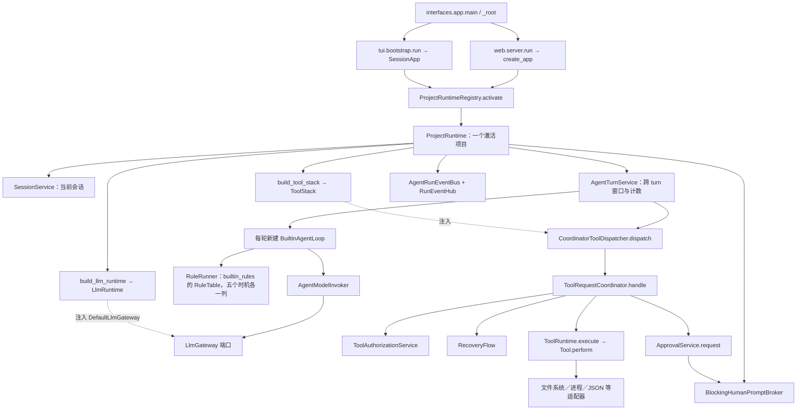
```mermaid
flowchart TD
    Entry["interfaces.app.main / _root"] --> Web["web.server.run → create_app"]
    Entry --> Tui["tui.bootstrap.run → SessionApp"]
    Web --> Registry["ProjectRuntimeRegistry.activate"]
    Tui --> Registry
    Registry --> Runtime["ProjectRuntime：一个激活项目"]
    Runtime --> Session["SessionService：当前会话"]
    Runtime --> Turn["AgentTurnService：跨 turn 窗口与计数"]
    Runtime --> Stack["build_tool_stack → ToolStack"]
    Runtime --> Llm["build_llm_runtime → LlmRuntime"]
    Runtime --> Bus["AgentRunEventBus + RunEventHub"]
    Runtime --> Prompt["BlockingHumanPromptBroker"]
    Turn --> Loop["每轮新建 BuiltinAgentLoop"]
    Loop --> Rules["RuleRunner：builtin_rules 的 RuleTable，五个时机各一列"]
    Loop --> Invoker["AgentModelInvoker"]
    Invoker --> Gateway["LlmGateway 端口"]
    Llm -. "注入 DefaultLlmGateway" .-> Gateway
    Turn --> Dispatcher["CoordinatorToolDispatcher.dispatch"]
    Stack -. "注入" .-> Dispatcher
    Dispatcher --> Coordinator["ToolRequestCoordinator.handle"]
    Coordinator --> Auth["ToolAuthorizationService"]
    Coordinator --> Recovery["RecoveryFlow"]
    Coordinator --> Tools["ToolRuntime.execute → Tool.perform"]
    Coordinator --> Approval["ApprovalService.request"]
    Approval --> Prompt
    Tools --> Adapters["文件系统／进程／JSON 等适配器"]
```

| 区域 | 主要职责 | 阅读时要守住的边界 |
|---|---|---|
| `domain/` | 值对象、规则、枚举、哈希、纯算法 | 不访问磁盘或网络，不依赖上层 |
| `application/agent_loop/` | 控制流在 `builtin_loop.py`，判断在 `rules/`，调用 LLM | 不直接执行工具，不读写长期记忆；规则只看只读快照 |
| `application/agent_turn/` | 驱动动作，记录会话、用量和压缩草稿 | 工具动作经 dispatcher，不能直接调用 perform |
| `application/tool_request/` | 串起机制、安全、审批、恢复 | 负责顺序，不把工具名字变成安全规则 |
| `application/tools/` | 工具契约、注册、执行校验和实现 | 不 import 安全策略层；prepare 与 perform 分离 |
| `application/security/` | 能力分析、策略、授权、学习规则 | 按 Capability 分派，不按工具名特判 |
| `application/context/` | 组上下文、维护窗口 | 模型可写状态不能成为授权事实 |
| `infrastructure/` | IO 适配器 | 实现 application 端口 |
| `interfaces/runtime/` | 组合根、线程、生命周期 | 同时认识端口和实现，负责接线 |
| `interfaces/web/`、`interfaces/tui/` | 用户输入、协议、展示 | 共用同一个 ProjectRuntime 业务入口 |
| `web/src/` | React 控制面 | HTTP 查权威状态，SSE 展示过程 |

### 1.2 生命周期与身份不要混用

| 名称 | 创建方 | 生命周期／作用 |
|---|---|---|
| `project_id`／工具栈中的 `workspace_id` | `ProjectService.trust()` | 项目分区；当前装配中二者指同一项目身份 |
| `ProjectRuntime` | `ProjectRuntimeRegistry.activate()` | 项目激活到切换／关闭；持有进程锁 |
| `session_id` | `SessionService.start()` | 一次会话，可持久化后续写 |
| `run_id` | `ProjectRuntime.start_turn()` | 一次后台线程执行，不等于 turn_id |
| `TurnIdentity(session_id, turn_id)` | `AgentTurnService.handle_user_message()` | 会话内轮次；turn_0001 可在不同会话重复 |
| `request_id` | `BuiltinAgentLoop._build_request()` | 一次主循环模型请求；其他用途也可独立调用网关 |
| `tool_call_id` | 模型协议 | assistant tool_calls 与 tool result 配对 |
| `invocation_id`／`ToolPlan.plan_id` | `ToolRequestCoordinator.handle()` | 一次工具管线请求 |
| `authorization_id` | `ToolAuthorizationService.issue()` | 一次性、带有效期的执行信封 |
| `checkpoint_id` | `WorkspaceMutationCoordinator.begin()` | 一次恢复事务 |
| `prompt_id` | 审批／提问生产方 | 一张待答卡片；broker 另绑定内部 turn 代次 |
| `stream_id:cursor` | `RunEventHub`／`ResumePoint` | 一个事件流实例中的位置；跨实例不可直接续用 |

`SessionService` 的会话记录、`runs.jsonl` 的过程记录、运行日志是三种数据，不能因为都包含
turn_id 就互相替代。尤其 `runs.jsonl` 不负责重建模型上下文。

## 2. 主流程：启动、激活和退出

源码入口：`interfaces/app.py`、`interfaces/web/server.py`、`interfaces/web/app.py`、
`interfaces/tui/bootstrap.py`、`interfaces/runtime/project_runtime.py`。

### 2.1 命令入口分支

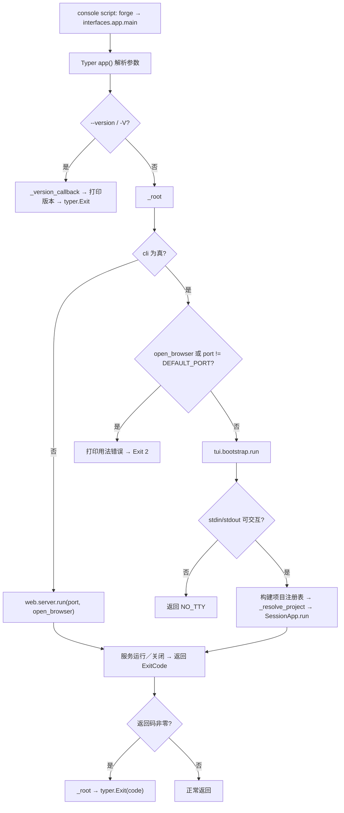
```mermaid
flowchart TD
    A["console script: forge → interfaces.app.main"] --> B["Typer app() 解析参数"]
    B --> C{"--version / -V?"}
    C -->|是| D["_version_callback → 打印版本 → typer.Exit"]
    C -->|否| E["_root"]
    E --> F{"cli 为真?"}
    F -->|否| G["web.server.run(port, open_browser)"]
    F -->|是| H{"open_browser 或 port != DEFAULT_PORT?"}
    H -->|是| I["打印用法错误 → Exit 2"]
    H -->|否| J["tui.bootstrap.run"]
    J --> K{"stdin/stdout 可交互?"}
    K -->|否| L["返回 NO_TTY"]
    K -->|是| M["构建项目注册表 → _resolve_project → SessionApp.run"]
    G --> N["服务运行／关闭 → 返回 ExitCode"]
    M --> N
    N --> O{"返回码非零?"}
    O -->|是| P["_root → typer.Exit(code)"]
    O -->|否| Q["正常返回"]
```

`--version` 是 eager callback，目的在于版本查询直接结束，不继续建立服务。
`--cli` 与端口的兼容检查实际比较的是数值：显式给默认端口仍等于默认值，不能把这段
描述成“能识别任何显式出现的 --port 参数”。

### 2.2 Web 准入、握手与路由分支

源码入口：`interfaces/web/security.py::LocalControlPlaneGuard`、
`interfaces/web/routers/handshake.py`、`interfaces/web/deps.py`。

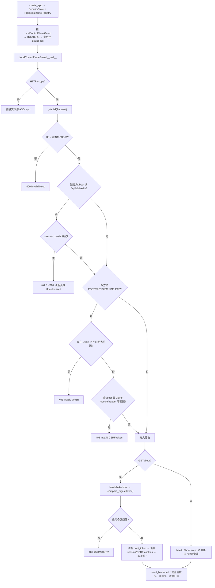
```mermaid
flowchart TD
    A["create_app → SecurityState + ProjectRuntimeRegistry"] --> B["挂 LocalControlPlaneGuard → ROUTERS → 最后挂 StaticFiles"]
    B --> C["LocalControlPlaneGuard.__call__"]
    C --> D{"HTTP scope?"}
    D -->|否| E["直接交下游 ASGI app"]
    D -->|是| F["_denial(Request)"]
    F --> G{"Host 在本机白名单?"}
    G -->|否| H["400 Invalid Host"]
    G -->|是| I{"路径为 /boot 或 /api/v1/health?"}
    I -->|否| J{"session cookie 匹配?"}
    J -->|否| K["401：HTML 说明页或 Unauthorized"]
    J -->|是| L{"写方法 POST/PUT/PATCH/DELETE?"}
    I -->|是| L
    L -->|是| M{"存在 Origin 且不匹配当前源?"}
    M -->|是| N["403 Invalid Origin"]
    M -->|否| O{"非 /boot 且 CSRF cookie/header 不匹配?"}
    O -->|是| P["403 Invalid CSRF token"]
    O -->|否| Q["进入路由"]
    L -->|否| Q
    Q --> R{"GET /boot?"}
    R -->|是| S["handshake.boot → compare_digest(token)"]
    S --> T{"启动令牌匹配?"}
    T -->|否| U["401 启动令牌无效"]
    T -->|是| V["清空 boot_token → 设置 session/CSRF cookies → 303 到 /"]
    R -->|否| W["health / bootstrap / 资源路由 / 静态资源"]
    W --> X["send_hardened：安全响应头、缓存头、请求日志"]
    V --> X
```

`/health` 不要求激活项目；`/bootstrap` 需要有效会话 cookie，返回版本、激活项目及 CSRF。
资源路由经 `active_runtime()` 取当前项目，需要空闲时再经 `idle_runtime()` 拦住在途 turn。
ASGI 中间件不缓冲 SSE 响应体。静态资源挂载必须在 API router 后，否则会截获 API 路径。

### 2.3 项目查找、信任与激活

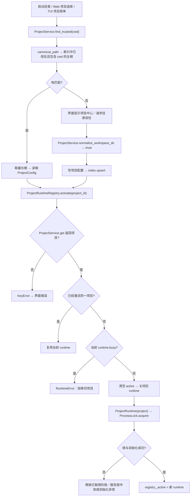
```mermaid
flowchart TD
    A["启动目录 / Web 项目选择 / TUI 项目菜单"] --> B["ProjectService.find_trusted(cwd)"]
    B --> C["canonical_path → 索引中已信任且包含 cwd 的主根"]
    C --> D{"有匹配?"}
    D -->|是| E["取最长根 → 读取 ProjectConfig"]
    D -->|否| F["界面显示项目中心／请求目录信任"]
    F --> G["ProjectService.normalize_workspace_dir → trust"]
    G --> H["写项目配置 → index.upsert"]
    E --> I["ProjectRuntimeRegistry.activate(project_id)"]
    H --> I
    I --> J{"ProjectService.get 返回项目?"}
    J -->|否| K["KeyError → 界面错误"]
    J -->|是| L{"已经激活同一项目?"}
    L -->|是| M["复用当前 runtime"]
    L -->|否| N{"当前 runtime.busy?"}
    N -->|是| O["RuntimeError：拒绝切项目"]
    N -->|否| P["清空 active → 关闭旧 runtime"]
    P --> Q["ProjectRuntime(project) → ProcessLock.acquire"]
    Q --> R{"锁与初始化成功?"}
    R -->|否| S["释放已取得的锁／报告锁冲突或初始化异常"]
    R -->|是| T["registry._active = 新 runtime"]
```

额外工作区根不参与项目身份匹配；同一 cwd 匹配多个主根时选最深项目。切项目先关闭旧 runtime，
再建立新 runtime；新项目初始化失败时不会自动恢复已经关闭的旧 runtime。

### 2.4 组合根装配和沙箱探测

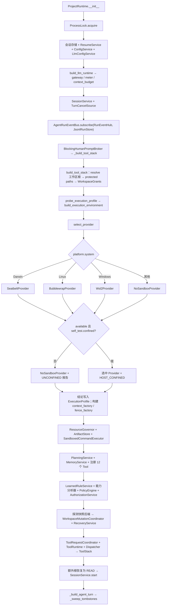
```mermaid
flowchart TD
    A["ProjectRuntime.__init__"] --> B["ProcessLock.acquire"]
    B --> C["会话存储 + ResumeService + ConfigService + LlmConfigService"]
    C --> D["build_llm_runtime → gateway / meter / context_budget"]
    D --> E["SessionService + TurnCancelSource"]
    E --> F["AgentRunEventBus.subscribe(RunEventHub, JsonlRunStore)"]
    F --> G["BlockingHumanPromptBroker → _build_tool_stack"]
    G --> H["build_tool_stack：resolve 工作区根 → protected paths → WorkspaceGrants"]
    H --> I["probe_execution_profile → build_execution_environment"]
    I --> J["select_provider"]
    J --> K{"platform.system"}
    K -->|Darwin| L["SeatbeltProvider"]
    K -->|Linux| M["BubblewrapProvider"]
    K -->|Windows| N["Wsl2Provider"]
    K -->|其他| O["NoSandboxProvider"]
    L --> P{"available 且 self_test.confined?"}
    M --> P
    N --> P
    O --> P
    P -->|否| Q["NoSandboxProvider + UNCONFINED 报告"]
    P -->|是| R["选中 Provider + HOST_CONFINED"]
    Q --> S["结论写入 ExecutionProfile；构建 context_factory / fence_factory"]
    R --> S
    S --> T["ResourceGovernor + ArtifactStore + SandboxedCommandExecutor"]
    T --> U["PlanningService + MemoryService + 注册 12 个 Tool"]
    U --> V["LearnedRuleService + 能力分析器 + PolicyEngine + AuthorizationService"]
    V --> W["探测快照后端 → WorkspaceMutationCoordinator + RecoveryService"]
    W --> X["ToolRequestCoordinator + ToolRuntime + Dispatcher → ToolStack"]
    X --> Y["额外根恢复为 READ → SessionService.start"]
    Y --> Z["_build_agent_turn → _sweep_tombstones"]
```

这里的沙箱降级是**启动探测结论**，之后审批和执行都绑定这个结论；不是拿到有沙箱的授权后，
执行中临时换成无沙箱继续运行。主根可写，额外根重启后保守恢复只读。

`_build_agent_turn()` 里的 `new_loop()` 每轮先调 `builtin_rules(context=窗口管理器,
workspace_provider=OsWorkspaceSnapshotProvider)` 建一份 `RuleTable`（五个时机各一列方法），
再交给 `BuiltinAgentLoop`。窗口管理器与工作区快照不再直接传给循环，传给对应的规则。

### 2.5 TUI 输入与退出

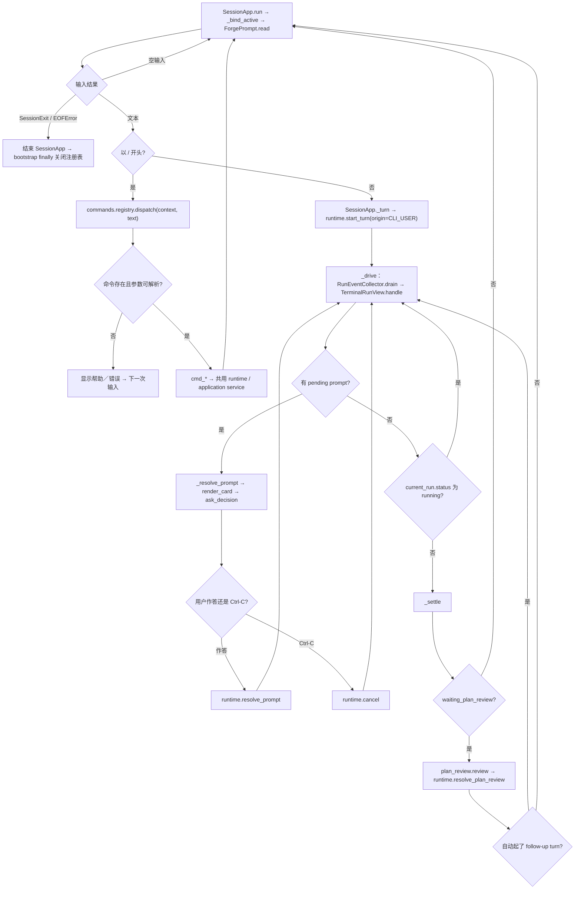
```mermaid
flowchart TD
    A["SessionApp.run → _bind_active → ForgePrompt.read"] --> B{"输入结果"}
    B -->|空输入| A
    B -->|SessionExit / EOFError| Z["结束 SessionApp → bootstrap finally 关闭注册表"]
    B -->|文本| C{"以 / 开头?"}
    C -->|是| D["commands.registry.dispatch(context, text)"]
    D --> E{"命令存在且参数可解析?"}
    E -->|否| F["显示帮助／错误 → 下一次输入"]
    E -->|是| G["cmd_* → 共用 runtime / application service"]
    G --> A
    C -->|否| H["SessionApp._turn → runtime.start_turn(origin=CLI_USER)"]
    H --> I["_drive：RunEventCollector.drain → TerminalRunView.handle"]
    I --> J{"有 pending prompt?"}
    J -->|是| K["_resolve_prompt → render_card → ask_decision"]
    K --> L{"用户作答还是 Ctrl-C?"}
    L -->|作答| M["runtime.resolve_prompt"]
    L -->|Ctrl-C| N["runtime.cancel"]
    M --> I
    N --> I
    J -->|否| O{"current_run.status 为 running?"}
    O -->|是| I
    O -->|否| P["_settle"]
    P --> Q{"waiting_plan_review?"}
    Q -->|否| A
    Q -->|是| R["plan_review.review → runtime.resolve_plan_review"]
    R --> S{"自动起了 follow-up turn?"}
    S -->|是| I
    S -->|否| A
```

普通文本即使以 `#` 开头也走 `_turn()`，当前不存在独立人工 Shell 分支。
运行期第一次 Ctrl-C 请求取消；第二次 Ctrl-C 只结束 `_drive()` 的等待，源码明确提醒已发出的
命令可能还在运行。输入框退出、取消菜单、取消当前 turn 是不同作用域。

Web 关闭路径是 `web.server` 设置 stopping → SSE 发停止帧／退出 → FastAPI lifespan
调用 `registry.close()` → `ProjectRuntime.close()` 调用 cancel、prompts.close、events.close、
最多等待 Agent 线程 2 秒并释放项目锁。这不是“无限等待所有子进程退出”的保证。

## 3. 主流程：一条用户消息到一轮最终响应

源码入口：`web/src/features/conversation/useConversation.ts`、
`interfaces/web/routers/turns.py`、`interfaces/runtime/project_runtime.py`、
`application/agent_turn/agent_turn_service.py`。

### 3.1 Web 发送、线程启动和前端对账

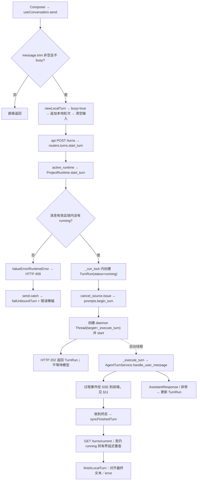
```mermaid
flowchart TD
    A["Composer → useConversation.send"] --> B{"message.trim 非空且不 busy?"}
    B -->|否| C["直接返回"]
    B -->|是| D["newLocalTurn → busy=true → 追加本地轮次 → 清空输入"]
    D --> E["api POST /turns → routers.turns.start_turn"]
    E --> F["active_runtime → ProjectRuntime.start_turn"]
    F --> G{"消息有效且锁内没有 running?"}
    G -->|否| H["ValueError/RuntimeError → HTTP 409"]
    H --> I["send.catch → failUnboundTurn + 错误横幅"]
    G -->|是| J["_run_lock 内创建 TurnRun(status=running)"]
    J --> K["cancel_source.issue → prompts.begin_turn"]
    K --> L["创建 daemon Thread(target=_execute_turn) 并 start"]
    L --> M["HTTP 202 返回 TurnRun；不等待模型"]
    L -. "后台线程" .-> N["_execute_turn → AgentTurnService.handle_user_message"]
    N --> O["过程事件经 SSE 到前端，见 §11"]
    N --> P["AssistantResponse / 异常 → 更新 TurnRun"]
    O --> Q["收到终态 → syncFinishedTurn"]
    Q --> R["GET /turns/current；若仍 running 则有界延迟重查"]
    R --> S["finishLocalTurn：对齐最终文本／error"]
```

HTTP 202 只说明后台任务已启动；SSE 的 turn 终态可能先于 `_execute_turn()` 最后一次赋值，
所以 `syncFinishedTurn()` 要查询权威的 `current_run()`，不能用 202 当完成证明。

### 3.2 AgentTurnService：动作驱动与持久化

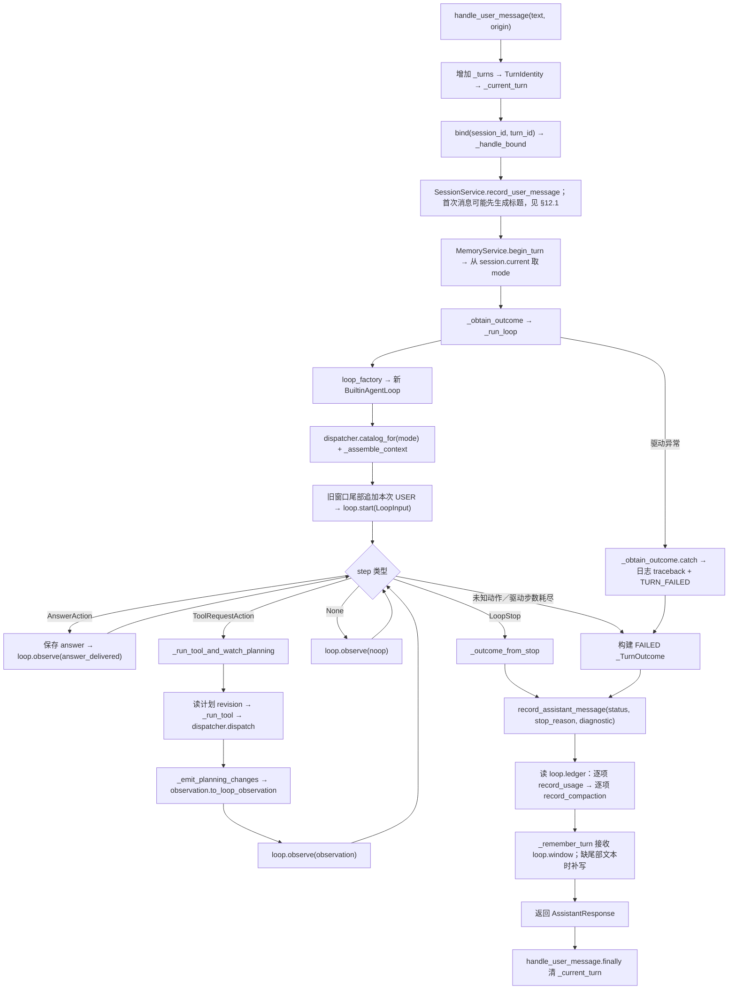
```mermaid
flowchart TD
    A["handle_user_message(text, origin)"] --> B["增加 _turns → TurnIdentity → _current_turn"]
    B --> C["bind(session_id, turn_id) → _handle_bound"]
    C --> D["SessionService.record_user_message；首次消息可能先生成标题，见 §12.1"]
    D --> E["MemoryService.begin_turn → 从 session.current 取 mode"]
    E --> F["_obtain_outcome → _run_loop"]
    F --> G["loop_factory → 新 BuiltinAgentLoop"]
    G --> H["dispatcher.catalog_for(mode) + _assemble_context"]
    H --> I["旧窗口尾部追加本次 USER → loop.start(LoopInput)"]
    I --> J{"step 类型"}
    J -->|AnswerAction| K["保存 answer → loop.observe(answer_delivered)"]
    K --> J
    J -->|ToolRequestAction| L["_run_tool_and_watch_planning"]
    L --> M["读计划 revision → _run_tool → dispatcher.dispatch"]
    M --> N["_emit_planning_changes → observation.to_loop_observation"]
    N --> O["loop.observe(observation)"]
    O --> J
    J -->|None| P["loop.observe(noop)"]
    P --> J
    J -->|LoopStop| Q["_outcome_from_stop"]
    J -->|未知动作／驱动步数耗尽| R["构建 FAILED _TurnOutcome"]
    F -->|驱动异常| S["_obtain_outcome.catch → 日志 traceback + TURN_FAILED"]
    S --> R
    Q --> T["record_assistant_message(status, stop_reason, diagnostic)"]
    R --> T
    T --> U["读 loop.ledger：逐项 record_usage → 逐项 record_compaction"]
    U --> V["_remember_turn 接收 loop.window；缺尾部文本时补写"]
    V --> W["返回 AssistantResponse"]
    W --> X["handle_user_message.finally 清 _current_turn"]
```

`_run_tool_and_watch_planning()` 比较 `(id, revision)`，不是比较工具名。新建一份计划与
修改原计划都可以触发变化；计划／待办事件里保存摘要和引用，正文由 PlanningService 读取。

`_obtain_outcome()` 隔离的是 `_run_loop()` 内异常。其前后的会话落盘失败不受这层 catch
保护，会继续到 `_execute_turn()` 的后台边界。因此“任何故障都能完整记录一对消息”不是
当前代码可保证的不变量，磁盘写失败尤其如此。

### 3.3 终态映射与异常边界

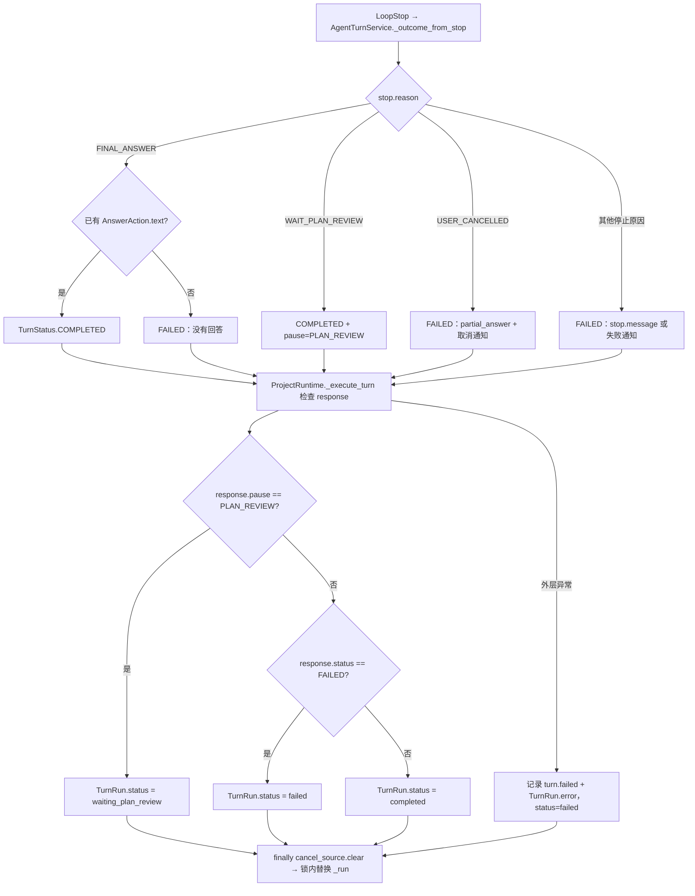
```mermaid
flowchart TD
    A["LoopStop → AgentTurnService._outcome_from_stop"] --> B{"stop.reason"}
    B -->|FINAL_ANSWER| C{"已有 AnswerAction.text?"}
    C -->|是| D["TurnStatus.COMPLETED"]
    C -->|否| E["FAILED：没有回答"]
    B -->|WAIT_PLAN_REVIEW| F["COMPLETED + pause=PLAN_REVIEW"]
    B -->|USER_CANCELLED| G["FAILED：partial_answer + 取消通知"]
    B -->|其他停止原因| H["FAILED：stop.message 或失败通知"]
    D --> I["ProjectRuntime._execute_turn 检查 response"]
    E --> I
    F --> I
    G --> I
    H --> I
    I --> J{"response.pause == PLAN_REVIEW?"}
    J -->|是| K["TurnRun.status = waiting_plan_review"]
    J -->|否| L{"response.status == FAILED?"}
    L -->|是| M["TurnRun.status = failed"]
    L -->|否| N["TurnRun.status = completed"]
    I -->|外层异常| O["记录 turn.failed + TurnRun.error，status=failed"]
    K --> P["finally cancel_source.clear → 锁内替换 _run"]
    M --> P
    N --> P
    O --> P
```

`LoopStopReason.classification` 是语义分类，`TurnStatus` 是消息持久化终态，`TurnRun.status`
是控制面的后台状态，三者不能逐字互换。例如 `CONTEXT_COMPACTION_REQUIRED` 分类为
`RESUMABLE_PAUSE`，但目前 `_outcome_from_stop()` 仍把它映射为 FAILED；只有计划评审得到
专门的 `pause=PLAN_REVIEW`。

## 4. 主流程：BuiltinAgentLoop 的 ReAct 状态机

源码入口：`application/agent_loop/builtin_loop.py`（控制流）、`rule_table.py`（规则表怎么跑）、
`rules/__init__.py`（五个时机各一列方法，顺序与理由）、`rules/*.py`（每条判断一个文件）、`verdicts.py`
（规则给循环的处置）、`rule.py`（规则能看到什么）、`ledger.py`（本轮账本）、
`model_invoker.py`、`transcript.py`、`domain/agent/phase.py`、`actions.py`、`stop.py`。

ADR-0049 之后循环分成两层：`builtin_loop.py` 只剩控制流，负责调模型、派工具、回填结果、
收尾，以及**执行**规则给出的处置；"下一步做什么"的判断全在 `rules/` 里。读循环只需要跟着
`start → _advance → _dispatch_next → _observe_tool → _stop` 走；读某条判断去它自己的文件，
阈值常量与它的处理在同一处。

### 4.1 start → 规则表 → 模型请求 → 动作

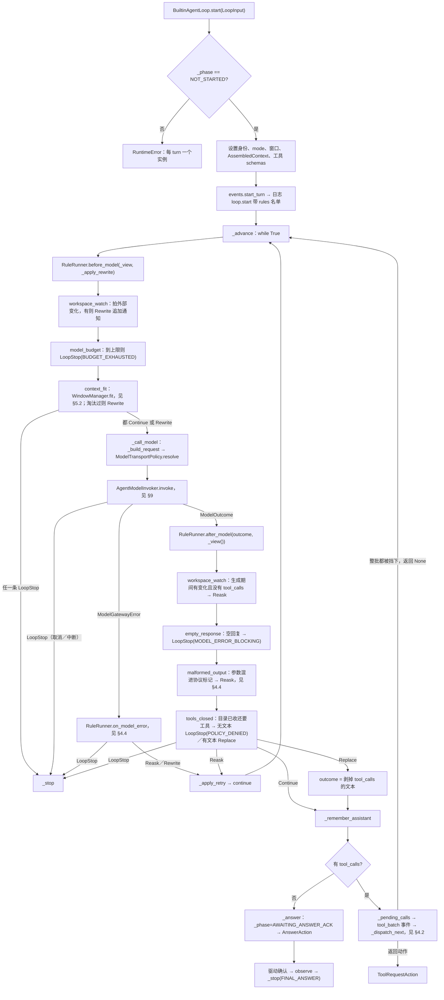
```mermaid
flowchart TD
    A["BuiltinAgentLoop.start(LoopInput)"] --> B{"_phase == NOT_STARTED?"}
    B -->|否| C["RuntimeError：每 turn 一个实例"]
    B -->|是| D["设置身份、mode、窗口、AssembledContext、工具 schemas"]
    D --> E["events.start_turn → 日志 loop.start 带 rules 名单"]
    E --> F["_advance：while True"]
    F --> G["RuleRunner.before_model(_view, _apply_rewrite)"]
    G --> G1["workspace_watch：拍外部变化，有则 Rewrite 追加通知"]
    G1 --> G2["model_budget：到上限则 LoopStop(BUDGET_EXHAUSTED)"]
    G2 --> G3["context_fit：WindowManager.fit，见 §5.2；淘汰过则 Rewrite"]
    G3 -->|任一条 LoopStop| H["_stop"]
    G3 -->|都 Continue 或 Rewrite| I["_call_model：_build_request → ModelTransportPolicy.resolve"]
    I --> J["AgentModelInvoker.invoke，见 §9"]
    J -->|LoopStop（取消／中断）| H
    J -->|ModelGatewayError| K["RuleRunner.on_model_error，见 §4.4"]
    K -->|Reask／Rewrite| L["_apply_retry → continue"]
    L --> F
    K -->|LoopStop| H
    J -->|ModelOutcome| M["RuleRunner.after_model(outcome, _view())"]
    M --> M1["workspace_watch：生成期间有变化且没有 tool_calls → Reask"]
    M1 --> M2["empty_response：空回复 → LoopStop(MODEL_ERROR_BLOCKING)"]
    M2 --> M3["malformed_output：参数混进协议标记 → Reask，见 §4.4"]
    M3 --> M4["tools_closed：目录已收还要工具 → 无文本 LoopStop(POLICY_DENIED)／有文本 Replace"]
    M4 -->|Reask| L
    M4 -->|LoopStop| H
    M4 -->|Replace| N["outcome = 剥掉 tool_calls 的文本"]
    M4 -->|Continue| O["_remember_assistant"]
    N --> O
    O --> P{"有 tool_calls?"}
    P -->|否| Q["_answer：_phase=AWAITING_ANSWER_ACK → AnswerAction"]
    Q --> R["驱动确认 → observe → _stop(FINAL_ANSWER)"]
    P -->|是| S["_pending_calls → tool_batch 事件 → _dispatch_next，见 §4.2"]
    S -->|返回动作| T["ToolRequestAction"]
    S -->|整批都被挡下，返回 None| F
```

`_advance` 不再调用自己：四条"追加点东西再来一次"的路（格式重试、溢出强压、工作区变更、
收工具）都是 `continue`；整批工具都被规则挡下时 `_dispatch_next` 返回 `None`，也是 `continue`。
从 observe 一侧回到 `_advance` 的调用只有一层（`_observe_tool` 与 `_close_tools`），那是 ReAct
的一步。改造前的循环在"模型反复要同一个被挡下的调用"这个场景下会撞 Python 递归上限，
`tests/agent_loop/test_loop_baseline.py::test_a_batch_denied_in_full_does_not_recurse` 守着这条。

`outcome.text` 与 `outcome.tool_calls` 可以同时存在。带工具的 assistant 消息必须先写入窗口，
再追加对应 tool result；格式损坏的调用在 `after_model` 阶段就被 `Reask` 拒掉，永远不会走到
`_remember_assistant`，否则会留下配不齐的协议记录。

### 4.2 同一批多个工具：严格串行

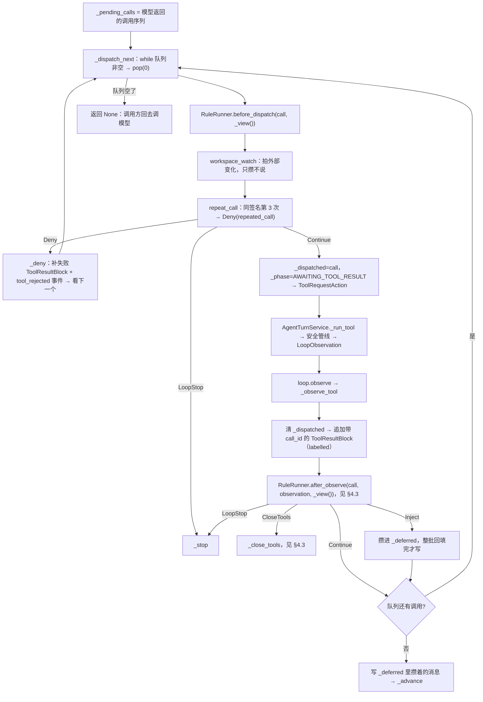
```mermaid
flowchart TD
    A["_pending_calls = 模型返回的调用序列"] --> B["_dispatch_next：while 队列非空 → pop(0)"]
    B --> C["RuleRunner.before_dispatch(call, _view())"]
    C --> C1["workspace_watch：拍外部变化，只攒不说"]
    C1 --> C2["repeat_call：同签名第 3 次 → Deny(repeated_call)"]
    C2 -->|Deny| D["_deny：补失败 ToolResultBlock + tool_rejected 事件 → 看下一个"]
    D --> B
    C2 -->|LoopStop| E["_stop"]
    C2 -->|Continue| F["_dispatched=call，_phase=AWAITING_TOOL_RESULT → ToolRequestAction"]
    B -->|队列空了| G["返回 None：调用方回去调模型"]
    F --> H["AgentTurnService._run_tool → 安全管线 → LoopObservation"]
    H --> I["loop.observe → _observe_tool"]
    I --> J["清 _dispatched → 追加带 call_id 的 ToolResultBlock（labelled）"]
    J --> K["RuleRunner.after_observe(call, observation, _view())，见 §4.3"]
    K -->|LoopStop| E
    K -->|CloseTools| L["_close_tools，见 §4.3"]
    K -->|Inject| M["攒进 _deferred，整批回填完才写"]
    K -->|Continue| N{"队列还有调用?"}
    M --> N
    N -->|是| B
    N -->|否| O["写 _deferred 里攒着的消息 → _advance"]
```

批量意图事件表示"模型请求了哪些工具"，不是执行事实。审批仍一次次发生；第一个调用
可能改工作区，第二个调用会重新构造执行上下文和安全事实。重复调用的判定用
`repeat_call.signature_of()`：工具名加规范化参数；改变参数不会命中同一签名，所以还需要
`barren_streak` 那条"连续无新信息"的提醒。`Inject` 必须等整批回填完再写，这条保证由循环
的 `_deferred` 执行，规则说了不算——插在两条 tool result 中间供应商会拒。

### 4.3 拿到结果之后：计划评审、人拒绝、策略拒绝与无进展

`after_observe` 那一列四个方法按写的顺序跑，第一个给出非 `Continue` 处置的就算数：

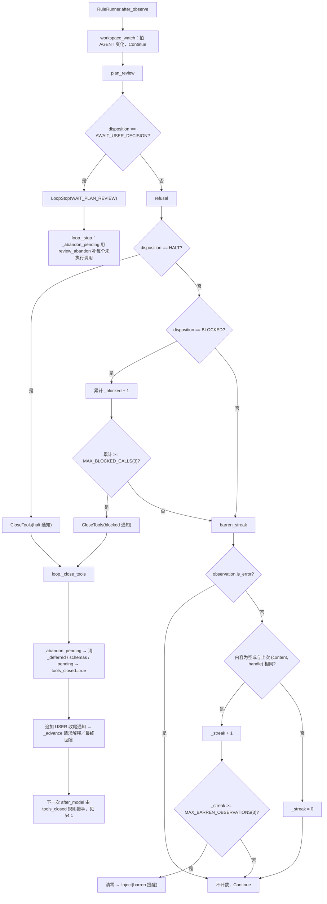
```mermaid
flowchart TD
    A["RuleRunner.after_observe"] --> B["workspace_watch：拍 AGENT 变化，Continue"]
    B --> C["plan_review"]
    C --> D{"disposition == AWAIT_USER_DECISION?"}
    D -->|是| E["LoopStop(WAIT_PLAN_REVIEW)"]
    D -->|否| F["refusal"]
    F --> G{"disposition == HALT?"}
    G -->|是| H["CloseTools(halt 通知)"]
    G -->|否| I{"disposition == BLOCKED?"}
    I -->|是| J["累计 _blocked + 1"]
    J --> K{"累计 >= MAX_BLOCKED_CALLS(3)?"}
    K -->|是| L["CloseTools(blocked 通知)"]
    K -->|否| M["barren_streak"]
    I -->|否| M
    M --> N{"observation.is_error?"}
    N -->|是| O["不计数，Continue"]
    N -->|否| P{"内容为空或与上次 (content, handle) 相同?"}
    P -->|是| Q["_streak + 1"]
    P -->|否| R["_streak = 0"]
    Q --> S{"_streak >= MAX_BARREN_OBSERVATIONS(3)?"}
    S -->|是| T["清零 → Inject(barren 提醒)"]
    S -->|否| O
    R --> O
    E --> U["loop._stop：_abandon_pending 用 review_abandon 补每个未执行调用"]
    H --> V["loop._close_tools"]
    L --> V
    V --> W["_abandon_pending → 清 _deferred / schemas / pending → tools_closed=true"]
    W --> X["追加 USER 收尾通知 → _advance 请求解释／最终回答"]
    X --> Y["下一次 after_model 由 tools_closed 规则接手，见 §4.1"]
```

`ToolObservation.to_loop_observation()` 决定 disposition。普通工具失败的 `is_error=true`
不自动等于 HALT；人拒绝／无人能审批与一次可修正的输入错误需要不同处置。
`refusal._blocked` 是累计值，插入一次成功读取不能重置它；`barren_streak` 只观察成功结果。
`plan_review` 声明了必须排在 `refusal` 之前：两者都不再派工具，但一个是"轮到人说话"，
一个是"你被罚闭嘴"，判错了评审界面上方会多一段没人读的解释。

### 4.4 模型错误与格式纠错

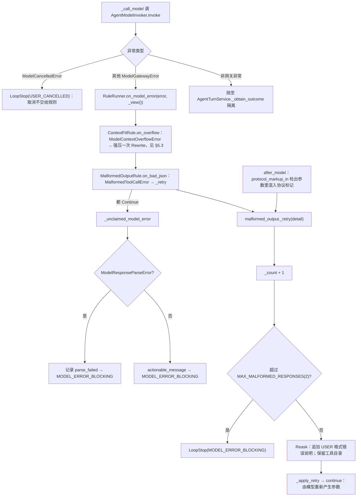
```mermaid
flowchart TD
    A["_call_model 调 AgentModelInvoker.invoke"] --> B{"异常类型"}
    B -->|ModelCancelledError| C["LoopStop(USER_CANCELLED)：取消不交给规则"]
    B -->|其他 ModelGatewayError| D["RuleRunner.on_model_error(error, _view())"]
    D --> D1["ContextFitRule.on_overflow：ModelContextOverflowError → 强压一次 Rewrite，见 §5.3"]
    D1 --> D2["MalformedOutputRule.on_bad_json：MalformedToolCallError → _retry"]
    D2 -->|都 Continue| E["_unclaimed_model_error"]
    E --> E1{"ModelResponseParseError?"}
    E1 -->|是| F["记录 parse_failed → MODEL_ERROR_BLOCKING"]
    E1 -->|否| G["actionable_message → MODEL_ERROR_BLOCKING"]
    B -->|非网关异常| H["抛至 AgentTurnService._obtain_outcome 隔离"]
    I["after_model：protocol_markup_in 检出参数里混入协议标记"] --> J["malformed_output._retry(detail)"]
    D2 --> J
    J --> K["_count + 1"]
    K --> L{"超过 MAX_MALFORMED_RESPONSES(2)?"}
    L -->|是| M["LoopStop(MODEL_ERROR_BLOCKING)"]
    L -->|否| N["Reask：追加 USER 格式错误说明；保留工具目录"]
    N --> O["_apply_retry → continue：由模型重新产生参数"]
```

`MalformedOutputRule` 的 `after_model`（标记污染）与 `on_bad_json`（半截 JSON）两条路
共用一个计数器；纠错不猜参数，不修补模型产生的半截 JSON。网关传输重试见 §9.3，那条路
通常重发同一请求；这里是改变上下文、让模型重新回答，二者不能合并计数。

### 4.5 规则表：按时机列方法、处置与隔离

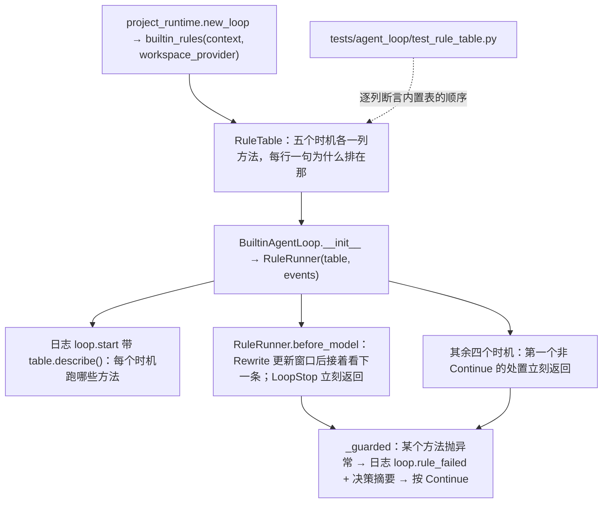
```mermaid
flowchart TD
    A["project_runtime.new_loop → builtin_rules(context, workspace_provider)"] --> B["RuleTable：五个时机各一列方法，每行一句为什么排在那"]
    B --> C["BuiltinAgentLoop.__init__ → RuleRunner(table, events)"]
    C --> D["日志 loop.start 带 table.describe()：每个时机跑哪些方法"]
    C --> E["RuleRunner.before_model：Rewrite 更新窗口后接着看下一条；LoopStop 立刻返回"]
    C --> F["其余四个时机：第一个非 Continue 的处置立刻返回"]
    E --> G["_guarded：某个方法抛异常 → 日志 loop.rule_failed + 决策摘要 → 按 Continue"]
    F --> G
    H["tests/agent_loop/test_rule_table.py"] -. "逐列断言内置表的顺序" .-> B
```

一条规则就是一个方法：收 `LoopView` 加这个时机的输入，返回这个时机允许的处置。方法叫
什么、属于哪个类都随意（`fit.on_overflow` 比 `fit.on_model_error` 更说事）；它在哪个时机
跑，由 `rules/__init__.py` 那张表决定，不由方法名决定。同一个对象的方法出现在几列，它就
参与几个时机，状态自然共享（`workspace_watch` 四列都有，`context_fit` 与 `malformed_output`
各两列）。读那一个文件就知道每个时机跑什么、什么顺序、为什么。

| 时机 | 一列的元素类型 | 允许的处置 | 今天那一列（按写的顺序） |
|---|---|---|---|
| 调模型之前 | `BeforeModelStep` | `Continue` / `Rewrite` / `LoopStop` | `WorkspaceWatchRule.before_model`, `ModelBudgetRule.before_model`, `ContextFitRule.before_model` |
| 模型调用出错 | `ModelErrorStep` | `Continue`(不归我管) / `Reask` / `Rewrite` / `LoopStop` | `ContextFitRule.on_overflow`, `MalformedOutputRule.on_bad_json` |
| 模型回来之后 | `AfterModelStep` | `Continue` / `Replace` / `Reask` / `LoopStop` | `WorkspaceWatchRule.after_model`, `EmptyResponseRule.after_model`, `MalformedOutputRule.after_model`, `ToolsClosedRule.after_model` |
| 派发一个工具之前 | `BeforeDispatchStep` | `Continue` / `Deny` / `LoopStop` | `WorkspaceWatchRule.before_dispatch`, `RepeatCallRule.before_dispatch` |
| 拿到工具结果之后 | `AfterObserveStep` | `Continue` / `Inject` / `CloseTools` / `LoopStop` | `WorkspaceWatchRule.after_observe`, `PlanReviewRule.after_observe`, `RefusalRule.after_observe`, `BarrenStreakRule.after_observe` |

每一列的元素类型是 `Callable[[...], 该时机的处置联合]`（定义在 `rule.py`）：把
`repeat.before_dispatch` 塞进 `after_model=`，或让一个方法返回这个时机不允许的处置，mypy 在
装配那一行报错。

| 处置 | 循环怎么执行 |
|---|---|
| `Rewrite(window)` | 换窗口；调模型前继续看下一条，出错后回到调模型前重来 |
| `Reask(messages)` | 这次输出作废，追加消息，重新调模型；不写 assistant 消息 |
| `Replace(outcome)` | 用改写后的输出继续 |
| `Deny(notice, code)` | 补一条 `is_error` 的工具结果 + `tool_rejected` 事件，看队列里下一个 |
| `Inject(messages)` | 攒进 `_deferred`，整批工具结果回填完才追加 |
| `CloseTools(notice)` | `_close_tools`：补未执行结果、清目录、追加通知、回去调模型 |
| `LoopStop` | `_stop`：有排队调用则先补"未执行"结果，再发 turn 终态 |

顺序的四条硬理由（工作区通知与预算都在压缩之前，格式坏掉在目录已收之前，计划评审在收
工具之前）写在表旁边的注释里，`tests/agent_loop/test_rule_table.py` 逐列断言，改错顺序在
`make test` 就停；没有运行期的顺序校验，也没有数字优先级。规则能看到的只有 `LoopView`
这份只读快照（窗口、目录、预算、计数、排队数量），能写的只有 `TurnLedger`：用量草稿、
压缩记录，以及把"压缩发生了"、"工作区变了"这两件它自己看见的事报成运行事件。规则拿不到
`_window`、`_pending_calls` 和事件发布器的其他方法，也 import 不到工具系统与安全层——
安全管线不是规则（ADR-0049 决策 6）。

加一条判断：写一个方法，返回它那个时机允许的处置；在 `rules/__init__.py` 对应时机那一列
加一行，旁边写一句为什么排在那。

## 5. 主流程：上下文组装、压缩与工作区变化

源码入口：`application/context/assembler.py`、`window_manager.py`、`summarize.py`、
`domain/agent/state.py`、`domain/context/window.py`、`application/workspace/monitor.py`。

### 5.1 六层上下文与冻结点

| 层 | 内容 | 实际来源／目的字段 | 更新时机 |
|---|---|---|---|
| 1 | 工具目录 | `dispatcher.catalog_for → ToolCatalog.to_model_schemas → ModelRequest.tools` | turn 开始；收工具时清空 |
| 2 | 五个内置策略块 | `SystemPromptBuilder._static_blocks` 模块函数 | 进程内 lru_cache |
| 3 | 工作区指令 | `FsProjectInstructionReader.read → SystemPromptBuilder.build` | 每个 turn 读取一次 |
| 4 | 平台、工作区、模式能力事实 | `RuntimeFacts.from_profile → render_runtime_context` | 每个 turn 读取一次 |
| 5 | 会话窗口 | `Window.messages` | 每次模型／工具往返只追加；压缩时整段淘汰 |
| 6 | 计划、待办、记忆状态帧 | `render_state_frame → to_request_messages` | turn 开始冻结，每次请求置于窗口末尾 |

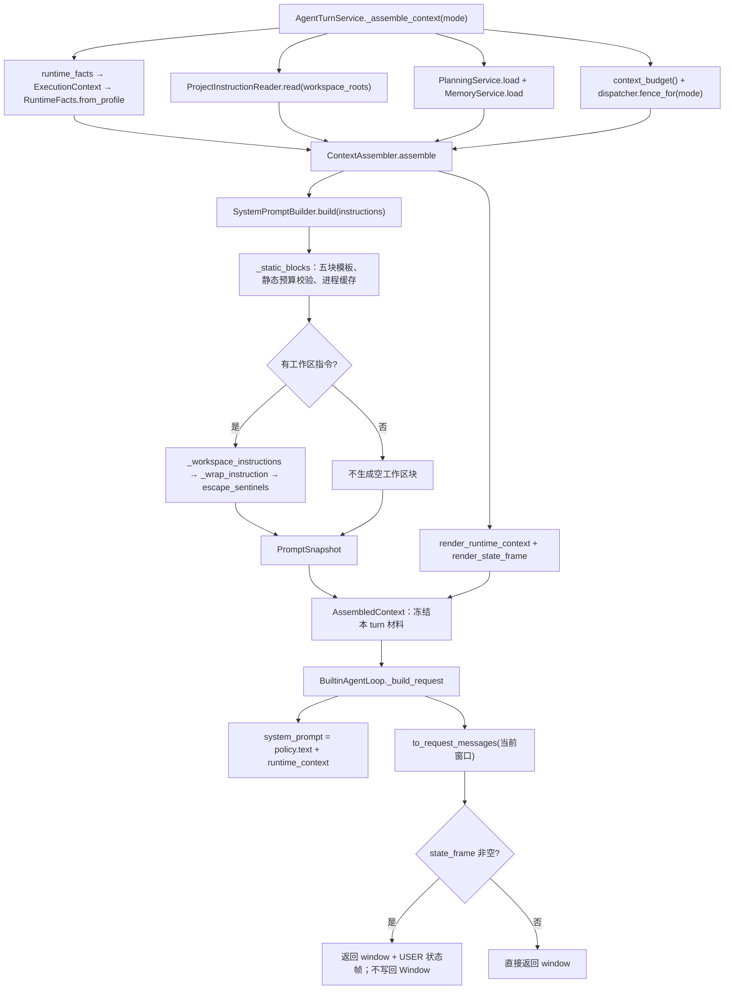
```mermaid
flowchart TD
    A["AgentTurnService._assemble_context(mode)"] --> B["runtime_facts → ExecutionContext → RuntimeFacts.from_profile"]
    A --> C["ProjectInstructionReader.read(workspace_roots)"]
    A --> D["PlanningService.load + MemoryService.load"]
    A --> E["context_budget() + dispatcher.fence_for(mode)"]
    B --> F["ContextAssembler.assemble"]
    C --> F
    D --> F
    E --> F
    F --> G["SystemPromptBuilder.build(instructions)"]
    G --> H["_static_blocks：五块模板、静态预算校验、进程缓存"]
    H --> I{"有工作区指令?"}
    I -->|是| J["_workspace_instructions → _wrap_instruction → escape_sentinels"]
    I -->|否| K["不生成空工作区块"]
    J --> L["PromptSnapshot"]
    K --> L
    F --> M["render_runtime_context + render_state_frame"]
    L --> N["AssembledContext：冻结本 turn 材料"]
    M --> N
    N --> O["BuiltinAgentLoop._build_request"]
    O --> P["system_prompt = policy.text + runtime_context"]
    O --> Q["to_request_messages(当前窗口)"]
    Q --> R{"state_frame 非空?"}
    R -->|是| S["返回 window + USER 状态帧；不写回 Window"]
    R -->|否| T["直接返回 window"]
```

状态帧不是工具调用后实时重读的。某轮执行 `todo_set_status` 后，这次工具结果立即进入窗口，
但新的完整待办状态帧到下一 turn 才重建。FORGE.md 同样是下一 turn 生效。
静态策略五块加可选工作区块，不能描述成“无条件六块”。前缀缓存是否命中由供应商决定，
六层组织只是在尽量保持前缀稳定，不是本地命中保证。

### 5.2 窗口高水位、合法切点和摘要

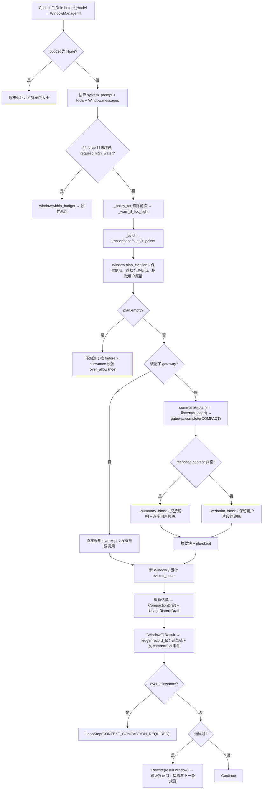
```mermaid
flowchart TD
    A["ContextFitRule.before_model → WindowManager.fit"] --> B{"budget 为 None?"}
    B -->|是| C["原样返回，不猜窗口大小"]
    B -->|否| D["估算 system_prompt + tools + Window.messages"]
    D --> E{"非 force 且未超过 request_high_water?"}
    E -->|是| F["window.within_budget → 原样返回"]
    E -->|否| G["_policy_for 扣除前缀 → _warn_if_too_tight"]
    G --> H["_evict → transcript.safe_split_points"]
    H --> I["Window.plan_eviction：保留尾部、选择合法切点、提取用户原话"]
    I --> J{"plan.empty?"}
    J -->|是| K["不淘汰；按 before > allowance 设置 over_allowance"]
    J -->|否| L{"装配了 gateway?"}
    L -->|否| M["直接采用 plan.kept；没有摘要调用"]
    L -->|是| N["summarize(plan) → _flatten(dropped) → gateway.complete(COMPACT)"]
    N --> O{"response.content 非空?"}
    O -->|是| P["_summary_block：交接说明 + 逐字用户片段"]
    O -->|否| Q["_verbatim_block：保留用户片段的兜底"]
    P --> R["摘要块 + plan.kept"]
    Q --> R
    M --> S["新 Window；累计 evicted_count"]
    R --> S
    S --> T["重新估算 → CompactionDraft + UsageRecordDraft"]
    T --> U["WindowFitResult → ledger.record_fit：记草稿 + 发 compaction 事件"]
    U --> V{"over_allowance?"}
    V -->|是| W["LoopStop(CONTEXT_COMPACTION_REQUIRED)"]
    V -->|否| X{"淘汰过?"}
    X -->|是| Y["Rewrite(result.window) → 循环换窗口，接着看下一条规则"]
    X -->|否| Z["Continue"]
```

合法切点不能把 assistant tool_calls 与尚未补齐的结果拆开。这里是一次批量淘汰，
不是每条消息都“滑动删除最旧一条”。`_warn_if_too_tight()` 捕获水位校验错误并记录日志，
不直接抛错终止 turn。

需要精确区分三种失败：摘要返回空文本有 `_verbatim_block()` 兜底；摘要网关抛异常不会
被 `summarize()` 吞掉，会沿调用栈上抛；未装配 gateway 时只保留 `plan.kept`，不能宣称
该分支也生成了完整的用户原话交接块。正常组合根装配了 gateway。

### 5.3 供应商报告超窗：额外一次强制压缩

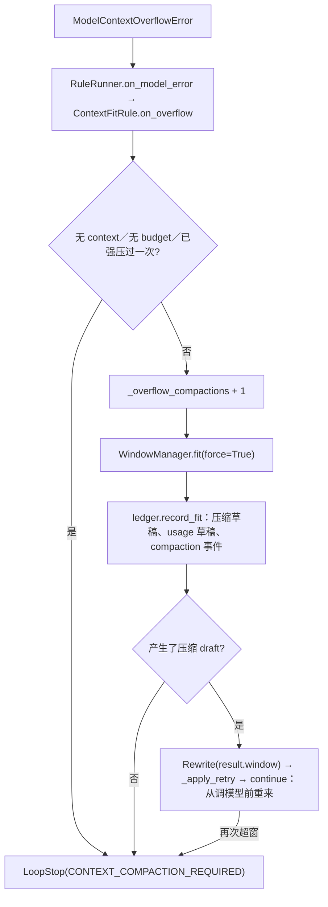
```mermaid
flowchart TD
    A["ModelContextOverflowError"] --> B["RuleRunner.on_model_error → ContextFitRule.on_overflow"]
    B --> C{"无 context／无 budget／已强压过一次?"}
    C -->|是| D["LoopStop(CONTEXT_COMPACTION_REQUIRED)"]
    C -->|否| E["_overflow_compactions + 1"]
    E --> F["WindowManager.fit(force=True)"]
    F --> G["ledger.record_fit：压缩草稿、usage 草稿、compaction 事件"]
    G --> H{"产生了压缩 draft?"}
    H -->|否| D
    H -->|是| I["Rewrite(result.window) → _apply_retry → continue：从调模型前重来"]
    I -->|再次超窗| D
```

强制压缩复用同一套切点逻辑，避免降级路径破坏消息配对。两道防线现在在同一个文件
`rules/context_fit.py` 里，共用 `_overflow_compactions` 计数。`WindowManager.fit()` 的估算输入
不显式加入末尾状态帧；网关 `_pre_call_checks()` 看到的是完整请求，因此两处预算结果
仍可能不同，供应商自己的分词也可能不同。

### 5.4 文件变化：检查点扫描、归因和重新思考

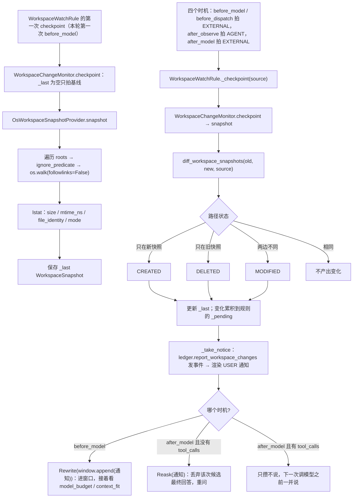
```mermaid
flowchart TD
    A["WorkspaceWatchRule 的第一次 checkpoint（本轮第一次 before_model）"] --> B["WorkspaceChangeMonitor.checkpoint：_last 为空只拍基线"]
    B --> C["OsWorkspaceSnapshotProvider.snapshot"]
    C --> D["遍历 roots → ignore_predicate → os.walk(followlinks=False)"]
    D --> E["lstat：size / mtime_ns / file_identity / mode"]
    E --> F["保存 _last WorkspaceSnapshot"]
    G["四个时机：before_model / before_dispatch 拍 EXTERNAL，after_observe 拍 AGENT，after_model 拍 EXTERNAL"] --> H["WorkspaceWatchRule._checkpoint(source)"]
    H --> I["WorkspaceChangeMonitor.checkpoint → snapshot"]
    I --> J["diff_workspace_snapshots(old, new, source)"]
    J --> K{"路径状态"}
    K -->|只在新快照| L["CREATED"]
    K -->|只在旧快照| M["DELETED"]
    K -->|两边不同| N["MODIFIED"]
    K -->|相同| O["不产出变化"]
    L --> P["更新 _last；变化累积到规则的 _pending"]
    M --> P
    N --> P
    P --> Q["_take_notice：ledger.report_workspace_changes 发事件 → 渲染 USER 通知"]
    Q --> R{"哪个时机?"}
    R -->|before_model| S["Rewrite(window.append(通知))：进窗口，接着看 model_budget / context_fit"]
    R -->|after_model 且没有 tool_calls| T["Reask(通知)：丢弃该次候选最终回答，重问"]
    R -->|after_model 且有 tool_calls| U["只攒不说，下一次调模型之前一并说"]
```

这里没有常驻 OS watcher，也不再有显式的 `monitor.start()`：第一次检查点只拍基线，不产生变化。
`source=AGENT` 表示变化发生在“派发工具到收到 observation”之间，
不是基于进程身份证明文件由 Agent 修改；同时发生的外部修改也可能被归入这段。
扫描使用元数据，不是对所有文件做内容哈希。工作区变化通知只提供上下文，不能替代工具
执行前的授权和文件状态校验。

## 6. 主流程：工具安全管线

先读值对象：`domain/tool/spec.py` → `plan.py` → `authorization.py` → `result.py`。
再读 `application/tool_request/coordinator.py`、`application/security/authorization_service.py`、
`policy_engine.py`、`application/tools/runtime.py`。

| 对象 | 表达什么 | 不表达什么 |
|---|---|---|
| `ToolSpec` | 能力上界、schema、目标声明能力、输出倾向 | 一次调用已获准 |
| `ToolPlan` | 规范化参数、目标、effects、上下文引用、状态绑定 | 人已经批准 |
| `AnalysisFindings` | 对计划的收缩、风险、不可执行原因、ASK／DENY 事实 | 可以越过恢复层直接执行 |
| `AuthorizationDecision` | ALLOW／ASK／DENY 以及有效计划 | 一次性执行凭证 |
| `ExecutionAuthorization` | 已裁决计划、画像、有效期、恢复绑定 | 任意新参数也能执行 |
| `ToolResult` | 真实执行结果、summary/data/body、metrics | 本次调用的全部安全决策 |
| `ToolObservation` | 给循环的统一结果／拒绝说明和处置 | 界面展示的全部过程事件 |

### 6.1 Dispatcher 与 Coordinator 全链路

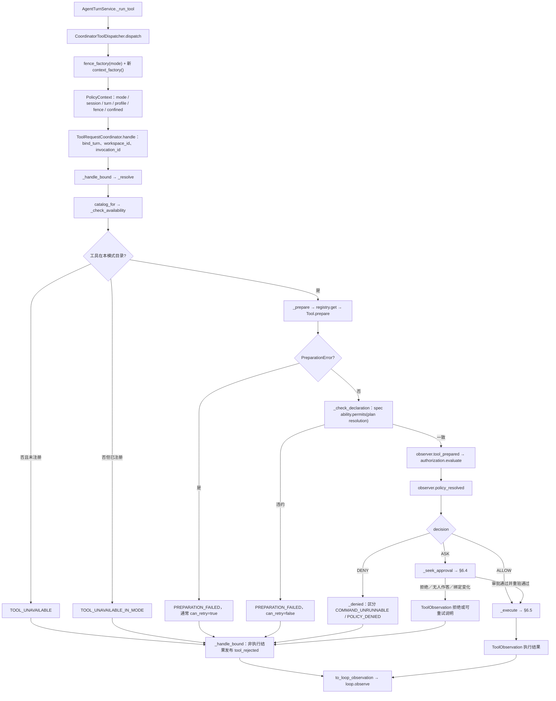
```mermaid
flowchart TD
    A["AgentTurnService._run_tool"] --> B["CoordinatorToolDispatcher.dispatch"]
    B --> C["fence_factory(mode) + 新 context_factory()"]
    C --> D["PolicyContext：mode / session / turn / profile / fence / confined"]
    D --> E["ToolRequestCoordinator.handle：bind_turn、workspace_id、invocation_id"]
    E --> F["_handle_bound → _resolve"]
    F --> G["catalog_for → _check_availability"]
    G --> H{"工具在本模式目录?"}
    H -->|否且未注册| I["TOOL_UNAVAILABLE"]
    H -->|否但已注册| J["TOOL_UNAVAILABLE_IN_MODE"]
    H -->|是| K["_prepare → registry.get → Tool.prepare"]
    K --> L{"PreparationError?"}
    L -->|是| M["PREPARATION_FAILED，通常 can_retry=true"]
    L -->|否| N["_check_declaration：spec ability.permits(plan resolution)"]
    N -->|违约| O["PREPARATION_FAILED，can_retry=false"]
    N -->|一致| P["observer.tool_prepared → authorization.evaluate"]
    P --> Q["observer.policy_resolved"]
    Q --> R{"decision"}
    R -->|DENY| S["_denied：区分 COMMAND_UNRUNNABLE / POLICY_DENIED"]
    R -->|ASK| T["_seek_approval → §6.4"]
    R -->|ALLOW| U["_execute → §6.5"]
    T -->|审批通过并重验通过| U
    T -->|拒绝／无人作答／绑定变化| V["ToolObservation 拒绝或可重试说明"]
    U --> W["ToolObservation 执行结果"]
    I --> X["_handle_bound：非执行结果发布 tool_rejected"]
    J --> X
    M --> X
    O --> X
    S --> X
    V --> X
    X --> Y["to_loop_observation → loop.observe"]
    W --> Y
```

目录过滤不是唯一防线：模型即使编造了未展示工具名，协调器也会再查。`prepare()` 只读，
参数错误无需进入策略引擎。执行只消费 `effective_plan`，不会重新解析原始 request.arguments。

### 6.2 能力分析与 Shell 子流程

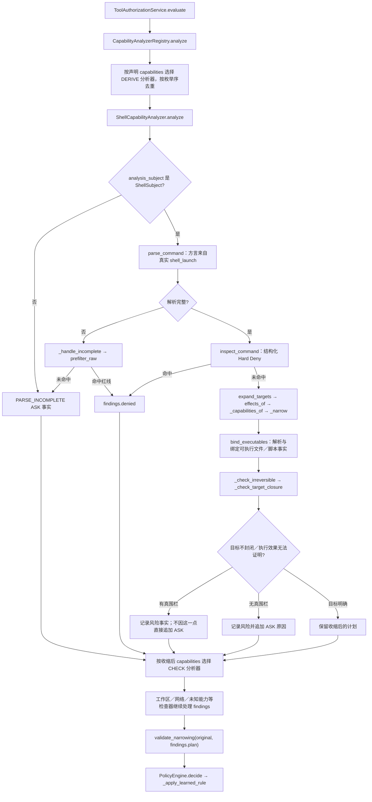
```mermaid
flowchart TD
    A["ToolAuthorizationService.evaluate"] --> B["CapabilityAnalyzerRegistry.analyze"]
    B --> C["按声明 capabilities 选择 DERIVE 分析器，按枚举序去重"]
    C --> D["ShellCapabilityAnalyzer.analyze"]
    D --> E{"analysis_subject 是 ShellSubject?"}
    E -->|否| F["PARSE_INCOMPLETE ASK 事实"]
    E -->|是| G["parse_command：方言来自真实 shell_launch"]
    G --> H{"解析完整?"}
    H -->|否| I["_handle_incomplete → prefilter_raw"]
    I -->|命中红线| J["findings.denied"]
    I -->|未命中| F
    H -->|是| K["inspect_command：结构化 Hard Deny"]
    K -->|命中| J
    K -->|未命中| L["expand_targets → effects_of → _capabilities_of → _narrow"]
    L --> M["bind_executables：解析与绑定可执行文件／脚本事实"]
    M --> N["_check_irreversible → _check_target_closure"]
    N --> O{"目标不封闭／执行效果无法证明?"}
    O -->|有真围栏| P["记录风险事实；不因这一点直接追加 ASK"]
    O -->|无真围栏| Q["记录风险并追加 ASK 原因"]
    O -->|目标明确| R["保留收缩后的计划"]
    F --> S["按收缩后 capabilities 选择 CHECK 分析器"]
    J --> S
    P --> S
    Q --> S
    R --> S
    S --> T["工作区／网络／未知能力等检查器继续处理 findings"]
    T --> U["validate_narrowing(original, findings.plan)"]
    U --> V["PolicyEngine.decide → _apply_learned_rule"]
```

DERIVE 先把不透明命令变为事实, CHECK 再按实际能力检查, 不能反过来对 Shell 的最宽能力
声明直接报警. 可执行文件绑定与脚本读取的细节继续读 `security/analyzers/executable_binding.py`
和 `security/analyzers/script_binding.py`; 解析 PATH, 判定内建与受控可执行文件的
`executable_resolver.py` 在上一层 `application/security/`, 不在 `analyzers/` 里.
命令方言, token 切分与效果推导另在 `domain/security/shell/` (`parser.py`, `posix.py`,
`powershell.py`, `effects.py`). 工具层和安全层之间传递的是 `ToolPlan`, 不是工具实例.

### 6.3 策略分支：以 _verdict 的真实顺序为准

```mermaid
flowchart TD
    A["PolicyEngine.decide → _verdict"] --> B{"findings.hard_deny?"}
    B -->|是| C["DENY：不可被批准／学习规则覆盖"]
    B -->|否| D{"findings.unrunnable?"}
    D -->|是| E["DENY：命令当前接不起来；允许换可执行方案"]
    D -->|否| F["_only_hard_deny = fence.unrestricted 且 confined"]
    F --> G{"mandatory_ask 且不是 unrestricted?"}
    G -->|是| H["ASK，mandatory=true"]
    G -->|否| I["_reliable_capabilities：有围栏且目标不封闭时移除不可靠越界推导"]
    I --> J{"非 unrestricted 且触及 _NEVER_AUTO?"}
    J -->|是| H
    J -->|否| K["capabilities_requiring_approval(capabilities, fence, confined, targets_closed)"]
    K --> L{"还有预算外能力?"}
    L -->|是| M["ASK；优先使用分析器的具体原因"]
    L -->|否| N{"requires_ask 且非 unrestricted?"}
    N -->|是| O["ASK：分析不足以自动放行"]
    N -->|否| P["ALLOW + _allow_reason"]
    H --> Q["ToolAuthorizationService._apply_learned_rule"]
    M --> Q
    O --> Q
    P --> Q
    C --> Q
    E --> Q
    Q --> R{"普通 ASK、非 mandatory、存在 learned service?"}
    R -->|否| S["原裁决返回"]
    R -->|是| T["LearnedRuleService.find"]
    T -->|未命中| S
    T -->|命中| U["改为 ALLOW / LEARNED_ALLOW"]
```

这里纠正旧文档的“最后默认 DENY”：当前 `_verdict()` 在所有禁止／需批准条件排除后
返回 ALLOW。保守性由前置事实、能力预算和授权校验共同构成，不能凭旧模块注释画一个不存在的
最终 DENY 分支。

`domain/security/budget.py::fence_allowed_capabilities()` 的关键分支：

```mermaid
flowchart TD
    A["fence_allowed_capabilities"] --> B["先加入 _ALWAYS：计划、归档、记忆、提问、工作区读、进程能力"]
    B --> C{"没有 fence?"}
    C -->|是| D["返回基线能力"]
    C -->|否| E{"unrestricted 且 confined?"}
    E -->|是| F["全部 Capability；Hard Deny 仍由上游保留"]
    E -->|否| G{"fence 非只读?"}
    G -->|是| H["加入工作区写／删除／移动"]
    G -->|否| I{"confined?"}
    H --> I
    I -->|否| J["扣除 _NEVER_AUTO 后返回"]
    I -->|是| K["加入 MODEL_CALL"]
    K --> L{"automatic_opaque_execution?"}
    L -->|是| M["加入 Shell／脚本／网络能力"]
    L -->|否| N{"automatic_shell 且 targets_closed?"}
    N -->|是| O["只加入透明 Shell 能力"]
    N -->|否| J
    M --> J
    O --> J
```

accept_edits 的透明 Shell 自动批准依赖**真围栏和目标封闭**；auto 允许围栏内不透明执行。
“允许 NETWORK_ACCESS”不等于实际网络畅通，最终由 `FencePolicy.network_allowed` 约束。
批准一次调用也不会修改 fence。

### 6.4 审批、学习与批准后重新校验

```mermaid
flowchart TD
    A["_seek_approval(decision)"] --> B["build_view + scopes_for + learn_block_reason"]
    B --> C["build_binding(plan, catalog, policy, view_hash)"]
    C --> D["ApprovalRequest → observer.approval_requested"]
    D --> E["ApprovalService.request → HumanPromptService.ask，见 §7"]
    E --> F["observer.approval_resolved → ApprovalRequest.response_error"]
    F --> G{"响应契约有效?"}
    G -->|否| H["APPROVAL_UNAVAILABLE：invalid response"]
    G -->|是| I{"response.approved?"}
    I -->|否，明确拒绝| J["APPROVAL_DENIED"]
    I -->|否，未解决／无人可答| K["APPROVAL_UNAVAILABLE"]
    I -->|是| L["_revalidate"]
    L --> M["重新 catalog_for → _prepare → authorization.evaluate"]
    M --> N{"准备失败或新裁决 DENY?"}
    N -->|是| O["返回对应拒绝；批准不能覆盖新事实"]
    N -->|否| P["重建 view 与 binding → approved_binding.differences(current)"]
    P --> Q{"存在差异?"}
    Q -->|是| R["APPROVAL_REQUIRED，can_retry=true，旧批准作废"]
    Q -->|否| S["绑定 approval_view_hash"]
    S --> T{"批准 scope 要学习且 learned service 存在?"}
    T -->|是| U["LearnedRuleService.record"]
    T -->|否| V["替换裁决为 ALLOW / APPROVAL_GRANTED"]
    U --> V
    V --> W["进入 _execute"]
```

重验失败不会在同一次 `_seek_approval()` 中自动再次弹卡，而是把可重试 observation 交回模型。
学习发生在重验通过后，避免一个已失效批准留下永久规则。`_revalidate()` 使用传入的 context
再次读取事实，并非调用新的 context_factory；运行期仍有下一道状态复核。

### 6.5 恢复屏障、授权信封与执行

```mermaid
flowchart TD
    A["ToolRequestCoordinator._execute"] --> B["RecoveryFlow.begin，见 §10"]
    B -->|RecoveryUnavailableError| C["RECOVERY_UNAVAILABLE；不签发、不执行"]
    B -->|建立保障或无需事务| D["ToolAuthorizationService.issue(ALLOW)"]
    D --> E["ExecutionAuthorization：有效计划、画像、TTL、恢复绑定、审批视图哈希"]
    E --> F["observer.tool_started → ToolRuntime.execute"]
    F --> G["_require_envelope → _resolve_tool"]
    G --> H{"计划能力未超 spec 且 spec_hash 一致?"}
    H -->|否| X["AuthorizationError"]
    H -->|是| I["envelope.ensure_usable：有效期／撤销／画像"]
    I -->|失败| X
    I -->|通过| J{"single_use 且已消费?"}
    J -->|是| X
    J -->|否| K["首次尝试即登记 consumed"]
    K --> L["context.differences(plan.execution_context)"]
    L -->|有变化| X
    L -->|无变化| M["_verify_file_state：realpath、身份、元数据、内容哈希"]
    M -->|变化| X
    M -->|一致| N{"传入 cancel 且已取消?"}
    N -->|是| O["返回 CANCELLED ToolResult"]
    N -->|否| P["Tool.perform(effective_plan, context, cancel)"]
    P -->|抛普通异常| Q["记录 traceback → TOOL_ERROR / tool_exception"]
    P -->|返回| R["必要时补 duration"]
    O --> S["RecoveryFlow.finish"]
    Q --> S
    R --> S
    S --> T["observer.tool_completed → fence_hint(raw_output)"]
    T --> U["_completed → ToolObservation → render → LoopObservation"]
    X --> V["_authorization_refused → RecoveryFlow.abort"]
    V --> W["tool_cancelled(side_effect_unknown=false) → 拒绝 observation"]
```

一次性授权在文件复核前消费，即使随后状态漂移也必须重新 prepare／裁决。
`FileStateBinding` 的通用复核与各工具自己的 `path_state_token()` 校验并存。二者都不能被
描述成“完全消除了任何外部进程在最后一瞬修改文件的可能”。

## 7. 分支流程：人机提示、取消与计划评审

源码入口：`interfaces/runtime/human_interaction/broker.py`、
`application/human_interaction/service.py`、`application/security/approval_service.py`、
`application/tools/builtin/ask_user.py`、`application/planning/plan_review.py`。

### 7.1 提问与审批共用队列，返回语义不同

```mermaid
flowchart TD
    A["审批 _seek_approval"] --> B["ApprovalService.request：审批视图转 HumanPrompt"]
    C["AskUserTool.perform"] --> D["_prompt：问题转 HumanPrompt(kind=QUESTION)"]
    B --> E["BlockingHumanPromptBroker.ask"]
    D --> E
    E --> F["锁内 _refuse"]
    F --> G{"closed／本 turn cancelled／问题次数超额?"}
    G -->|是| H["PromptAnswer(resolved=false, note)"]
    G -->|否| I["登记 _Pending(prompt, turn代次) → prompt_requested"]
    I --> J["pending.ready.wait：无超时等待"]
    J --> K["Web /prompts 或 TUI list_pending 显示卡片"]
    K --> L["ProjectRuntime.resolve_prompt → broker.resolve"]
    L --> M{"存在、未解决、代次一致、accepts_answer?"}
    M -->|否| N["返回 false；不唤醒等待方"]
    M -->|是| O["before_resolve → _record_prompt_answer"]
    O --> P["问题回答先写 USER_QUESTION_ANSWERED"]
    P --> Q["设置 pending.answer → ready.set"]
    Q --> R["ask.finally 删除 pending + prompt_resolved"]
    R --> S{"调用者"}
    S -->|ApprovalService| T["映射 ApprovalResponse → 协调器继续重验／拒绝"]
    S -->|AskUserTool| U["answered／skipped ToolResult → 同一 turn 继续"]
    H --> V{"调用者"}
    V -->|审批| W["未获授权 → 不执行，HALT 处置"]
    V -->|提问| X["_unanswered → no_answer；让模型按已有信息继续"]
```

只对 QUESTION 计提问额度，审批不占这个额度。跳过问题不是同意推荐选项；自由文本、单选／多选
和可跳过规则由 `HumanPrompt.accepts_answer()` 校验。问题答案先持久化再唤醒工具，避免下一次
模型请求先于不可重建的人类回答落盘。

### 7.2 取消：同步边界和当前接线限制

```mermaid
flowchart TD
    A["POST /turns/current/cancel 或 TUI Ctrl-C"] --> B["ProjectRuntime.cancel"]
    B --> C["持有 _run_lock"]
    C --> D{"当前状态 running?"}
    D -->|否| E["返回 false"]
    D -->|是| F["cancel_source.current → token.cancel"]
    F --> G["prompts.cancel_turn：锁内先置 cancelled 闩"]
    G --> H["_release_locked：唤醒所有未解决 pending"]
    H --> I["以后在同一代次 ask → _refuse 直接返回未解决"]
    H --> J["已经等待的 ask → resolved=false 返回"]
    F --> K["主模型 ModelRequest.cancel_token 可观察取消"]
    K --> L["网关／Invoker 归一中断 → USER_CANCELLED"]
    J --> M["审批返回不可用／问题返回无回答；随后模型调用看到 token"]
    N["下一次 start_turn"] --> O["同一 _run_lock 内 issue 新 token + begin_turn 新代次"]
    O --> P["之后才启动后台线程"]
```

必须按源码区分“具备取消参数”和“生产调用确实传了 token”：当前
`AgentTurnService._run_tool()` 调 `dispatcher.dispatch()` 没传 `cancel`，因此正常 Agent 工具链
默认收到 None。`ToolRuntime`、`ShellRunTool`、`LocalCommandExecutor` 虽支持 CancelToken，
不能据此声称点击停止会立即终止正在执行的 Shell。broker 的取消释放与主模型 token 仍生效。
标题／压缩等另建的模型请求也没有自动继承主请求 token，阅读取消延迟时要逐段查。

### 7.3 计划评审：结束本 turn，再决定是否新起一轮

```mermaid
flowchart TD
    A["PlanWriteTool.perform"] --> B["ToolResult.turn_disposition = AWAIT_USER_DECISION"]
    B --> C["Coordinator._completed → PLAN_REVIEW_REQUIRED"]
    C --> D["PlanReviewRule.after_observe → LoopStop(WAIT_PLAN_REVIEW) → loop._stop 补齐未执行结果"]
    D --> E["AgentTurnService：COMPLETED + PLAN_REVIEW pause"]
    E --> F["ProjectRuntime：waiting_plan_review"]
    F --> G["Web /plan/review 或 TUI review → resolve_plan_review"]
    G --> H{"当前确实等待且有 active plan?"}
    H -->|否| I["返回 None"]
    H -->|是| J["PlanReviewService.decide"]
    J --> K{"choice"}
    K -->|REJECT| L["set_plan_status(REJECTED)，无 follow_up"]
    K -->|AMEND| M["SUPERSEDED + 补充意见 follow_up"]
    K -->|APPROVE| N["APPROVED + seed_from_plan，暂不运行"]
    K -->|APPROVE_AND_RUN| O["APPROVED + seed_from_plan + _upgraded_mode"]
    O --> P{"mode.sandbox == READ_ONLY?"}
    P -->|是| Q["返回 SessionMode.AUTO"]
    P -->|否| R["不改变 mode"]
    Q --> S["返回执行 follow_up"]
    R --> S
    L --> T["runtime 记录 PLAN_REVIEWED；必要时 session.set_mode"]
    M --> T
    N --> T
    S --> T
    T --> U["旧 TurnRun 标 completed"]
    U --> V{"outcome.follow_up 非空?"}
    V -->|是| W["start_turn(follow_up, origin=PROGRAM)"]
    V -->|否| X["等待用户下一条输入"]
```

实际升档条件是 `mode.sandbox is READ_ONLY`，不只是与某个 PLAN 预设对象相等。
批准计划不产生执行授权，不写 learned rule；新 turn 的每个工具仍完整经过 §6。

## 8. 分支流程：12 个内置工具如何真正执行

注册清单以 `interfaces/runtime/tool_wiring.py::build_tool_stack()` 为准。下列每个 perform
入口之前，都有 §6 的统一管线；图中“授权后”不表示工具可以自己绕过管线。

注册顺序即 `registry.register_all()` 的字面顺序, 与模型看到的目录顺序无关: 目录由
`catalog_for(mode)` 按模式过滤后生成.

| 工具名 | 实现类 | 源文件（`application/tools/builtin/`） | 主要协作对象 |
|---|---|---|---|
| `plan_read` | `PlanReadTool` | `planning_tools.py` | PlanningService.read_plan |
| `plan_write` | `PlanWriteTool` | `planning_tools.py` | PlanningService.write_plan、计划评审 |
| `todo_write` | `TodoWriteTool` | `planning_tools.py` | PlanningService.write_todo |
| `todo_set_status` | `TodoSetStatusTool` | `planning_tools.py` | PlanningService.update_status |
| `ask_user` | `AskUserTool` | `ask_user.py` | HumanPromptService，流程见 §7.1 |
| `artifact_read` | `ArtifactReadTool` | `artifact_read.py` | ArtifactStore |
| `memory_write` | `MemoryWriteTool` | `memory_tools.py` | MemoryService.remember |
| `memory_forget` | `MemoryForgetTool` | `memory_tools.py` | MemoryService.forget |
| `fs_read` | `ReadFileTool` | `fs_read.py` | FileSystemView、ResourceGovernor、ArtifactStore |
| `search_text` | `SearchTextTool` | `search_text.py` | glob、regex、文件状态令牌、输出归档 |
| `fs_apply_patch` | `ApplyPatchTool` | `fs_apply_patch.py` | patch_envelope、patch_apply、text_edit、注入的写函数 |
| `shell_run` | `ShellRunTool` | `shell_run.py` | CommandExecutor、SandboxProvider、输出归档 |

四个计划/待办工具共享 `planning_tools.py::_PlanningTool`, 两个记忆工具共享
`memory_tools.py::_MemoryTool`; 找 perform 分支时先看基类再看子类覆写.
`patch_apply.py`, `patch_envelope.py`, `text_edit.py` 是 `fs_apply_patch` 的实现细节模块,
自身不在 `ToolRegistry` 里. 共用 `base.py` 提供 `validate_arguments()`、
`resolve_target()`、`path_state_token()`、`emit_text()` 等函数；当前仍由具体工具调用，
不是 ToolRuntime 自动对所有工具运行一套 schema／输出模板。

### 8.1 fs_read：解析目标、执行前复核与读取窗口

```mermaid
flowchart TD
    A["ReadFileTool.prepare"] --> B["validate_arguments → resolve_target"]
    B --> C{"存在且最终目标是普通文件?"}
    C -->|否| D["PreparationError：不存在／不可读／非法入参"]
    C -->|是| E["facts(realpath) → scope_of → read_capability"]
    E --> F["ToolPlan：realpath、source_size、source_state、offset、limit、max_bytes"]
    F --> G["经 §6 裁决授权 → ReadFileTool.perform"]
    G --> H["重新 facts → path_state_token"]
    H --> I{"与 source_state 一致?"}
    I -->|否| J["TOOL_ERROR / target_changed / retryable=true"]
    I -->|是| K["limits_for → max_bytes 与归档上限取小值"]
    K --> L["filesystem.read_text → _slice(offset, limit)"]
    L --> M["_slice 产生正文及范围／不完整说明"]
    M --> N["emit_text：内联和归档，见 §8.7"]
    N --> O["ToolResult：summary、data、content_parts、metrics、provenance"]
```

路径归属按最终 realpath 判断，不能凭输入路径看起来位于项目内就算工作区读取。
读取字节上限、行窗口和输出内联上限是三个不同限制；`truncated` 不能单独代表“读过整个文件”。
位置说明作为额外 ContentPart，避免混入模型下一次准备精确匹配的文件正文。

### 8.2 search_text：冻结搜索范围与不完整结果

```mermaid
flowchart TD
    A["SearchTextTool.prepare"] --> B["validate_arguments；query 非空；regex.compile 校验"]
    B -->|无效| C["INVALID_INPUT"]
    B -->|有效| D["resolve_target(path 或 primary_root)"]
    D --> E{"目标类型"}
    E -->|普通单文件| F{"符号链接?"}
    F -->|是| G["UNSUPPORTED_REQUEST"]
    F -->|否| H["files = 单个 realpath"]
    E -->|目录| I["expand_glob(in_files, skip_ignored)；限制候选数"]
    E -->|其他| J["TARGET_UNREADABLE"]
    I --> K["过滤符号链接／非普通文件 → _rank 排序 → 限制文件数"]
    K --> L["_plan_for：冻结 files、file_states、截断事实"]
    H --> L
    L --> M["授权后 perform：_matcher 构造匹配器"]
    M --> N{"还有文件且未达命中上限?"}
    N -->|否| Y["汇总 incomplete_notes"]
    N -->|是| O{"cancel 已设置?"}
    O -->|是| P["记录 cancelled，停止扫描"]
    P --> Y
    O -->|否| Q{"当前 path_state_token 与计划一致?"}
    Q -->|否| R["target_changed → 返回可重试错误"]
    Q -->|是| S["read_text_if_text(max_bytes)"]
    S --> T{"二进制?"}
    T -->|是| U["计 skipped_binary → 下一文件"]
    U --> N
    T -->|否| V["逐行匹配；正则超长行先截断"]
    V --> W["_render_hits：路径分组、行号、上下文行"]
    W --> N
    Y --> Z["标明 glob／文件／字节／符号链接／二进制／命中／长行／取消限制"]
    Z --> AA["emit_text → ToolResult(data.complete, matches, files)"]
```

零命中且 `complete=false` 只能说明扫描过的范围没有匹配，不能解释成整个项目不存在该文本。
忽略规则在遍历阶段剪枝，排序在截断文件列表之前；否则构建产物可能耗尽额度，让源码未被扫描。
取消分支要求调用者传入 token，正常 Agent 链的接线限制见 §7.2。

### 8.3 fs_apply_patch：四类操作的 prepare 分支

```mermaid
flowchart TD
    A["ApplyPatchTool.prepare"] --> B["validate_arguments → patch 非空"]
    B --> C["patch_envelope.parse_envelope"]
    C -->|PatchSyntaxError| D["PreparationError，包含 described 位置"]
    C -->|成功| E["逐 section 调 _plan_section"]
    E --> F{"section 类型"}
    F -->|NewFile| G["_plan_new：解析目标／检查已有对象／计算缺失父目录"]
    F -->|UpdateFile| H["_plan_update：读取现有正文 → apply_replacements"]
    F -->|DeleteFile| I["_plan_delete：解析删除目标与展开集合"]
    F -->|MoveFile| J["_plan_move：绑定源与目的路径事实"]
    H --> K["text_edit.locate：定位 FIND；容差只用于明确定位"]
    K -->|无法可靠定位| L["返回 PreparationError；提供未命中／歧义说明"]
    K -->|定位成功| M["计算最终正文、对齐说明与 content_preview"]
    G --> N{"当前 section 计划有效?"}
    I --> N
    J --> N
    M --> N
    N -->|否| O["立即返回失败；全部 prepare 都不写文件"]
    N -->|是| P{"还有 section?"}
    P -->|是| E
    P -->|否| Q["汇总 write/delete/move targets → scope_for_write_all → _capabilities_of"]
    Q --> R["ToolPlan：operations 保存最终内容及状态令牌"]
    R --> S["STATIC 或 FORGE_EXPANDED → 进入统一授权管线"]
```

补丁是项目自己的信封格式，具体标记与转义看 `patch_envelope.py`，不是把任意 unified diff
直接丢给系统 patch。更新内容在 prepare 阶段算完，因此批准绑定的是“文件将变成什么”，
不是在 perform 时根据旧 FIND 重新猜一次结果。

### 8.4 fs_apply_patch：实际写入与部分失败

```mermaid
flowchart TD
    A["授权后 ApplyPatchTool.perform"] --> B["读取 plan.normalized_input.operations"]
    B --> C["每项操作先 _stale_target"]
    C --> D{"源／目标状态一致?"}
    D -->|否| E["_stale_result：报告已应用部分和 mutation 状态"]
    D -->|是| F["_apply(raw)"]
    F --> G{"kind"}
    G -->|create| H["先 _mkdir 缺失目录 → 注入 _create_file"]
    G -->|update| I["注入 _replace_file"]
    G -->|delete| J["倒序遍历冻结 targets → _delete_file"]
    G -->|move| K["注入 _move_file"]
    H --> L{"发生 OSError?"}
    I --> L
    J --> L
    K --> L
    L -->|是| M["_failed_result：保留已执行项，不伪装全成功"]
    L -->|否| N["记录 applied / mutated / 对齐 notes"]
    N --> O{"还有操作?"}
    O -->|是| C
    O -->|否| P["OK + paths / changes + workspace_mutated=true"]
    E --> Q["Coordinator → RecoveryFlow.finish，恢复点保留"]
    M --> Q
    P --> Q
```

多个文件不是一个文件系统原子事务，中途失败可能留下已应用部分。单文件发布由组合根注入：
`_replace_file()` 写同目录临时文件、flush/fsync、os.replace；`_create_file()` 用硬链接
发布且拒绝覆盖竞争出现的目标；`_move_file()` 使用 no-replace 语义，链接目标后删除源。
恢复能力来自执行前的恢复事务，不是 perform 自动回滚整批。

### 8.5 shell_run：执行链、围栏、超时与退出码

```mermaid
flowchart TD
    A["ShellRunTool.prepare"] --> B["validate_arguments → command.strip"]
    B --> C{"命令非空且 shell_kind 与 profile 一致?"}
    C -->|否| D["INVALID_INPUT"]
    C -->|是| E["ToolPlan：ShellSubject + UNKNOWN targets + OPAQUE confidence"]
    E --> F["ShellCapabilityAnalyzer 收缩 → 审批／恢复／授权，见 §6"]
    F --> G["ShellRunTool.perform → ResourceGovernor.limits_for"]
    G --> H["_argv_of：shell_launch.program + args + 已批准 command"]
    H --> I["SandboxedCommandExecutor.run(CommandRequest)"]
    I --> J{"request.fence 缺失?"}
    J -->|是| K["CommandOutcome.failure；拒绝执行"]
    J -->|否| L["SandboxProvider.wrap(argv, fence)"]
    L -->|OSError| M["围栏创建失败，不启动内层进程"]
    L -->|成功| N["LocalCommandExecutor.run"]
    N --> O["启动进程 → _BoundedReader 分别读取 stdout/stderr"]
    O --> P{"执行结局"}
    P -->|自然结束| Q["记录 exit_code，包括非零"]
    P -->|超时或收到 cancel| R["_terminate / _signal_group / _reap → 记录状态"]
    P -->|启动失败| S["返回 failure"]
    Q --> T["ShellRunTool._render → emit_text"]
    R --> T
    S --> T
    K --> T
    M --> T
    T --> U{"_completed(outcome)?"}
    U -->|是| V["ToolResult.OK；data 保留真实 exit_code"]
    U -->|否| W["_status_of → 超时／取消／工具错误"]
```

Shell 正常退出但 exit_code=1 仍可能是工具 OK，例如无匹配的 grep。工具状态表示执行机制
是否完成，命令业务是否成功由输出和 exit_code 判断。围栏根据模式编译，批准按钮本身不会
把网络或目录范围放宽。`fence_hint()` 只是给模型的失败解释，不会重新授权。

### 8.6 计划和待办四条分支

```mermaid
flowchart TD
    A["_PlanningTool.prepare"] --> B["validate_arguments + 子类 _validate_semantics"]
    B -->|非法 plan_id／修订不存在计划| C["PreparationError"]
    B -->|成功| D["PLAN_ONLY、空工作区 effects 的 ToolPlan → 授权后 perform"]
    D --> E{"具体工具"}
    E -->|PlanReadTool| F["PlanningService.read_plan(plan_id)"]
    F --> G{"有正文?"}
    G -->|是| H["_ok：返回正文"]
    G -->|否| I["_ok：当前没有计划，不算 IO 错误"]
    E -->|PlanWriteTool| J["构造 PlanStep → PlanningService.write_plan"]
    J --> K["再 read_plan → _ok(disposition=AWAIT_USER_DECISION)"]
    K --> L["进入 §7.3 计划评审"]
    E -->|TodoWriteTool| M["提取 titles/name → PlanningService.write_todo"]
    M --> N["整表重写、状态重置 → todo.render → _ok"]
    E -->|TodoSetStatusTool| O["构造 StatusUpdate → PlanningService.update_status"]
    O -->|ValueError| P["TOOL_ERROR：序号越界／多个 in_progress 等"]
    O -->|None| Q["_ok：没有待办，请先创建"]
    O -->|成功| R["todo.render → _ok"]
    H --> S["AgentTurnService 比较前后 id/revision → 发计划／待办变化事件"]
    I --> S
    N --> S
    P --> S
    Q --> S
    R --> S
```

计划和待办文件按当前会话分区，由 `FsPlanStore` 的延迟路径函数定位。待办可以独立于计划
存在；只有方向确实要人裁决时才提交计划。状态切换约束继续读 `domain/planning/todo.py`，
文档名称、版本和活动索引更新继续读 `application/planning/planning_service.py`。

### 8.7 输出归档与 artifact_read 回读

```mermaid
flowchart TD
    A["工具调用 base.emit_text(text)"] --> B["UTF-8 编码计总 bytes_out"]
    B --> C{"超过 max_inline_bytes?"}
    C -->|是| D["截取可解码前缀，标 truncated"]
    C -->|否| E["内联保留正文"]
    D --> F{"配置了 ArtifactStore?"}
    E --> F
    F -->|否| G["返回内联内容；无归档句柄"]
    F -->|是| H["ResourceGovernor.clamp(max_artifact_bytes) → artifacts.write"]
    H --> I["保存 provenance.artifact_id；内联截断时加入 artifacts 列表"]
    I --> J["ToolResult → ToolObservation.render"]
    G --> J
    J --> K["ToolResult.render_for_model(include_body=spec.body_in_window)"]
    K --> L["依据句柄、正文规模和 include_body 决定正文还是引用"]
    L --> M["summary + data + 正文／artifact 句柄进入窗口"]
    M --> N["模型请求 artifact_read"]
    N --> O["ArtifactReadTool.prepare 校验 id 与窗口参数 → 统一授权"]
    O --> P["ArtifactReadTool.perform → artifacts.read(id, offset, limit)"]
    P -->|ArtifactMissing| Q["TOOL_ERROR / artifact_expired / retryable=false"]
    P -->|成功| R["按 max_inline_bytes clamp"]
    R --> S{"仍过长?"}
    S -->|是| T["附带继续分段读取说明"]
    S -->|否| U["直接返回"]
    T --> V["沿用原 artifact_id；不再次 emit_text 归档"]
    U --> V
```

没有句柄时必须保留正文，否则模型无法找回内容。正文短时也可能直接内联，
`body_in_window=false` 不是无条件删正文。`bytes_out` 是工具产出规模，`artifacts` 是展示用
溢出列表，`provenance.artifact_id` 是内容来源引用，三者不能混用。

`max_artifact_bytes` 本身也会截断归档；`raw_output()` 拼的是结果中已有 content_parts
和 error，并不会读取归档补回原进程全部输出。因此围栏提示检查覆盖的范围受结果保留范围限制。

### 8.8 记忆写入、覆盖、拒绝与遗忘

```mermaid
flowchart TD
    A["_MemoryTool.prepare：schema + scope → MEMORY_WRITE 计划"] --> B["统一授权后 perform"]
    B --> C{"工具类型"}
    C -->|MemoryWriteTool| D["MemoryService.remember(scope, key, value, derived_from)"]
    D --> E{"scope store 存在?"}
    E -->|否| F["SCOPE_FULL 拒绝"]
    E -->|是| G["_reject：key 格式、非空、字节数、looks_like_secret"]
    G -->|不合格| H["MemoryRejection → _refused"]
    G -->|合格| I["load 旧条目 → 找同 key → 去掉旧值"]
    I --> J{"新增且 scope 容量已满?"}
    J -->|是| F
    J -->|否| K["保存新 MemoryEntry + begin_turn 提供的 provenance"]
    K --> L{"覆盖了旧值?"}
    L -->|是| M["_ok：说明被覆盖的旧内容"]
    L -->|否| N["_ok：已写入"]
    C -->|MemoryForgetTool| O["MemoryService.forget(scope, key)"]
    O --> P{"存在 store 和该 key?"}
    P -->|否| Q["返回 false → _ok：原本不存在"]
    P -->|是| R["过滤条目 → store.save → _ok：已遗忘"]
    K --> S["下一 turn MemoryService.load：项目在前、用户在后、各自按 key 排序"]
    S --> T["render_state_frame；不进入安全裁决"]
```

记忆是模型可写的上下文材料，作用是提供事实／偏好，不能改变授权范围。凭证样式检查是
记忆写入自身的拒绝条件，不是 LLM 安全分类器。删除会话不会清除项目或用户记忆。

## 9. 主流程：LLM 网关与协议适配

源码入口：`application/agent_loop/model_invoker.py`、
`application/llm/gateway/default_gateway.py`、`retry.py`、`streaming.py`、
`application/llm/selection.py`、`infrastructure/llm/adapters/openai_compatible.py`。

### 9.1 选择模型、调用形态与正常结果

```mermaid
flowchart TD
    A["BuiltinAgentLoop._build_request"] --> B["AgentModelInvoker.invoke(request, transport)"]
    B --> C{"ModelTransportMode.COMPLETE?"}
    C -->|是| D["_complete → gateway.complete"]
    C -->|否| E["_stream → gateway.stream"]
    D --> F["DefaultLlmGateway._resolve_selection"]
    E --> F
    F --> G["ConfigBackedSelectionResolver.resolve → resolve_selection"]
    G --> H["_select_ref：用途覆盖／默认选择 → _validate 目录与可用性"]
    H --> I["_resolve_thinking：origin 是否需要 thinking"]
    I --> J["_check_tool_capability：provider 与 model 都须支持工具"]
    J --> K{"调用通道"}
    K -->|complete| L["_complete_resolved，见 §9.2"]
    K -->|stream| M["检查 streaming 支持 → _pre_call_checks → _stream_with_retries"]
    M -->|调用 stream 当场抛 ModelBadRequestError| N["Invoker 回退 _complete；不换模型"]
    N --> D
    L --> O["ModelResponse → UsageMeter.build_draft → model_delta → _finished"]
    M --> P["StreamAccumulator.add；delta 外送；收尾处理见 §9.4"]
    O --> Q["ModelOutcome(text, tool_calls) → 主循环"]
    P --> Q
```

origin 是用途，不是自动换模型指令；只有显式配置用途覆盖才会选择其他模型。
工具能力不支持直接报错，不偷偷清空工具目录继续回答。Invoker 的流式回退捕获范围是
调用 `gateway.stream()` 当场抛出的错误，不是任意流式中途错误都能转非流式重跑。

### 9.2 非流式调用、响应缓存和预检

```mermaid
flowchart TD
    A["DefaultLlmGateway._complete_resolved"] --> B["raise_if_cancelled"]
    B --> C{"use_cache 且 cache.lookup 命中?"}
    C -->|是| D["直接返回缓存 ModelResponse"]
    C -->|否| E["_pre_call_checks"]
    E --> F["SlidingWindowHealthRegistry.check(ref)"]
    F --> G["ApproximateTokenEstimator.estimate_input：messages/system/tools"]
    G --> H{"estimated_input + expected_output 超 context_window?"}
    H -->|是| I["ModelContextOverflowError → 主循环强压分支"]
    H -->|否| J["_settings + ProviderRegistry.get"]
    J --> K["_invoke_with_retries → CredentialRetryLoop.run"]
    K --> L["_provider_request → ModelProvider.complete → HTTP adapter"]
    L -->|失败| M["按类型重试或上抛，见 §9.3"]
    L -->|成功| N["有供应商 usage 则采用；否则 _estimate_usage"]
    N --> O["构造 ModelResponse：内容、tool_calls、latency、重试元数据"]
    O --> P["health.record_success → 允许时 cache.store"]
    P --> Q["返回给 AgentModelInvoker"]
```

本地 `InMemoryResponseCache` 是完整响应缓存，与供应商的输入前缀缓存不同。前者可以避免
发送 HTTP，后者仍会有真实模型调用并在 usage 中体现 cached input tokens。流式通道没有
复用这条完整响应缓存路径。

### 9.3 首包前／非流式共用的凭证重试

```mermaid
flowchart TD
    A["CredentialRetryLoop.run(attempt)"] --> B["至多 max_retries + 1 次：先 raise_if_cancelled"]
    B --> C["credential_for：keyless 为 None，否则 CredentialPool.get_credential"]
    C -->|凭证耗尽| D["有 last_error 则抛它，否则抛认证错误"]
    C -->|取得凭证| E["attempt(credential)"]
    E -->|成功| F["按 mark_success 记录凭证成功 → 返回"]
    E -->|ModelCancelledError| G["立即抛出；不重试"]
    E -->|ModelRateLimitError| H{"retry_after 存在且不超过阈值?"}
    H -->|是| I["sleeper 等待 → wait 计数 → 下一次尝试"]
    H -->|否| J{"有可冷却凭证?"}
    J -->|是| K["mark_failed 冷却 → credential 计数 → 换可用凭证"]
    J -->|否| L["keyless：直接上抛"]
    E -->|ModelAuthError| J
    E -->|Timeout / Unavailable| M["health.record_failure → transport 计数 → 有界重试"]
    E -->|其他 ModelGatewayError| N["不重试，上抛"]
    E -->|其他异常| O["归一 ModelProviderInternalError，上抛"]
    I --> P{"还有尝试次数?"}
    K --> P
    M --> P
    P -->|是| B
    P -->|否| Q["抛最后一次错误"]
```

重试不切换 provider/model。短限流等待与传输重试不主动冷却当前凭证；认证错误和较长限流
可冷却凭证再取下一把。凭证日志使用引用和哈希指纹，不记录密钥值。

### 9.4 流式：首包是重试边界

```mermaid
flowchart TD
    A["_stream_with_retries"] --> B["_open_stream：retry.run(mark_success=false)"]
    B --> C["provider.stream → next(iterator, None) 取首包"]
    C -->|首包前故障| D["走 §9.3；取消则生成 interrupt chunk"]
    C -->|取得迭代器和首包| E["_stream_body"]
    E --> F["normalize 首包 → yield"]
    F --> G{"cancelled(request)?"}
    G -->|是| H["关闭 iterator → _interrupt_chunk → return"]
    G -->|否| I["next(provider_iter)"]
    I -->|正常块| J["累积 text/usage/finish → normalize → yield"]
    J --> G
    I -->|StopIteration| K["补 usage 和 finish_reason 收尾块 → 标成功"]
    I -->|取消异常| H
    I -->|网关／普通异常| L["health 失败 → _error_chunk；不重试、不重放"]
    H --> M["Invoker._stream：StreamAccumulator.add"]
    J --> M
    K --> M
    L --> M
    M --> N["保存 partial_answer → _record_stream_draft"]
    N --> O{"tail.interrupted?"}
    O -->|是| P["_interrupted：USER_CANCELLED 或 MODEL_ERROR_BLOCKING"]
    O -->|否| Q{"has_partial_tool_calls?"}
    Q -->|是| R["_failed → MalformedToolCallError → 主循环纠错"]
    Q -->|否| S["accumulator.tool_calls → _finished → ModelOutcome"]
```

首包后不能自动重新请求并把第二段输出接在第一段后面。流式中断记录已经收到的部分文本与
用量；不完整工具参数绝不执行。具体 SSE 字节解码、HTTP 错误到 ModelGatewayError 的映射
继续沿 `OpenAICompatibleProvider` 的 complete／stream 和同模块解析函数阅读。

### 9.5 结构化输出：原生 schema 与指令降级

```mermaid
flowchart TD
    A["DefaultLlmGateway.complete_structured"] --> B["解析模型、thinking、工具能力"]
    B --> C{"provider 和 model 都支持 structured output?"}
    C -->|是| D["_structured_native"]
    D --> E["schema 摘要参与 cache.lookup → structured.parse 校验"]
    E -->|有效命中| F["使用缓存结果"]
    E -->|未命中／校验失败| G["_complete_resolved(response_schema, use_cache=false)"]
    G --> H["structured.parse：JSON + schema"]
    H -->|有效| I["写入带 schema 指纹的缓存"]
    H -->|无效| J["保留 validation errors"]
    C -->|否| K["_structured_degraded → structured.with_instruction"]
    K --> L["先查缓存并校验；否则有界调用 _complete_resolved"]
    L --> M["structured.parse"]
    M -->|成功| N["缓存有效响应 → 结束重试"]
    M -->|失败且有次数| L
    M -->|失败且耗尽| J
    F --> O{"有 errors 且 strict?"}
    I --> O
    N --> O
    J --> O
    O -->|是| P["抛 ModelResponseParseError"]
    O -->|否| Q["StructuredModelResponse(data, validation_errors, usage)"]
```

原生路径不是无限重新要求 JSON；降级路径有独立次数上限且不换模型。会话首次标题生成
使用这个入口，并有标题失败后从原始输入截取的回退，见 §12.1。

## 10. 主流程：写前保护、恢复与撤销

源码入口：`application/tool_request/recovery_flow.py`、`application/recovery/coordinator.py`、
`recovery_service.py`、`infrastructure/recovery/cow_snapshot_backend.py`、
`interfaces/web/routers/recovery.py`。

### 10.1 恢复策略选择：不修改、精确目标与全工作区

```mermaid
flowchart TD
    A["RecoveryFlow.begin(plan, context, policy)"] --> B{"装配了 WorkspaceMutationCoordinator?"}
    B -->|否| C{"plan.mutates_workspace?"}
    C -->|是| D["RecoveryUnavailableError：不允许无保障写入"]
    C -->|否| E["返回 None，无事务"]
    B -->|是| F["WorkspaceMutationCoordinator.begin → strategy_for"]
    F --> G{"plan.mutates_workspace?"}
    G -->|否| E
    G -->|是| H{"targets closed 且 mutating_targets 非空?"}
    H -->|否| I["FULL"]
    H -->|是| J{"_touches_directory?"}
    J -->|是| I
    J -->|否| K["TARGETED"]
    I --> L{"策略允许 FULL?"}
    L -->|否| D
    L -->|是| M["_capture_snapshot：尝试整树 COW 快照"]
    M -->|成功| N["保存 snapshot_ref/backend"]
    M -->|不可用或 OSError| O["_planned_targets → _walk_files 主工作区"]
    K --> P["_planned_targets = 精确 mutating_targets"]
    O --> Q["_estimate → RecoveryPolicy.within_budget"]
    P --> Q
    Q -->|超预算| D
    Q -->|通过| R["构造 PREPARING checkpoint + MutationTransaction"]
    N --> R
    R --> S["transaction.arm：ARMED manifest 落盘"]
    S --> T{"FULL 且没有 COW snapshot?"}
    T -->|是| U["逐文件 record_write(OVERWRITE) 保存 preimage"]
    T -->|否| V["返回 transaction"]
    U --> V
    V --> W["RecoveryFlow 登记 write/delete/move 的 preimage"]
    W --> X["恢复保障建立后才允许签发授权"]
```

目录即使目标封闭也采用 FULL，避免“只存目录元数据、恢复为空目录”冒充完整恢复。
FULL 的逐文件回退扫描主根，COW 也对 `context.primary_root` 建快照；不能仅凭 FULL 名称
推断额外授权根或任意外部路径都受整树保护。具体可恢复范围还需看 checkpoint 的实际内容。

### 10.2 事务登记、执行结果与收尾

```mermaid
flowchart TD
    A["MutationTransaction.record_write(path, operation)"] --> B{"checkpoint 已 armed?"}
    B -->|否| C["RecoveryUnavailableError"]
    B -->|是| D["_relative → 检查已有 MutationEntry"]
    D -->|已登记| E["复用最早 preimage；不覆盖最初状态"]
    D -->|未登记| F["filesystem.facts → existed/regenerable/object_type"]
    F --> G{"破坏性操作且非可再生内容?"}
    G -->|是| H["_store_preimage → RecoveryStore.put_blob"]
    G -->|否| I["记录创建／可再生对象事实"]
    H --> J["_append → manifest 更新落盘"]
    I --> J
    J --> K["ToolRuntime 执行"]
    K -->|授权校验失败| L["RecoveryFlow.abort → complete(failed=true)"]
    K -->|返回 ToolResult| M["RecoveryFlow.finish"]
    M --> N{"workspace_mutated is False?"}
    N -->|是| L
    N -->|否，包括未知 None| O["按计划目标 record_result：postimage / 删除 / 移动两端"]
    O --> P{"ToolResult.status == OK?"}
    P -->|是| Q["complete → COMPLETED"]
    P -->|否| R["complete(failed=true) → FAILED"]
```

`workspace_mutated=None` 是不知道，不是没有修改；Shell 超时可能已经产生部分副作用。
manifest 的 ARMED 状态表示保护准备已就位；崩溃候选应以
`TransactionState.may_have_partial_changes` 实际判定，不从“日志里没看到完成”反推零修改。

### 10.3 HTTP／TUI 撤销：逐文件与整树恢复分开

```mermaid
flowchart TD
    A["restore_checkpoint / undo_latest / TUI _restore"] --> B["确认空闲 → 查 checkpoint → context_factory"]
    B -->|不存在| C["404／界面无可撤销提示"]
    B -->|存在| D["RecoveryService.restore"]
    D --> E{"checkpoint.snapshot_ref 非空?"}
    E -->|是| F["_restore_snapshot"]
    F --> G{"快照 backend 可用?"}
    G -->|否| H["RecoveryUnavailableError"]
    G -->|是| I["SnapshotHandle → snapshots.restore(primary_root)"]
    I -->|OSError| H
    I -->|成功| J["manifest=RESTORED；返回主根已恢复"]
    E -->|否| K["preview → 每项 _plan_item"]
    K --> L["比较当前 hash 与 postimage_content_hash"]
    L --> M{"每项 applicable 或 force_conflicts?"}
    M -->|否| N["加入 skipped，不覆盖后续修改"]
    M -->|是| O{"existed_before?"}
    O -->|否| P["删除该次创建的对象"]
    O -->|是，目录| Q["_restore_directory：目录和权限"]
    O -->|是，文件| R["_restore_content → get_blob → writer → mode_setter"]
    N --> S["处理下一项"]
    P --> S
    Q --> S
    R --> S
    S --> T{"全部结束且无 skipped?"}
    T -->|是| U["manifest=RESTORED"]
    T -->|否| V["manifest=CONFLICTED"]
    U --> W["RestoreOutcome(restored, skipped, new_checkpoint_id=None)"]
    V --> W
```

整树快照恢复不逐文件跳过冲突，语义是回到快照时刻；`force_conflicts` 只参与逐文件路径。
`preview()` 遍历 manifest.mutations，不等于完整快照差异预览。当前 Web restore／undo
直接调用 `RecoveryService.restore()`，没有先为撤销自身建立新恢复点，不能承诺“撤销也可再次撤销”。

`crash_recovery_candidates()` 只列出可能部分修改的 checkpoint，让用户决定处理；它不是启动时
自动回滚所有未完成操作。恢复点清理与会话删除分别看 `prune_expired()`、`discard_session()`，
后者接入墓碑后台清理，见 §12.3。

## 11. 主流程：运行事件、快照和前端重建

源码入口：`application/agent_run/events.py`、`application/agent_loop/run_events.py`、
`application/tool_request/run_observer.py`、`interfaces/runtime/event_hub.py`、
`interfaces/web/routers/run_events.py`、`infrastructure/session/jsonl_run_store.py`、
`web/src/features/runEvents/`、`web/src/app/useRunEventWiring.ts`。

### 11.1 事件发布：同一事实有多个展示订阅者

```mermaid
flowchart TD
    A["BuiltinAgentLoop → LoopEventPublisher"] --> D["AgentRunEventBus.publish"]
    B["ToolRequestCoordinator → EventBusToolRunObserver"] --> D
    C["AgentTurnService／ProjectRuntime._prompt_changed"] --> D
    D --> E["构造 AgentRunEvent：session / turn / sequence / payload"]
    E --> F["_dispatch → 每个 subscriber.on_event"]
    F --> G["RunEventHub.on_event"]
    F --> H["JsonlRunStore.on_event"]
    F --> I["TUI RunEventCollector.on_event"]
    F -->|订阅者异常| J["隔离并记录，不让展示失败穿透执行链"]
    G --> K["锁内 cursor + 1 → deque(maxlen=2048)"]
    K --> L["_StreamWaiter.wake → loop.call_soon_threadsafe"]
    L --> M["SSE 协程读取并发送"]
    H --> N["按 session/turn 累积过程；_fold_delta 折叠模型正文"]
    N --> O["终态 _flush → runs.jsonl"]
    I --> P["SessionApp._drive → drain → TerminalRunView.handle"]
```

总线隔离订阅者异常意味着过程记录可能缺失而执行继续。因此 `runs.jsonl` 不应被当成强制
写前审计屏障。当前协调器通过 observer 发布执行事实，不持有旧版 `ToolAuditSink`。

### 11.2 /runs 快照：先取水位，再读内容

```mermaid
flowchart TD
    A["GET /runs → routers.run_events.runs"] --> B["取当前 session_id"]
    B --> C["先 RunEventHub.resume_point → watermark"]
    C --> D["JsonlRunStore.read(session_id)"]
    D --> E["_turn_snapshots(hub, session_id)"]
    E --> F["过滤会话；按 turn 归档；delta 折叠进 outputs"]
    F --> G["先装 stored，再用 live 覆盖相同 turn"]
    G --> H["返回 items + session_id + resume token"]
    H --> I["useConversation.loadTranscript"]
    I --> J{"请求代次仍有效且响应 session_id 匹配?"}
    J -->|否| K["忽略过期响应"]
    J -->|是| L["restoreTurn → setRestoredRuns"]
    L --> M["resumePosition.adopt(resume)"]
    M --> N{"同 stream 且当前 cursor 已更大?"}
    N -->|是| O["保留较新位置"]
    N -->|否| P["采纳快照水位"]
```

先读内容再取水位会产生遗漏窗口：两次操作之间的事件既不在快照里，也被后续游标跳过。
先取水位允许少量重叠，再由前端的事件身份／归并逻辑处理。水位表示事件流位置，
不是会话事件文件中的 `evt_0001`。

### 11.3 SSE 续传、缓冲过期与服务关闭

```mermaid
flowchart TD
    A["GET /events → events(request, after, Last-Event-ID)"] --> B["after 优先 → ResumePoint.parse"]
    B --> C{"能解析实例和 cursor?"}
    C -->|否／首次连接| D["从 hub.resume_point 开始，不重放旧缓冲"]
    C -->|是| E["沿传入位置续传"]
    D --> F["stream while stopping 未设置"]
    E --> F
    F --> G["RunEventHub.after(position)"]
    G --> H{"实例不匹配／cursor 超前／缓冲已过期?"}
    H -->|是| I["位置改当前水位 → 发 resync_required"]
    I --> F
    H -->|否| J{"有 pending events?"}
    J -->|是| K["按 cursor 排序 → _frame → 批量 bytes yield"]
    K --> F
    J -->|否| L{"hub.closed?"}
    L -->|是| M["结束此流；项目可能已切换"]
    L -->|否| N["await hub.wait(cursor, timeout, stop)"]
    N --> F
    F -->|stopping 已设置| O["发 server_stopping → 收尾"]
    P["EventSourceResponse"] -. "心跳／http.disconnect" .-> F
```

客户端断线检测和心跳交给 sse-starlette；后台线程唤醒等待者必须通过其 asyncio loop，
不能跨线程直接操作异步 Event。旧版裸数字游标缺少实例身份，按无有效续传位置处理。

### 11.4 前端连接、合批、作用域与最终文本

```mermaid
flowchart TD
    A["App → useRunEventWiring → useRunEvents"] --> B{"projectId 改变?"}
    B -->|是| C["position.reset + 清 pending + 关闭旧连接"]
    B -->|否| D["connect：EventSource 带 position.read 的 after"]
    C --> D
    D --> E{"接收事件／连接状态"}
    E -->|run_event| F["consume：先 advance(lastEventId)，再 JSON.parse"]
    F --> G["handlers.accepts：sessionScopeRef 过滤会话"]
    G -->|不接受| H["丢弃内容，但位置已推进"]
    G -->|接受| I["onEvent 即时反应 → pending.push → 33ms flushEvents"]
    I --> J["onBatch → appendRunEvent → localTurns"]
    I --> K{"prompt／计划／终态等事件?"}
    K -->|prompt| L["reloadPrompts"]
    K -->|计划／审批／待办| M["refreshWorkspace"]
    K -->|终态| N["flush → busy=false → 延后 syncFinishedTurn"]
    N --> O["GET /turns/current → finishLocalTurn"]
    J --> P["ConversationTimeline／TurnView／RunProcess 渲染"]
    O --> P
    E -->|resync_required| Q["reset 位置、清 pending → loadTranscript + refreshWorkspace"]
    E -->|onopen| R["live、重置退避；重连后刷新项目与状态"]
    E -->|server_stopping| S["关闭连接 → 从初始退避重新连接"]
    E -->|onerror| T["关闭 EventSource → fetch /bootstrap 探测会话"]
    T -->|401| U["STALE_SESSION 提示"]
    T --> V["scheduleRetry：1 秒起翻倍"]
    U --> V
    V --> W{"下一间隔超过一小时?"}
    W -->|是| X["connection=stopped，等待用户重新加载"]
    W -->|否| D
    S --> V
```

`useRunEvents` 只管连接与合批；`useRunEventWiring` 决定事件影响会话、提示卡片或工作区。
合批用 setTimeout，后台标签页仍能缓慢排空。切会话调用 `discardPending()`，否则旧会话
尚未渲染的事件会在清屏后重新出现。前端源码仍在重构时，应先查当前 App 的 import，
不要沿旧组件文件名寻找入口。

## 12. 分支流程：会话、模型配置、模式与目录授权

### 12.1 会话首次落盘、标题生成与事件顺序

源码入口：`application/session/session_service.py`、`infrastructure/session/jsonl_event_store.py`、
`infrastructure/session/json_state_store.py`。

```mermaid
flowchart TD
    A["SessionService.start"] --> B["新 session_id、默认 ACCEPT_EDITS、_persisted=false；不落盘"]
    B --> C["record_user_message / record_tool_event / 其他 record_* → _append"]
    C --> D{"首条 USER_MESSAGE、未落盘且无标题?"}
    D -->|是| E["_title_from → gateway.complete_structured(origin=TITLE)"]
    E --> F{"JSON 中 title 是有效非空字符串?"}
    F -->|是| G["规范空白并按长度裁剪"]
    F -->|否或任意异常| H["从原输入规范空白并截取标题"]
    G --> I["_ensure_persisted"]
    H --> I
    D -->|否| I
    I --> J{"已经 persisted?"}
    J -->|否| K["置 persisted=true → _emit(SESSION_CREATED)"]
    J -->|是| L["_emit(当前事件)"]
    K --> L
    L --> M["递增 evt 序号 → EventStore.append(event)"]
    M --> N["更新内存 last_event_id → StateStore.write(snapshot)"]
    N --> O["返回 SessionEvent"]
    M -->|OSError| P["session.write_failed 日志 → 上抛"]
    N -->|OSError| P
```

标题调用发生在主循环启动之前，所以首次消息可能先等待一次 TITLE 请求。标题失败不会
阻断输入，落盘失败则会上抛。先写事件再写快照保证快照引用已存在事件，不等于这两次写入
是跨文件原子事务。只进入会话且不产生可记录动作，不创建会话文件。

### 12.2 新会话、恢复历史与模型窗口重建

```mermaid
flowchart TD
    A["useSessionActions.create / resume（侧栏会话项，见 §12.6）或 TUI 命令"] --> B{"新建还是恢复?"}
    B -->|新建| C["ProjectRuntime.new_session：拒绝 busy"]
    C --> D["SessionService.start → _build_agent_turn → 清 _run"]
    B -->|恢复| E["ProjectRuntime.resume：拒绝 busy"]
    E --> F["ResumeService.load_full(session_id)"]
    F --> G{"StateStore 有快照?"}
    G -->|否| H["SessionStateError"]
    G -->|是| I["读取全部 EventStore 事件 → SessionService.resume(snapshot, history)"]
    I --> J["接续 evt 序号 → _build_agent_turn → AgentTurnService.resume"]
    J --> K["USER_MESSAGE 数量重建 turn 计数 → _rebuild_window"]
    K --> L{"逐历史事件"}
    L -->|USER/ASSISTANT_MESSAGE| M["按角色追加正文"]
    L -->|USER_QUESTION_ANSWERED| N["answer_replay：转成 USER 消息保留回答"]
    L -->|有非空 SUMMARY 的 CONTEXT_COMPACTED| O["用交接摘要替换此前累积窗口"]
    L -->|其他事件| P["不生成模型窗口消息"]
    M --> Q["继续下一事件 → 最终 Window"]
    N --> Q
    O --> Q
    P --> Q
    Q --> R["runtime 清 _run → 返回快照"]
    D --> S["前端 enterSession：同步 state 与 sessionScopeRef"]
    R --> S
    S --> T["清本地旧过程 + discardPending → loadTranscript → 刷新相关状态"]
```

恢复后的模型窗口不包含上个进程全部工具请求／结果细节；人类问题答案单独保留。
`runs.jsonl` 可以让界面显示历史工具过程，但这不表示这些过程也被送回模型。
模式是运行期状态，不写入会话快照文件；从磁盘恢复时不会静默继承过去的 full_access。

### 12.3 删除会话：快速摘除、后台清理、启动补扫

```mermaid
flowchart TD
    A["useSessionActions.remove / TUI 删除确认"] --> B["ProjectRuntime.delete_session"]
    B --> C{"busy?"}
    C -->|是| D["拒绝删除"]
    C -->|否| E{"删当前会话且尚未落盘?"}
    E -->|是| F["直接 new_session；无需删磁盘目录"]
    E -->|否| G["_deletion_service → SessionDeletionService.begin"]
    G --> H["读取快照 → SessionCatalog.begin_delete：目录改名为墓碑"]
    H --> I["返回 DeletedSession + Tombstone"]
    I --> J["_purge_in_background 启动 daemon 清理线程"]
    I --> K{"删的是当前会话?"}
    K -->|是| L["new_session → 保持有当前会话"]
    K -->|否| M["保持当前会话"]
    L --> N["HTTP 返回列表已摘除；前端采纳 current_session_id"]
    M --> N
    J --> O["SessionDeletionService.purge"]
    O --> P["WorkspaceMutationCoordinator.discard_session：恢复点／快照／孤立 blob"]
    P --> Q["SessionCatalog.purge：删除墓碑目录"]
    P -->|异常| R["记录 purge_failed；保留墓碑供下次清理"]
    Q -->|异常| R
    S["下次 ProjectRuntime 初始化"] --> T["_sweep_tombstones → pending → _purge_in_background"]
    T --> O
```

删除会话带走正文、状态、过程记录、计划待办和该会话恢复点；不会撤销工作区改动，
不会删除项目／用户记忆、学习规则或全局内容寻址归档。前端成功返回只代表会话已从列表摘除，
不代表全部磁盘空间已经回收。先清恢复点再删墓碑，确保中断后仍能找到待清理对象。

### 12.4 配置读取、修改与 LLM 重载

源码入口：`application/config/config_service.py`、`application/llm/config/llm_config_service.py`、
`interfaces/runtime/llm_wiring.py`、`interfaces/runtime/project_runtime.py`。

```mermaid
flowchart TD
    A["Web settings/models 路由或 TUI cmd_config/cmd_model"] --> B{"配置类别"}
    B -->|普通配置键| C["ConfigService.set → config_keys.require_known"]
    C --> D["按 ConfigKey.level 选 APP / PROJECT store"]
    D --> E["validate(value) → store.save"]
    C -->|未知键／值非法／缺 store| F["ConfigValidationError 等异常"]
    B -->|provider/model 参数| G["LlmConfigService 对应 setter → 解析／验证 → LlmConfigStore"]
    B -->|默认模型| H["ProjectRuntime.set_current_model：确认模型声明存在"]
    H --> I["写 model.provider + model.name → reload_llm"]
    G --> J["需要生效的调用方触发 reload_llm"]
    I --> K["ProjectRuntime.reload_llm"]
    J --> K
    K --> L{"runtime.busy?"}
    L -->|是| M["RuntimeError：不重载"]
    L -->|否| N["保存现有 grants → build_llm_runtime"]
    N --> O["_build_tool_stack(new llm) → 复制 grants"]
    O -->|构建失败| P["不提交新 self.llm/self.tools；旧运行对象保留"]
    O -->|构建成功| Q["一起替换 self.llm / self.tools"]
    Q --> R["_build_window_manager → AgentTurnService.reconfigure"]
    R --> S["更换预算／context／memory／planning／dispatcher；保留窗口和 turn 计数"]
    B -->|thinking 运行期覆盖| T["update_thinking → ThinkingRuntimeState.update"]
    T --> U["不写磁盘；按当前模型校验选项"]
```

`reload_llm()` 保留现有 `AgentTurnService`，避免换模型导致对话窗口清空。闭包读取当前
runtime.llm/tools，下一 turn 的 loop 使用新对象。配置落盘与运行对象替换不是同一个事务，
构建失败不表示配置文件也自动回滚；默认模型的两个 ConfigService.set 也是顺序写入。
另外 SessionService 持有创建时的 gateway，当前 reconfigure 不更新它，不能据此宣称所有
历史持有者都已统一换到新网关。

### 12.5 模式切换和额外工作区授权

```mermaid
flowchart TD
    A["模式 UI → POST /mode / TUI cmd_mode"] --> B["合并 sandbox / approval 两个轴"]
    B --> C["ProjectRuntime.set_mode：拒绝 busy"]
    C --> D["SessionService.set_mode：只改内存 snapshot"]
    D --> E["下一 turn catalog_for / fence_for 使用新 mode"]
    F["POST /workspace-roots"] --> G["idle_runtime → 检查 access=read/write"]
    G --> H["ProjectService.normalize_workspace_dir"]
    H --> I{"是主根?"}
    I -->|否| J["ProjectRuntime.grant_workspace → WorkspaceGrants.grant"]
    J --> K["检查受保护路径 → 记录 DIR_GRANT_CHANGED"]
    I -->|是| L["不重复授权主根"]
    K --> M["ProjectService.add_workspace_dir → 保存项目根列表"]
    L --> M
    M --> N["runtime.project = updated"]
    O["DELETE /workspace-roots"] --> P["idle_runtime → normalize_workspace_dir"]
    P --> Q["ProjectService.remove_workspace_dir"]
    Q -->|主根| R["WorkspaceError：不可移除身份根"]
    Q -->|额外根| S["保存根列表 → runtime.revoke_workspace → 更新 project"]
    N --> T["之后 context_factory / fence_factory 读取 grants"]
    S --> T
```

持久化根列表与本进程授权是两份不同信息：前者回答项目包含哪些目录，后者回答当前可读还是
可写。修改链按图中顺序执行，不是跨两份状态的原子提交。进程重启时额外根回到 READ，
不能把昨天授予的写权限当成今天无条件继承的事实。

### 12.6 侧栏按项目分页列会话：不激活项目的只读查询

源码入口：`web/src/features/projects/useProjectSessions.ts`、`app/SessionSidebar.tsx`、
`interfaces/web/routers/projects.py::list_project_sessions`、
`interfaces/runtime/project_runtime.py::ProjectRuntimeRegistry.list_sessions`、
`application/session/resume_service.py::ResumeService.list_sessions`。

```mermaid
flowchart TD
    A["App → useProjectSessions(projects)"] --> B["projectKey 变化 → load：每个项目并发一请求"]
    B --> C["GET /projects/{id}/sessions?offset=0&limit=5"]
    C --> D["list_project_sessions → registry(request)"]
    D --> E["ProjectRuntimeRegistry.list_sessions(project_id, offset, limit+1)"]
    E --> F{"projects.get(project_id)?"}
    F -->|否| G["KeyError → 404 项目不存在"]
    F -->|是| H["按 config_dir/projects/{id}/sessions 临时建 ResumeService"]
    H --> I["FsSessionCatalog.list_session_ids → JsonStateStore.read 每个快照"]
    I --> J["按 updated_at 倒序 → 切 [offset, offset+limit+1)"]
    J --> K["路由：多取的那一条只用来算 has_more，next_offset = offset + 本页条数"]
    K --> L["前端 requestVersion 不匹配则丢弃 → setGroups"]
    L --> M["SessionSidebar：每个项目一组，current 项目高亮"]
    M --> N{"用户点了什么?"}
    N -->|项目行且非当前| O["onActivateProject → useProjectSwitch.activate，见 §2.3"]
    N -->|加载更多| P["loadNextPage：带 nextOffset 再请求，追加到该组"]
    N -->|某条会话| Q["onResume(projectId, sessionId) → useProjectSwitch.openSession"]
    Q --> R{"projectId == activeProjectId?"}
    R -->|是| S["sessionActions.resume，见 §12.2"]
    R -->|否| T{"busy?"}
    T -->|是| U["拒绝：请求仍在处理"]
    T -->|否| V["clearTimeline → projects.switchProject：POST /projects/{id}/activate，只切服务端"]
    V --> W["sessionActions.resume：POST /sessions/{sid}/resume → enterSession → loadTranscript"]
    W --> X["finally projects.load：activeProjectId 此时才变"]
    X --> Y["事件流按新项目重连（§11.4）+ loadWorkspace 按服务端已切好的状态重拉"]
    V -->|任一步失败| Z["onError；finally 仍 load，界面追上服务端实际停在哪"]
    Z --> X
```

这条查询**不激活项目也不拿项目锁**：注册表按项目 id 直接指到那个项目的 `sessions` 目录，
临时组一个无状态的 `ResumeService` 只读快照，所以侧栏可以同时展示多个项目的会话，而当前
激活的项目不变。每次只取一页（`PROJECT_SESSION_PAGE_SIZE = 5`），路由多取一条来判断
`has_more`，不额外数总数。新建、删除会话之后 `useSessionActions` 会调 `reloadProjectSessions`
重新拉第一页。

`resume` 仍然只打**当前激活**的运行时（附录 A.3），所以非当前项目的会话由前端先切项目再
恢复（`useProjectSwitch.openSession`）。这里的顺序是有讲究的：服务端切项目 → 服务端切会话
→ **最后**才 `projects.load()` 让 `activeProjectId` 变。`activeProjectId` 一变，界面会重连事件流
并按服务端状态重拉工作区；那时服务端已经停在要恢复的会话上，拉回来的就是它。反过来先让
界面知道切了项目，它会先拿到新项目自动开的空会话（§2.4 装配末尾的 `SessionService.start`），
再被稍后的恢复盖一次——两个请求谁后到谁赢。`useProjects.switchProject` 就是为这条路拆出的
"只切服务端"的一步，`activate` = `switchProject` + `load`。没有后端的"激活并恢复"合并接口，
这两步之间服务端短暂停在新项目的空会话上。

## 13. 排障路线、实现边界与文档维护

### 13.1 用一次真实请求建立调用链

运行日志入口在 `interfaces/runtime/logging_wiring.py`，基础能力在
`shared/observability/configure.py`、`log.py`、`context.py`。以实际配置的日志路径为准；
默认环境可查看 `~/.forge/logs/forge-latest.log`。需要正文时启用 debug，日志 handler 的
初始化配置通常需要重启才能生效。

```mermaid
flowchart TD
    A["用户报告：某轮没成功"] --> B["先查 current_run / AssistantResponse 的 status、stop_reason、error"]
    B --> C{"失败范围"}
    C -->|入口不可达| D["web.server → LocalControlPlaneGuard → active_runtime"]
    C -->|没进入模型| E["turn.received → 标题／持久化 → context.assembled"]
    C -->|模型失败| F["model.request → llm.* → model.response / model.failed"]
    C -->|工具没执行| G["tool.requested → pipeline.prepared → pipeline.decision"]
    C -->|工具执行失败| H["authorization_issued → tool.execute → ToolResult.error"]
    C -->|界面未收尾| I["turn 终态 → RunEventHub 水位 → useRunEventWiring → syncFinishedTurn"]
    G --> J["按 invocation_id 追审批、恢复屏障、授权复核"]
    H --> K["按 checkpoint_id 查 manifest；按 artifact_id 查输出"]
    E --> L["按 session_id + turn_id 对照 events.jsonl"]
    F --> L
    I --> M["对照 runs.jsonl 与 /runs；不把它们当模型历史"]
```

| 要回答的问题 | 第一站 | 下一站／观察字段 |
|---|---|---|
| 页面返回 401／403 | `LocalControlPlaneGuard._denial` | session、Origin、CSRF；不要先查 LLM |
| 首次输入迟迟没主模型输出 | `SessionService._append → _title_from` | TITLE 请求可能在主循环前 |
| 模型看不到某个工具 | `catalog_query_for_mode → ToolRegistry.list` | 当前 mode、declared_capabilities |
| 工具出现但被拒 | `ToolRequestCoordinator._resolve` | observation.kind、reason_code、risk_facts |
| 批准后仍未执行 | `_revalidate`、`ToolRuntime.execute` | binding.differences、画像、文件状态 |
| Shell 非零退出是否算工具失败 | `ShellRunTool._completed` | timed_out、cancelled、failure、exit_code |
| 自动批准后网络仍失败 | `SandboxedCommandExecutor.run` | fence.network_allowed；审批不改 fence |
| 搜索零结果是否可信 | `SearchTextTool.perform` | data.complete、incomplete_notes |
| 改文件只改了一部分 | `ApplyPatchTool.perform` | applied、mutated、_failed_result、checkpoint |
| token 费用突然增大 | `_assemble_context`、`ContextFitRule` → `WindowManager.fit` | prompt 指纹、窗口淘汰、cached_input_tokens |
| 循环为什么停／为什么收了工具 | `rules/__init__.py` 对应时机那一列 → 对应规则文件 | 日志 `loop.start` 的 rules、`loop.stop` 的 reason、`loop.tools_closed`、决策摘要事件 |
| 某条规则是不是坏了 | 日志 `loop.rule_failed` | rule（`类名.方法名`）；坏规则按 Continue 跳过，本轮不失败 |
| 点停止后仍等待 | `ProjectRuntime.cancel` | 模型 token、broker 释放、工具 cancel 接线 |
| 换会话后旧消息回来 | `useSessionActions`、`useRunEvents` | sessionScopeRef、discardPending、请求代次 |
| 重启后过程不连续 | `RunEventHub.after`、`/runs` | stream_id、cursor、快照 resume |
| 删除成功但磁盘未立即下降 | `SessionDeletionService.purge` | 墓碑、后台日志、下一次启动补扫 |
| 撤销抹掉后续修改 | `RecoveryService.restore` | snapshot_ref 与逐文件冲突分支不同 |

### 13.2 当前实现不能被文档扩大成承诺

以下是阅读边界，不是本次文档修改顺带完成的功能修复：

1. **取消不等于已杀死 Shell**：正常 `_run_tool()` 未向 dispatcher 传 cancel；关闭最多等待
   Agent 线程 2 秒。看见可选 CancelToken 参数不能推出生产接线完整。
2. **上下文冻结是 turn 级**：计划／待办／记忆状态帧和 FORGE.md 在轮内不重新编译。
3. **文件变化不是 OS 事件订阅**：当前扫描快照的检查点归因不能证明实际修改者。
4. **恢复不是全局时间机器**：FULL 以主根为边界；snapshot 恢复会全量替换，逐文件恢复才
   默认跳过冲突；当前 Web 撤销不自动创建“撤销的恢复点”。
5. **历史展示不等于模型历史**：resume 不重建全部工具往返，runs.jsonl 主要用于界面。
6. **过程总线不是强审计事务**：订阅者异常被隔离；不能画出已删除 ToolAuditSink 的调用链。
7. **通用工具管线尚未替代所有工具样板**：schema、部分状态复核、输出组装仍分布在工具里。
8. **配置修改不是跨文件原子事务**：新运行对象建成前保留旧对象，不代表所有已落盘配置会回滚。
9. **失败隔离有范围**：驱动异常可转失败响应，磁盘写失败仍会穿透；不能保证故障时每份记录齐全。
10. **源码中的历史注释也可能过时**：例如描述已删除的分类器、去重或旧命令名的注释，必须与
    实际函数体、装配点和消费方交叉核对。
11. **切项目再恢复不是一个原子操作**：非当前项目的会话由前端两步打开（切项目、恢复），
    中间服务端短暂停在新项目自动开的空会话上；第二步失败时界面按 `finally` 里的 `load`
    追上服务端，不回退到原项目，见 §12.6。

### 13.3 可执行检查与阅读自检

`Makefile` 的 `arch` 依次调用四个脚本：

- `scripts/check_arch.py`：层依赖、同层边界、import 环等架构约束。
- `scripts/check_abstractions.py`：抽象保留条件，区分端口与无必要的同层包装。
- `scripts/check_prompt_text.py`：模型可读文案的归属约束。
- `scripts/check_deps.py`：直接依赖声明与源码消费关系。

这些是检查入口，不表示当前工作区已经全部通过。本次是文档更新，不运行真实工具去改工作区，
也不调用真实 LLM 验证流程。`tests/agent_loop/` 有主循环的行为基线（`test_loop_baseline.py`，
在 `start()` / `observe()` 边界上，替身只换循环之外的东西）与规则表用例
（`test_rule_table.py`）；其余目录仍没有测试源文件，`make test` 不能被当作完整回归覆盖的
证明。后续添加测试应优先覆盖下面这些行为分叉（标 ✓ 的已在 `tests/agent_loop/` 覆盖）：

| 场景 | 应核对的行为 |
|---|---|
| 模型一次请求三个工具，第二个被人拒绝 | 第三个不执行，补齐配对结果，收工具后解释 ✓（计划评审那条同形） |
| 审批期间目标被替换 | 绑定重验或执行前状态复核拒绝旧批准 |
| 第一包之前 429，与第一包之后连接断开 | 前者有界重试，后者不重放输出 |
| 窗口超水位与真实供应商超窗 | 合法切点、草稿计量、额外强压次数受限 ✓ |
| 模型反复要同一个被挡下的调用 | 派发与调模型不互相套起来，四百次不撞递归上限 ✓ |
| 规则表顺序被改错 | `test_rule_table.py` 逐列断言，`make test` 停 ✓ |
| 停止请求先于提问入队 | 取消闩使稍后的 ask 立即返回，不永久阻塞 |
| /runs 查询期间恰好产生新事件 | 水位不制造遗漏，跨会话和跨实例不混流 |
| 快速切换会话 A → B，A 的请求晚到 | 过期响应不覆盖 B 的正文与过程 |
| 补丁中途写入失败 | 如实报告部分变化，保留可用恢复记录 |
| 删除会话清理过程中退出 | 墓碑保留，下次启动可接着清理 |

读完应能不看目录树就解释：谁产生动作、谁执行动作、谁裁决、谁签发、谁记录、谁展示，以及
每个失败分支交还哪个值对象。遇到新功能，先在对应主流程插入真实入口和出口，再扩展图，
不要只在目录表增加一个文件名。

## 附录 A. HTTP 路由导航

装配在 `interfaces/web/routers/__init__.py::ROUTERS`, 由 `app.py::create_app` 依次
`include_router`. 挂载顺序与行为无关 (路径彼此不重叠), 但静态资源 `app.mount("/")` 必须
排在全部 router 之后, 否则它会吃掉 `/api/v1/*`.

**三种取运行时的方式** (`interfaces/web/deps.py`), 决定这条路由在没有项目或正在跑 turn 时
返回什么:

| 取法 | 没有激活项目 | turn 运行中 |
|---|---|---|
| `registry(request)` | 正常处理, 不需要项目 | 正常处理 |
| `active_runtime(request)` | 409 "尚未激活项目" | 正常处理 |
| `idle_runtime(request, 动作)` | 409 "尚未激活项目" | 409 "turn 运行期间不能{动作}" |

`idle_runtime` 不是唯一的空闲闸: `new_session`, `resume_session`, `set_mode` 走
`active_runtime`, 忙闲由 `ProjectRuntime` 对应方法自己的 `if self.busy` 抛 `RuntimeError`,
再由路由折成 409. 排查"为什么运行中还能改这个"时两处都要看.

### A.1 握手与探活 (`handshake.py`, 无前缀)

| 方法 | 路径 | 处理函数 | 取运行时 |
|---|---|---|---|
| GET | `/boot` | `boot` L31 | 不取, 只比对 `SecurityState.boot_token` |
| GET | `/api/v1/health` | `health` L55 | 不取 |
| GET | `/api/v1/bootstrap` | `bootstrap` L60 | `registry` |

`/boot` 与 `/api/v1/health` 是 `LocalControlPlaneGuard` 里唯二不要求 session cookie 的路径,
见 §2.2. `/boot` 成功后清空 boot_token 并 303 到 `/`, 同一条链接不能用第二次.

### A.2 项目 (`projects.py`, 前缀 `/api/v1/projects`)

| 方法 | 路径 | 处理函数 | 取运行时 |
|---|---|---|---|
| GET | `` | `list_projects` L26 | `registry` |
| POST | `` | `trust_project` L38 | `registry` |
| POST | `/{project_id}/activate` | `activate_project` L48 | `registry` |
| GET | `/{project_id}/sessions?offset=&limit=` | `list_project_sessions` L61 | `registry` |

这四条都不经 `active_runtime`: 选项目本身就发生在还没有激活项目的时候, 列某个项目的会话
也不要求它是当前项目. `activate` 把 `KeyError` 折成 404, `ProjectLockedError` 折成 423, 其余
`RuntimeError` (含"正忙不能切项目") 折成 409, 对应 §2.3 的分支. `sessions` 的 `limit` 限在
1..50, 多取一条算 `has_more`, 项目不存在 404, 见 §12.6.

### A.3 会话与模式 (`sessions.py`, 前缀 `/api/v1`)

| 方法 | 路径 | 处理函数 | 取运行时 |
|---|---|---|---|
| GET | `/sessions` | `list_sessions` L55 | `active_runtime` |
| POST | `/sessions` | `new_session` L65 | `active_runtime` + 运行时自查 busy |
| POST | `/sessions/{session_id}/resume` | `resume_session` L73 | `active_runtime` + 运行时自查 busy |
| DELETE | `/sessions/{session_id}` | `delete_session` L83 | `idle_runtime("删除会话")` |
| GET | `/sessions/{session_id}/transcript` | `transcript` L108 | `active_runtime` |
| POST | `/mode` | `set_mode` L117 | `active_runtime` + 运行时自查 busy |

`delete_session` 立刻返回, 磁盘清理在后台线程里继续, 响应体的 `cleanup` 固定是
`"scheduled"`, 不报"清掉了几个恢复点", 见 §12.3. 删的是当前会话时, `current_session_id`
是紧接着新开的那一个.

### A.4 轮次 (`turns.py`, 前缀 `/api/v1/turns`)

| 方法 | 路径 | 处理函数 | 取运行时 |
|---|---|---|---|
| POST | `` | `start_turn` L24 | `active_runtime` |
| GET | `/current` | `current_turn` L34 | `active_runtime` |
| POST | `/current/cancel` | `cancel_turn` L45 | `active_runtime` |

POST 返回 202, 只说明后台线程已启动, 见 §3.1. `GET /current` 是终态的权威来源, 前端
`syncFinishedTurn()` 查的就是它. cancel 也返回 202, 语义见 §7.2 的接线限制.

### A.5 运行事件 (`run_events.py`, 前缀 `/api/v1`)

| 方法 | 路径 | 处理函数 | 取运行时 |
|---|---|---|---|
| GET | `/events` | `events` L73 | `active_runtime` |
| GET | `/runs` | `runs` L134 | `active_runtime` |

`/events` 是 SSE 长连接, 额外取 `stopping` 事件以便服务关闭时主动收尾; 续传位置来自
`after` 查询参数或 `Last-Event-ID` 头, 见 §11.3. `/runs` 先取水位再读内容, 见 §11.2.

### A.6 人机提示 (`human_interaction.py`, 前缀 `/api/v1/prompts`)

| 方法 | 路径 | 处理函数 | 取运行时 |
|---|---|---|---|
| GET | `` | `pending_prompts` L27 | `active_runtime` |
| POST | `/{prompt_id}/resolve` | `resolve_prompt` L32 | `active_runtime` |

刻意用 `active_runtime` 而不是 `idle_runtime`: 审批和提问正是在 turn 运行期间产生的,
要求空闲会让卡片永远答不上. 代次校验在 `BlockingHumanPromptBroker.resolve` 里, 见 §7.1.

### A.7 计划与待办 (`planning.py`, 前缀 `/api/v1`)

| 方法 | 路径 | 处理函数 | 取运行时 |
|---|---|---|---|
| GET | `/planning` | `planning` L21 | `active_runtime` |
| GET | `/planning/markdown` | `planning_markdown` L30 | `active_runtime` |
| GET | `/plans` | `plans` L46 | `active_runtime` |
| POST | `/plans/{plan_id}/activate` | `activate_plan` L52 | `active_runtime` |
| POST | `/plan-reviews/current/resolve` | `resolve_plan_review` L59 | `active_runtime` |

`resolve_plan_review` 同样必须在非空闲语义下可达: 它处理的是 `waiting_plan_review` 状态,
且可能直接起一轮新 turn, 见 §7.3.

### A.8 配置与模型 (`settings.py` 前缀 `/api/v1/settings`, `models.py` 前缀 `/api/v1`)

| 方法 | 路径 | 处理函数 | 取运行时 |
|---|---|---|---|
| GET | `/api/v1/settings` | `settings` L22 | `active_runtime` |
| PATCH | `/api/v1/settings/{key:path}` | `update_setting` L51 | `idle_runtime("修改运行配置")` |
| DELETE | `/api/v1/settings/{key:path}` | `reset_setting` L63 | `idle_runtime("修改运行配置")` |
| GET | `/api/v1/models` | `models` L112 | `active_runtime` |
| PUT | `/api/v1/models/current` | `set_current_model` L167 | `idle_runtime("切换模型")` |
| POST | `/api/v1/models` | `add_model` L207 | `idle_runtime` |
| DELETE | `/api/v1/models` | `remove_model` L216 | `idle_runtime` |
| PATCH | `/api/v1/models/{field}` | `update_model_field` L227 | `idle_runtime` |
| PUT | `/api/v1/model-overrides/{origin}` | `set_model_override` L179 | `idle_runtime("修改模型覆盖")` |
| DELETE | `/api/v1/model-overrides/{origin}` | `clear_model_override` L190 | `idle_runtime("修改模型覆盖")` |
| POST | `/api/v1/thinking` | `update_thinking` L198 | `idle_runtime("修改 thinking")` |
| POST | `/api/v1/providers` | `add_provider` L258 | `idle_runtime` |
| PATCH | `/api/v1/providers/{provider_id}/{field}` | `update_provider_field` L278 | `idle_runtime` |
| PATCH | `/api/v1/llm-runtime/{section}/{field}` | `update_llm_runtime_field` L292 | `idle_runtime("修改网关配置")` |

`{key:path}` 用 path 转换器是因为配置键自带点号分段 (`logging.level`), 普通段会被截断.
写操作之后触发 `reload_llm()` 的条件与失败保留旧对象的行为见 §12.4.

### A.9 工具, 规则, 工作区, 恢复, 状态

| 方法 | 路径 | 处理函数 | 取运行时 |
|---|---|---|---|
| GET | `/api/v1/tools` | `tools.py::tools` L14 | `active_runtime` |
| GET | `/api/v1/rules` | `rules.py::rules` L17 | `active_runtime` |
| DELETE | `/api/v1/rules/{rule_id}` | `rules.py::revoke_rule` L29 | `active_runtime` |
| POST | `/api/v1/rules/prune` | `rules.py::prune_rules` L36 | `active_runtime` |
| GET | `/api/v1/workspace-roots` | `workspace.py::workspace_roots` L38 | `active_runtime` |
| POST | `/api/v1/workspace-roots` | `workspace.py::add_workspace_root` L50 | `idle_runtime("修改工作区授权")` |
| DELETE | `/api/v1/workspace-roots` | `workspace.py::remove_workspace_root` L70 | `idle_runtime("修改工作区授权")` |
| GET | `/api/v1/recovery` | `recovery.py::recovery_status` L23 | `active_runtime` |
| GET | `/api/v1/checkpoints` | `recovery.py::checkpoints` L29 | `active_runtime` |
| GET | `/api/v1/checkpoints/{id}/preview` | `recovery.py::preview_checkpoint` L35 | `active_runtime` |
| POST | `/api/v1/checkpoints/{id}/restore` | `recovery.py::restore_checkpoint` L46 | `idle_runtime("执行恢复")` |
| POST | `/api/v1/undo` | `recovery.py::undo_latest` L63 | `idle_runtime("执行撤销")` |
| GET | `/api/v1/status` | `status.py::status_view` L16 | `active_runtime` |

恢复层的读 (状态, 列表, 预览) 用 `active_runtime`, 只有真正改工作区的 restore 与 undo
要求空闲. `GET /tools` 返回两份清单: `items` 按当前模式过滤, `all` 是全部已注册工具的
展示名, 供过程视图翻译历史事件里的工具名 —— 那些调用可能发生在换模式之前.

`/api/v1/workspace-roots` 的 GET 只读项目根列表与本进程授权, 不要求空闲; 授权本身重启后
回到 READ, 见 §12.5.

**全局异常映射** (`app.py::create_app`): `WorkspaceError` 与 `GrantError` 统一折成 422,
不必在每条路由里各写一遍 try.

## 附录 B. TUI 命令导航

命令表在 `interfaces/tui/commands/registry.py::COMMANDS`, 一条命令一行 `Command` 记录:
名字, 一句 summary, 处理函数, `usage`, `-h` 才展开的 `detail`, 以及 `/help` 分组用的
`category`. `dispatch()` 先按名字精确查表, 认不出就用 `difflib.get_close_matches` 给最近的
三个, 不猜着执行.

`-h` / `--help` 在处理函数之前拦截 (`HELP_FLAGS`), 所以每条命令的处理函数不需要自己认这个
参数. 处理函数签名统一是 `(context: CommandContext, argument: str) -> None`.

**`CommandContext`** (`commands/context.py`) 是命令能拿到的全部东西, 只有三样:

- `console`: rich 输出.
- `registry`: `ProjectRuntimeRegistry`. `context.runtime` 是它的 property, 没有激活项目时
  抛 `NoActiveProject`, 需要项目的命令据此提前收场, 不是各判各的 None.
- `exit_requested`: 命令只表达"我要退出"这个意愿, 由 REPL 决定怎么收场.

`context.require_idle()` 是 TUI 侧与 Web `idle_runtime` 对应的那道闸: turn 运行期间拒绝改
运行配置, 打印一行提示并返回 False.

**刻意不含 REPL 本身**: 命令拿到 REPL 就会出现两条控制流, 而它们对"现在能不能读下一行输入"
迟早会有不同答案.

| 命令 | 分类 | 处理函数 | 用到的运行时入口 |
|---|---|---|---|
| `/help` | 帮助 | `registry.cmd_help` | 只读 `COMMANDS` 表 |
| `/status` | 会话 | `session.cmd_status` L37 | `runtime.session`, `project`, `llm` |
| `/new` | 会话 | `session.cmd_new` L66 | `ProjectRuntime.new_session` |
| `/sessions` | 会话 | `session.cmd_sessions` L73 | `list_sessions` + `resume` |
| `/resume <id>` | 会话 | `session.cmd_resume` L164 | `ProjectRuntime.resume` |
| `/delete-session [id]` | 会话 | `session.cmd_delete_session` L110 | `ProjectRuntime.delete_session` |
| `/clear` | 会话 | `session.cmd_clear` L32 | 只清屏, 不动会话 |
| `/exit` | 会话 | `session.cmd_exit` L28 | 置 `exit_requested` |
| `/mode [预设名]` | 运行 | `mode.cmd_mode` L31 | `ProjectRuntime.set_mode` |
| `/model [provider:model]` | 模型 | `model.cmd_model` L59 | `set_current_model`, `reload_llm` |
| `/provider [add]` | 模型 | `provider.cmd_provider` L38 | `LlmConfigService` |
| `/thinking [on\|off\|强度]` | 模型 | `model.cmd_thinking` L87 | `update_thinking` (不落盘) |
| `/gateway` | 模型 | `model.cmd_gateway` L130 | 网关缓存, 熔断与重试视图 |
| `/config [键] [值\|--reset]` | 设置 | `config.cmd_config` L67 | `ConfigService` |
| `/tools` | 安全 | `security.cmd_tools` L24 | `dispatcher.catalog_for(mode)` |
| `/rules [prune]` | 安全 | `security.cmd_rules` L49 | `runtime.tools.learned` (`LearnedRuleService`) |
| `/dirs [路径]` | 安全 | `security.cmd_dirs` L100 | `grant_workspace`, `revoke_workspace` |
| `/projects [路径]` | 项目 | `project.cmd_projects` L28 | `ProjectService`, `registry.activate` |
| `/plan [review\|计划 id]` | 计划 | `planning.cmd_plan` L32 | `PlanningService`, 计划评审 |
| `/todo` | 计划 | `planning.cmd_todo` L78 | `PlanningService` 待办视图 |
| `/checkpoints` | 恢复 | `recovery.cmd_checkpoints` L22 | `list_checkpoints`, `RecoveryService.restore` |
| `/undo` | 恢复 | `recovery.cmd_undo` L63 | `list_checkpoints()[0]` → `_restore`, 与 Web 撤销同一个动作 |
| `/recovery` | 恢复 | `recovery.cmd_recovery` L73 | `recovery_status`, 未收尾事务 |

共 23 条, 分 9 类 (帮助, 会话, 运行, 模型, 设置, 安全, 项目, 计划, 恢复).
`/help` 按 `category` 在 `COMMANDS` 里首次出现的顺序分组 (`_category_order()` 用
`dict.fromkeys`), 不另立排序字段 —— 换一条命令的位置就会换一次分组顺序.

**与 Web 的对应关系**: 每条命令背后都是 `ProjectRuntime` 或应用服务的同一个方法, 与附录 A
里的路由调用的是同一个入口 —— 两个界面共用一个业务入口, 不各写一份规则. 排查"TUI 能做但
Web 不能"这类问题时, 先确认两边打到的是不是同一个方法, 再看是不是空闲闸的位置不同
(`require_idle()` 对 `idle_runtime`).

**几个只在 TUI 侧存在的东西**, 不在命令表里, 找不到时不要在 `commands/` 下翻:

- 模式切换的 Tab / Shift-Tab 快捷键在输入框里, 见 `interfaces/tui/prompt.py::ForgePrompt` L193.
- 审批与提问卡片由 `session_app.py::SessionApp._resolve_prompt` L252 驱动, 不是斜杠命令, 见 §2.5.
- 计划评审在一轮结束后由 `session_app.py::SessionApp._settle` L278 触发, `/plan review` 是手动入口.
- Ctrl-C 的两级语义 (第一次请求取消, 第二次结束 `_drive()` 的等待) 见 §7.2.
