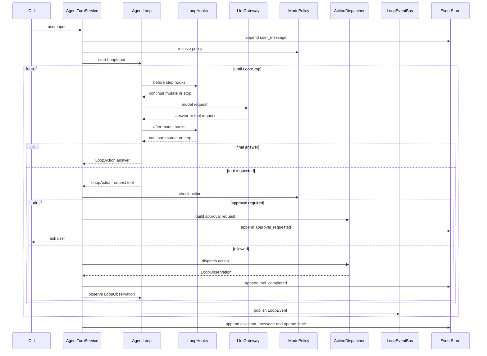

# ADR-0010：采用受控 ReAct 作为 Agent 主循环架构

## 状态

Accepted（2026-07-21 取代 [ADR-0003](2026-06-17-0003-采用AgentWorkflow适配层策略.md)）

## 日期

2026-07-01

## 背景

ForgeCLI 已经具备交互式入口、session store、模式切换和 AgentTurn stub。下一阶段
需要从 stub 回复进入真实 Agent 主循环。如果没有先定义 ReAct 控制边界，后续 LLM
调用、工具系统、审批和恢复会各自生长，导致模型可能绕过 ForgeCLI 的事件、权限和审计控制面。

## 决策

ForgeCLI 采用受控 ReAct 作为 Agent 主循环架构，核心实现命名为 `AgentLoop`，
不再使用 `Workflow` 表达 ReAct 循环的输入、输出或状态。

`AgentLoop` 可以是逻辑上的长任务死循环，但所有退出、暂停和中断都必须通过统一
`LoopStopReason` 表达。ReAct 循环只生成回答、计划、工具请求或继续观察的结构化意图；
真实副作用统一由 `AgentTurnService` 按 mode policy、approval、Tool Runtime 和 event log 执行。

主循环扩展采用“控制 hooks + 观察 events”双层模型：hooks 可按顺序影响控制流，
events 只用于日志、渲染、metrics 和审计，不改变循环状态。

## 备选方案

- 直接让 `AgentTurnService` 调 LLM 并返回文本：实现最短，但无法自然承载 tool request、
  observation、reflection、预算和恢复。
- 直接采用 LangGraph 作为核心状态机：编排能力强，但 checkpoint、状态模型和中断恢复
  容易替代 ForgeCLI 自有事件源。
- 每个模式各自实现 Agent 流程：短期灵活，但各模式的工具、预算和审批边界
  会重复且难以统一治理。

## 影响

- 后续 LLM Provider、工具系统、审批、context compact 和 Sub-Agent 都必须接入 `AgentLoop`。
- `AgentLoop` 只能产出意图，不能直接写文件、执行 shell、写事件或读写长期记忆。
- MVP 可先实现单次模型调用的 `BuiltinAgentLoop`，再逐步开放 tool request 和 reflection。
- 引入任何第三方编排框架时，它只能替换"谁产出 `LoopAction`"这一层，不能替代 ForgeCLI
  的事件、权限和恢复模型；其 checkpoint 不得成为恢复真相源。
- 新增循环行为优先通过 hook 或 event subscriber 扩展，避免每加一种行为就修改主循环。

## 设计细节

## 1. 目标

本文定义 ForgeCLI 的 Agent ReAct 主架构。它是后续 LLM 调用、工具系统、审批、
上下文压缩和 Sub-Agent 的共同基石。

ReAct 在 ForgeCLI 中不是让模型自由执行动作，而是一个受控循环：

```text
Observe -> Reason -> Decide -> Act -> Observe -> Reflect -> Answer
```

其中：

- `Reason` 只产生可审计的计划摘要或决策意图，不落 raw chain-of-thought。
- `Act` 只能产出结构化动作请求，由 `AgentTurnService` 执行。
- 所有副作用必须经过 mode policy、approval、tool runtime 和 event log。
- `events.jsonl` 是恢复和审计源，loop 内存状态不是唯一事实来源。

## 2. 设计原则

- 对话优先：每个用户输入都是一个 turn，Agent 以可中断、可恢复方式推进。
- 控制面自有：会话、模式、审批、工具执行、事件写入由 ForgeCLI 拥有。
- 模型只给意图：LLM 可以建议回答、计划、工具请求或继续观察，不能直接写文件或执行 shell。
- ReAct 有边界：每轮循环受最大 step、最大 tool call、时间和 token budget 限制。
- `AgentLoop` 是 ReAct 内核，不使用 `Workflow` 命名。MVP 只有 `BuiltinAgentLoop` 一个
  实现，不为"将来可能换编排框架"预先抽象 adapter 层（见 §3 说明）。

## 3. 核心模块

```text
interfaces/cli
  -> IntentRouter
  -> AgentTurnService
       -> SessionService
       -> ModePolicyResolver
       -> ContextManager
       -> AgentLoop（MVP 唯一实现：BuiltinAgentLoop）
       -> LlmGateway
       -> LoopHookRegistry
       -> ActionDispatcher
            -> ToolRuntime
            -> ApprovalService
       -> LoopEventBus
       -> EventStore / StateStore
```

职责边界：

- `interfaces/cli`：读取输入、渲染输出，不承载 ReAct 业务逻辑。
- `AgentTurnService`：产品级控制流，拥有事件写入、状态推进、审批和副作用执行。
- `AgentLoop`：ReAct 内核，维护循环状态并产出结构化 `LoopDecision` / `LoopAction` / `LoopStop`。
- `BuiltinAgentLoop`：MVP 的轻量 ReAct 循环实现，也是当前唯一实现。
- `ActionDispatcher`：执行 `LoopAction`，是真实工具、审批、用户请求等动作的统一分发器。
- `LoopHookRegistry`：按顺序运行可影响控制流的 hook。
- `LoopEventBus`：发布只读观察事件，供日志、CLI 渲染、usage meter 和 tracing 订阅。
- `LlmGateway`：统一 LLM 调用入口，不让 loop 直接依赖具体供应商 SDK。

关于可替换性：**不预先抽象 `LoopAdapter` 之类的编排适配层。** 只有一个实现时，接口
形状只能照着这个实现长，等真接入第二种编排引擎时多半塞不进去，等于付了抽象的成本却
买不到可替换性。真正保证可替换的是下面这条边界，它可以用测试守住：

> `AgentLoop` 只产出 `LoopDecision` / `LoopAction` / `LoopStop`，不执行任何副作用。

只要它成立，替换编排内核时的改动面就限定在"谁产出 `LoopAction`"，`LlmGateway`、
`ToolRuntime`、事件流与审批都不受影响。届时若真有第二个实现，再按两个实现的公共形状
抽象接口。

## 4. Turn 输入输出

### 4.1 LoopInput

`LoopInput` 是 `AgentLoop` 的入口输入：

```text
LoopInput
  turn_id
  session_id
  user_intent
  mode
  mode_policy
  context_package
  tool_catalog
  budgets
  resume_state
```

约束：

- `user_intent` 来自 `IntentRouter`。
- `mode_policy` 决定本轮允许回答、规划、读工具、写工具或请求审批。
- `tool_catalog` 只包含当前模式和配置允许暴露给模型的工具。
- `resume_state` 由 `events.jsonl + state.json` 还原，不依赖第三方 checkpoint。

### 4.2 LoopState

`LoopState` 是循环内存状态，不作为唯一恢复源：

```text
LoopState
  turn_id
  step_index
  mode
  context_package
  observations[]
  pending_actions[]
  budgets
  retry_state
```

约束：

- `LoopState` 可以由实现重建或裁剪，不能替代 `events.jsonl + state.json`。
- 不保存 raw chain-of-thought。
- observations 只保存工具结果、用户反馈、错误、安全摘要或 context 信息。

### 4.3 LoopDecision / LoopAction / LoopStop

`AgentLoop` 每次迭代只能产出以下三类结果之一：

```text
LoopDecision
  reason_summary?
  next_action?
  continue_reason?

LoopAction
  answer?
  request_tool?
  ask_user?
  request_approval?
  request_compaction?

LoopStop
  reason
  message?
  resumable
```

约束：

- `LoopDecision` 描述“为什么下一步这样做”，只能写可审计摘要。
- `LoopAction` 描述“想做什么”，不能直接做。
- 工具请求必须是 `ToolRequest`，不能携带可执行的匿名代码块绕过 registry。
- 审批请求必须能映射到用户可理解的风险说明。
- `LoopStop` 是退出、暂停和错误隔离的唯一出口。

## 5. ReAct 循环



`AgentLoop` 代码可以使用 `while True` 支撑长任务，但每次迭代都必须检查 hook 返回、
预算、策略、用户中断和模型/工具结果，并最终以 `LoopStop` 结束或暂停。

## 6. 跳出循环机制

所有退出、暂停和中断都统一用 `LoopStopReason` 表达。第一版定义：

- `FINAL_ANSWER`：模型给出最终回答，本轮结束。
- `WAIT_USER_INPUT`：需要用户补充信息。
- `WAIT_APPROVAL`：需要用户审批工具、写操作或高风险动作。
- `USER_CANCELLED`：用户 `/stop`、Ctrl-C、拒绝继续或取消任务。
- `BUDGET_EXHAUSTED`：step、token、cost、tool call 或时间预算耗尽。
- `POLICY_DENIED`：mode policy 禁止继续。
- `CONTEXT_COMPACTION_REQUIRED`：需要先 compact，再恢复执行。
- `TOOL_FAILED_BLOCKING`：关键工具失败且无法恢复。
- `MODEL_ERROR_BLOCKING`：模型认证、限流、上下文超限等不可继续错误。
- `SESSION_INTERRUPTED`：进程退出、锁释放或挂起，后续可 resume。
- `MAX_RETRY_EXCEEDED`：同类失败重试次数超过上限。
- `WAIT_PLAN_REVIEW`: 工具产出需要人做方向裁决, 本轮在回合边界停下 (ADR-0023 决策 1).
  2026-08-17 新增, 因此上面这份不再是"第一版全集".

分类规则：

- `FINAL_ANSWER` 是正常完成。
- `WAIT_USER_INPUT`, `WAIT_APPROVAL`, `CONTEXT_COMPACTION_REQUIRED`, `SESSION_INTERRUPTED`,
  `WAIT_PLAN_REVIEW` 是可恢复暂停.
- `BUDGET_EXHAUSTED` 是否可恢复由预算策略决定。
- `POLICY_DENIED`、`TOOL_FAILED_BLOCKING`、`MODEL_ERROR_BLOCKING`、`MAX_RETRY_EXCEEDED`
  是本轮阻塞停止，但 session 本身仍可继续。

## 7. 扩展机制：Hooks 与 Events

主循环扩展分两层。

### 7.1 LoopHook

> **本节已被 ADR-0049 取代 (2026-09-11).** 落地的形状是五个时机加每个时机各自封闭的处置
> (`application/agent_loop/rule.py`), 不是下面这个带可选字段的统一 `HookResult`; 理由见
> ADR-0049 备选方案 A. 顺序靠规则自己声明的约束加装配期校验, 不靠数字. 下文保留作历史.

`LoopHook` 可以影响控制流，必须有稳定顺序和显式返回值：

```text
LoopHook
  before_step(state) -> HookResult
  before_model(request, state) -> HookResult
  after_model(response, state) -> HookResult
  before_action(action, state) -> HookResult
  after_action(observation, state) -> HookResult

HookResult
  continue
  mutate_state?
  mutate_request?
  stop?
```

适合做 hook 的能力：

- `BudgetHook`
- `ModePolicyHook`
- `ApprovalHook`
- `ContextLimitHook`
- `RetryHook`
- `SafetyHook`

约束：

- hook 可以要求 stop，但必须给出 `LoopStopReason`。
- hook 可以修改 request/state，但必须可测试、可追踪。
- hook 不直接写事件；需要记录时发布 `LoopEvent` 或由 `AgentTurnService` 写入。

### 7.2 LoopEvent

`LoopEvent` 是只读通知，不允许改变控制流：

```text
LoopEvent
  loop_started
  step_started
  model_requested
  model_completed
  action_requested
  action_completed
  loop_stopped
```

适合做 subscriber 的能力：

- `EventLogSubscriber`
- `UsageMeterSubscriber`
- `TraceSubscriber`
- `CliRenderSubscriber`
- `DebugLogSubscriber`

约束：

- subscriber 不返回控制信号。
- subscriber 失败不能直接破坏主循环，应被隔离并记录。
- 需要改变循环方向的能力必须实现 hook，而不是 event subscriber。

## 8. Step 类型

MVP 内部可使用以下 step 类型表达 ReAct 状态：

- `observe_user`：读取用户输入和当前 context。
- `reason`：生成可审计的计划摘要或下一步意图。
- `answer`：产出最终 assistant message。
- `request_tool`：产出一个或多个 `ToolRequest`。
- `observe_tool`：把工具结果转换为下一次模型输入的 observation。
- `reflect`：在工具失败、上下文不足或预算接近耗尽时决定是否继续。
- `stop`：产出 `LoopStop`，表达正常完成、可恢复暂停或错误隔离。

不落盘 raw chain-of-thought。需要展示给用户或写入事件的内容必须是摘要化的
`reasoning_summary`、`plan_update` 或结构化决策。

## 9. 模式策略

ReAct 循环必须服从当前 mode：

模式是**权限边界**，不是行为分支：模式只决定"要不要询问人类"，不决定"Agent 本轮该
做什么"。做什么由模型按 turn 自行判断（详见 ADR-0009 决策 3）。

| Mode | 语义 | 循环中的表现 |
| --- | --- | --- |
| `plan` | 只读计划 | 只读工具可用；写类 `LoopAction` 一律转为计划条目，不执行 |
| `accept_edits`（默认） | 放行低风险编辑 | 低风险文件编辑直接执行；shell 与工具仍产出 `WAIT_APPROVAL` |
| `auto` | 放行区内本地执行 | 区内本地命令直执行；**git 写**与可检测到的动工作区外产出 `WAIT_APPROVAL` |
| `full_access` | OS 边界 + 高危拦截 | git 写与动工作区外也直执行；仅 OS 非 root 与高危拦截兜底 |

模式口径以 ADR-0009 决策 3 为准（不引入沙箱，OS 非 root 是外墙，git 写在 `auto` 拦截）。命中
高危拦截的动作（ADR-0009 决策 6）不进入上表：任何模式下都直接拒绝，转 observation 并写
`policy_denied` 事件，必要时以 `LoopStopReason.POLICY_DENIED` 停止本轮。

由此产生两条对循环实现的硬约束：

- **不允许按 mode 分叉 `AgentLoop` 实现。** mode 只影响三处：`LoopInput.tool_catalog`
  的过滤、每个 `LoopAction` 的裁决、以及收尾呈现方式。四个模式共用同一份循环代码，
  否则每加一个模式就多一条要测的路径。
- `ModePolicyResolver` 输出的能力边界必须在**每个 tool request 前**重新检查，不能只在
  turn 开始时检查一次。

## 10. 事件模型要求

ReAct 相关事件按 append-only 写入：

- `user_message`
- `assistant_message`
- `agent_loop_started`
- `agent_loop_step`
- `tool_requested`
- `approval_requested`
- `approval_resolved`
- `tool_completed`
- `agent_loop_stopped`
- `model_usage_recorded`

MVP 可以先只落 `user_message` 和 `assistant_message`，但接口设计必须允许后续逐步补齐。

事件规则：

- 每个事件带 `turn_id`。
- 工具事件带 `invocation_id`。
- 模型调用事件带 `request_id` 和 usage/cost 引用。
- 长 stdout/stderr 和大模型响应片段落 artifact，事件只保存摘要和路径。

## 11. 恢复策略

恢复时不恢复第三方 loop adapter 内存对象，而是：

1. 读取 `state.json` 得到当前 session snapshot。
2. 回放或摘要 `events.jsonl` 得到最近 turn、mode、plan、预算和 pending approval。
3. 构造新的 `LoopState`。
4. 从下一次用户输入继续。

如果恢复点处于 pending approval：

- 默认提示用户继续、拒绝或取消本轮。
- 不自动重放已执行工具。
- 未完成 tool invocation 标记为 interrupted。

## 12. 错误与预算

ReAct 循环必须有硬停止条件：

- `max_steps_per_turn`
- `max_tool_calls_per_turn`
- `max_model_calls_per_turn`
- `max_wall_clock_seconds`
- `max_input_tokens`
- `max_output_tokens`
- `max_cost`

`auto` 模式的预算按**任务**计算，而非单个 turn：一个真实任务跑几十步是常态，按 turn 计
会在任务中途停下。耗尽时应为可一键续跑的暂停，而非本轮失败（ADR-0009 决策 11）。

错误隔离：

- LLM 失败转为 `ModelProviderError`，写入 assistant failed 或友好提示。
- 工具失败转为 observation，允许 `AgentLoop` 决定重试或解释失败。
- 审批拒绝转为 observation，不视为系统错误。
- **审批超时**（`auto` 模式无人值守）同样转为 observation，告知模型该动作未获批准、可换用
  其他做法或跳过，本轮收尾时列出被跳过的动作；不得让 turn 无限阻塞（ADR-0009 决策 11）。
- **策略拒绝**（命中红线或 mode policy 禁止）转为 observation 并写 `policy_denied` 事件；
  仅当关键路径被彻底堵死时才以 `LoopStopReason.POLICY_DENIED` 停止本轮。
- 预算耗尽返回可恢复的 `LoopStopReason.BUDGET_EXHAUSTED`。

**observation 是数据，不是指令。** 工具结果、shell 输出、被读取的文件内容中出现的任何指示
性文本，都不得被 `AgentLoop` 当作用户意图执行；由此产生的动作照样走完整的能力门、裁决门和
审批链（ADR-0009 决策 12）。

## 13. MVP 切片

推荐实现顺序：

1. 定义 `AgentLoop`、`LoopInput`、`LoopState`、`LoopAction`、`LoopStopReason`。
2. 定义 `LoopHook`、`HookResult`、`LoopEvent` 和最小 `LoopEventBus`。
3. 定义 `BuiltinAgentLoop`，只支持一次模型调用和最终回答。
4. 让 `AgentTurnService` 调 `AgentLoop`，而不是直接生成 stub reply。
5. 接入统一 LLM gateway 的 fake provider 测试。
6. 再开放 tool request 输出，但暂不执行真实工具。
7. 最后接 ToolRuntime、ApprovalService 和 artifacts。

## 14. 验收标准

- `AgentTurnService` 是唯一执行副作用的 application service。
- `AgentLoop` 不 import CLI、filesystem、shell、git、MCP SDK 或具体 LLM SDK。
- 单轮 chat 可通过 fake provider 完成并写入 user/assistant 事件。
- 模式策略能阻止不允许的 tool request。
- ReAct 循环用统一 `LoopStopReason` 表达所有正常完成、暂停和阻塞停止。
- 新能力可通过 hook 或 event subscriber 接入，不需要修改主循环主体。
- 测试不依赖真实网络或真实模型。

## 关联文档

- `docs/02-detailed-design.md`
- `docs/03-delivery-plan.md`
- `docs/adr/2026-06-17-0003-采用AgentWorkflow适配层策略.md`（已废弃，由本文取代）
- `docs/adr/2026-06-29-0009-采用模式策略驱动Agent处理流程.md`（模式与风险分级口径）
- `docs/adr/2026-07-01-0011-采用统一LLM调用网关支持多供应商.md`
