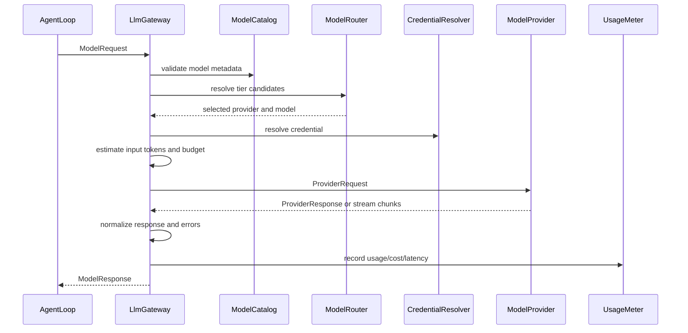

# ADR-0011：采用统一 LLM 调用网关支持多供应商

## 状态

Accepted

## 日期

2026-07-01

## 背景

ForgeCLI 需要接入多个模型供应商，并在后续支持 token 计量、成本控制、限流、审计、
缓存、重试和企业策略。如果 application、`AgentLoop` 或 CLI 层直接调用具体供应商 SDK，
模型调用会分散在多处，后续很难统一计量和治理。

## 决策

ForgeCLI 所有 LLM 调用必须经过统一 `LlmGateway`。`LlmGateway` 负责 provider/model
路由、凭证解析、请求归一化、streaming 归一化、usage/cost/token 计量、错误归一化和
审计记录；具体供应商只通过 `ModelProvider` adapter 接入。

模型选择采用 `ModelTier` 路由策略，而不是把档位作为模型的唯一静态属性。`fast`、
`smart`、`default` 等档位各自配置多个候选模型，`ModelRouter` 按优先级、能力、可用性、
上下文长度、预算和 fallback 策略选择最终 provider/model。

## 备选方案

- `AgentLoop` 直接依赖 OpenAI-compatible SDK：实现快，但 provider lock-in 强，usage/cost
  统计难统一。
- 每个供应商单独做 application service：便于局部优化，但调用策略、错误处理和预算控制
  会重复。
- 完全委托 LangChain model abstraction：生态完善，但会把 ForgeCLI 的审计、凭证和预算
  控制放到第三方抽象之后。

## 影响

- `AgentLoop` 只能依赖 `LlmGateway`，不能直接依赖具体供应商 SDK。
- Provider adapter 只做协议映射，不读写 session、事件、配置或预算状态。
- 每次模型调用必须产出 request id、provider、model、usage 或 estimated usage。
- 凭证解析集中到 `CredentialResolver`，明文 key 不进入配置、事件、日志或测试 fixture。
- `/config` 的模型配置源应以“档位分配候选模型”为主；模型详情页可以提供“加入某档位”
  的快捷操作，但底层仍写入 tier candidates。

## 设计细节

## 1. 目标

本文定义 ForgeCLI 的统一 LLM 调用架构，保证所有模型请求都经过同一个控制面，
为后续成本控制、token 计量、限流、审计、缓存、重试和企业策略打基础。

核心目标：

- 支持多个供应商和模型：OpenAI-compatible、DeepSeek、MiMo、本地模型、企业私有网关。
- application 和 `AgentLoop` 不直接依赖具体 SDK。
- 所有请求统一记录 usage、cost、latency、model、provider、错误类型。
- 凭证只从环境变量或系统凭证读取，不写入配置、事件或日志。
- 后续可以在不改 Agent 主循环的前提下加入预算控制和模型路由。

## 2. 架构位置

```text
AgentTurnService
  -> AgentLoop
      -> LlmGateway
          -> ModelRouter
          -> ModelTierConfig
          -> ProviderRegistry
          -> ModelProvider
              -> OpenAICompatibleProvider
              -> DeepSeekProvider
              -> MimoProvider
              -> LocalProvider
          -> UsageMeter
          -> CostEstimator
          -> LlmEventSink
```

边界：

- `AgentLoop` 只依赖 `LlmGateway`。
- `LlmGateway` 负责统一请求校验、路由、计量、错误归一化和返回结构。
- `ModelRouter` 负责把 `requested_tier` 和能力需求解析成具体 provider/model。
- `ModelProvider` 只负责把统一请求映射到某供应商 API。
- 供应商 SDK 只能出现在 provider adapter 或 infrastructure adapter 内。

## 3. 核心抽象

### 3.1 LlmGateway

`LlmGateway` 是所有模型调用的唯一入口：

```text
LlmGateway
  complete(request: ModelRequest) -> ModelResponse
  stream(request: ModelRequest) -> Iterator[ModelStreamChunk]
```

职责：

- 解析当前默认模型或显式模型引用。
- 校验模型是否存在、是否可用、是否被策略允许。
- 注入超时、重试、temperature、max_tokens、thinking 等默认值。
- 通过 `ModelRouter` 解析 `requested_tier` 到具体 provider/model。
- 在调用前估算输入 token 和成本风险。
- 调用 provider adapter。
- 归一化 usage、tool call、finish reason、错误。
- 写入 usage/cost 记录。

### 3.2 ModelProvider

`ModelProvider` 是供应商适配接口：

```text
ModelProvider
  provider_id: str
  capabilities() -> ProviderCapabilities
  complete(request: ProviderRequest) -> ProviderResponse
  stream(request: ProviderRequest) -> Iterator[ProviderStreamChunk]
```

约束：

- provider 不读取 ForgeCLI session state。
- provider 不写事件、不写配置、不做预算决策。
- provider 不直接读取任意环境变量；凭证由 `CredentialResolver` 传入。
- provider 抛出的错误必须被 gateway 转成统一 `ModelProviderError`。

### 3.3 ModelRequest

统一请求结构：

```text
ModelRequest
  request_id
  session_id
  turn_id
  loop_step_id?
  origin
  requested_tier?
  required_capabilities[]
  min_context_window?
  provider
  model
  messages[]
  system_prompt?
  tools[]
  params
  timeout_seconds?
  stream
  metadata
```

规则：

- `messages` 使用 ForgeCLI 自有 message schema，不直接暴露第三方 SDK message 对象。
- `tools` 使用 ForgeCLI `ToolSpec`，由 provider adapter 转成供应商 tool schema。
- `origin` 表示调用用途，例如 `chat`、`plan`、`act`、`compact`、`summary`、
  `tool_observation`，不绑定第三方编排概念。
- `requested_tier` 表示逻辑档位，例如 `fast`、`smart`、`default`。
- `params` 承载通用超参、thinking 配置和 provider 私有选项。
- `metadata` 可包含 mode、command、loop step 等安全摘要，但不得包含 secret。

### 3.4 ModelParams

统一超参分为通用参数、thinking 参数和 provider 私有参数：

```text
ModelParams
  temperature?
  top_p?
  max_output_tokens?
  stop[]
  response_format?
  thinking?
  provider_options?

ThinkingConfig
  enabled: true | false | auto
  effort: none | low | medium | high
  budget_tokens?
```

规则：

- `temperature`、`top_p`、`max_output_tokens` 等通用参数由 gateway 统一校验。
- `thinking` 是 ForgeCLI 的统一抽象，由 provider adapter 翻译为供应商字段。
- 不支持 thinking 的模型，gateway 必须在请求前拒绝、降级或按明确策略选择其他候选模型，
  不能静默忽略。
- `provider_options` 按 provider 命名空间隔离，例如 `provider_options.deepseek`，
  只能由对应 provider adapter 读取。
- Provider adapter 负责参数翻译；`AgentLoop` 不读取 provider 私有字段。

### 3.5 ModelResponse

统一返回结构：

```text
ModelResponse
  request_id
  provider
  model
  content
  tool_calls[]
  finish_reason
  usage
  latency_ms
  raw_metadata
```

`raw_metadata` 只保存安全摘要，例如供应商 request id、region、cache hit，不保存完整原始响应。

### 3.6 Usage

所有 provider 必须归一化到统一 usage：

```text
ModelUsage
  input_tokens
  output_tokens
  cached_input_tokens
  reasoning_tokens
  total_tokens
  estimated: bool
```

如果供应商没有返回 usage：

- gateway 使用 tokenizer 或近似算法估算。
- `estimated=true`。
- 后续成本统计必须区分真实用量和估算用量。

## 4. 模型目录与运行时调用的分工

`ModelCatalogService` 管模型元数据：

- provider id
- model id
- context window
- max output tokens
- tool calling capability
- structured output capability
- pricing
- deprecation status
- enterprise allowlist

`ModelTierConfig` 管运行时路由策略：

- `fast`、`smart`、`default` 等逻辑档位。
- 每个档位的候选模型列表。
- 候选模型优先级。
- 档位级默认超参和 thinking 配置。
- fallback 策略和选择策略。

`LlmGateway` 管运行时调用：

- 选哪个 provider adapter。
- 选哪个 tier 和候选模型。
- 本次请求能否发起。
- usage/cost 如何记录。
- provider 错误如何归一化。

两者不能混在一起。模型目录可以离线存在，真实调用必须经过 gateway。

## 5. ModelTier 路由

模型档位是运行时路由策略，不是模型的静态唯一属性。一个模型可以出现在多个档位；
同一个档位也可以配置多个候选模型。

内置档位：

- `fast`：低延迟、低成本，适合简单问答、摘要、轻量代码解释、compact。
- `smart`：高能力或推理模型，适合规划、复杂代码分析、debug、review。
- `default`：项目默认档位；未显式请求时使用。

`ModelRouter` 输入：

```text
ModelRouteRequest
  requested_tier
  origin
  required_capabilities[]
  min_context_window?
  budget_hint?
  preferred_provider?
```

`ModelRouter` 输出：

```text
ModelRouteResult
  provider
  model
  tier
  params
  selection_reason
  fallback_chain[]
```

路由步骤：

1. 读取 `requested_tier` 的候选模型列表。
2. 过滤 provider 不可用、凭证缺失、模型不存在、企业策略禁用的候选项。
3. 过滤能力不满足的候选项，例如 tools、json schema、thinking、context window。
4. 合并档位级、候选级和请求级参数。
5. 按 selection 策略选择模型。
6. 失败时按 fallback 策略尝试同档下一个候选，或升级到更高档位。

建议选择策略：

- `first_available`：按 priority 选择第一个可用候选。
- `lowest_cost`：在满足能力和上下文后选成本最低。
- `lowest_latency`：在满足能力后选低延迟模型。
- `balanced`：结合成本、延迟、能力和上下文窗口。

`/config` 配置原则：

- 存储源采用“档位 -> 候选模型列表”。
- UI 可以提供档位视角：编辑某档位的候选模型、优先级、selection、fallback。
- UI 可以提供模型视角：把某个模型加入 `fast` / `smart` / `default`，但这只是快捷入口。
- 不把“档位”作为模型唯一属性写入模型目录。

## 6. Provider Registry

Provider registry 是封闭的代码级注册表：

```text
ProviderRegistry
  deepseek -> DeepSeekProvider
  mimo -> MimoProvider
  openai_compatible -> OpenAICompatibleProvider
  local -> LocalProvider
```

规则：

- 用户配置可以新增模型实例，不能动态新增任意 provider adapter。
- 未知 provider 配置应被忽略或明确报错，不能自动执行未知 SDK。
- 企业版可通过插件注册 provider，但仍必须实现 `ModelProvider`。

## 7. 凭证解析

凭证通过 `CredentialResolver` 获取：

```text
CredentialResolver
  resolve(provider_id, credential_ref) -> Credential
```

来源优先级：

1. 企业托管凭证。
2. 系统 keychain / secret store。
3. 环境变量。
4. 本地开发用 `.env` 加载器（可选，默认不落入事件）。

安全约束：

- 配置文件只保存 `api_key_env` 或 credential reference，不保存明文 key。
- 事件日志、错误信息、debug 输出不得包含凭证。
- 测试只能使用假 key 名称或 fake resolver。

## 8. 请求生命周期



## 9. Streaming

Streaming 必须统一成 `ModelStreamChunk`：

```text
ModelStreamChunk
  request_id
  delta_text?
  tool_call_delta?
  usage_delta?
  finish_reason?
```

规则：

- CLI 渲染只消费 gateway 输出的 chunk。
- provider adapter 负责把供应商私有 SSE/event 转成统一 chunk。
- 最后一块必须包含或触发完整 `ModelResponse` 汇总。
- stream 中断要写入可恢复错误，不得留下未关闭的 turn。

## 10. Tool Calling 兼容

不同供应商 tool calling schema 不同，但 Agent 层只使用 ForgeCLI `ToolSpec` 和 `ToolCall`。

```text
ToolSpec -> provider tool schema -> provider response -> ToolCall
```

约束：

- provider 只能返回 tool call 意图。
- tool call 必须回到 `AgentTurnService` 和 `ToolRuntime`。
- 不支持 tool calling 的模型，gateway 应在请求前拒绝、切换候选模型或让 `AgentLoop` 降级。
- 工具参数需要经过 schema 校验，不能直接信任供应商返回的 JSON。

## 11. Token 与成本计量

### 11.1 UsageMeter

`UsageMeter` 负责写入模型调用计量记录：

```text
UsageRecord
  request_id
  session_id
  turn_id
  provider
  model
  input_tokens
  output_tokens
  cached_input_tokens
  reasoning_tokens
  total_tokens
  estimated
  unit_prices
  estimated_cost
  latency_ms
  created_at
```

计量记录可先写入 event payload，后续再拆到独立 `usage.jsonl` 或 sqlite。

### 11.2 CostEstimator

成本估算依赖模型目录中的价格元数据：

- input token 单价。
- output token 单价。
- cached input token 单价。
- reasoning token 单价。
- 免费额度或企业折扣（后续）。

如果价格缺失：

- `estimated_cost=None`。
- 不阻塞模型调用。
- 在 `/status` 或 usage 汇总中标记价格未知。

### 11.3 BudgetPolicy

后续预算控制基于 usage/cost 统一记录实现：

- 每 turn token 上限。
- 每 session token/cost 上限。
- 每项目每日上限。
- 指定 provider/model allowlist。
- 超预算时要求用户确认或降级模型。

预算检查点：

1. 请求前：估算 input tokens 和 max output tokens。
2. 流式过程中：如果 provider 支持 usage delta，可提前停止。
3. 响应后：记录真实 usage 并更新 session budget。

## 12. 错误归一化

统一错误类型：

- `ModelUnavailableError`
- `ModelAuthError`
- `ModelRateLimitError`
- `ModelTimeoutError`
- `ModelContextOverflowError`
- `ModelBadRequestError`
- `ModelProviderInternalError`
- `ModelResponseParseError`

处理规则：

- auth/rate limit/context overflow 给用户可行动提示。
- timeout 可按策略重试。
- bad request 通常是 ForgeCLI bug 或 provider schema 不兼容，应保留安全摘要。
- 所有错误都带 `provider`、`model`、`request_id`，不带 secret。

## 13. 配置形态

项目级默认档位：

```toml
[model]
default_tier = "fast"
planning_tier = "smart"
```

应用级 provider/model 配置：

```toml
[providers.deepseek]
name = "DeepSeek"
api_base = "https://api.deepseek.com"
api_key_env = "DEEPSEEK_API_KEY"
timeout = 60
max_retries = 2

[providers.deepseek.models.deepseek-chat]
context_window = 65536
max_tokens = 8192
input_price_per_million = 0.14
output_price_per_million = 0.28
supports_tools = true
supports_json_schema = true
```

档位配置：

```toml
[model_tiers.fast]
selection = "first_available"
fallback = "same_tier"

[[model_tiers.fast.candidates]]
provider = "deepseek"
model = "deepseek-chat"
priority = 10

[[model_tiers.fast.candidates]]
provider = "openai_compatible"
model = "gpt-4.1-mini"
priority = 20

[model_tiers.smart]
selection = "first_available"
fallback = "same_tier"

[[model_tiers.smart.candidates]]
provider = "deepseek"
model = "deepseek-reasoner"
priority = 10
thinking.enabled = true
thinking.effort = "medium"

[[model_tiers.smart.candidates]]
provider = "openai_compatible"
model = "o4-mini"
priority = 20
thinking.enabled = true
thinking.effort = "medium"
```

配置规则：

- `[model]` 只表示当前项目默认档位偏好，不直接绑定唯一模型。
- `[providers]` 表示可调用模型目录和 adapter 参数。
- `[model_tiers]` 表示运行时路由策略：档位到候选模型列表。
- 同一个模型可以出现在多个档位。
- 一个档位可以有多个候选模型。
- 明文 key 不进入 TOML。
- provider adapter 必须由代码注册，TOML 不能注入任意类名。

## 14. MVP 切片

推荐实现顺序：

1. 定义 `LlmGateway`、`ModelProvider`、`ModelRequest`、`ModelResponse`、`ModelUsage`。
2. 实现 `FakeModelProvider`，用于单测和 E2E。
3. 定义 `ModelTierConfig`、`ModelTierCandidate` 和 `ModelRouter`。
4. 让 `AgentLoop` 通过 `LlmGateway` 获取 assistant message。
5. 接入一个 OpenAI-compatible provider，但默认测试不打网络。
6. 增加 usage/cost 归一化事件。
7. 增加 streaming chunk 适配。
8. 再接 tool calling schema 转换。

## 15. 测试策略

必须覆盖：

- fake provider 正常回答。
- provider auth/rate limit/timeout/context overflow 错误归一化。
- usage 存在时按真实 usage 记录。
- usage 缺失时估算并标记 `estimated=true`。
- 配置默认档位路由到正确候选 provider/model。
- 同一档位多候选时按 priority 和 selection 选择。
- 候选模型能力不足时自动跳过或按 fallback 策略降级。
- thinking 参数按 provider capability 校验。
- 未配置凭证时不发起真实网络请求。
- stream chunk 能合并成完整 response。
- tool calling 不绕过 ToolRuntime。

## 16. 验收标准

- 所有 LLM 调用都经过 `LlmGateway`。
- application 和 `AgentLoop` 不 import 具体供应商 SDK。
- 凭证不写入 config、event、fixture、日志。
- 每次模型调用都有 `request_id`、provider、model、usage 或 estimated usage。
- `fast`、`smart`、`default` 档位支持多个候选模型。
- `/config` 可配置档位候选模型、优先级、selection 和 thinking 默认值。
- fake provider 可支撑 deterministic 单测。
- 默认无网络测试通过。
- 后续成本控制和 token budget 可以基于 usage record 实现，不需要重写调用链。

## 关联文档

- `docs/02-detailed-design.md`
- `docs/03-delivery-plan.md`
- `docs/adr/2026-07-01-0010-采用受控ReAct作为Agent主循环架构.md`
