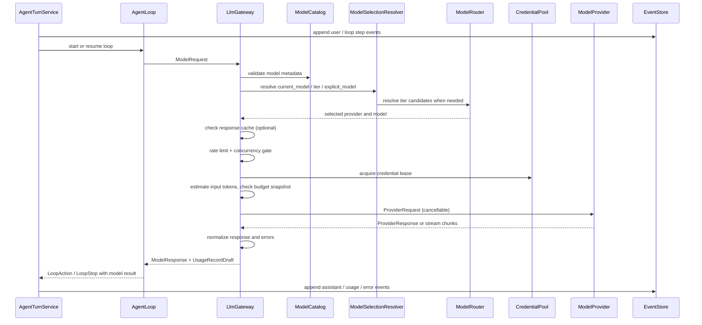

# ADR-0011：采用统一 LLM 调用网关支持多供应商

## 状态

Accepted

## 日期

2026-07-01

## 背景

ForgeCLI 需要接入多个模型供应商，并在后续支持 token 计量、成本控制、限流、审计、
缓存、重试和企业策略。如果 application、`AgentLoop` 或 CLI 层直接调用具体供应商 SDK，
模型调用会分散在多处，后续很难统一计量和治理。

## 决策

ForgeCLI 所有 LLM 调用必须经过统一 `LlmGateway`。`LlmGateway` 负责 provider/model
路由、凭证解析、请求归一化、streaming 归一化、结构化输出归一化、usage/cost/token
计量草稿、错误归一化和可用性处理；具体供应商只通过 `ModelProvider` adapter 接入。

模型选择同时支持当前模型和模型档位，二者不冲突：

- 当前模型表示用户或项目指定的主 Agent 模型，主要用于自然语言主对话、长任务判断、
  最终总结和需要保持一致性的 Agent 推进。
- 模型档位表示系统用途路由策略，主要用于生成标题、摘要、context compact、计划、
  review、结构化分类等内部任务。

LLM 不能自行决定调用哪个真实 provider/model 或档位。LLM 可以提出“需要更强推理能力”
或“需要更大上下文”等结构化诉求，但最终由 `AgentLoop` / `AgentTurnService` 根据 origin、
mode policy、预算和模型策略裁决。

## 备选方案

- `AgentLoop` 直接依赖 OpenAI-compatible SDK：实现快，但 provider lock-in 强，usage/cost
  统计难统一。
- 每个供应商单独做 application service：便于局部优化，但调用策略、错误处理和预算控制
  会重复。
- 完全委托 LangChain model abstraction：生态完善，但会把 ForgeCLI 的审计、凭证和预算
  控制放到第三方抽象之后。

## 影响

- `AgentLoop` 只能依赖 `LlmGateway` 端口，不能直接依赖具体供应商 SDK。
- Provider adapter 只做协议映射，不读写 session、事件、配置或预算状态。
- 每次模型调用必须产出 request id、provider、model、usage 或 estimated usage。
- 凭证解析集中到 `CredentialResolver`，明文 key 不进入配置、事件、日志或测试 fixture。
- `LlmGateway` 不直接写 `events.jsonl`、`state.json` 或 usage 文件；模型响应、usage 草稿、
  错误和安全摘要必须交回 `AgentTurnService`，由 `AgentTurnService` 统一落盘。
- `/config` 同时支持当前模型和档位候选模型配置；模型详情页可以提供“设为当前模型”
  或“加入某档位”的快捷操作。

## 设计细节

## 1. 目标

本文定义 ForgeCLI 的统一 LLM 调用架构，保证所有模型请求都经过同一个控制面，
为后续成本控制、token 计量、限流、审计、缓存、重试和企业策略打基础。

核心目标：

- 支持多个供应商和模型：OpenAI-compatible、DeepSeek、MiMo、本地模型、企业私有网关。
- application 和 `AgentLoop` 不直接依赖具体 SDK。
- 所有请求统一记录 usage、cost、latency、model、provider、错误类型。
- 凭证只从环境变量或系统凭证读取，不写入配置、事件或日志。
- 后续可以在不改 Agent 主循环的前提下加入预算控制和模型路由。

范围与非目标：

- 本文聚焦文本对话、工具调用和结构化输出三类调用。
- 多模态（图像 / 文件输入）在 message schema 中预留内容块扩展点，MVP 不实现。
- embeddings、rerank 等非对话模型不在本文范围；若后续需要，必须新增 gateway 方法走
  同一控制面，不得另开调用路径。

## 2. 架构位置

```text
AgentTurnService
  -> AgentLoop
  -> LlmGateway
  -> ContextManager
  -> ModePolicyResolver
  -> EventStore / StateStore

AgentLoop
  -> LlmGatewayPort

LlmGateway
  -> ModelSelectionResolver
  -> ModelRouter
  -> ModelTierConfig
  -> ModelCatalogService
  -> ProviderRegistry
  -> CredentialResolver / CredentialPool
  -> ProviderHealthRegistry
  -> RateLimiter
  -> TokenEstimator
  -> BudgetGuard
  -> LlmCacheController
  -> ModelProvider
      -> OpenAICompatibleProvider
      -> DeepSeekProvider
      -> MimoProvider
      -> LocalProvider
  -> CostEstimator

AgentTurnService
  -> UsageMeter      # usage 写入边界在 AgentTurnService 一侧
  -> BudgetPolicy    # 预算规则
  -> BudgetTracker   # session / turn 已用预算状态
```

边界：

- `AgentLoop` 和 `LlmGateway` 是两个并列 application 能力；`LlmGateway` 不是 `AgentLoop`
  的子模块。
- `AgentLoop` 只依赖 `LlmGatewayPort`，不依赖具体 provider adapter。
- `LlmGateway` 负责统一请求校验、路由、计量、错误归一化和返回结构。
- `ModelSelectionResolver` 负责把当前模型、显式模型或档位选择解析为统一选择请求，
  并决定本次是否允许 fallback；只在需要解析 tier 候选或执行 fallback 时调用 `ModelRouter`。
- `ModelRouter` 负责把模型档位和能力需求解析成具体 provider/model；current_model 与
  explicit_model 不经过候选过滤，但仍要经过 `ModelCatalogService` 的存在性与能力校验。
- `ModelCatalogService` 是模型元数据（能力、上下文窗口、价格、deprecation、allowlist）的
  唯一只读来源；gateway 与 router 都从它读，不各自解析 TOML。
- `TokenEstimator` 负责调用前的输入 token 估算，服务于上下文窗口校验和预算前置检查。
- `RateLimiter` 负责客户端主动限流与并发控制；`ProviderHealthRegistry` 负责跨请求的
  provider/model 健康与熔断状态。
- `BudgetGuard` 是 gateway 内的只读预算校验点，基于 `AgentTurnService` 注入的预算快照裁决；
  预算规则由 `BudgetPolicy` 表达，已用量状态由 `BudgetTracker` 拥有。
- `LlmCacheController` 负责 prompt 缓存控制透传与可选的请求级响应缓存。
- `ModelProvider` 只负责把统一请求映射到某供应商 API。
- 供应商 SDK 只能出现在 provider adapter 或 infrastructure adapter 内。
- `AgentTurnService` 是事件、state 和 usage 的写入边界；gateway 不直接写盘，也不持有
  session 预算状态，只做只读校验。

## 3. 核心抽象

### 3.1 LlmGateway

`LlmGateway` 是所有模型调用的唯一入口：

```text
LlmGateway
  complete(request: ModelRequest) -> ModelResponse
  stream(request: ModelRequest) -> Iterator[ModelStreamChunk]
  complete_structured(request: StructuredModelRequest) -> StructuredModelResponse
```

职责：

- 解析当前模型、档位模型或显式模型引用。
- 校验模型是否存在、是否可用、是否被策略允许。
- 注入超时、重试、temperature、max_tokens、thinking 等默认值。
- 通过 `ModelSelectionResolver` 和 `ModelRouter` 解析本次调用的 provider/model。
- 在调用前估算输入 token 和成本风险。
- 调用 provider adapter。
- 归一化 usage、tool call、finish reason、错误。
- 返回 usage/cost 计量草稿，由 `AgentTurnService` 决定如何落盘。
- 支持非流式、流式和结构化输出三类调用。

### 3.2 ModelProvider

`ModelProvider` 是供应商适配接口：

```text
ModelProvider
  provider_id: str
  capabilities() -> ProviderCapabilities
  complete(request: ProviderRequest) -> ProviderResponse
  stream(request: ProviderRequest) -> Iterator[ProviderStreamChunk]
```

约束：

- provider 不读取 ForgeCLI session state。
- provider 不写事件、不写配置、不做预算决策。
- provider 不直接读取任意环境变量；凭证由 `CredentialResolver` 传入。
- provider 抛出的错误必须被 gateway 转成统一 `ModelProviderError`。
- `capabilities()` 返回的 `ProviderCapabilities` 只描述 adapter/provider 级能力，例如支持哪些
  协议特性、认证方式、streaming 形态、tool schema 变体；它不是模型能力的事实来源。
  单个模型的能力（context window、tool calling、structured output、thinking 等）以
  `ModelCatalogService`（§4）为准，避免双重事实来源。

### 3.3 ModelRequest

统一请求结构：

```text
ModelRequest
  request_id
  session_id
  turn_id
  loop_step_id?
  origin
  model_selection
  required_capabilities[]
  min_context_window?
  messages[]
  system_prompt?
  tools[]
  params
  timeout_seconds?
  budget_snapshot?
  cancel_token?
  metadata
```

规则：

- `messages` 使用 ForgeCLI 自有 message schema，不直接暴露第三方 SDK message 对象；
  message content 采用内容块数组（text 块为 MVP 必需，image/file 块为预留扩展点）。
- `tools` 使用 ForgeCLI `ToolSpec`，由 provider adapter 转成供应商 tool schema。
- `origin` 表示调用用途，取自统一枚举（不绑定第三方编排概念）：`chat`、`act`、
  `tool_observation`、`final_summary`、`title`、`summary`、`compact`、`plan`、`review`、
  `debug`、`structured_classification`。新增用途必须先扩这个枚举，§3.4 的选择映射表与之一一对应。
- `model_selection` 表示本次调用选择当前模型、档位模型或显式模型。
- `params` 承载通用超参、thinking 配置和 provider 私有选项。
- 是否流式由调用方选择 `complete` 还是 `stream` 决定，`ModelRequest` 不带 `stream` 标志，
  同一个请求结构可同时用于非流式、流式和结构化调用。
- `metadata` 可包含 mode、command、loop step 等安全摘要，但不得包含 secret。

### 3.4 ModelSelection

模型选择必须显式表达，避免 `current_model`、tier 和 provider/model 同时出现时产生歧义：

```text
ModelSelection =
  CurrentModelSelection
  | TierModelSelection
  | ExplicitModelSelection

CurrentModelSelection
  kind: current_model

TierModelSelection
  kind: tier
  tier
  allow_fallback: bool
  fallback_policy?

ExplicitModelSelection
  kind: explicit_model
  provider
  model
  allow_fallback: bool
  fallback_policy?
```

选择规则：

- `current_model`：使用项目或 session 当前模型，适合主 Agent turn、用户对话、长任务推进
  和最终总结。
- `tier`：使用系统用途档位，适合标题、摘要、compact、结构化分类、轻量判断和特定内部任务。
- `explicit_model`：使用用户或配置显式指定的 provider/model。
- `explicit_model` 默认不跨模型 fallback；只有 `allow_fallback=true` 时才允许按策略切换。
- `current_model` 不做任何模型 fallback：主模型调用失败或不可用时，gateway 返回归一化错误，
  由用户通过 `/model` 主动切换主模型，不自动改用其他模型。
- `current_model` 不表示唯一可用模型，也不替代 tier 路由。
- gateway 必须校验 `ModelSelection` 字段组合：`current_model` 不得携带 `tier`、`provider`、
  `model`、`allow_fallback` 或 `fallback_policy`；`tier` 必须携带 tier；`explicit_model`
  必须携带 provider/model。
- LLM 不能直接指定 `kind`、tier、provider 或 model；它只能产出能力诉求，最终由
  `AgentLoop` / `AgentTurnService` 裁决。

推荐 origin 到选择策略的默认映射：

| origin | 默认选择 |
| --- | --- |
| `chat` / `act` / `tool_observation` | `current_model` |
| `final_summary` | `current_model` |
| `title` | `tier: fast` |
| `summary` | `tier: fast` |
| `compact` | `tier: fast`，上下文或质量不足时可升到 `smart` |
| `plan` / `review` / `debug` | `tier: smart` |
| `structured_classification` | `tier: fast` 或按 schema 能力过滤 |

### 3.5 ModelParams

统一超参分为通用参数、thinking 参数和 provider 私有参数：

```text
ModelParams
  temperature?
  top_p?
  max_output_tokens?
  stop[]
  response_format?
  thinking?
  provider_options?

ThinkingConfig
  enabled: true | false | auto
  effort: none | low | medium | high
  budget_tokens?
```

规则：

- `temperature`、`top_p`、`max_output_tokens` 等通用参数由 gateway 统一校验。
- `thinking` 是 ForgeCLI 的统一抽象，由 provider adapter 翻译为供应商字段。
- `thinking.enabled = auto` 表示由 gateway 按 origin/tier 默认策略决定是否开启思考（例如
  `plan`/`review`/`debug` 默认开，`title`/`summary` 默认关），不交给 LLM 决定。
- `effort` 与 `budget_tokens` 互为高低层表达：provider 支持 effort 档位时按 effort 翻译，
  只支持 token 预算时由 adapter 把 effort 映射成 budget_tokens；两者都给时以 effort 为准。
- 不支持 thinking 的模型，gateway 必须在请求前拒绝、降级或按明确策略选择其他候选模型，
  不能静默忽略。
- `provider_options` 按 provider 命名空间隔离，例如 `provider_options.deepseek`，
  只能由对应 provider adapter 读取。
- Provider adapter 负责参数翻译；`AgentLoop` 不读取 provider 私有字段。

### 3.6 ModelResponse

统一返回结构：

```text
ModelResponse
  request_id
  provider
  model
  content
  tool_calls[]
  finish_reason
  usage
  latency_ms
  cached
  raw_metadata
```

`raw_metadata` 只保存安全摘要，例如供应商 request id、region、cache hit，不保存完整原始响应。
`cached=true` 表示本次响应来自 gateway 响应缓存（§14），其真实 usage 记为 0。

### 3.7 StructuredModelResponse

结构化输出是 gateway 的一等能力，不应伪装成普通聊天文本再由上层自行解析：

```text
StructuredModelRequest
  model_request: ModelRequest
  schema
  schema_name
  strict: bool

StructuredModelResponse
  request_id
  provider
  model
  data
  validation_errors[]
  usage
  latency_ms
  raw_metadata
```

规则：

- provider 支持原生 JSON schema / structured output 时优先使用原生能力。
- provider 不支持时，gateway 可以按策略拒绝、切换候选模型，或使用受控解析降级。受控解析
  降级指：在 prompt 中注入 schema 指令，解析返回文本并做 schema 校验，失败时按有上限的
  策略重试或换候选；重试上限和是否允许降级由请求或档位策略显式声明，不无限重试。
- 结构化输出必须经过 schema 校验；校验失败归一化为 `ModelResponseParseError`。
- `complete_structured` 用于 plan update、risk classification、title、summary 等内部
  分类/生成任务；Agent 主循环 act 步骤的工具调用走原生 tool calling（§10），不经过
  `complete_structured`。需要执行工具时用 tool calling，需要受 schema 约束的结构化数据时用
  `complete_structured`，两条路径不混用同一目的。

### 3.8 Usage

所有 provider 必须归一化到统一 usage：

```text
ModelUsage
  input_tokens
  output_tokens
  cached_input_tokens
  reasoning_tokens
  total_tokens
  estimated: bool
```

如果供应商没有返回 usage：

- gateway 使用 tokenizer 或近似算法估算。
- `estimated=true`。
- 后续成本统计必须区分真实用量和估算用量。

## 4. 模型目录与运行时调用的分工

`ModelCatalogService` 管模型元数据，是单个模型能力的唯一事实来源：

- provider id
- model id
- context window
- max output tokens
- tool calling capability
- structured output capability
- pricing
- deprecation status
- enterprise allowlist

`ModelProvider.capabilities()`（§3.2）只描述 adapter/provider 级能力（协议特性、认证方式、
streaming/tool schema 变体），不重复声明单个模型的能力；路由与能力过滤一律读 catalog，
provider capabilities 仅用于判断 adapter 能否承接某类调用形态。

`ModelTierConfig` 管运行时路由策略：

- `fast`、`smart`、`default` 等逻辑档位。
- 每个档位的候选模型列表。
- 候选模型优先级。
- 档位级默认超参和 thinking 配置。
- fallback 策略和选择策略。

`LlmGateway` 管运行时调用：

- 选哪个 provider adapter。
- 解析当前模型、显式模型或 tier 候选模型。
- 本次请求能否发起。
- usage/cost 计量草稿如何生成。
- provider 错误如何归一化。

两者不能混在一起。模型目录可以离线存在，真实调用必须经过 gateway。

目录来源：`ModelCatalogService` 以内置目录为基线，`[providers.*.models.*]`（§16）中用户配置的
模型元数据按 provider+model 合并覆盖到基线之上，得到运行时只读视图。pricing、deprecation、
enterprise allowlist 都归并到这一视图；gateway、router、`CostEstimator` 只读它，不各自解析 TOML。

## 5. ModelTier 路由

模型档位是运行时路由策略，不是模型的静态唯一属性。一个模型可以出现在多个档位；
同一个档位也可以配置多个候选模型。

内置档位：

- `fast`：低延迟、低成本，适合简单问答、摘要、轻量代码解释、compact。
- `smart`：高能力或推理模型，适合规划、复杂代码分析、debug、review。
- `default`：tier 路由的兜底档位。当某 origin 未在 §3.4 映射表中显式给出 tier，或显式
  tier 无任何可用候选时，router 回落到 `default` 候选列表；`default` 必须始终配置至少一个候选。

当前模型不属于档位。当前模型表示主 Agent 模型；档位表示系统用途模型池。二者可以指向
同一个 provider/model，也可以完全不同。

模型选择裁决规则：

1. `AgentTurnService` 根据用户输入、slash command、mode policy 和 origin 构造
   `ModelSelection`。
2. `AgentLoop` 可以请求更强能力、更大上下文、更低延迟或结构化输出，但不能直接指定真实
   provider/model。
3. `LlmGateway` 按 `ModelSelection.kind` 解析当前模型、显式模型或 tier 候选模型。
4. 企业 allowlist、预算、凭证可用性和模型能力永远可以否决一次选择。
5. 如果没有可用模型，gateway 返回归一化错误，不由 provider adapter 自行降级。

`ModelRouter` 输入：

```text
ModelRouteRequest
  tier
  origin
  required_capabilities[]
  min_context_window?
  budget_hint?
  preferred_provider?
```

`ModelRouter` 输出：

```text
ModelRouteResult
  provider
  model
  tier
  params
  selection_reason
  fallback_chain[]
```

路由步骤：

1. 读取 `tier` 的候选模型列表。
2. 过滤 provider 不可用、凭证缺失、模型不存在、企业策略禁用的候选项。
3. 过滤能力不满足的候选项，例如 tools、json schema、thinking、context window。
4. 合并档位级、候选级和请求级参数。
5. 按 selection 策略选择模型。
6. 失败时按 fallback 策略尝试同档下一个候选，或升级到更高档位。

建议选择策略：

- `first_available`：按 priority 选择第一个可用候选。
- `lowest_cost`：在满足能力和上下文后选成本最低。
- `lowest_latency`：在满足能力后选低延迟模型。
- `balanced`：结合成本、延迟、能力和上下文窗口。

各 selection kind 的 fallback 语义：

- `explicit_model`：默认不 fallback；`allow_fallback=true` 时按 `fallback_policy` 切换。
- `current_model`：不做模型 fallback。主模型不可用或调用失败时直接抛归一化错误，由用户通过
  `/model` 切换；仅同 provider/model 的凭证级重试（换 key）仍适用，不切换到其他模型或档位。
- `tier`：在候选列表内按 selection 策略选择，失败时进入下面的 fallback 顺序。

Fallback 是一个有界的有序过程，层级固定为「凭证 -> 候选 -> 档位」：

1. 凭证级：同一 provider 的其他 `credential_refs`（认证失败、429、配额）。
2. 候选级：同档位 priority 次序的下一个可用候选。
3. 档位级：仅当 `fallback` 允许升档时，按固定档位序 `fast -> smart` 升级；`default` 只作为
   兜底入口，不参与升档链。

`ModelRouteResult.fallback_chain` 是路由时预计算的候选序列（用于诊断与可预测性）；运行时
错误（§12）按这个链顺序消费，不在错误处临时另算路径。每层都有上限，总重试与切换次数受
provider 配置的 `max_retries` 和档位策略约束。

参数合并优先级（高到低）：请求级 `ModelParams` > 档位候选级（候选项上的 thinking 等）
> 档位级默认 > provider 默认（timeout、max_retries）。`provider_options` 不参与合并，
按 provider 命名空间整体透传。

`/config` 配置原则：

- 存储源采用“档位 -> 候选模型列表”。
- UI 可以提供档位视角：编辑某档位的候选模型、优先级、selection、fallback。
- UI 可以提供模型视角：把某个模型加入 `fast` / `smart` / `default`，但这只是快捷入口。
- 不把“档位”作为模型唯一属性写入模型目录。

## 6. Provider Registry

Provider registry 是封闭的代码级注册表：

```text
ProviderRegistry
  deepseek -> DeepSeekProvider
  mimo -> MimoProvider
  openai_compatible -> OpenAICompatibleProvider
  local -> LocalProvider
```

规则：

- 用户配置可以新增模型实例，不能动态新增任意 provider adapter。
- 未知 provider 配置应被忽略或明确报错，不能自动执行未知 SDK。
- 企业版可通过插件注册 provider，但仍必须实现 `ModelProvider`。

## 7. 凭证解析

凭证通过 `CredentialResolver` 获取：

```text
CredentialResolver
  resolve(provider_id, credential_ref) -> Credential

CredentialPool
  acquire(provider_id, credential_refs[], reason) -> CredentialLease
  release(lease)
  mark_failed(credential_id, error_type, retry_after?)
  mark_succeeded(credential_id)

CredentialLease
  credential
  credential_id
  acquired_at
  expires_at?
```

来源优先级：

1. 企业托管凭证。
2. 系统 keychain / secret store。
3. 环境变量。
4. 本地开发用 `.env` 加载器（可选，默认不落入事件）。

安全约束：

- 配置文件只保存 `api_key_env` 或 credential reference，不保存明文 key。
- 事件日志、错误信息、debug 输出不得包含凭证。
- 测试只能使用假 key 名称或 fake resolver。
- 同一 provider 可以配置多个 credential reference，用于认证失败、429 或配额限制时切换。
- provider adapter 不负责枚举或切换 API key；它只接收本次调用的 credential。
- lease 生命周期由 gateway 管理：每次模型调用 acquire，调用结束（成功、失败或中断）必须
  release；`mark_failed` 带 `retry_after` 的凭证在冷却期内不再被 acquire 选中，冷却到期或
  `mark_succeeded` 后恢复。lease 不跨请求复用，也不写入事件或日志。

## 8. 请求生命周期



规则：

- `LlmGateway` 不直接写事件、state、usage 文件或 session snapshot。
- `LlmGateway` 返回可落盘的 `UsageRecordDraft`、错误摘要和 provider 安全摘要。
- `AgentTurnService` 负责给 loop step、model request、assistant 输出和 usage 记录分配事件顺序。
- `AgentTurnService` 在构造 `ModelRequest` 时注入预算快照（当前 turn/session 已用量与上限）；
  gateway 的 `BudgetGuard` 用它做请求前只读校验，超限时直接返回 `ModelBudgetExceededError`，
  不发起 provider 调用。gateway 不持有也不更新预算状态。
- `ModelRequest` 携带取消信号（cancel_token）；超时、用户 Ctrl-C 或上层中止都通过它传播到
  provider adapter，由 adapter 中止在途 HTTP 请求，不靠等待自然超时。
- 恢复时以 `events.jsonl + state.json` 为事实来源，gateway 不保存恢复状态。

## 9. Streaming

Streaming 必须统一成 `ModelStreamChunk`：

```text
ModelStreamChunk
  request_id
  sequence
  delta_text?
  tool_call_delta?
  usage_delta?
  finish_reason?
  interrupted?
```

规则：

- CLI 渲染只消费 gateway 输出的 chunk。
- provider adapter 负责把供应商私有 SSE/event 转成统一 chunk。
- 最后一块必须包含或触发完整 `ModelResponse` 汇总。
- `tool_call_delta` 先进入内存 accumulator；只有参数完整且 schema 校验通过后，才生成
  ForgeCLI 归一化后的 `ToolCallIntent`。
- 事件日志中优先记录归一化后的 assistant partial、tool call intent 和 usage draft，不记录
  大量 provider 私有 delta。
- stream 中断时，gateway 返回 `interrupted=true` 的安全摘要；由 `AgentTurnService` 写入
  可恢复错误，不得留下未关闭的 turn。
- 用户 Ctrl-C 后，如果 provider 没有返回 usage，按 input tokens 加已接收 delta 文本估算
  output tokens，并标记 `estimated=true`、`interrupted=true`、`finish_reason=user_cancelled`。
- 取消通过 `ModelRequest.cancel_token` 传播：provider adapter 收到取消时中止底层 SSE/HTTP
  连接并停止产出 chunk，gateway 随即产出 `interrupted=true` 的收尾 chunk，不等待超时。

### 9.1 Resume 幂等

Agent 循环中的 model request、tool call 和 action 必须有稳定 id：

```text
turn_id
loop_step_id
model_request_id
tool_call_id
action_id
status: pending | running | completed | failed | cancelled
```

恢复规则：

- `/resume` 多次执行不得重复执行已经 `completed` 的 tool call 或模型调用副作用。
- 已完成的 assistant 输出和 usage 记录只重放展示，不重复追加。
- `running` 但没有完成事件的 step 可以按策略标记为 `interrupted` 后重新发起。
- 半截 tool call delta 不执行，只能作为 interrupted model request 的诊断摘要。
- 重新发起 `running` 但未完成的模型调用意味着重新计费；`AgentTurnService` 重发前应保留原
  interrupted 请求的 usage 估算与安全摘要，在避免重复副作用的同时让成本可追溯。

## 10. Tool Calling 兼容

不同供应商 tool calling schema 不同，但 Agent 层只使用 ForgeCLI `ToolSpec` 和 `ToolCall`。

```text
ToolSpec        -> provider tool schema  -> provider response -> ToolCall
ToolResultMsg   -> provider 工具结果表示
```

约束：

- provider 只能返回 tool call 意图。
- tool call 必须回到 `AgentTurnService` 和 `ToolRuntime`。
- 不支持 tool calling 的模型，gateway 应在请求前拒绝、切换候选模型或让 `AgentLoop` 降级。
- 工具参数需要经过 schema 校验，不能直接信任供应商返回的 JSON。
- 工具结果回填同样要归一化：ForgeCLI 用统一的 tool result message 表达工具观测，provider
  adapter 负责把它翻译成各供应商的工具结果表示（例如 OpenAI 的 `role=tool` 消息与
  Anthropic 风格的 `tool_result` 内容块）；Agent 层只产出和消费 ForgeCLI 归一化结构，不感知
  供应商差异。tool call 与 tool result 通过统一的 `tool_call_id` 关联。

## 11. Token 与成本计量

### 11.1 UsageMeter

`UsageMeter` 负责生成或转换模型调用计量记录。它不由 `LlmGateway` 直接调用去写文件；
`AgentTurnService` 在处理 `ModelResponse` 或模型错误后，决定把 usage 作为 session event、
独立 `usage.jsonl` 或未来 sqlite 记录写入。

`UsageRecordDraft` 是 gateway 返回给 `AgentTurnService` 的待落盘计量草稿，字段与
`UsageRecord` 一致，但尚未分配最终事件顺序，也不表示已经持久化。`AgentTurnService`
可以把它写入 session event、独立 usage 文件或未来 sqlite。

```text
UsageRecord
  request_id
  session_id
  turn_id
  provider
  model
  input_tokens
  output_tokens
  cached_input_tokens
  reasoning_tokens
  total_tokens
  estimated
  unit_prices
  estimated_cost
  latency_ms
  created_at
```

计量记录可先写入 event payload，后续再拆到独立 `usage.jsonl` 或 sqlite。无论采用哪种
存储，写入边界都属于 `AgentTurnService`。

### 11.2 CostEstimator

成本估算依赖模型目录中的价格元数据：

- input token 单价。
- output token 单价。
- cached input token 单价。
- reasoning token 单价。
- 免费额度或企业折扣（后续）。

如果价格缺失：

- `estimated_cost=None`。
- 不阻塞模型调用。
- 在 `/status` 或 usage 汇总中标记价格未知。

### 11.3 BudgetPolicy 与 BudgetTracker

预算控制基于 usage/cost 统一记录实现。`BudgetPolicy` 表达预算规则，`BudgetTracker` 拥有
session / turn 已用量状态，二者都归属 `AgentTurnService` 一侧；gateway 内只有只读的
`BudgetGuard`，依据请求注入的预算快照裁决，不持有也不更新预算状态。

约束维度：

- 每 turn token 上限。
- 每 session token/cost 上限。
- 每项目每日上限。
- 指定 provider/model allowlist。
- 超预算时要求用户确认或降级模型。

预算检查点：

1. 请求前：`BudgetGuard` 用 `TokenEstimator` 的估算与预算快照比对，超限抛
   `ModelBudgetExceededError`，不发起调用。
2. 流式过程中：如果 provider 支持 usage delta，可提前停止。
3. 响应后：`AgentTurnService` 用真实 usage 经 `UsageMeter` 更新 `BudgetTracker` 的 session budget。

### 11.4 TokenEstimator

`TokenEstimator` 是请求前 token 估算的统一组件，服务于上下文窗口校验和预算前置检查：

- 按 provider/model 选择分词器：优先精确分词器，缺失时退化为字符或经验比例近似。
- 估算覆盖 system prompt、messages、tools schema 和预期 max output tokens。
- 输出标注为估算的预估用量，与响应后的真实 usage 区分。
- 估算结果用于：① 判断是否超出所选模型上下文窗口（触发 compact 或换更大窗口候选）；
  ② 给 `BudgetGuard` 做请求前预算裁决。
- 估算只读、不写盘；近似误差不应阻塞调用，但要在 usage 草稿中标注为估算。

## 12. 错误归一化

统一错误类型：

- `ModelUnavailableError`
- `ModelAuthError`
- `ModelRateLimitError`
- `ModelTimeoutError`
- `ModelContextOverflowError`
- `ModelBadRequestError`
- `ModelProviderInternalError`
- `ModelResponseParseError`
- `ModelBudgetExceededError`
- `ModelCancelledError`

处理规则：

- auth/rate limit/context overflow 给用户可行动提示。
- timeout 可按策略重试。
- bad request 通常是 ForgeCLI bug 或 provider schema 不兼容，应保留安全摘要。
- 所有错误都带 `provider`、`model`、`request_id`，不带 secret。

可用性处理策略：

| 场景 | 处理 |
| --- | --- |
| auth 失败 | 先尝试同 provider 的其他 credential；全部失败后可按 fallback 切换候选 provider/model；仍失败则抛 `ModelAuthError`。 |
| 429 / rate limit / quota | 先按 `retry_after` 和预算判断是否等待；可切换同 provider 其他 credential；仍受限则按 fallback 切换候选。 |
| timeout | 有限重试；仍失败则抛 `ModelTimeoutError`，本轮任务停止或进入可恢复暂停。 |
| connection failed | 有限重试；仍失败则抛 `ModelUnavailableError`，不继续执行任务。 |
| context overflow | 优先触发 context compact；compact 后重试；仍超限时可选择更大上下文候选或抛 `ModelContextOverflowError`。 |
| bad request / schema mismatch | 通常表示 ForgeCLI 请求构造或 provider adapter 不兼容，不应盲目 fallback 掩盖；返回 `ModelBadRequestError` 或 `ModelResponseParseError`。 |

表中「切换候选 provider/model」只在本次 selection 允许 fallback 时发生（`tier`，或
`explicit_model` 且 `allow_fallback=true`）。`current_model`（§3.4）不切换候选，只做同
provider/model 的凭证级重试；用尽后直接抛对应错误，由用户通过 `/model` 切换主模型。

重试和 fallback 必须有上限，并写入安全摘要，不能无限切换 key 或无限重试。

### 12.1 Provider 健康度与熔断

`ProviderHealthRegistry` 维护跨请求的 provider/model 健康状态，避免每个请求都去试探已知
故障的候选：

- 连续失败（连接失败、5xx、超时）累计到阈值时，对应 provider/model 进入熔断冷却，路由阶段
  直接跳过，不计入本次 fallback 尝试。
- 冷却到期后进入半开状态，放行少量探测请求；成功则恢复，失败则继续冷却。
- 熔断是 provider/model 级，与凭证级的 `mark_failed` 冷却（§7）正交：前者针对服务可用性，
  后者针对单个 key 的认证/配额。
- 熔断状态只存在于进程内运行时，不落盘、不跨 session 持久化。

## 13. 限流与并发控制

`RateLimiter` 负责客户端主动限流，区别于 §12 对 provider 返回 429 的被动处理：

- 按 provider（可细到 credential）维度配置 QPS / 每分钟请求数 / 每分钟 token 上限，采用
  token bucket 或滑动窗口。
- 控制并发度：限制单 provider/credential 的在途请求数，供并行 subagent 或并行 turn 共享。
- 触发限流时在本地排队等待或快速失败，由调用 origin 的策略决定（交互式对话优先快速失败，
  后台内部任务可短暂排队）。
- 本地限流与 provider 侧 `retry_after`（§12）叠加生效，取更严格者。
- 限流等待计入 latency，但不计入 provider 计费。

## 14. 缓存

缓存分两层，都由 gateway 统一管理，Agent 层无需感知。

Prompt 缓存（降低重复前缀成本）：

- ForgeCLI 在请求侧用统一的 cache 控制抽象标注可缓存前缀（例如 system prompt、稳定的工具
  定义、长上下文前缀）；provider adapter 把它翻译成各供应商的缓存机制（显式 cache breakpoint
  或自动前缀缓存）。
- 命中信息归一化到 `ModelUsage.cached_input_tokens` 和 `raw_metadata.cache_hit`，并在成本
  估算中按缓存单价计入（§11.2）。
- 不支持 prompt 缓存的 provider 静默忽略缓存标注，不报错。

响应缓存（可选，默认关闭）：

- 对确定性、幂等的内部调用（如对固定输入做结构化分类）可按 `(provider, model, 归一化请求指纹)`
  缓存响应；指纹排除易变字段（request_id、时间戳）。
- 命中时直接返回带 `cached=true` 的 `ModelResponse`，真实 usage 记为 0 并标注来源缓存。
- 主 Agent 对话（`chat`/`act`）默认不走响应缓存，避免掩盖非确定性。
- 缓存键、TTL 和开关由配置控制；缓存内容只存在于运行时，不写入事件日志。

## 15. 可观测性与审计

gateway 在不破坏「不直接落盘」边界的前提下，产出结构化可观测信号交给上层：

- 每次调用产出指标维度：provider、model、tier、origin、finish_reason、latency、retry_count、
  fallback_count、cache_hit、estimated。
- 维护进程内聚合（每 provider/model 的成功率、p95 延迟、错误分类计数），供 `/status` 展示。
- 支持把 selection -> route -> credential -> provider 的关键阶段串成一次调用的 trace span，
  span 只带安全摘要，不带凭证和完整 prompt/response。
- 审计要素（谁、在什么 mode/command/origin 下、调了哪个 provider/model、是否被策略否决、
  usage/cost）由 gateway 产出摘要，`AgentTurnService` 决定落盘形态。
- 脱敏不止针对凭证：写入事件或日志前，messages、工具输出和 `raw_metadata` 都要经过 redaction；
  默认不持久化完整 prompt 与完整 response 原文。

## 16. 配置形态

项目级当前模型和系统用途档位：

```toml
[model]
provider = "openai_compatible"
model = "gpt-5"
title_tier = "fast"
summary_tier = "fast"
compact_tier = "fast"
planning_tier = "smart"
review_tier = "smart"
structured_tier = "fast"
```

应用级 provider/model 配置：

```toml
[providers.deepseek]
name = "DeepSeek"
api_base = "https://api.deepseek.com"
api_key_env = "DEEPSEEK_API_KEY"
credential_refs = ["env:DEEPSEEK_API_KEY", "env:DEEPSEEK_API_KEY_BACKUP"]
timeout = 60
max_retries = 2

[providers.deepseek.models.deepseek-chat]
context_window = 65536
max_tokens = 8192
input_price_per_million = 0.14
output_price_per_million = 0.28
supports_tools = true
supports_json_schema = true
```

档位配置：

```toml
[model_tiers.fast]
selection = "first_available"
fallback = "same_tier"

[[model_tiers.fast.candidates]]
provider = "deepseek"
model = "deepseek-chat"
priority = 10

[[model_tiers.fast.candidates]]
provider = "openai_compatible"
model = "gpt-4.1-mini"
priority = 20

[model_tiers.smart]
selection = "first_available"
fallback = "same_tier"

[[model_tiers.smart.candidates]]
provider = "deepseek"
model = "deepseek-reasoner"
priority = 10
thinking.enabled = true
thinking.effort = "medium"

[[model_tiers.smart.candidates]]
provider = "openai_compatible"
model = "o4-mini"
priority = 20
thinking.enabled = true
thinking.effort = "medium"
```

配置规则：

- `[model].provider` 和 `[model].model` 表示当前项目或 session 的主 Agent 模型。
- `[model].*_tier` 表示不同系统用途的档位偏好，不替代当前模型。
- `[providers]` 表示可调用模型目录和 adapter 参数。
- provider 可以使用单个 `api_key_env`，也可以使用多个 `credential_refs` 支撑 key pool。
- `[model_tiers]` 表示运行时路由策略：档位到候选模型列表。
- 同一个模型可以出现在多个档位。
- 一个档位可以有多个候选模型。
- 当前模型也可以同时出现在某个档位候选中，但这不是必需条件。
- 明文 key 不进入 TOML。
- provider adapter 必须由代码注册，TOML 不能注入任意类名。

## 17. MVP 切片

推荐实现顺序：

1. 定义 `LlmGateway`、`ModelProvider`、`ModelRequest`、`ModelResponse`、`ModelUsage`。
2. 实现 `FakeModelProvider`，用于单测和 E2E。
3. 定义 `ModelSelection`、`ModelTierConfig`、`ModelTierCandidate` 和 `ModelRouter`。
4. 让 `AgentLoop` 通过 `LlmGateway` 获取 assistant message。
5. 增加 `complete_structured`，用于 title、summary、plan、risk classification 等内部任务。
6. 接入一个 OpenAI-compatible provider，但默认测试不打网络。
7. 增加 usage/cost 归一化草稿，并由 `AgentTurnService` 写入事件。
8. 增加 streaming chunk 适配和 interrupted partial 输出。
9. 再接 tool calling schema 转换（含 tool result 回填归一化）。
10. 增加 prompt 缓存标注与可选响应缓存（`LlmCacheController`）。

streaming、tool calling、缓存都属于 MVP 切片（上方 8–10），MVP 必须实现。

以下能力在接口上预留，默认排在 MVP 之后：`RateLimiter`、`ProviderHealthRegistry` 熔断、
`BudgetGuard` 实裁决、可观测性聚合。MVP 阶段它们以 no-op 或直通实现存在，不改变调用链；
`TokenEstimator` 至少要有近似实现以支撑上下文校验。

排在 MVP 之后的网关治理能力（`RateLimiter`、熔断、`BudgetGuard` 实裁决、可观测性聚合，
以及企业凭证、企业 allowlist / 插件 provider、embeddings/rerank、多模态内容块等）登记到
[后续迭代 Backlog](../roadmap/backlog.md)；streaming、tool calling、缓存不进入 backlog。

## 18. 测试策略

MVP 必须覆盖：

- fake provider 正常回答。
- provider auth/rate limit/timeout/context overflow 错误归一化。
- usage 存在时按真实 usage 记录。
- usage 缺失时估算并标记 `estimated=true`。
- `current_model` 路由到配置中的主 Agent provider/model。
- 配置用途档位路由到正确候选 provider/model。
- 同一档位多候选时按 priority 和 selection 选择。
- 候选模型能力不足时自动跳过或按 fallback 策略降级。
- thinking 参数按 provider capability 校验。
- 未配置凭证时不发起真实网络请求。
- auth 和 429 可尝试同 provider 其他 credential，且有重试上限。
- stream chunk 能合并成完整 response。
- stream 中断时 partial 输出、usage 估算和 interrupted 摘要正确返回给 `AgentTurnService`。
- `complete_structured` 能校验 schema，失败时返回归一化 parse error。
- tool calling 不绕过 ToolRuntime。
- tool result 回填能按 provider 正确归一化，且 tool call 与 tool result 通过 `tool_call_id` 关联。
- gateway 不直接写事件、state、usage 文件或 session snapshot。
- `TokenEstimator` 在 provider 缺失 usage 时给出估算并标记 `estimated=true`。
- 取消信号能中止在途调用，返回 `interrupted=true` 收尾，不留未关闭 turn。

后续能力实现时必须追加覆盖：

- `BudgetGuard` 在预算快照超限时返回 `ModelBudgetExceededError` 且不发起 provider 调用。
- provider 连续失败触发熔断后，路由跳过该候选且熔断状态不落盘。
- fallback 按「凭证 -> 候选 -> 档位」固定顺序且各层有上限。
- 启用响应缓存时命中返回 `cached=true` 且不重复计真实 usage。

## 19. 验收标准

- 所有 LLM 调用都经过 `LlmGateway`。
- application 和 `AgentLoop` 不 import 具体供应商 SDK。
- 凭证不写入 config、event、fixture、日志。
- 每次模型调用都有 `request_id`、provider、model、usage 或 estimated usage。
- 当前模型和模型档位语义清晰分离。
- `fast`、`smart`、`default` 档位支持多个候选模型。
- `/config` 可配置当前模型、用途档位、档位候选模型、优先级、selection 和 thinking 默认值。
- gateway 支持非流式、流式和结构化输出接口。
- gateway 不直接落盘，所有模型事件和 usage 记录由 `AgentTurnService` 写入。
- fake provider 可支撑 deterministic 单测。
- 默认无网络测试通过。
- 后续成本控制和 token budget 可以基于 usage record 实现，不需要重写调用链。
- `ModelSelectionResolver` 与 `ModelRouter` 职责边界清晰；`current_model` 不做模型 fallback
  （仅凭证级重试），`explicit_model` / `tier` 的 fallback 语义明确。
- 模型能力以 `ModelCatalogService` 为唯一事实来源，`ProviderCapabilities` 只描述 adapter 级能力。
- `ModelRequest` 不带 `stream` 标志，流式与否由调用 `complete` / `stream` 决定。
- fallback 遵循「凭证 -> 候选 -> 档位」固定有序过程，各层有上限。
- 限流、缓存、熔断、预算裁决、可观测性以接口预留，MVP 可 no-op，不阻塞调用链演进。
- 取消与超时能真正中止在途 provider 请求。

## 关联文档

- `docs/02-detailed-design.md` — Model Catalog 与整体详细设计；§11 指向本 ADR 作为完整调用架构。
- `docs/03-delivery-plan.md` — 多供应商 LLM 调用架构的交付计划与里程碑。
- `docs/adr/2026-07-01-0010-采用受控ReAct作为Agent主循环架构.md` — AgentLoop 主循环；gateway 作为
  其并列 application 能力被调用。
- `docs/adr/2026-06-29-0009-采用模式策略驱动Agent处理流程.md` — AgentTurnService 与 ModePolicy；
  模型选择裁决、事件与 usage 写入边界在该侧。
- `docs/adr/2026-06-17-0001-采用jsonl-state作为本地会话存储.md` — events.jsonl / state.json 事实
  来源；resume 幂等与 usage 落盘依赖它。
- `docs/adr/2026-06-17-0004-将工具系统作为一等运行时.md` — ToolSpec / ToolRuntime；tool call 与
  tool result 归一化回到该运行时。
- `docs/adr/2026-06-17-0005-项目配置系统设计.md`、`docs/adr/2026-06-23-0008-区分应用配置与项目配置存储.md`
  — §16 配置形态：当前模型 / 档位为项目级，provider / 凭证为应用级。
