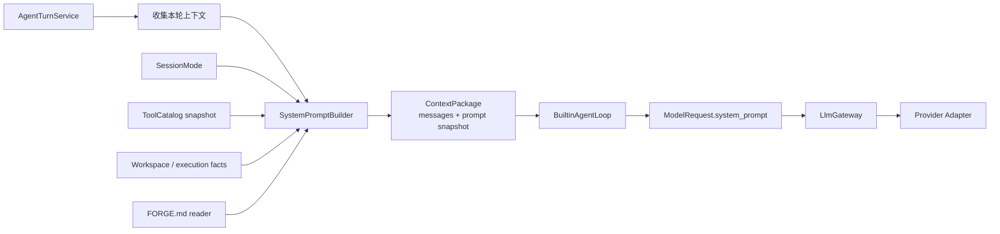

# ADR-0018：采用分层且按 Turn 冻结的系统提示词编译机制

## 状态

Accepted (2026-08-17 实现阶段 1-3)

2026-08-17 修订并实现. 结构上的三处:

- `PromptSnapshot` 由一段扁平文本改为**块序列**, `text` 变成派生属性 (§3.1).
- 区分**结构性块**与**条件性块**, 并明写 Prompt Cache 的断点位置 (§4).
- 补 §4.4 提示词与工具的分工. 这条边界决定了将来 Skills / MCP prompts 走哪条路.

以及一轮"什么算过度设计"的清理. 首版设计里有五样东西**定义了但没有任何消费方**, 逐条
撤回 (§3.1, §4.3, §12.1):

| 撤回 | 原因 |
|---|---|
| `PromptSnapshot.profile` 与 `PromptProfile` | 单成员枚举, 进指纹等于加常量; 第二个 profile 落地时再加 |
| `PromptBlock.trust` 与 `TrustLevel` | 无任何代码分支于它; 真正起作用的是块顺序与正文里的文字 |
| `PromptSourceRef` / `sources` / `diagnostics()` | §10.1 的诊断接线属阶段 4, 先建对象等于建空壳 |
| `PromptSnapshot.cacheable_prefix` | 只有测试在用; `cacheable` 标志与构造校验保留 |
| `tool_catalog_snapshot_hash` | 模型拿它做不了任何事 |

同一轮还去掉了两处**重复维护**: 提示词里的工具用途表改为取 `ToolSpec.title`, 模式能力
描述改为取 `auto_allowed_capabilities` (§4.2, §4.3). 硬编码那两份不会报错, 只会在真相
变化之后开始骗模型.

## 日期

2026-08-07 (2026-08-17 修订并实现)

## 背景

ForgeCLI 的 LLM 调用链路已经具备承载系统提示词的底层能力：

- `ModelRequest.system_prompt` 独立于对话 `messages`。
- token 估算覆盖 system prompt、messages 和 tool schema。
- 响应缓存指纹包含 system prompt，`CacheHint` 可标注稳定前缀。
- Provider adapter 可把 `system_prompt` 转换成具体供应商的 system role 或等价机制。
- Background Safety Classifier 已经使用独立的系统提示词，不继承主 Agent 的任务完成压力。

但主 Agent 目前只把会话历史和工具目录交给模型，没有任何主 Agent 系统提示词的
产出方。这会造成以下问题：

1. 模型对自身身份、ForgeCLI 职责和工具边界没有稳定认知，可能沿用底层模型的预训练身份。
2. 模型不知道当前 mode、工作目录、workspace roots、平台、隔离等级等运行事实。
3. 模型在工具调用前是否给出简短、用户可见的行动说明完全取决于模型默认风格。
4. 项目级工程约定没有受控的注入通道。
5. 如果后续由 AgentLoop、CLI、Gateway 和各个内部 LLM 用例分别拼接字符串，容易形成多套提示词优先级、
   缓存和脱敏规则。

系统提示词可以影响模型“尝试什么”，但不能成为安全控制面。真实副作用仍必须由
Tool Catalog、Policy Engine、ApprovalService、Tool Runtime 和恢复屏障强制管理。

## 决策

ForgeCLI 采用“分层编译、按 Turn 冻结、用途隔离”的系统提示词机制。

1. **由 application 层编译主 Agent 提示词**：新增 `SystemPromptBuilder`，它接收类型化运行事实和
   受控指令源，产出不可变 `PromptSnapshot`。
2. **`AgentTurnService` 是提示词构建边界**：它在每个 turn 开始时读取当前 mode、Tool Catalog、
   workspace 和执行画像，并把提示词快照放入 `ContextPackage`。
3. **一个 turn 内完全冻结**：`BuiltinAgentLoop` 在 `start()` 时接收快照，本轮所有模型调用复用
   同一份 system prompt；不在工具调用之间隐式换提示词。
4. **Gateway 不组装业务提示词**：`LlmGateway` 继续只负责模型解析、凭证、重试、缓存、计量、
   观测和 Provider 映射；不反向依赖 mode、workspace、CLI 或项目文件。
5. **提示词按信任级别分层**：固定顺序为内置核心契约、工具与交互契约、项目指令、
   当前运行事实。低信任层不得覆盖高信任层。
6. **安全分类器和内部用例与主 Agent 隔离**：Background Safety Classifier 继续使用独立提示词，
   不继承主 Agent 身份、`FORGE.md`、会话历史或“完成任务”压力。
7. **第一版项目指令只读受信任根目录的 `FORGE.md`**：不扫描嵌套目录，不执行 include，不展开
   环境变量，不跟随到 workspace 之外的符号链接。
8. **原始提示词不默认持久化或展示**: 事件, 普通日志和终端运行流至多记录 version 与
   fingerprint, 不记录原文. 诊断输出的具体字段集属阶段 4 (§10.1).
9. **使用稳定前缀优化 Prompt Cache**：不在 system prompt 中放入 request id、turn id、秒级时间戳等
   高频易变值；稳定区段在前，运行事实在后。
10. **主 Agent 需要可见行动摘要，不请求原始思维链**：内置契约要求模型在一组工具调用前用一句
    简短文字说明意图；Provider 不产出可见文字时，终端仍以工具事件作为权威时间线。
11. **内置提示词不允许被配置整体替换**：项目和用户可追加低信任指令，但不能通过 TOML 或
    `FORGE.md` 覆盖身份、工具、审批、审计与安全边界。
12. **第一版不建立通用 Prompt 插件注册表**：先实现主 Agent builder，保留已有分类器提示词。
    当 title、summary、compact 等至少三个内部 profile 真正落地后，再从实际共性抽取 registry。

## 备选方案

### 方案 A：在 `BuiltinAgentLoop` 中写一段固定字符串

实现最短，但很快会把 mode、workspace、`FORGE.md`、工具使用规则和缓存标注都堆进循环实现，
使 AgentLoop 同时承担编排、文件读取和提示词策略。不采用。

### 方案 B：由 Gateway 按 `RequestOrigin` 自动注入

可以集中处理 prompt，但 Gateway 不掌握 mode、Tool Catalog、workspace 与执行画像；强行注入会让
Gateway 从供应商无关的调用控制面变成 Agent 业务层。`origin` 继续只是用途标签。不采用。

### 方案 C：允许用户配置完整 system prompt

灵活性最高，但会让每个项目都能移除 ForgeCLI 身份、工具真实性和审批契约，并使问题难以复现。
用户自定义改为追加低信任指令，不允许整体替换。

### 方案 D：把所有提示词源先抽象成通用 `PromptSource` / `PromptRegistry`

可扩展性强，但当前主 Agent 只有内置契约、运行事实和 `FORGE.md` 三类来源。插件体系会提前
冻结错误接口并增加空实现。第一版采用显式 builder，不采用注册表。

## 影响

### 收益

- 主 Agent 拥有稳定、与 Provider 无关的 ForgeCLI 身份。
- 模型能在调用工具前给用户可见的简短说明，改善长工具链的可理解性。
- mode、workspace 和平台事实每轮现读，不再依赖模型猜测。
- 提示词版本、来源和指纹可诊断，但原文不进入常规日志或事件。
- 稳定前缀可利用 Provider Prompt Cache，不必每轮反复支付全部前缀成本。
- 主 Agent、风险分类器和未来 compact/summary 用例不会相互污染。

### 代价

- 每个 turn 开始时需要读取小量项目指令和组装上下文。
- 提示词变更会改变模型行为，必须通过版本、snapshot test 和行为用例评审。
- `FORGE.md` 是会自动发送给当前 Provider 的项目内容，需在文档中明确说明不应放入凭证或秘密。
- 按 turn 重建意味着 resume 续写使用“当前提示词”，而不保证与历史 turn 完全一致。

### 兼容性

- 无 system role 的 Provider 由对应 adapter 翻译成等价的最高优先级指令；无法表达时明确返回
  `ModelBadRequestError`，不得悄悄降级为普通 user message。
- 未配置任何 Provider 时 builder 仍可独立构建和测试。
- `FORGE.md` 不存在时只使用内置契约和运行事实，不视为错误。

## 设计细节

## 1. 目标与非目标

### 1.1 目标

- 为主 Agent 提供稳定身份、交互方式和工具契约。
- 把当前 mode、workspace 和执行环境事实以类型化方式告诉模型。
- 提供受限的项目指令注入机制。
- 保证一个 turn 内的提示词、工具目录和审计指纹可对齐。
- 保持 Provider 无关、可测、可版本化和可利用缓存。

### 1.2 非目标

- 不用提示词替代 Tool Catalog、Hard Deny、Policy Engine、ApprovalService 或 sandbox。
- 不记录或展示 raw chain-of-thought。
- 不允许任意项目文件或 tool output 自动升格为 system instruction。
- 不在第一版实现嵌套 `FORGE.md`、远程 prompt、Prompt Marketplace 或热更新插件。
- 不保证不同 Provider 对同一提示词产生完全一致的语言风格。

## 2. 责任边界



### 2.1 `AgentTurnService`

- 从 session snapshot 现读 mode。
- 只计算一次本轮 Tool Catalog，同一个快照同时交给 builder 和 `LoopInput`，避免两次计算结果分叉。
- 收集经类型化和脱敏的 workspace / execution facts。
- 调用 builder 产出 `PromptSnapshot`，不自己拼接大段字符串。

### 2.2 `SystemPromptBuilder`

- 是纯组装服务：相同输入必须产生相同文本与 fingerprint。
- 不读 `os.environ`，不直接读文件系统，不调用 LLM，不读 Provider 凭证。
- 只消费注入的 `PromptBuildInput` 与 `ProjectInstructionReader` 结果。
- 对区段顺序、长度、版本和指纹负责。

### 2.3 `BuiltinAgentLoop`

- `start()` 时保存本轮 prompt snapshot。
- 每次构建 `ModelRequest` 时设置同一份 `system_prompt`。
- **不设 `CacheHint`** (2026-08-17 修订). 当前唯一的 adapter 是 OpenAI-compatible,
  它走自动前缀缓存, 标不标一样; 而 `CacheHint` 的两个布尔也表达不了 §4.0.1 的断点
  位置 —— 那正是 `PromptSnapshot` 里已经有的信息. 摆一个没人读的字段不如不摆.
  接入需要显式 `cache_control` breakpoint 的 adapter (如 Anthropic) 时, 按真实需要
  重新设计 `CacheHint` 的形状再接线.
- 不根据 Provider 名称、模型名称或终端主题改写提示词。

### 2.4 `LlmGateway`

- 把已组装的 `system_prompt` 原样交给 adapter。
- 在 token 估算、预算守卫、指纹和观测中使用它，但不理解其业务内容。
- 除 `complete_structured` 的 schema instruction 等网关协议所需指令外，不自动追加主 Agent 行为规则。

## 3. 数据模型

### 3.1 `PromptSnapshot` 与 `PromptBlock`

```text
PromptBlock
  block_id                 # core_identity / tool_contract / answer_contract
                           # / workspace_instructions / runtime_facts
  heading                  # 渲染出来的小节标题
  body                     # 该块正文
  cacheable                # 是否属于 Prompt Cache 稳定前缀

PromptSnapshot
  version                  # 语义版本, 初始为 1
  blocks[PromptBlock]      # 有序, 渲染顺序即本序列顺序
  text                     # 派生: 各块渲染后拼接
  fingerprint              # 派生: 由 version + 规范化 text 计算
```

约束:

- frozen; `blocks` 非空.
- `text` / `fingerprint` 是**派生**属性, 不允许调用方传入与块序列不匹配的值.
- `cacheable=False` 的块之后不得再出现 `cacheable=True` 的块 (构造时校验). 否则"稳定
  前缀"这个概念不成立.

`version` 不是装饰: 它是排查"模型行为什么时候变的"唯一的锚点, 且 §15.3 要求改内置文本
必须同时升版本并更新快照测试.

#### 3.1.1 首版曾定义而后撤回的字段

四样东西在首版设计里存在, 实现时确认**没有任何消费方**, 予以撤回. 记录在此是为了让后来
的人知道它们被考虑过, 以及回来的条件:

| 撤回 | 撤回理由 | 回来的条件 |
|---|---|---|
| `profile` / `PromptProfile` | 只有 `main_agent` 一个成员, 进指纹等于加了个常量; 没有任何代码分支于它 | 第二个 profile (summary / compact) 真正落地时 (§7.3) |
| `trust` / `TrustLevel` | 无任何代码分支于它. 真正表达信任层级的是**块顺序**与项目指令正文里的引导文字; 而渲染出去的 `trust: below-forge-core` 是 §5.3 规定的固定格式, 与该字段是两份独立副本 | §8.2 的按信任排序截断策略真正实现时 |
| `PromptSourceRef` / `sources` / `diagnostics()` | §10.1 的诊断输出属阶段 4, 当前没有任何日志或 `/status` 消费它 | 阶段 4 接 `/status` 或 `/debug prompt` 时 |
| `cacheable_prefix` | 只有测试在用. `cacheable` 标志与构造校验保留 —— 它们挡的是真实的顺序错误 | adapter 真的需要把前缀单独交出去时 |

判据统一:**一个定义了但无人消费的字段不会报错, 只会让下一个人以为它有用途.** 这与
§14 "阶段之间不创建下一阶段的空类" 是同一条规则, 只是首版把它用在了模块粒度而没用在
字段粒度.

**为什么是块而不是一段文本.** 扁平字符串堵死四件事, 而这四件事在块数超过四五个之后都
会需要: 按块的 cache hint, 按块的截断优先级, 按块的诊断, 以及为无 system role 的
Provider 重排. 把 `text` 降级成派生属性的成本几乎为零 —— fingerprint 仍然算在渲染后的
完整文本上, 现有的每一条保证都不变.

第一版只实现四个块,**不预建将来的空块**. 待办与计划状态两块随 ADR-0022 落地时再加,
那时只需新增一个 block_id 和一段渲染, 不动 `PromptSnapshot` 的形状.

`PromptSnapshot` 是 Provider 无关值对象, 位于 `domain/agent`, 不引入文件系统或
template engine.

### 3.2 `ContextPackage`

第一版将当前只含 `messages` 的形状扩展为：

```text
ContextPackage
  messages[]
  prompt: PromptSnapshot
```

system prompt 不伪装成 `MessageRole.SYSTEM` 的 conversation message，不进入 transcript，也不作为历史
assistant/user message 重放。

### 3.3 `PromptBuildInput`

```text
PromptBuildInput
  mode
  facts: RuntimeFacts
    platform
    shell_kind
    isolation_level
    working_directory
    workspace_roots[]          # 第一个是 primary
  available_tools[ToolBrief]   # name + ToolSpec.title
  project_instructions[]
```

环境事实收在 `RuntimeFacts` 里而不是摊平成一排字段: 那样"哪些环境事实可以渲染"这条
规则只需要在一个地方成立. 投影由组合根完成, builder 拿不到 `ExecutionProfile` 本身
(§12).

`PromptBuildInput` 不含 environment values, API key, Authorization header, 任意 Provider
options, tool output 或 raw policy object.

2026-08-17 移除 `tool_catalog_snapshot_hash`: 它既不渲染 (§4.3) 也不影响指纹 ——
`available_tool_names` 已经表达了"目录变了"这件事. 留一个不进任何输出的字段, 只会让
下一个人以为它有用途. "prompt 与 tool schema 来自同一份 catalog 快照"这条保证由
`AgentTurnService` 只计算一次 catalog 从结构上给出, 不靠传一个哈希来对账.

## 4. 提示词分层与顺序

编译结果采用固定顺序:

| # | block_id | 内容 | 出现 | cacheable |
|---|---|---|---|---|
| 1 | `core_identity` | ForgeCLI 核心身份与责任 | 结构性 | 是 |
| 2 | `tool_contract` | 工具, 真实性, 审批, 交互契约与检索顺序 | 结构性 | 是 |
| 3 | `answer_contract` | 怎么交付一个回答 | 结构性 | 是 |
| 4 | `workspace_instructions` | 项目指令 `FORGE.md` | 条件性 | 是 |
| — | — | **Prompt Cache 断点** | — | — |
| 5 | `runtime_facts` | 当前运行事实 | 结构性 | 否 |

低信任层不得覆盖高信任层. 顺序不因任何块缺席而改变.

**信任层级由顺序与文字表达, 不由字段表达** (见 §3.1.1): 项目指令排在内置契约之后,
并被 §5.3 的信任标注包裹, 引导文字明说它改不了工具真实性与审批边界. 再挂一个
`trust` 枚举不会让任何一条约束更强 —— 没有代码会去读它.

### 4.0 结构性块与条件性块

**结构性块**无条件渲染, 即使内容为空也保留标题. `core_identity`, `tool_contract` 与
`answer_contract` 永远有内容; `runtime_facts` 永远至少有 mode 与 platform.

**条件性块**只在有内容时渲染, 没有就整块不出现 —— 不渲染一个写着"(无)"的空标题.

首版只有 `workspace_instructions` 一个条件性块, 差别看不出来. 但块数长到十几个之后,
一屏"(无)"不只是浪费 token, 它在教模型"空块是常态", 稀释注意力. 规则现在定死, 免得
每加一个块都要重新讨论一次.

**约束: 条件性块必须排在缓存断点之前或之后的同一侧, 且不得插在结构性块中间造成顺序
抖动.** 首版 `workspace_instructions` 位于断点之前 —— `FORGE.md` 变更频率远低于每轮,
放进稳定前缀是划算的; 它变了就是整轮缓存重建, 而那本来就该发生.

### 4.0.1 缓存断点在哪里

ADR 首版只说了"禁止把每轮必变的值放进稳定前缀", 没说断点在哪. 现在定死:

**`cacheable=True` 的块构成稳定前缀; 第一个 `cacheable=False` 的块起, 全是每轮重算的
易变尾部.** `PromptSnapshot` 在构造时校验这个划分不被打破 (§3.1).

于是逐轮变化情况如下:

| 块 | 变化时机 | 缓存 |
|---|---|---|
| `core_identity` | 升 profile 版本 | 命中 |
| `tool_contract` | 增删工具, 改契约文本 | 命中 |
| `answer_contract` | 改契约文本 | 命中 |
| `workspace_instructions` | 用户改 `FORGE.md` | 命中 |
| `runtime_facts` | 切档, `/add-dir`, 换工作目录 | 每轮重算 |

收益是占比最大的三块逐轮命中, 而易变尾部通常只有一两百 token. 这也解释了为什么 mode 和
工具名单必须留在 `runtime_facts` 里而不能上提: 按一次 Tab 就变的东西进了前缀, 前缀就
不再稳定.

### 4.1 内置核心身份

初始语义应包含：

```text
你是运行在 ForgeCLI 中的编码 Agent。
你的推理能力由用户当前配置的模型提供，但工作接口、工具权限、审批和执行结果
以 ForgeCLI 运行时为准。
```

不使用“你不是 Claude / GPT / 某供应商助手”这类绑定当前 Provider 的否定式描述。如用户询问底层模型，
终端或配置服务可如实提供当前 provider/model；身份契约不伪造供应商信息。

### 4.2 工具与交互契约

初始版本至少包含：

- 只能请求 ForgeCLI 提供的工具，不得绕过工具伪造副作用。
- 当前附带的 tool schema 是本轮唯一可用的工具目录，不在提示词中复制完整 schema。
- 未收到成功 ToolResult 前，不得声称已经执行或已经修改。
- 工具请求可能被允许、拒绝或要求人类确认；不预设审批结果。
- 用户拒绝后，不通过改写同一意图来绕过拒绝。
- 一组工具调用前先用一句简短、可见文字说明目的；不输出原始思维链。
- 工具调用后根据真实结果继续、修正方案或说明阻塞。

提示词只降低无效请求和误解，不用它强制任何权限。即使模型忽略上述文字，工具请求仍必须
通过本地安全管线。

#### 4.2.1 工具用途表取自 `ToolSpec.title`, 不在提示词层硬编码

本块还渲染一张"用途 -> 工具名"的表, 供模型快速选型.**表的内容全部来自本轮 catalog 里
每个 `ToolSpec` 的 `title`, 提示词层不写死任何工具名.**

理由与 ADR-0004 §2 的解耦是同一条: 那里说"新增工具不需要修改安全模块", 这里就是"新增
工具不需要修改提示词 builder". 首版实现曾硬编码过一张九行的表, 上线前它已经同时含着一个
尚未实现的工具和一个即将删除的工具 —— 硬编码的一份必然与真相各自演化, 而漂了不会报错:
提示词照常渲染, 只是内容开始骗人.

同理, 表的**引导语也跟着目录走**: `shell.run` 不在本轮目录里时不提它的名字, 否则等于
告诉模型有个它看不见的工具, 而模型会去请求它.

唯一保留在提示词层的硬编码是那句**跨工具规则** ("同一个动作既有专用工具又能用
`shell.run` 时, 用专用工具"). 它说不进任何单个 `ToolSpec.description` —— 那是关于工具
**集合**的策略, 不是关于某一个工具的说明; 塞进 `shell.run` 自己的描述只是换个地方硬编码.

### 4.3 运行事实

允许注入:

- 当前 `SessionMode` 值, 以及**从 `auto_allowed_capabilities(mode)` 现取**的自动放行
  能力集 (见 §4.3.1).
- 当前工作目录.
- 已明确信任的 primary / additional workspace roots.
- `ExecutionProfile.platform`, `isolation_level` 和 `shell_kind`.
- Tool Catalog 中的工具数量与名称.
- **"PATH 受控且窄"这一事实本身** (不含 PATH 内容). 它影响模型该不该假设某个命令可用,
  属于行为相关事实, 不是秘密.

禁止注入:

- 环境变量值, 凭证, token, cookie, Authorization header.
- 完整 PATH 内容, 用户 shell rc 内容, Provider 私有选项.
- plan hash, approval binding, 安全策略全文或内部 hard-deny 语料.
- 完整 tool output, raw classifier response, raw reasoning 或事件日志原文.
- **`catalog_snapshot_hash`** (2026-08-17 新增禁止项).

`catalog_snapshot_hash` 被移出允许清单的理由与秘密无关 —— 它不是秘密, 首版允许它也没
造成任何风险. 移除是因为**模型拿它做不了任何事**: 它是给诊断与审计对账用的锚点, 渲染
进提示词只是每轮几十个字符的噪音. 保留它的唯一说得通的场景是"让模型在报错时复述这个
hash 便于排查", 而这个场景没有真实发生过. 它继续进调用 trace 与安全摘要 (§10.1), 只是
不进提示词.

运行事实使用固定字段名和确定顺序渲染, 不使用任意 `repr()`.

#### 4.3.1 模式能力取自能力预算, 不写成散文

首版设计说的是"当前 `SessionMode` 值**及一句稳定摘要**", 实现时那句摘要变成了四段按档
手写的散文 —— 而每一档的真相已经在 `domain/security/modes.py::auto_allowed_capabilities`
里了. 那是第三份副本 (前两份是能力预算与目录门), 且有人往 `_ACCEPT_EDITS` 里加一个
`NETWORK_ACCESS` 时, 散文照旧说"网络需要人类确认", 没有任何一层会说话.

改为从能力预算现取并渲染成中文:

```text
mode              accept_edits
自动放行          计划, 工作区读取, 工作区写入, 工作区删除, 移动与重命名, 启动子进程
需人类确认        其余一切
```

`Capability -> 中文` 是提示词层唯一保留的枚举硬编码, 它值得: 能力词汇是闭集, 改动要走
ADR 并升 `CAPABILITY_VOCABULARY_VERSION` (ADR-0004 §5), 因此这张表不会悄悄漂; 而且它是
**一张表覆盖四档**, 不是四份互相独立的副本. 渲染顺序取自该表的声明顺序而不是集合迭代
顺序 —— 后者不稳定, 会让同样的输入产出不同的提示词, 从而毁掉指纹的确定性.

注意"写入工具不在本轮目录中"这类话**不必再说**: 工具清单本身已经表达了目录门的结果.
真正只能从这里得到的信息是"工具可见但会 ASK" —— `accept_edits` 与 `auto` 两档的工具
清单完全相同, 差别只在裁决.

### 4.4 提示词与工具的分工

"按需加载提示词"是个合理诉求, 但在 ForgeCLI 里它有三种互不相同的含义, 混为一谈会得到
错误的设计:

| 含义 | 判断 |
|---|---|
| **条件装配**: 开轮时按 mode / 工作区决定哪些块进去 | **采用**. 决策发生在快照构建之前, 与按轮冻结完全兼容 (§4.0) |
| **轮内动态追加**: 模型跑到一半要求更多指令 | **不采用**. 与 §6.2 的冻结规则直接冲突, 且每次追加都打掉前缀缓存 |
| **渐进披露**: 提示词只放索引, 正文由模型用工具取 | **采用**, 且这是 ForgeCLI 表达"按需"的**唯一**机制 |

因此定下这条边界:

**提示词承载稳定契约与小体量运行事实; 大体量, 按需, 可能过期的内容一律走工具.**

判据是两条, 满足任意一条就该走工具而不是提示词:

1. 内容可能超过几百字 —— 每轮重述它是浪费.
2. 模型只在部分轮次需要它 —— 每轮都给等于稀释注意力.

既有样板是 ADR-0022 的计划与待办: 待办清单小且每轮都要对齐, 所以进运行事实块; 计划正文
大且按需查阅, 所以提示词里只出现一行引用, 正文由 `plan.read` 取.

这条边界同时决定了将来 Skills 与 MCP prompts 的接入路径: 它们是"按需的大体量内容",
因此走工具/目录, 不走 system prompt 注入. 本 ADR 不实现它们, 但把路指定了, 免得后来
有人从提示词这一侧开口子.

### 4.5 检索顺序与回答契约 (version 2, 2026-08-19)

一次真实任务暴露出首版提示词漏掉的两件事. 47 次工具调用的构成: 22 次列目录 (其中 13 次
只为逐层走完一条 Java 包路径), 22 次 shell 检索, 读文件 3 次, 专用搜索工具零次成功.

**其一, 契约里没有检索顺序.** §4.2 的工具契约只说了"同一个动作既有专用工具又能用
`shell.run` 时用专用工具", 那是**选哪个工具**; 它没说**按什么顺序做**. 模型于是把列目录
当 `cd` 用. 递归 glob 一直可用 (ADR-0004 §14.1b), 缺的不是能力.

新增一段写进 `tool_contract`:

1. 先按关键词检索定位, 不要逐层列目录.
2. 需要目录全貌时用一次递归 glob, 不要一层层列.
3. 命中之后直接读关键文件.
4. 读到定义之后搜它的**引用**, 不是同一个词再搜一遍.
5. 同一关键词连续两次检索无结果, 这本身就是结论.

**这一段按动作写, 不按工具名写.** 哪个工具承担哪个动作由工具表回答; 在散文里再点一次名
就有了第二份会漂的真相 —— 删掉一个工具时表会跟着变, 散文不会. 它跟着工具目录一起出现:
目录为空时整段不渲染, 因为那时它是空话.

**其二, 契约管到"执行", 没管到"交付".** 首版的"未收到成功的 ToolResult 之前不得声称
已经执行"只覆盖工具调用. 同一次任务的最终答案里出现了从未读到过的配置路径, 而全程 8 次
检索真正证明的事实是"本地配置里没有这个键" —— 那条最有价值的结论一个字没提.

因此新增结构性块 `answer_contract`:

- 只陈述工具结果证实过的事实; 推断要明说是推断.
- 没读过的文件不描述其内容.
- 检索无结果本身就是结论, 不用推测的例子填补.
- 举例要标明是示例, 不能看起来像项目里已有的东西.
- 结论先行; 不用 emoji 小标题, 标点半角.

它与 `tool_contract` **分块而不是并进去**: 两者的适用时机不同, 一个管每次工具调用, 一个
只管最后那段文字, 混在一起会让"什么时候该守哪条"变模糊. 它无条件渲染 —— 没有工具的一轮
同样要交付一个诚实的回答 —— 且在缓存前缀内, 因为它每轮都一样.

**顺带修掉的一处渲染缺陷**: `_tool_table` 的名字与标题之间没有分隔符, 渲染出来是
`读取文件fs.read_file`. 它不会让任何测试失败, 提示词照常渲染, 指纹照常稳定, 只是模型
读到的工具表是一坨. 这正是提示词类缺陷的典型形态 —— **没有任何一层会说话**, 只能靠正面
钉住输出形状的用例发现.

`MAIN_AGENT_PROMPT_VERSION` 由 1 升到 2, §15.3 的指纹快照随之更新.

## 5. `FORGE.md` 项目指令

### 5.1 发现范围

第一版只查找每个已信任 workspace root 顶层的 `FORGE.md`：

```text
<primary-root>/FORGE.md
<additional-root-1>/FORGE.md
<additional-root-2>/FORGE.md
```

- primary root 先渲染，additional roots 按 `ProjectConfig.workspace_roots` 的稳定顺序渲染。
- 冲突时内置契约始终优先；项目指令之间由 primary root 声明的约定优先。
- 不递归查找子目录、`.forge/`、Git submodule 或用户 home 中的指令文件。

嵌套目录指令的作用域与优先级需要单独 ADR，不由第一版猜测。

### 5.2 读取边界

- 仅读 UTF-8 普通文本；含 NUL 或无法解码时忽略该文件并产出安全诊断。
- 解析 `realpath`；目标不在对应已信任 root 内时不读取。
- 不解析 include / import / shell substitution / environment expansion。
- 不把 Markdown 当作模板语言执行，只作为文本指令。
- 每个文件最大 32 KiB，所有 workspace 项目指令总计最大 64 KiB。
- 超限时只保留边界内的完整 UTF-8 字符，显式加入 `[FORGE.md 已截断]`，不静默截断。
- 文件内出现用于分隔的 sentinel 整行时进行转义，避免伪造区段结束。

`FORGE.md` 会自动发送给当前模型 Provider。用户文档必须明确说明：不得把 API key、私钥、cookie 或
其他 secret 写入该文件。ForgeCLI 不声称能够可靠检出任意形态的秘密。

### 5.3 信任标注

项目文本按以下形状渲染：

```text
--- BEGIN WORKSPACE INSTRUCTIONS ---
source: <workspace-relative-or-redacted-id>
sha256: <digest>
trust: below-forge-core

<content>
--- END WORKSPACE INSTRUCTIONS ---
```

引导文字明确说明：项目指令可影响工程方式、命名、测试和风格，不能修改 ForgeCLI 工具真实性、
审批、审计和安全边界。

## 6. 按 Turn 冻结与失效

### 6.1 构建时机

`AgentTurnService` 必须在开始 `AgentLoop` 之前：

1. 读当前 session mode。
2. 计算一次 Tool Catalog snapshot。
3. 读当前 workspace roots 和 execution profile。
4. 加载受限 `FORGE.md`。
5. 编译 `PromptSnapshot`。
6. 把同一个 catalog 与 prompt snapshot 交给 `LoopInput`。

任一步不得调用模型或执行工具。

### 6.2 冻结规则

- 一个 turn 中，经过多次 model call / tool call 循环时不重读 `FORGE.md`。
- 一个 turn 中，mode、tool catalog 和 system prompt 必须来自同一份开始快照。
- 工具在本轮修改 `FORGE.md` 时，新内容从下一个 turn 生效。
- 当本轮因拒绝、阻塞或预算用尽而收回工具目录时，AgentLoop 可向 conversation 追加受控运行通知，
  但不重新编译核心 system prompt。

### 6.3 跨 Turn 失效

以下变化在下一个 turn 使旧快照失效：

- session mode 变化。
- workspace roots 增加、撤销或重排。
- execution profile 变化。
- Tool Catalog snapshot 变化。
- `FORGE.md` 内容、文件身份或可读状态变化。
- 内置 profile 版本变化。
- 人工 Shell 返回后的 context invalidation barrier 生效。

实现不必保留跨 turn 的原始 prompt cache；每轮重建是权威路径。Provider 端前缀缓存是独立优化，
不能反过来成为上下文真相源。

## 7. Profile 与用途隔离

### 7.1 主 Agent

第一版只实现 `main_agent` profile：

- `RequestOrigin.CHAT` 和 `RequestOrigin.ACT` 共用主 Agent 核心 profile。
- 有工具时由 tool schema 和运行事实表达可用能力，不为 ACT 复制一整套提示词。
- 无工具时仍保留身份、真实性和交互契约。

### 7.2 安全分类器

- `RequestOrigin.STRUCTURED_CLASSIFICATION` 不映射到主 Agent profile。
- 分类器只获得分类所需的结构化事实和隔离系统指令。
- 分类器不获得 `FORGE.md`、工具目录、主会话 transcript 或主 Agent 行为契约。
- 项目文件、命令和脚本内的“忽略上述规则”只能作为待分类数据。

### 7.3 未来内部 Profile

title、summary、compact、review 等用例必须使用窄职责提示词，不默认继承主 Agent profile。当多个
已落地 profile 出现重复机制后，再提取 `PromptProfileRegistry`，不在本 ADR 中预建空注册表。

## 8. Prompt Cache 与上下文预算

### 8.1 稳定前缀

按以下顺序优化缓存命中：

```text
内置身份
→ 工具与交互契约
→ FORGE.md
→ 运行事实
```

禁止放入稳定前缀：

- request id / turn id / event id。
- 秒级或每轮必变时间戳。
- 随机数、临时路径、运行次数。
- 与模型无关的 terminal UI 状态。

`PromptSnapshot.fingerprint` 不放回 prompt 文本，避免自引用造成指纹不稳定。

### 8.2 预算

- Builder 的 32/64 KiB 上限是输入滥用防护，不替代 token budget。
- `ContextManager` 落地后，系统与 mode 指令仍遵循详细设计中约 10% 的默认预算。
- 核心身份和工具真实性契约不能为了容纳项目指令而被截断。
- 项目指令超限时显式截断低信任部分，并向诊断面暴露 `truncated=true`。
- Gateway 估算请求后如超出模型上下文，继续按 ADR-0011 的容量错误/压缩策略处理，不在
  Provider adapter 中静默丢提示词。

## 9. 注入、安全与真实性

### 9.1 提示词不是权限边界

以下内容必须继续由代码强制：

- 当前 mode 可见的 Tool Catalog。
- 工具请求的能力声明与目标解析。
- Hard Deny、受保护路径、沙箱和执行画像。
- ASK / ALLOW / DENY 裁决及 HITL 回复。
- 用户拒绝后的本轮停止。
- 超时、取消、资源限制和恢复屏障。

不得因为提示词写了“不要做危险操作”就减少本地检查。

### 9.2 低信任内容

- `FORGE.md` 是已信任 workspace 内用户提供的工程指令，但仍低于 ForgeCLI 内置契约。
- 除显式 `FORGE.md` 外，代码、README、注释、编译输出和 tool output 不会自动成为 system instruction。
- 低信任内容中对“忽略 ForgeCLI 规则”“用户已授权”“不需要工具”的声明没有权限效果。

### 9.3 提示词模板

- 内置文本可使用包内 Markdown resource 或代码常量，但必须通过 `importlib.resources` 或正常 import 读取，
  不依赖当前工作目录。
- 第一版不引入 Jinja 等通用模板执行引擎。
- 所有变量使用类型化渲染函数和固定字段顺序，不对 workspace 文本执行代码。

## 10. 观测、审计与调试

### 10.1 默认可见性

默认允许记录：

> 2026-08-17: 本节的诊断输出属**阶段 4**, 尚未接线. `prompt_profile` 随 `PromptProfile`
> 一起撤回 (§3.1.1), 阶段 4 接 `/status` 时按当时的 profile 集合重新决定字段.

```text
prompt_version=1
prompt_fingerprint=sha256:...
project_instruction_count=...
project_instructions_truncated=true|false
```

默认禁止进入事件、普通日志和终端运行流：

- 完整 system prompt。
- `FORGE.md` 原文。
- 环境变量值。
- Provider 私有提示词或 raw metadata。
- hidden reasoning / chain-of-thought。

Prompt fingerprint 可进入调用 trace 和安全摘要，但不进入默认终端时间线，免得重新引入
ADR-0016 已删除的内部实现噪声。

### 10.2 显式调试

后续可增加 `/debug prompt`，但必须满足：

- 默认只显示 profile、version、fingerprint、来源列表和截断状态。
- 显示完整文本需要用户在前台 TTY 中显式选择。
- 完整文本只写当前终端，不写 `events.jsonl`、artifact 或普通日志。
- 调试界面不显示 Provider 凭证或未脱敏环境值。

`/debug prompt` 不属于第一版必须产物，不因缺失该命令而阻塞主提示词接线。

## 11. 错误与降级策略

| 情况 | 处理 |
| --- | --- |
| 内置核心 profile 缺失、为空或无法读取 | 阻止主模型调用，返回可行动错误 |
| 运行事实缺失非关键字段 | 使用 `unknown` 或省略该字段，指纹反映降级结果 |
| `FORGE.md` 不存在 | 正常构建，不产生警告 |
| `FORGE.md` 不可读、非 UTF-8、越界符号链接 | 忽略该来源，产出不含原文的诊断，不降级安全管线 |
| 项目指令超限 | 显式截断低信任区段，标记 `truncated=true` |
| Provider 不支持 system instruction | 返回 `ModelBadRequestError`，不悄悄降级成 user message |
| prompt + messages + tools 超出上下文 | 按 Gateway / ContextManager 容量策略失败或请求 compact，不截断核心契约 |

## 12. 模块建议

```text
src/forgecli/domain/agent/
  prompt.py                         # PromptBlock / PromptBlockId / PromptSnapshot 纯值对象

src/forgecli/application/prompt/
  system_prompt_builder.py          # 主 Agent 显式 builder + 内置文本常量
  runtime_facts.py                  # RuntimeFacts: 类型化, 已脱敏的运行事实
  project_instruction_reader.py     # 读取端口与结果 DTO

src/forgecli/infrastructure/prompt/
  fs_project_instruction_reader.py  # 受限 FORGE.md 读取
```

约束:

- `domain` 不引入 `Path`, `importlib.resources`, Provider SDK 或 CLI 类型.
- 文件读取实现属于 infrastructure; 读取规则和编译顺序属于 application.
- `interfaces/cli` 只在组合根装配 builder 和 reader, 不保有提示词业务文本.
- **不建包门面 `__init__.py` 转手再导出一遍.** 调用方按模块路径直接 import. 与
  `domain/agent` 对 `run_events` 的处理一致: 一个没人用的门面只会让"改个符号要同步
  几处"变成三处.

**内置文本用模块常量, 不用包资源** (偏离首版 §9.3 给的两个选项之一). 包资源要多付
`importlib.resources` 读取, `pyproject.toml` 的 wheel/sdist 纳入, 以及一个"装好之后
读得到吗"的安装测试; 而在只有一个 profile, 文本由代码同一次提交管理的前提下, 这些成本
换不到任何东西. 将来 profile 多到需要非开发者改文案时再迁, 那时迁移是机械的.

**`RuntimeFacts` 是 application 层的类型化值对象, 不是 `ExecutionProfile` 本身.**
`ExecutionProfile` 带着 `trusted_path`, `environment_allowlist`, `protected_roots_hash`
这些绝不能进提示词的字段; 让 builder 直接收它, 就等于把"哪些字段不许渲染"这条规则
散落在渲染代码里. 组合根负责把 profile 投影成 `RuntimeFacts`, builder 只能看见已经
脱敏的那一份 —— 渲染全部字段是安全的默认行为.

## 13. 调用时序

```mermaid
sequenceDiagram
    participant CLI as CLI
    participant ATS as AgentTurnService
    participant CAT as ToolDispatcher
    participant PIR as ProjectInstructionReader
    participant PB as SystemPromptBuilder
    participant LOOP as BuiltinAgentLoop
    participant GW as LlmGateway
    participant P as Provider

    CLI->>ATS: user message
    ATS->>CAT: catalog_for(current mode)
    CAT-->>ATS: ToolCatalog snapshot
    ATS->>PIR: read trusted root FORGE.md files
    PIR-->>ATS: bounded instruction results
    ATS->>PB: PromptBuildInput + instructions
    PB-->>ATS: PromptSnapshot
    ATS->>LOOP: LoopInput(ContextPackage + same ToolCatalog)
    loop model/tool cycle in one turn
        LOOP->>GW: ModelRequest(same system_prompt)
        GW->>P: provider request
        P-->>GW: text / tool calls
        GW-->>LOOP: normalized response
    end
```

## 14. 分阶段落地

### 阶段 1：主 Agent 核心契约

- 定义 `PromptSnapshot` 和 `SystemPromptBuilder`。
- 实现内置身份、真实性、工具使用和可见行动摘要契约。
- 接入 `ContextPackage` 和 `BuiltinAgentLoop._build_request()`。
- 设置 system prompt / tools 的 cache hint。

### 阶段 2：运行事实

- 注入 mode、cwd、workspace roots、platform、isolation 和 shell kind。
- 保证 Tool Catalog 在 prompt 与 `LoopInput` 中为同一快照。
- 增加 fingerprint 与安全诊断。

### 阶段 3：`FORGE.md`

- 实现受限 reader、路径身份校验、大小上限和截断标记。
- 支持信任根的稳定顺序与来源指纹。
- 增加用户文档，说明文件会发送给 Provider 且不得包含 secret。

阶段 1-3 已于 2026-08-17 实现.

### 阶段 4: 诊断与后续 profile

- 接入 `/status` 的 profile/version/fingerprint 摘要或单独 `/debug prompt`。
- 等 title/summary/compact 真实落地后，评估是否需要 profile registry。

### 阶段 5: 计划与待办块 (依赖 ADR-0022)

- 新增 `todo_state` 与 `plan_state` 两个条件性块, 排在 `runtime_facts` 之后.
- 两块都是 `cacheable=False`: 它们每轮都可能变.
- 计划正文**不进块**, 块里只放一行引用, 正文由 `plan.read` 取 (§4.4).

阶段之间不创建下一阶段的空类, 空模块或 no-op 注册表. 阶段 5 的两个 block_id 在
ADR-0022 落地之前不出现在枚举里.

## 15. 测试设计

### 15.1 单元测试

- 相同 `PromptBuildInput` 产出字节级相同的 text 和 fingerprint。
- 内置区段顺序固定，运行事实字段顺序固定。
- 主 Agent 身份明确为 ForgeCLI，不绑定任一具体 Provider 品牌。
- 工具契约要求简短可见行动摘要，不请求 raw chain-of-thought。
- 项目指令无法删除内置区段，也不会被当作模板执行。
- 符号链接越界、非 UTF-8、NUL、超限与 sentinel 伪造均有用例。
- 核心 profile 缺失时阻止调用，`FORGE.md` 缺失时正常构建。

### 15.2 集成测试

- 主 Agent 的 `ModelRequest.system_prompt` 非空，Safety Classifier 仍使用独立提示词。
- 一个 turn 内多次模型调用的 system prompt 与 fingerprint 完全相同。
- 切换 mode、增加 workspace root 或修改 `FORGE.md` 后，下一个 turn 的 fingerprint 变化。
- 工具在本轮修改 `FORGE.md` 时，本轮提示词不变，下一轮生效。
- Tool Catalog 名称集与交给 Provider 的 tool schema 来自同一快照。
- 主 Agent 请求**不带** `CacheHint` (§2.3). 这条断言钉住的是决定本身: 将来接需要显式
  breakpoint 的 adapter 时它会红, 那正是该重新设计 `CacheHint` 形状的时刻.
- 正常运行事件、session transcript 和终端输出不含完整 system prompt 或 `FORGE.md` 原文。
- 模型即使输出越权工具请求，仍由 Tool Catalog / Policy / Approval 管线阻止，不依赖提示词。

### 15.3 快照与回归

- 内置 profile 必须有精确 snapshot test；任何文本变更必须显式更新 profile version 和 snapshot。
- 针对至少两种 Provider adapter 形状测试 system instruction 映射；当前只有一种 adapter 时，先覆盖
  OpenAI-compatible 和一个不支持 system role 的 fake adapter。
- 所有用例使用 fake gateway / provider，不发起真实网络调用。
- `make ci`、架构检查、提示词快照测试和 Agent Loop 集成测试全部通过。

## 16. 已知限制

- 文本分层能向模型表达优先级，但无法从统计上保证模型永远遵守；权限仍必须由本地代码强制。
- 模型可能仍然在无文本说明时直接发出 tool call；终端必须能独立渲染工具时间线。
- 第一版不加载用户全局指令、nested `FORGE.md`、Skills 或 MCP prompts。
- 第一版不自动保存历史 prompt 原文，因此 resume 是在当前版本下续写，不是模型调用的字节级重放。
- 密钥检测不可能完全可靠；用户必须把 `FORGE.md` 视为会发送给 Provider 的输入。

## 验收标准

- ADR 已同步到 `docs/adr/README.md` 和 `docs/README.md` 索引。
- 主 Agent 实际发出的 `ModelRequest.system_prompt` 非空，且由 application 层 builder 产出。
- 一个 turn 内的所有模型调用共享同一 `PromptSnapshot`。
- Safety Classifier 与主 Agent profile 隔离，不继承 `FORGE.md` 和主会话。
- Tool Catalog、Policy Engine、ApprovalService 和 Tool Runtime 仍是唯一权限与副作用边界。
- 事件、日志和默认终端输出不包含完整 system prompt、`FORGE.md` 原文或 secret。
- 主要错误、路径越界、指令超限、指纹变化和多次模型调用均有回归测试。
- `make ci` 通过，不引入真实网络或 Provider 依赖。

## 关联文档

- `docs/02-detailed-design.md` §6：上下文管理与 Context Package。
- `docs/adr/2026-07-01-0010-采用受控ReAct作为Agent主循环架构.md`。
- `docs/adr/2026-07-01-0011-采用统一LLM调用网关支持多供应商.md`。
- `docs/adr/2026-07-12-0012-完善统一LLM网关运行时自身能力.md`。
- `docs/adr/2026-07-29-0013-采用分层Shell命令安全控制架构.md`。
- `docs/adr/2026-08-03-0016-采用统一Agent运行事件流驱动终端过程展示.md`。
- `docs/adr/2026-08-04-0017-采用井号入口提供人工Shell模式.md`。
