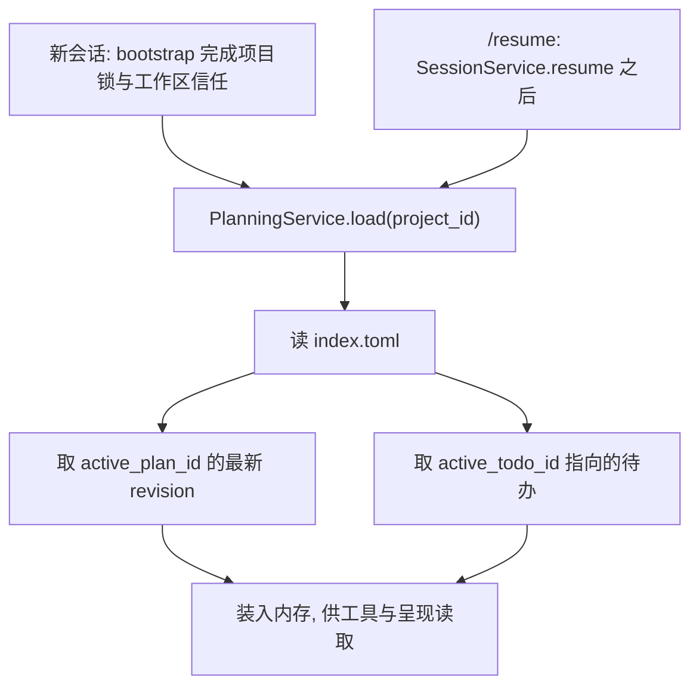

# ADR-0022: 采用项目级持久化的计划与待办清单

## 状态

Accepted (2026-08-19 实现)

本 ADR 把"计划"从一个进程内的草稿变成项目级持久化状态, 并把"待办清单"确立为与计划并列
而非从属的第二个概念. 计划的人工评审与模式升档由 ADR-0023 单独决定, 本文只负责数据,
存储, 工具与会话加载.

## 日期

2026-08-17

## 背景

### 现状

`plan` 档在 ADR-0013 §1 里被定义为"只暴露 PlanTool 和只读工具", 实现之后它**只有这一件
事**: `application/tool_request/catalog_predicates.py::catalog_query_for_mode` 把带
`MUTATING_CAPABILITIES` 的 `ToolSpec` 从目录里过滤掉. 除此之外 plan 档与 accept_edits 档
没有任何行为差异.

唯一的计划载体 `plan.update` 是个死件:

- 计划状态挂在工具实例上 (`ToolStack.plan_tool`), 一个会话一个实例, 不落盘.
- 全仓库**零消费方**: 没有任何代码读 `plan_tool.steps`, 终端不渲染它, 没有 `/plan show`
  之类的查看入口, 也没有一行测试引用它. 它的输出只以普通工具结果文本流回模型.
- 它的入参形状是 `steps[{title, status}]`, 状态取值 `pending / in_progress / done /
  dropped` —— 这其实是一份**待办清单**, 却顶着"计划"的名字占着 `PLAN_ONLY` 能力.

`docs/02-detailed-design.md` §3.4 早在详细设计阶段就规划过 `Plan` / `PlanStep` /
`Session.active_plan_id` 以及 `plan_created` / `plan_updated` 事件, 一直没有实现.
`docs/SYNC-TO-MAIN.md` 的"代码里已知未实现的"一节明确记着: "**plan 档的计划评审
(补充 / 拒绝 / 同意 / 同意并执行) 从未实现.**"

待办清单则完全不存在. 全仓库检索 `todo` / `待办` / `任务列表`, 除上述 `plan.update` 的
docstring 之外没有第二处.

### 三个促成决策的观察

**其一: 计划的价值在跨会话, 而当前实现连跨 turn 都不保证.**
`plan.update` 的 docstring 把不落盘写成了刻意选择: "落盘就得回答 resume 时该不该恢复一份
可能已经过时的计划, 而它本来就该由模型重新说一遍." 这个理由在计划只是"本轮草稿"时成立,
但真实任务往往跨若干个会话. 让模型"重新说一遍"的结果是它每次说的都不一样 —— 而人已经
在上一次会话里对某一版点过头了. 过时的计划是个可以用状态和 revision 表达的问题, 不是
放弃持久化的理由.

**其二: 执行漂移的根因是"当前该做哪一步"只存在于对话历史里.**
长任务的步骤信息随对话增长被稀释, 模型开始重复做完的事, 或跳过没做的事. 需要的是一份
**小而准, 每轮都对齐**的执行状态 —— 它必须小到可以每轮重述, 准到能被单点修正. 计划正文
不满足这两条: 它大, 而且批准之后不该随手改.

**其三: 把方向和状态放进同一张表, "以谁为准"无解.**
这正是 `plan.update` 的形状: 步骤既是方向也带状态. 人批准的是方向, 模型改的是状态, 两者
共用一份数据, 于是"批准过的计划"和"改了三轮的执行状态"无法区分, 也就无法回答"现在做的
事还是当初批的那件事吗".

## 决策

ForgeCLI 采用"项目级持久化, 计划与待办分离, 专用工具读写"的计划机制.

### 1. 计划与待办是项目级持久化状态, 不是会话内存态

落盘位置:

```text
~/.forge/projects/<project_id>/plans/
```

与学习规则 (`~/.forge/state/rules/<workspace_id>.toml`) 同级同性质: 项目范围, 跨会话,
不随会话销毁, 不随进程退出丢失.

### 2. 计划与待办是两个概念, 不是一个东西的两种视图

| | 计划 | 待办清单 |
| --- | --- | --- |
| 回答的问题 | 整个大方向 | 当前该做哪一步 |
| 谁裁决 | 人 (ADR-0023) | 无需裁决 |
| 批准之后 | 不再随执行变动, 要变就是新 revision | 允许随时纠正 |
| 粒度 | 目标 / 背景 / 方案 / 步骤骨架 / 风险 / 验收 | 一行一步, 带状态 |
| 大小 | 大, 按需查阅 | 小, 每轮对齐 |
| 生命周期 | 一份计划可跨多个会话 | 跟随当前工作 |

这条区分是本 ADR 的核心. 它直接对应观察其三: 方向与状态分表之后, "以谁为准"不再是问题
—— 方向以最近一次被批准的 revision 为准, 状态以待办清单为准.

### 3. 计划内含待办结构

计划模板的"步骤"小节就是待办清单的骨架: **一条计划步骤对应一条待办项**. 批准一份计划
等于用它的步骤播种待办清单, 首项置 `in_progress`, 其余 `pending`.

这条让"计划 -> 执行"之间不需要人再翻译一次, 也让"批准的方向"与"正在执行的步骤"在第一
时刻是对齐的. 之后待办可以被纠正而计划不变, 两者的差异本身就是有用的信息.

### 4. 待办不必绑定计划

Forge 可以直接从一段需求描述建立待办清单, 不经过计划与评审 —— 这是绝大多数中等任务的
路径. `TodoList.plan_id` 因此可空.

**简单任务不建待办.** 建议界线: 预期步骤 ≥ 3 步, 或改动跨 ≥ 2 个文件. 这条界线靠系统
提示词与工具 description 传达, 属**建议而非强制**: 强制会让"改个错别字"也先列三条待办,
那是噪音而不是纪律.

三种组合都是合法的:

| 组合 | 场景 |
| --- | --- |
| 有计划 + 有待办 | 大任务, 经过评审 |
| 无计划 + 有待办 | 中等任务, 直接开工但需要防漂移 |
| 无计划 + 无待办 | 简单任务 |

"有计划 + 无待办"只在计划刚提交尚未批准时短暂存在.

### 5. 计划与待办的读写由专用工具完成, 且不经过审批

五个工具, 全部声明 `Capability.PLAN_ONLY`, `TargetDeclarationAbility.STATIC`:

| 工具 | 作用 |
| --- | --- |
| `plan.read` | 读当前生效计划正文, 或按 `plan_id` 读指定一份 |
| `plan.write` | 提交一份新计划或已有计划的新 revision |
| `todo.read` | 读当前待办清单 |
| `todo.write` | 整表替换 (内容纠错) |
| `todo.set_status` | 改一项或多项的状态 (执行状态更新) |

**"不经审批"的论证.** 这一条最容易被读成"给计划开了后门", 因此理由必须写足:

- **表层原因**: `PLAN_ONLY` 在四档模式预算里都自动放行 (`domain/security/modes.py` 的
  `_PLAN` 集合是所有更高档位的子集), `PolicyEngine` 另有 `PLAN_ONLY_FAST_PATH`. 所以
  "不经 ASK"不是为本 ADR 新开的特例, 是既有规则的自然结果.
- **真正的原因**: 这五个工具的**目标集合在机制上是封闭的**. 它们的 `input_schema` 里
  **没有路径字段** —— 写入位置由 Forge 从 `project_id` 与 `plan_id` 算出来
  (`plans_dir(project_id) / <plan_id> / r<n>.toml`), 模型无法指定写到哪里. 没有可由模型
  影响的目标, 就没有可裁决的内容. 对照 `fs.write_patch`: 它的路径来自模型, 所以必须逐次
  裁决. **是"模型能不能选目标"决定要不要审批, 不是"这件事重不重要".**
- **顺带回答"为什么不直接用 `fs.read_file` / `fs.write_patch` 读写计划文件"**: 计划目录
  在任何工作区根之外, 那条路会落 `EXTERNAL_READ` / `EXTERNAL_WRITE` 从而逐次 ASK, 体验
  很差; 但更要紧的是它把 `~/.forge` 下的**任意位置**暴露给一个由模型填写的路径参数.
  专用工具是**更窄**的通道, 不是更宽的.
- **边界**: 不经审批 ≠ 不记审计. 五个工具照常经 `ToolRequestCoordinator`, 照常写
  `tool_requested` / `tool_completed`, 照常受 `ToolRuntime` 的 spec 上界与授权信封校验.
  少的只是 ASK 那一步.

### 6. 待办有两类更新, 分成两个动作

- **内容纠错** = `todo.write`, 整表替换. 模型发现步骤拆错了, 顺序不对, 或需要增删时,
  直接重写整张表. 这是"执行时可自动纠正"的机制: 不需要一套增量编辑 API, 重写整表足以
  表达任何内容变更.
- **执行状态更新** = `todo.set_status`, 只收 `{index, status}` 列表.

**分开的理由是失误代价不同.** 打勾是全流程最高频的操作; 用整表替换去打一个勾, 模型少抄
一行就静默丢掉一个步骤, 而这种丢失没有任何一层会报错. 状态更新的入参小, 出错面窄, 而且
它不可能改变步骤集合 —— 这一点由 schema 保证, 不靠模型自觉.

### 7. 同一时刻最多一条 `in_progress`

放在 `TodoList` 的构造校验里, 任何调用方绕不过去. 违反时工具返回
`PreparationError(INVALID_INPUT)` 并给出可操作的消息.

这是防漂移的核心不变量: 允许多条并行等于没有"当前步骤", 而"当前步骤"正是这份清单存在的
理由.

### 8. 真相源边界: 项目级状态不在 `events.jsonl` 的重建职责内

计划与待办的**内容**真相源是 `plans/` 目录下的文件. 会话事件只记录**引用与裁决**
(谁在什么时候提了哪一版, 人怎么裁的), 用于审计, 不用于重建.

这不违背 ADR-0001. ADR-0001 说的是**会话状态**的真相源是 `events.jsonl`, `state.json` 是
可重建的派生快照. 计划是**项目级**状态, 与会话生命周期不同 —— 一份计划可能跨三个会话,
而每个会话有自己的 `events.jsonl`. 把项目级状态塞进某一个会话的事件流, 会让"在会话 B 里
读会话 A 提的计划"变成跨文件重放.

既有先例是 `TomlLearnedRuleStore`: 学习规则同样是项目级, 同样按项目单独存储, 同样不进
`events.jsonl`. 本决策沿用同一条边界, 并在 ADR-0001 里把这条一直隐含的边界补写清楚.

### 9. 计划格式由模板决定, 不由模型决定

固定小节与顺序, 模型只填结构化字段, Forge 负责渲染. 模板带版本号, 改模板必须升版本.
详见设计细节 §3.

## 备选方案

### 方案 A: 计划落在会话目录

`sessions/<session_id>/plans/`. 实现最省事, 与现有会话存储对齐. 但跨会话就丢, 而计划的
价值恰恰在跨会话 —— 一个需要计划的任务多半做不完一个会话. 不采用.

### 方案 B: 计划落在工作区

`<workspace>/.forge/plans/`. 好处很实在: 可提交进 git 与团队共享, 用户可直接编辑,
模型能用 `fs.read_file` 直接读 (`WORKSPACE_READ` 四档都自动放行, 连专用读工具都省了).

不采用的理由有两条. 其一, 仓库当前**没有**工作区内 `.forge/` 这个惯例 —— ADR-0008 把
项目配置放在 `~/.forge/projects/<id>/forge.toml`, 工作区里是干净的, 新开一个目录惯例
需要连带回答 `.gitignore` 默认值, 多根工作区下放哪个根, 以及只读工作区怎么办. 其二,
它与 `infrastructure/config/paths.py::state_dir()` 已经写下的理由冲突: "工具产物落在
工作区会污染用户仓库, 还会被下一轮 Agent 当成项目内容读回上下文."

保留为后续 `/plan export` 的入口: 导出是用户显式动作, 与自动落盘不是一回事.

### 方案 C: 只做待办, 不做计划

待办确实覆盖了大部分执行期需求, 而且不需要评审流程, 落地成本低得多. 但 plan 档就仍然
只是个能力门, 大任务开工前的方向确认没有着落 —— 而"先对齐方向再动手"正是 plan 档存在的
理由. 不采用.

### 方案 D: 计划与待办合并成一个带状态的步骤表

即今天 `plan.update` 的形状. 这正是当前设计失败的地方, 见观察其三. 不采用.

### 方案 E: 用 `fs.*` 通用工具读写计划文件, 不新增专用工具

少五个工具, 少一层抽象. 但它把一个由 Forge 完全掌握的封闭目标集合, 换成一个由模型填写的
自由路径参数 —— 方向反了. 见决策 5 的论证. 不采用.

## 影响

### 收益

- 计划跨会话存活, `/resume` 之后人和模型看到的是同一份, 不需要模型重说.
- 待办清单每轮对齐, 长任务的执行漂移有了可测量, 可纠正的着力点.
- 方向与状态分离, "现在做的还是当初批的那件事吗"这个问题可回答.
- 计划格式固定, 不同任务, 不同模型产出的计划可比较, 也可以做快照测试.
- 五个工具都在 `PLAN_ONLY` 上界内, 不新增能力词汇, 不动安全模块.

### 代价

- 新增一套项目级存储 (目录布局, TOML 读写, 索引维护), 以及它的损坏与降级处理.
- 待办的每轮注入占用上下文预算; 清单越长占得越多, 需要一个长度上限.
- 计划可能过时. 本 ADR 用 `status` 与 `revision` 表达, 但判断"这份计划还作数吗"最终仍
  依赖人.
- 五个工具意味着五份 schema, 五份测试; 相比一个 `plan.update` 是明显的增量.

### 兼容性

- `plan.update` 被删除. 它零消费方零测试, 删除不影响任何现有行为.
- 不新增 `Capability`, 不升 `CAPABILITY_VOCABULARY_VERSION`, 因此不使学习规则与风险缓存
  失效.
- `SessionSnapshot` 不新增字段, `state.json` 的 `schema_version` 不变.
- 新增三个 `EventType`. `SessionEvent.from_dict` 用 `EventType(str)` 构造, 旧版本读到新
  事件会抛 `ValueError` —— 但方向是新代码读旧文件, 不是反过来, 因此不构成实际兼容问题.
- 首次运行时 `plans/` 目录不存在, 视为"没有计划", 不报错.

## 设计细节

## 1. 目标与非目标

### 1.1 目标

- 让计划成为可持久化, 可查阅, 可跨会话引用的项目级产物.
- 让待办清单成为执行期的防漂移机制, 且可被模型随时纠正.
- 让计划与待办的读写有一条窄到不需要审批的通道.
- 让新会话与 `/resume` 都能确定地加载"当前生效的计划与待办".
- 保持工具系统与安全模块的解耦 (ADR-0004 §2).

### 1.2 非目标

- 不保证模型产出的计划质量, 也不做计划内容的自动校验.
- 不做多计划之间的依赖图, 父子计划或计划模板库.
- 不做团队共享与跨机器同步 (那需要工作区内落盘, 见备选 B).
- 不校验计划与实际代码变更的一致性.
- 不做待办的自动完成判定 —— 状态由模型显式更新, 系统只保证不变量.
- 不在本 ADR 决定评审流程与模式升档, 那是 ADR-0023.

## 2. 目录布局

```text
~/.forge/projects/<project_id>/plans/
  index.toml                    # 活动指针与索引
  <plan_id>/
    r1.toml                     # 结构化正文, 权威
    r1.md                       # 按模板渲染, 人读, 派生
    r2.toml
    r2.md
  todo/
    current.toml                # 当前生效待办
    archive/
      <todo_id>.toml            # 换用新清单时归档旧的
```

### 2.1 两种格式的分工

**TOML 是权威格式, Markdown 是派生物.** 每次 `plan.write` 先写 `r<n>.toml`, 再由模板渲染
出 `r<n>.md`. 单向, 不反向解析.

选 TOML 是沿用既有惯例 (`config.toml`, `llm.toml`, `forge.toml`, 学习规则文件), 不引入
新格式. 保留 Markdown 是因为人要读它, 而让人读一份 TOML 是不必要的刁难; 让程序解析
Markdown 则会把模板变成一门需要 parser 的语言.

`plan.read` 返回的是**渲染后的 Markdown 正文** —— 那是模型该看到的形态, 也与人看到的
完全一致. TOML 只供 Forge 自己读写.

### 2.2 `index.toml`

```toml
schema_version = 1
active_plan_id = "pl_7k2m"
active_todo_id = "td_3x9p"

[[plans]]
plan_id = "pl_7k2m"
revision = 2
status = "approved"
title = "拆分 domain 值域对象"
template_version = 1
created_at = "2026-08-17T10:12:33+08:00"
updated_at = "2026-08-17T14:05:11+08:00"
```

- `plan_id` 用稳定短 id, **不由标题派生** —— 标题会改, 而 id 是文件名的一部分.
- `active_plan_id` / `active_todo_id` 可为空字符串, 表示当前没有活动计划或待办.
- 索引里只有摘要. 正文在各自的文件里, 不在索引里重复一份.

### 2.3 并发

项目级 `ProcessLock` (`infrastructure/project/`) 已保证同一项目同时只有一个 Forge 进程,
因此不设文件锁. 这一条要在实现的模块 docstring 里写明, 免得后来的人以为漏了.

写入本身仍用"先写同目录临时文件再 rename"的原子写, 与 `tool_wiring.py::_write_file` 一致
—— 防的是崩溃, 不是并发.

## 3. 计划模板

### 3.1 固定小节

```text
# <title>

## 目标

<goal>

## 现状与背景

<context>

## 方案

<approach>

## 步骤

1. <step.title>
   <step.detail>
2. ...

## 风险

- <risk>

## 实现记录 (2026-08-19)

三处与本文的偏差, 都记在这里以免读设计的人拿它去对代码时对不上.

**其一, §5.4 已按修订走块, 不走注入消息.** 正文里那条修订说明已经写明; 实现落的是
`PromptBlockId.PLAN_STATE` 与 `TODO_STATE`, `MAIN_AGENT_PROMPT_VERSION` 由 2 升到 3.

**其二, 待办整表替换会重置全部状态.** §决策 6 只说"整表替换", 没说状态怎么办. 实现选择
一律重置为 `pending`: 保留状态需要把新旧两张表按标题配对, 而标题恰恰是这次要改的东西.
想改状态的路径是 `todo.set_status`, 那正是决策 6 把两件事分开的理由.

**其三, `todo.set_status` 把某项改成 `in_progress` 时, 原来那条自动降回 `pending`.**
按 §决策 7 的字面意思应当直接拒绝. 实现选择自动让位: 模型想表达的意思非常明确, 逼它分
两步说只会多跑一轮, 而不变量 (最多一条 in_progress) 仍然由 `TodoList` 的构造校验保证 ——
守住的是不变量, 不是"这次调用必须失败".

另外补了一条 §6 没写的事件字段: `PLAN_REVIEWED` 带 `upgraded_mode`. 升档是权限规则变更,
审计必须答得出"这次批准有没有改档".

## 验收标准

- <acceptance>
```

顺序不可变. 空小节保留标题, 正文写 `(无)` —— 不因为某节为空就删掉标题, 那会让不同计划的
结构不一致, 也会让人误以为模板变了.

"步骤"小节就是待办骨架 (决策 3): 编号列表, 一条一项.

### 3.2 模型只填字段, 不产出格式

`plan.write` 的 `input_schema`:

```text
required: title, goal, context, approach, steps, risks, acceptance
steps:   array of { title (required), detail }
risks:   array of string        # 允许空数组, 但必须给出这个键
acceptance: array of string
```

把 `risks` 也列进 `required` 而允许空数组, 是为了强制模型**表态**: 给空数组表示"想过了,
没有"; 不给这个键则说明它根本没考虑. 两者不该无法区分.

**"格式随意发挥"因此在入参层面就不可表达** —— 模型给字段, Forge 给格式. 这也是模板存在
的全部意义: 不是为了好看, 而是让计划可比较, 可测试, 可以在不同模型之间保持一致.

### 3.3 版本

`PLAN_TEMPLATE_VERSION` 从 1 起, 进文件头与 `index.toml`. 改模板文本必须升版本并更新
快照测试. 读到比当前更高的版本时按 §10 降级处理.

## 4. 数据模型

```text
PlanDocument
  plan_id                # 稳定短 id
  revision               # 从 1 起, 同一 plan_id 内递增
  title
  goal
  context
  approach
  steps[PlanStep]        # 1..20
  risks[str]
  acceptance[str]
  status                 # PlanStatus
  template_version
  created_at / updated_at

PlanStep
  title                  # 非空
  detail                 # 可空

PlanStatus
  proposed | approved | rejected | superseded

TodoList
  todo_id
  plan_id?               # 可空: 待办不必绑定计划 (决策 4)
  items[TodoItem]        # 0..50
  revision               # 每次写入递增
  updated_at

TodoItem
  title                  # 非空
  status                 # TodoStatus

TodoStatus
  pending | in_progress | done | dropped
```

不变量:

- `PlanDocument`: `title` / `goal` 非空; `steps` 至少一项, 至多 20 项.
- `TodoList`: **至多一条 `in_progress`** (决策 7); 至多 50 项.
- 全部 frozen, 状态推进用 `dataclasses.replace` 产生新值, 与 `SessionSnapshot` 一致.

### 4.1 `PlanStep` 不带 status —— 与详细设计的第一处偏离

`docs/02-detailed-design.md` §3.4 给 `PlanStep` 定义了 `status`
(`pending/in_progress/completed/blocked/skipped`), `requires_approval`, `expected_output`,
`evidence` 四个字段. 本 ADR **不采用 `status`**.

理由见决策 2 与观察其三: 状态跟踪整体归待办清单. 两边都挂 status 会立刻产生"以谁为准"
的问题, 而这正是 `plan.update` 失败的方式. `requires_approval` 同样不采用 —— 审批是逐次
工具调用的事 (ADR-0004 §6.1), 不是计划步骤的属性; 一条计划步骤可能展开成十次工具调用,
每次各自裁决.

`expected_output` 与 `evidence` 本版不实现, 不预留空字段.

## 5. 会话如何加载当前生效的计划与待办

这一节是决策 1 与 8 的兑现.

### 5.1 加载时机



两条路径共用同一个入口. 加载在**任何模型调用之前**完成.

### 5.2 加载语义

1. **加载内容**: `index.toml` 的 `active_plan_id` 指向的计划的最新 revision, 以及
   `active_todo_id` 指向的待办清单.
2. **加载是只读的**: 打开一个会话不会把 `proposed` 的计划变成 `approved`, 也不会重置
   待办状态. 状态只由工具调用与人的裁决 (ADR-0023) 改变.
3. **失败不阻塞启动**: 目录不存在, `index.toml` 缺失或损坏, 指向的文件读不到 —— 一律
   视为"没有计划", 打一条诊断, 会话正常开始. 见 §10.

### 5.3 呈现给用户

启动横幅之下加一行, 无内容时整行不显示:

```text
计划: 拆分 domain 值域对象 (已批准, 5 步)  |  待办: 2/5 完成
```

配套斜杠命令:

| 命令 | 作用 |
| --- | --- |
| `/plan show` | 打印当前计划正文与文件路径 |
| `/plan list` | 列出本项目全部计划及其状态 |
| `/plan use <id>` | 切换活动计划 |
| `/todo` | 打印当前待办清单 |

注意 `/plan` 裸命令的现有语义是**切换到 plan 档**, 保持不变; 上面三个是它的子命令.
归档不删文件.

### 5.4 呈现给模型: 两条通道分开

这是本节最关键的设计决定.

**待办每轮进系统提示词的 `todo_state` 块** (ADR-0018 §3.1 的条件性块, 阶段 5). 内容是
清单正文加一句"如与实际不符, 用 `todo.write` 重写整表", 本轮尚未完成的项单独点名.

- 它是每轮现算的运行事实, 因此 `cacheable=False`, 排在 ADR-0018 的缓存断点之后.
- **提示词不进 transcript, 不写任何会话事件.** 这一条由 ADR-0018 §10.1 保证, 于是
  "`/resume` 时读回一串互相矛盾的过期清单"这个问题从机制上不存在.
- 清单为空时整块不渲染, 不产生一个写着"(无)"的空标题.

**计划正文不进块.** `plan_state` 块里只放一行引用 (`plan_id`, 标题, 状态, 步数), 正文由
模型用 `plan.read` 取.

两条通道不同的理由就是 ADR-0018 §4.4 那两条判据: **清单小且每轮都要对齐, 所以进提示词;
计划正文大且按需查阅, 所以走工具.**

> 早先本节写的是"注入到 `ContextPackage.messages` 的一条运行通知". 那是 ADR-0018 尚未
> 实现时的过渡方案 —— 当时没有提示词可用. ADR-0018 于 2026-08-17 落地后改为块, 结构上
> 更正确: 待办本来就是运行事实, 而不是一句伪装成用户发言的消息.

### 5.5 陈旧计划

`index.toml` 记 `updated_at`. 活动计划长期未更新时, 加载后**只提示不自动清除**:

```text
计划: 拆分 domain 值域对象 (已批准, 5 步, 12 天未更新)
```

清除或换用是用户的决定. 系统自动作废一份人批准过的计划, 比留着一份旧计划更糟.

### 5.6 跨会话一致性

项目级 `ProcessLock` 保证同一项目同时只有一个 Forge 进程 (§2.3), 因此不存在两个会话
同时改同一份计划的情况. 前后两个会话之间通过 `index.toml` 交接.

## 6. 会话事件: 审计, 非重建

新增三个 `EventType`, 对齐 `docs/02-detailed-design.md` §3.4 预留的 `plan_created` /
`plan_updated`:

| 事件 | payload |
| --- | --- |
| `PLAN_CREATED` | `plan_id`, `revision`, `template_version`, `title`, `step_count`, `file` (相对 `plans/` 的路径) |
| `PLAN_REVIEWED` | `plan_id`, `revision`, `decision`, `amendment` (仅"补充"时) |
| `TODO_UPDATED` | `todo_id`, `plan_id?`, `revision`, `kind` (`content` / `status`), `done`, `total` |

**payload 只记摘要与引用, 不记正文.** 正文的真相源是 `plans/` 下的文件; 复制一份进事件流
就有了两个会漂移的副本, 而事件流是 append-only 的, 漂移之后无法修正.

同一 `plan_id` 的新 revision 写一条新的 `PLAN_CREATED` —— 不用 `PLAN_UPDATED`, 因为
`PlanDocument` 是 frozen 的, 每个 revision 都是一份新文档.

### 6.1 `SessionSnapshot` 不加 `active_plan_id` —— 与详细设计的第二处偏离

`docs/02-detailed-design.md` §3.4 把 `active_plan_id` 放在 `Session` 上. 本 ADR 把它放在
项目级 `index.toml` 里.

理由: 计划跨会话, 指针应当跟着**项目**走而不是跟着**会话**走. 放在 `SessionSnapshot` 上
会导致新会话默认没有活动计划, 而"上次那份计划"是用户开新会话时最想要的东西. 同时它也
避免了一个尴尬: `SessionSnapshot.mode` 因为无法从事件重建而刻意不落盘, 若再加一个能落盘
的 `active_plan_id`, 同一个类里就有了两种不同的持久化语义.

## 7. 运行事件与终端呈现

新增两个 `AgentRunEventKind`: `PLAN_PROPOSED` 与 `TODO_UPDATED`, 各配一个 frozen payload
类 (`PlanProposedPayload(title, step_count, steps)`,
`TodoUpdatedPayload(items, done, total)`) —— ADR-0016 的硬约束禁止自由 dict.

**发事件的是 `AgentTurnService`**, 不是工具也不是 `ToolRequestCoordinator`: 它在
`_run_tool` 前后比对 `PlanningService` 的 revision, 变了就发. 它本来就独家持有 `turn_id`
且是唯一的驱动方, 这样做零工具名耦合 —— 换成协调器发, 就得让协调器认识
"`plan.write` 这个名字意味着要发 `PLAN_PROPOSED`".

`TerminalRunRenderer` 保持纯订阅者, **不读 `PlanningService`**. 拉状态会破坏 ADR-0016
"事件是观察"的定位.

## 8. 分层归属

```text
domain/planning/
  plan.py                       # PlanDocument / PlanStep / PlanStatus
  todo.py                       # TodoList / TodoItem / TodoStatus

application/planning/
  planning_service.py           # 加载, 读写, 播种, 状态迁移
  plan_template.py              # PLAN_TEMPLATE_VERSION 与渲染
  plan_store.py                 # 存储抽象 (ABC)

infrastructure/planning/
  fs_plan_store.py              # TOML + Markdown 落盘

application/tools/builtin/
  plan_read.py / plan_write.py
  todo_read.py / todo_write.py / todo_set_status.py
```

约束:

- `domain/planning` 不引入 `Path`, TOML 库或任何 I/O.
- 渲染规则属 application, 文件读写属 infrastructure.
- `interfaces/cli` 只在组合根装配, 不持有计划业务文本.

`scripts/check_arch.py` 的 `SIBLING_BANS` 只禁 `application.tools` 与
`application.security` 互相可见, 以及 `application.manual_shell` 与工具/安全三者互相可见.
`application.planning` 两组都不在, **因此不需要改架构检查** —— 它是状态不是策略, 加一条
禁令反而是错的.

## 9. 安全边界

本决策**没有**动的东西, 逐条点名, 作为 ADR-0004 §2 解耦仍然成立的证据:

- 无 `Capability` 新增, 无 `CAPABILITY_VOCABULARY_VERSION` 升版.
- 无 `domain/security/modes.py` 改动 —— 五个工具落在既有的 `_PLAN` 预算里.
- 无分析器新增或修改, `application/security/wiring.py` 不变.
- 无 `scripts/check_arch.py` 规则变更.
- 无 `ProtectedPathPolicy` 变更.

补充说明两条边界:

**计划目录既不受保护, 也够不到.** `~/.forge/projects/<id>/plans/` 不进
`ProtectedPathPolicy` 的受保护根 (它不是凭证, 不是系统目录, 也不是 Forge 运行时代码),
但它也不在任何工作区根内, 因此 `fs.*` 工具对它的访问会落 `EXTERNAL_READ` /
`EXTERNAL_WRITE` 从而需要用户确认. 这正是决策 5 想要的隔离: 计划只能经专用工具改, 而
专用工具改不了别的地方.

**提示词不是权限边界.** 决策 4 的"简单任务不建待办"是建议; 模型不遵守的后果是噪音, 不是
越权. 真正的权限仍由目录能力门, `PolicyEngine`, `ApprovalService` 与 `ToolRuntime` 强制.

## 10. 错误与降级

| 情况 | 处理 |
| --- | --- |
| `plans/` 目录不存在 | 视为没有计划, 首次写入时创建, 不报错 |
| `index.toml` 缺失 | 视为没有计划; 扫描 `plans/` 下已有目录重建一份最小索引, 活动指针留空 |
| `index.toml` 解析失败 | 视为没有计划, 打诊断并把损坏文件改名为 `index.toml.broken`, 不静默覆盖 |
| `active_plan_id` 指向的文件缺失 | 活动指针置空, 打诊断, 其余计划仍可列出 |
| 计划 TOML 解析失败 | 该份计划标为不可读, `/plan list` 里显式显示, 不影响其它计划 |
| `template_version` 高于当前实现 | 拒绝渲染该份计划, 提示升级 Forge; 不按旧模板猜着渲染 |
| 磁盘不可写 | `plan.write` / `todo.*` 返回 `ToolResult(TOOL_ERROR)` 并说明原因; 不阻塞会话其余部分 |
| 待办项数超上限 | `PreparationError(INVALID_INPUT)`, 提示拆分或归档 |

统一原则: **计划与待办不可用时不阻塞主流程**, 降级成"没有计划", 打诊断. 它是辅助机制,
不是运行前提.

## 11. 已知限制

- 计划不跨机器同步, 不做团队共享. 需要共享时用后续的 `/plan export`.
- 待办的准确性依赖模型自觉更新. 不变量只保证"至多一条 `in_progress`", 保证不了"标了
  `done` 就真的做完了" —— 系统没有验证一个步骤是否完成的手段.
- 计划与实际代码变更之间没有一致性校验. 一份批准过的计划不阻止模型做计划外的事; 那由
  逐次工具裁决与人的观察负责.
- 每轮注入待办会占用上下文预算. 50 项上限是个粗糙的保护, 真正的预算管理要等
  `ContextManager` 落地.
- 单进程假设来自 `ProcessLock`. 如果将来允许同一项目多进程, 本设计需要补文件锁.

## 验收标准

- ADR 已同步到 `docs/adr/README.md` 与 `docs/README.md` 索引.
- 计划与待办跨 `/resume` 与跨会话可加载, 内容与退出前一致.
- 五个工具在四档模式下都不触发 ASK; 它们的 `input_schema` 里没有路径字段, 有用例断言
  这一点.
- 一个项目下可同时存在多份计划, 活动指针可切换, `/plan list` 全部可见.
- 待办可以在没有任何计划的情况下独立建立并正常工作.
- `events.jsonl` 里只有引用与摘要, 没有计划正文 —— 有用例断言.
- 计划 `.md` 的小节与顺序由模板固定, 任何模型输入都无法改变它; 模板有精确快照测试, 文本
  变更必须同时升 `PLAN_TEMPLATE_VERSION`.
- `TodoList` 的单 `in_progress` 不变量在领域层强制, 工具层转成可操作的错误消息.
- `index.toml` 缺失, 损坏, 指向失效三种情况下会话都能正常启动.
- `make ci` 通过, 架构检查无新增豁免.

## 关联文档

- `docs/02-detailed-design.md` §3.4: Plan / PlanStep 原始设计, 本 ADR 记录两处偏离.
- `docs/adr/2026-06-17-0001-采用jsonl-state作为本地会话存储.md`: 真相源范围.
- `docs/adr/2026-06-17-0004-将工具系统作为一等运行时.md`: 工具契约与能力解耦.
- `docs/adr/2026-06-23-0008-区分应用配置与项目配置存储.md`: 项目级存储位置.
- `docs/adr/2026-07-29-0013-采用分层Shell命令安全控制架构.md` §1: plan 档工具目录.
- `docs/adr/2026-08-03-0016-采用统一Agent运行事件流驱动终端过程展示.md`: 运行事件.
- `docs/adr/2026-08-07-0018-采用分层且按Turn冻结的系统提示词编译机制.md`: 待办注入与
  提示词的边界.
- `docs/adr/2026-08-17-0023-采用回合边界的计划评审与模式升档.md`: 本 ADR 的评审配套决策.
