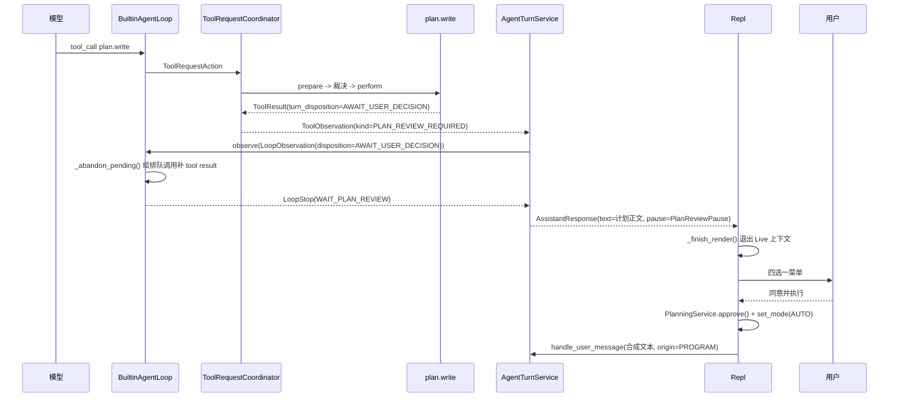

# ADR-0023: 采用回合边界的计划评审与模式升档

## 状态

Accepted (2026-08-19 实现)

本 ADR 决定"一份计划如何得到人的裁决", 以及"同意并执行"这一动作对会话模式的影响. 计划与
待办的数据模型, 存储与工具由 ADR-0022 决定, 本文只在其上加人机交互与权限规则.

## 日期

2026-08-17

## 背景

### 现状

ADR-0013 §1 把 plan 档定义为"只暴露 PlanTool 和只读工具", 实现之后 plan 档确实收窄了工具
目录, 但**没有出口**: 模型在 plan 档里想清楚了方向, 没有任何机制把这份方向交给人确认,
也没有任何机制让确认过的方向变成可以动手的状态. 用户只能自己读完模型的输出, 手动敲
`/accept-edits`, 再用自然语言复述一遍"就按你说的做".

`docs/SYNC-TO-MAIN.md` 的"代码里已知未实现的"一节把这件事记为明确缺口:
"**plan 档的计划评审 (补充 / 拒绝 / 同意 / 同意并执行) 从未实现.**"

ADR-0022 让计划成为可持久化的项目级产物, 但那之后立刻出现一个新问题: **一份没人批准过的
计划和一份批准过的计划, 在系统里没有任何区别.** `PlanStatus` 有 `proposed` 与 `approved`
两个取值, 却没有任何东西能让它从前者变成后者.

### 为什么不能直接复用现有的 HITL

`ApprovalService` 是现成的人机交互入口, 但它的形状是**逐次工具调用的授权**:

- 按 ADR-0004 §6.1, 人的批准**不等于授权**. 批准之后必须重新 `prepare` -> 分析 -> 裁决,
  并重验约十五项绑定事实 (`ApprovalBinding`, `approval_presentation_hash`,
  `execution_profile_hash` ...), 然后才签发 `ExecutionAuthorization`.
- 它只有"批准 / 拒绝 / 未决"三态 (`ApprovalOutcome`).

计划评审没有待授权的调用, 不签发授权, 没有需要重验的执行环境, 而且需要四个选项 —— 其中
"补充"这一项要把人的文字带回给模型, 这在审批的语义里无法表达.

### 循环需要一个"停下来等人"的出口, 而它不该认识工具名

`BuiltinAgentLoop` 今天的两个停止路径都不合用:

- `_close_tools` 是"工具没了但继续说": 它清空目录, 注入一条 USER 通知, 然后**继续调模型**
  逼出最终回答. 计划评审要的是**立刻停下**.
- 直接返回 `LoopStop` 需要一个理由, 而 `LoopStopReason` 的现有取值里没有一个表达"等人对
  一份产出做方向裁决".

同时, ADR-0010 的核心不变量是"`AgentLoop` 只产出 `LoopDecision` / `LoopAction` /
`LoopStop`, 不执行任何副作用". 循环不能弹菜单, 也不该知道 `plan.write` 这个名字 —— 否则
每加一个需要人裁决的工具就要改一次主循环.

## 决策

ForgeCLI 采用"工具声明, 循环分流, CLI 交互"的回合边界评审机制.

### 1. 工具可以声明"本次输出需要人裁决", 循环据此在回合边界停下

链条如下, 每一环都只看字段, 不看名字:

```text
ToolResult.turn_disposition = AWAIT_USER_DECISION       工具声明
  -> ObservationKind.PLAN_REVIEW_REQUIRED               协调器按字段置 kind
  -> ObservationDisposition.AWAIT_USER_DECISION         循环的既有分流字段
  -> LoopStopReason.WAIT_PLAN_REVIEW (RESUMABLE_PAUSE)  循环出口
  -> AssistantResponse.pause                            交给 CLI
```

选 `ObservationDisposition` 这条缝, 是因为它的现有 docstring 已经把职责写死了: "循环靠
这个字段分流, 而不是去读 content 里的文字." 沿用它, `BuiltinAgentLoop` 就不需要出现
`plan.write` 这个字符串, 而机制对将来的 `ask_user` 一类工具同样成立.

**`turn_disposition` 只能缩短一次 turn, 不能延长, 不能授予能力.** 这条要写进字段的
docstring: 失效方向朝安全, 因此将来一个行为不端的 MCP 工具把它置上, 后果是多问一次人,
不是绕过任何检查.

### 2. 评审不走 `ApprovalService`

理由见背景. 补充一条实现层面的界线: 计划评审**不产生 `ExecutionAuthorization`**, 不进
`RiskCache`, 不写 `learned rules`. 人同意一份计划, 不会让计划里提到的任何一条命令在下次
自动放行 —— 这一点在决策 4 里再次强调.

### 3. 四选一, 语义固定

| 选项 | 计划状态迁移 | 待办 | 是否起新一轮 |
| --- | --- | --- | --- |
| 补充 | `proposed` -> `superseded` | 不动 | 是, 以补充文字为输入 |
| 拒绝 | `proposed` -> `rejected` | 不动 | **否** |
| 同意 | `proposed` -> `approved` | 用步骤播种 | 否 |
| 同意并执行 | `proposed` -> `approved` | 用步骤播种 | 是, 以合成消息为输入 |

- **补充**: 读一行文字, 当前 revision 标 `superseded`, 把文字作为下一轮的用户输入, 模型
  据此提交 `revision + 1`. 计划的 `plan_id` 不变, 于是一次评审往返的历史留在同一份计划下.
- **拒绝**刻意不起新一轮: 花一次模型调用去说"不行"是浪费, 而且用户拒绝之后下一句话本来
  就该由他自己说 —— 这与 `_weigh` 对人类拒绝的既有处理逻辑一致 ("下一句话该由人说").
- **同意**不起新一轮, 是为了让用户可以先批准, 再决定什么时候开工.

### 4. "同意并执行"是一次前台 TTY 用户的显式模式升档, 只允许 `PLAN -> ACCEPT_EDITS`

> 2026-08-26 修订 (ADR-0038): 升档终点改为 `AUTO`. 下面第 1 条读作"等价于手敲 `/auto`",
> 第 3 条读作"绝不升到 `FULL_ACCESS`"; 第 2, 4 条与本节其余内容不变. 理由是 ADR-0030 用
> 围栏顶替能力预算表之后, `accept_edits` 与 `auto` 编译出同一道围栏与同一份工具目录 ——
> 这条约束当时挡住的是一组能力, 现在挡住的是一个标签.

这是本 ADR 需要独立成文的主要原因: 它是**权限规则变更**, 按
`docs/04-engineering-standards.md` 属必须走 RFC / ADR 的类别.

约束写死如下:

1. 等价于用户手敲 `/accept-edits`, 经 `SessionService.set_mode`, 不新增任何旁路.
2. **仅当当前档是 `PLAN` 时升档**. 在 `auto` 或 `full_access` 档批准一份计划不改变档位
   —— 既不升也不降.
3. **绝不升到 `AUTO` 或 `FULL_ACCESS`**, 无论计划正文里写了什么. 计划是模型产出的低信任
   文本, 不能成为提权的依据.
4. **批准计划不等于批准计划里的任何一次工具调用.** 升档之后, 计划里的每一步执行仍然逐次
   经过完整的裁决管线: 目录能力门 -> `prepare` -> 能力分析 -> `PolicyEngine` -> ASK /
   ALLOW / DENY -> 恢复屏障 -> `ExecutionAuthorization`. 升档只改变"哪些能力可以自动放行"
   这一档预算, 与在 plan 档手敲 `/accept-edits` 完全等价, 不多一分.

### 5. 评审的再入使用 `InputOrigin.PROGRAM`

"补充"与"同意并执行"都要用一段文字再起一轮. 这段文字由 CLI 合成, 直接调
`AgentTurnService.handle_user_message(..., origin=InputOrigin.PROGRAM)`, **不经过
`IntentRouter`**.

于是它永远不会被打上 `InputOrigin.TTY_USER`, 也就拿不到 ADR-0017 §2 描述的人工 Shell
特权 —— 那条特权来自输入来源, 而 `ManualShellIntent` 在构造函数里就强制 origin 必须是
`TTY_USER`. 绕回 `Repl._process_line` 才是 bug: 那里会把合成文本按 TTY 用户输入解析,
一段以 `#` 开头的计划补充说明就会变成一次不受裁决的 Shell.

`user_message` 事件的 payload 增加 `origin` 键, 于是审计里分得清"人敲的"和"UI 把人的点击
渲染成了文本". 这是**追加**一个键: 现有的 transcript 重建只读 `text`,
`SessionEvent.from_dict` 原样拷贝 payload, 不改事件类型, 不破 schema.

### 6. 评审链有上限

一次评审最多起一轮后续 turn, 而那一轮可能又停在评审. 链上限设 **3**, 到顶后回到提示符
并给出提示.

没有这条上限, 一个每轮都提计划的模型会造出一个无人输入的死循环: 提计划 -> 用户补充 ->
再提计划 -> 再补充. 每一环看起来都有人参与, 但用户实际上被困在菜单里.

### 7. 评审菜单必须在本轮的 Rich `Live` 上下文退出之后驱动

同一个 console 上两个 `Live` 会互相覆盖. `TerminalRunRenderer` 为审批场景专门做了挂起
(`_on_approval_requested` 暂停活动区, `_on_approval_resolved` 恢复), 因为审批发生在
**回合之中**.

计划评审发生在**回合之后**: `Repl._run_turn` 返回时 `stream_view.turn()` 上下文已经退出,
菜单可以安全地开自己的 `Live`, 不需要挂起. 但顺序不能反 —— 这条要写进实现约束, 因为
"在收到 pause 时立刻弹菜单"是很自然的写法, 而它恰好是错的.

### 8. 评审不是权限边界

即使模型完全不提计划就想动手, plan 档的目录能力门照常生效: 带
`MUTATING_CAPABILITIES` 的工具根本不进目录. 评审提高的是**方向对齐**, 不是安全.

反过来也成立: 一份被批准的计划不会让计划外的操作变得可行, 也不会让计划内的危险操作跳过
Hard Deny.

## 备选方案

### 方案 A: 复用 `ApprovalService`

形状不匹配, 见背景与决策 2. 另有一条决定性的: 审批只有批准 / 拒绝 / 未决三态, 撑不起
"补充"这个需要携带用户文字回到模型的选项. 强行塞进去会让 `ApprovalResponse` 长出一个只有
计划评审用得上的字段. 不采用.

### 方案 B: 用 `LoopHook`

`application/agent_loop/hooks.py::LoopHook` 是既有但从未被调用的扩展点, 定义了
`before_step` / `before_model` / `after_model` / `before_action` / `after_action`, ADR-0010
把它指定为"需要影响控制流"的扩展方式.

用它意味着循环在 hook 里同步等待人的输入, 与 ADR-0010 "AgentLoop 只产出意图, 不执行任何
副作用"直接冲突 —— 阻塞等待终端输入是副作用中最重的一种. 不采用. `LoopHook` 保留给真正
只改控制流不做 I/O 的场景.

### 方案 C: 让 `TerminalRunRenderer` 在收到事件时弹菜单

实现最短: 加一个 `PLAN_PROPOSED` 事件的 handler, 在里面弹菜单. 但 ADR-0016 的硬约束第一条
写着"事件是观察, 不是 hook. 需要影响循环方向的能力必须实现 LoopHook". 让订阅者驱动控制流
会让"关掉终端渲染"这个本该无害的操作改变 Agent 的行为. 不采用.

### 方案 D: 不做评审, 计划写完就算数

plan 档退回成一个只读模式, `PlanStatus.approved` 永远用不上, 而"先对齐方向再动手"这件事
没有着落. 不采用.

### 方案 E: 用斜杠命令让用户手动批准

`/plan approve` / `/plan reject`. 可行且简单得多, 不需要动循环的停止词汇. 但它把一次自然
的回合内确认变成用户要记住的额外步骤, 而且模型不知道自己该停下来等 —— 它会在提交计划的
同一轮里继续动手.

**保留为降级路径**: 非交互环境下没有人可裁决 (§3), 那时唯一能用的就是这条. 不作为主路径.

## 影响

### 收益

- plan 档有了完整闭环: 提计划 -> 人裁决 -> 进入执行, 不再只是一个只读模式.
- "同意并执行"把两步操作 (批准 + 切档) 合成一次点击, 而不牺牲任何裁决.
- 停顿机制以字段而非工具名表达, 将来的 `ask_user` 类工具可以直接复用.
- `PlanStatus` 的四个取值第一次全部有了产生者.

### 代价

- `LoopStopReason` 增加一个取值, 修订 ADR-0010 §6 声明的"第一版全集".
- `ToolResult` 增加一个字段, 所有工具实现都要理解它的默认值语义.
- `Repl` 增加一项职责 (评审编排). 需要把菜单构造与状态迁移分别推到 presenter 与
  `PlanningService`, 否则 `Repl` 会继续膨胀.
- 评审链上限是个钝的保护, 到顶时的用户体验不理想.

### 兼容性

- `ToolResult.turn_disposition` 有默认值 `CONTINUE`, 现有九个工具无需改动.
- `ObservationDisposition` 与 `ObservationKind` 都是新增取值, 不改既有取值的语义.
- `LoopStopReason` 新增取值必须同步 `_CLASSIFICATION` 映射 —— `stop.py` 末尾的 import 期
  `assert` 保证漏了就在导入时报错, 不会拖到运行时.
- `user_message` 事件 payload 追加 `origin` 键, 旧事件缺该键时按 `tty_user` 读取.

## 设计细节

## 1. 停顿链条时序



关键点: 循环在 `_abandon_pending` 之后**立刻**返回 `LoopStop`, 不再调模型. 菜单在
`_finish_render` 之后才出现.

## 2. 四个选项的完整状态迁移

| 选项 | `PLAN_REVIEWED` payload | `index.toml` | 会话模式 | 后续 turn |
| --- | --- | --- | --- | --- |
| 补充 | `decision="amend"`, `amendment=<文字>` | 该计划 `status="superseded"` | 不变 | 有, 输入为补充文字 |
| 拒绝 | `decision="reject"` | 该计划 `status="rejected"`, `active_plan_id` 置空 | 不变 | 无 |
| 同意 | `decision="approve"` | `status="approved"`, `active_plan_id` 指向它, 写新 `active_todo_id` | 不变 | 无 |
| 同意并执行 | `decision="approve_and_run"` | 同"同意" | `PLAN -> AUTO` (仅当前为 PLAN; ADR-0038 前为 `ACCEPT_EDITS`) | 有, 输入为合成文本 |

"同意"与"同意并执行"都要写一条 `TODO_UPDATED` (kind=`content`), 因为播种待办是一次内容
写入.

合成文本的形状固定, 不由模型或用户提供, 例如: `已批准计划 <title>, 按待办清单开始执行.`
它是 UI 行为的文字化, 不是用户输入的转述.

## 3. 非交互环境的降级

没有前台 TTY 时 (`ApprovalService` 已有 `PendingApprovalService` 这个先例, 它的
docstring 写着"超时或不可用时返回 PENDING, **不得返回 APPROVED**"), 评审无人可答.

决策:

- 计划照常落盘, 状态保持 `proposed`.
- 本轮以 `WAIT_PLAN_REVIEW` 结束, 输出一条可行动的提示, 说明用 `/plan show` 查看,
  用备选方案 E 的斜杠命令批准.
- **不自动批准, 也不自动升档.**

失效方向朝保守, 与 `PendingApprovalService` 一致.

## 4. 取消与中断

菜单显示期间用户按 Ctrl-C: 等同"什么都不做" —— 计划保持 `proposed`, 不升档, 不起新一轮,
回到提示符.

不把它等同于"拒绝": **中断不是裁决.** 一个手滑的 Ctrl-C 不该把一份计划永久标成
`rejected`, 而用户随时可以用 `/plan show` 再看一遍然后显式决定.

## 5. 与 ADR-0010 停止词汇的关系

`LoopStopReason.WAIT_PLAN_REVIEW` 归 `StopClassification.RESUMABLE_PAUSE` —— 它与
`WAIT_USER_INPUT` / `WAIT_APPROVAL` 同类: 本轮停下, 会话完好, 下一步由人推进.

两处既有机制因此自动生效, 不需要特判:

- `stop.py` 末尾的 `assert set(_CLASSIFICATION) == set(LoopStopReason)` 保证新增取值必须
  同时给出分类, 漏了就在 import 期报错.
- `BuiltinAgentLoop` 的 `_TURN_END_KINDS` 已经把 `RESUMABLE_PAUSE` 映到
  `AgentRunEventKind.TURN_COMPLETED`, 因此终端会正常收起活动区, 而不是显示成一次失败.

对应地, `AgentTurnService._outcome_from_stop` 今天把所有非 `FINAL_ANSWER` 的停止都映成
`TurnStatus.FAILED`, 必须在通用兜底**之前**加一个分支: `WAIT_PLAN_REVIEW` 的 turn 是
**成功**的 —— 模型做完了这一轮该做的事.

## 6. 排队工具调用的收尾

停下之前必须调 `_abandon_pending`, 给还在排队的 `tool_call` 补上 `tool_result`. 这是它
既有的职责, 其 docstring 已经说明理由: "协议要求 assistant 消息里每个 tool_call 都有对应
的 tool result: 直接丢掉它们, 下一次请求就是残缺的, 供应商会拒."

**不走 `_close_tools`.** 那条路的语义是"工具没了但继续说" —— 它清空目录之后会
`return self._advance()` 再调一次模型逼出最终回答. 计划评审要的是立刻停下: 模型已经说完
了它要说的, 接下来该人说话.

## 7. 模块建议

```text
domain/agent/
  pause.py                      # TurnPause 封闭基类 + PlanReviewPause
  stop.py                       # 新增 WAIT_PLAN_REVIEW
  actions.py                    # ObservationDisposition 新增 AWAIT_USER_DECISION

domain/tool/
  result.py                     # TurnDisposition + ToolResult.turn_disposition

domain/conversation/
  turn.py                       # AssistantResponse.pause

application/tool_request/
  observations.py               # ObservationKind.PLAN_REVIEW_REQUIRED

interfaces/cli/
  plan_review.py                # PlanReviewPresenter
  repl.py                       # _review_plan 只做路由
```

`AssistantResponse.pause` 的类型是 `TurnPause | None`, 只 import 封闭基类, 因此
`domain.conversation` 不依赖 `domain.planning`.

`PlanReviewPresenter` 复用既有的 `application/menu.py`: `Choice` 已经同时支持
`on_select` + `close_on_select` (用于三个直接生效的选项) 与 `on_text` (用于"补充"的行内
文字输入), 不需要新的交互原语.

`Repl._review_plan` **只做路由**: 菜单构造在 presenter, 状态迁移在 `PlanningService`.
如果它超过约 25 行, 说明职责切错了.

## 8. 已知限制

- 模型可能不提计划就直接开干. 提示词能降低但不能消除; plan 档的目录能力门保证它做不成
  破坏性的事, 但它可以只用只读工具就给出一段没有落盘的"计划"文字.
- 评审只覆盖计划提交那一刻, 不覆盖执行中途的方向变更. 中途发现方向错了, 靠的是用户中断
  加一次新的计划提交.
- 链上限 3 是个钝的数字, 没有区分"用户在认真迭代计划"和"模型在原地打转".
- 非交互环境下计划永远停在 `proposed`, 除非用户事后用斜杠命令处理. 自动化场景需要另行
  设计.
- "同意并执行"只覆盖一条边. 用户想进 `full_access` 档仍需手动切换 —— 这是刻意的, 见决策 4.
  (2026-08-26 修订: 这条边原为 `PLAN -> ACCEPT_EDITS`, ADR-0038 改为 `PLAN -> AUTO`.)

## 实现记录 (2026-08-19)

**多出一层词汇: `TurnPause`.** 本文的链条止于 `AssistantResponse.pause`, 没说那个字段
装什么. 实现新增了 `domain/conversation/turn.py::TurnPause`, 而不是直接放
`LoopStopReason`.

理由是**两者回答不同的问题**: `LoopStopReason` 是"循环为什么停", `TurnPause` 是"该请人做
什么". 多个停止原因可能映到同一种交互, 而 CLI 不该认识循环的全部停止词汇 —— 它只需要知道
该弹哪个界面. 直接暴露 `LoopStopReason` 会让每加一个停止原因都可能牵动 CLI.

**§6 的排队调用收尾是惰性的.** `AgentTurnService._history` 只保留 user/assistant 文本对,
工具结果不跨轮, 而 `_stop` 之后同一个 loop 实例不会再跑. 因此 `_abandon_pending` 在停顿
点买到的是**本轮记录的完整性**, 不是防某个具体的下游崩溃. 实现保留了这一步, 但代码注释
按实情写, 没有沿用本文"否则 transcript 不符合协议"的说法.

**"中断不是裁决"落在两处**: 菜单取消 (Esc / Ctrl-C) 与"补充"时给了空意见, 两条都保持
`proposed` 并回提示符. 后者本文没提 —— 补充意见是那条路径唯一的输入, 拿不到就没有可提交
的东西.

## 验收标准

- ADR 已同步到 `docs/adr/README.md` 与 `docs/README.md` 索引.
- plan 档下模型提交计划后, 终端出现按模板渲染的计划正文并停在四选一菜单.
- 四个选项各自的状态迁移, 事件写入与是否起新一轮均可复现, 有用例覆盖.
- "同意并执行"只从 `PLAN` 升到 `ACCEPT_EDITS`; 从 `auto` / `full_access` 批准时档位不变;
  任何情况下都不会升到 `AUTO` 或 `FULL_ACCESS` —— 有用例断言.
  (2026-08-26 修订 (ADR-0038): 终点改为 `AUTO`, 不变的是"任何情况下都不会升到
  `FULL_ACCESS`"; 用例断言随之更新.)
- 升档之后计划里的每一步仍逐次经过裁决管线, 有用例证明批准计划不会让任何一次工具调用
  跳过 ASK.
- 非交互环境下计划保持 `proposed`, 不自动批准, 不自动升档.
- 菜单期间 Ctrl-C 不改变计划状态.
- 循环实现中不出现任何具体工具名 —— 用例给假工具起一个任意名字并断言停顿照常发生.
- 停顿时排队中的 `tool_call` 全部拿到配对的 `tool_result`.
- `WAIT_PLAN_REVIEW` 的 turn 报 `TURN_COMPLETED` 而非 `TURN_FAILED`.
- `make ci` 通过, `stop.py` 的分类 assert 未被放宽.

## 关联文档

- `docs/adr/2026-08-17-0022-采用项目级持久化的计划与待办清单.md`: 本 ADR 的数据与存储前提.
- `docs/adr/2026-07-01-0010-采用受控ReAct作为Agent主循环架构.md` §6: 停止词汇与分类.
- `docs/adr/2026-06-17-0004-将工具系统作为一等运行时.md` §6.1 / §8: 审批与授权的区别.
- `docs/adr/2026-07-29-0013-采用分层Shell命令安全控制架构.md` §1 / §9: plan 档目录与模式
  能力预算.
- `docs/adr/2026-08-03-0016-采用统一Agent运行事件流驱动终端过程展示.md`: 事件是观察不是
  hook.
- `docs/adr/2026-08-04-0017-采用井号入口提供人工Shell模式.md` §2: `InputOrigin` 的信任
  语义.
- `docs/04-engineering-standards.md`: 权限策略变更必须走 RFC / ADR.
