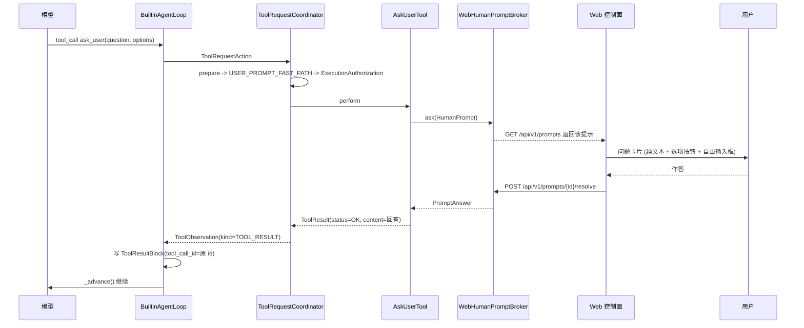

# ADR-0043: 采用统一人机提示通道与 ask_user 工具

## 状态

Accepted (2026-09-04 实现)

本 ADR 决定两件事: **模型缺信息时怎么向人要** (新增 `ask_user` 工具), 以及**所有"挂起
调用者等一个人回话"的路径收进同一条通道** —— 安全审批与 `ask_user` 共用它, 但各自的类型
与语义互不相干.

审批要问什么, 问完之后怎么重验与签发授权, 仍由 ADR-0004 §6.1 与 ADR-0013 决定, 本文
一个字都不改; 改的只是它底下那张待答队列. 计划评审的回合边界停顿 (ADR-0023) 不进这条
通道, 理由见决策 3.

## 日期

2026-09-03

## 背景

### 现状: "问人"这条路今天只有安全审批走得通

`ApprovalService` 与 `BlockingApprovalBroker` 是现成且能用的人机交互入口, 但它回答的问题是
固定的一句: **这一次已经确定下来的调用, 许不许可.** 发起者是 `PolicyEngine`, 触发条件是
裁决结果为 `Decision.ASK`. 它并非只针对 Shell —— 任何工具调用被策略判成 ASK 都会走到
那里, 只是 Shell, 越界路径, 网络与不可逆写入更容易命中.

模型自己缺信息时没有任何入口:

- `LoopAction` 的实现只有 `AnswerAction` 与 `ToolRequestAction` 两种
  (`domain/agent/actions.py`).
- `docs/02-detailed-design.md:148` 把 `ask_user` 列进 `LoopAction` 的取值, 而
  `application/agent_turn/agent_turn_service.py:366` 的 `else` 分支写着
  "ask_user / approval / compaction 属后续切片" —— 这条路从设计文档写下那天起就没有接过.

于是模型唯一能做的是把问题写成最终回答. 那等于**结束本轮**: 循环停在
`FINAL_ANSWER`, 用户回答之后是新的一轮, 而那句回答是一条与任何 `tool_call` 都不相干的
新用户消息. 严格地说, ADR-0041 决策 4 之后窗口跨轮只追加, 上一轮的工具往返其实还留在
`AgentTurnService._window` 里, 所以模型并没有"失忆"; 缺的是**结构**: 没有任何东西把
"这句话是在回答那一次提问"表达出来, 模型只能靠读上下文猜, 而 Forge 也无从知道这一轮
到底该不该等人.

### 唯一的暂停出口被写死成了计划评审

ADR-0023 建了一条以字段而非工具名分流的停顿链:

```text
ToolResult.turn_disposition = AWAIT_USER_DECISION
  -> ObservationKind.PLAN_REVIEW_REQUIRED
  -> ObservationDisposition.AWAIT_USER_DECISION
  -> LoopStopReason.WAIT_PLAN_REVIEW
  -> TurnPause.PLAN_REVIEW
  -> ProjectRuntime 的 waiting_plan_review
```

链条中段确实不认识 `plan_write` 这个名字, 但**两端是写死的**: 起点只有
`PlanWriteTool.perform` 一个产出方, 终点只有 `resolve_plan_review` 一个消费方, 中间四个
枚举值里有三个的名字里就写着 plan. ADR-0023 决策 1 与 `domain/tool/result.py` 的
`TurnDisposition` docstring 都预言过"机制对将来的 `ask_user` 一类工具同样成立" ——
本 ADR 的结论是**那句预言不成立**, 理由见决策 2 与备选方案 A.

### 两种"问人"语义不同, 但等的是同一件事

| | 安全审批 | ask_user |
| --- | --- | --- |
| 发起者 | `PolicyEngine` 判出 `Decision.ASK` | 模型 |
| 问的是什么 | 这次已经确定的调用许不许可 | 缺需求, 偏好或业务事实, 无法决定下一步 |
| 回答产生什么 | `ExecutionAuthorization`, 可能进 `RiskCache` 与 learned rules | 一段文本, 别的什么都不产生 |
| 回答的取值 | 批准 / 拒绝 / 未决 三态 | 任意文本 |

`ApprovalRequest` 因此不可复用: 它绑着 `ApprovalBinding` 与 `ApprovalView.view_hash`,
批准之后必须重新 `prepare` -> 分析 -> 裁决 -> 复核六项绑定事实, 然后才签出
`ExecutionAuthorization`. 一个业务问题的回答没有待授权的调用, 没有需要复核的执行环境,
也**绝不该**签出任何执行授权.

但**下面那一层是同一件事**: 挂起一个正在跑的调用者, 在界面上摆一张卡片, 等一个人点一下,
把结果交回去, 并在取消或退出时放开所有还在等的. `interfaces/runtime/approval.py` 里的
`BlockingApprovalBroker` 今天就是这个东西 —— 一把锁, 一张 `dict`, 每项一个
`threading.Event`, 加上 `release_pending` 与 `close`.

而且它**已经是跨界面共用的**: ADR-0045 恢复终端入口时, 这个 broker 从
`interfaces/web/` 上移到了 `interfaces/runtime/`, 现在 Web 卡片与 TUI 的
`approval_prompt.py` 读的是同一张队列. "等人回话只该有一份实现"这条判断在审批上已经
兑现过一次了.

再写一个只为提问服务的同形副本, 换来的是两条要分别记得放开的队列, 而漏掉一条不会报错,
只会让"停止"按不动.

更关键的是, **语义闸门本来就不在 broker 里**: `ToolRequestCoordinator` 在
`approval.request(...)` 返回之后立刻调 `ApprovalRequest.response_error(response)`
(`coordinator.py:422`), 由它断言这个回答属于当前请求, `scope` 确实在
`view.allowed_scopes` 里, 且 mandatory 时只能是 `ONCE`. 底下换成什么, 这道闸都在原地.

## 决策

ForgeCLI 新增内置工具 `ask_user`. 它在 `perform` 内部阻塞等待, 用户的回答就是这次调用的
`ToolResult`. 本轮不结束, 循环不停, `tool_call_id` 的配对由数据流本身保证.

### 1. `ask_user` 是一个工具, 不是 `LoopAction`

`docs/02-detailed-design.md:148` 那份 `LoopAction` 取值表要改: 删掉 `ask_user`,
`request_approval` 与 `request_compaction` 三项. 前者由本 ADR 落成工具, 后两者早已分别由
`ApprovalService` 与 `WindowManager` 在循环之外承担 —— 一张列着三个永远不会被构造的动作
的表, 读起来像是三条已经接好的路 (ADR-0028 规则 C).

做成工具而不是动作, 有三条理由:

1. **模型侧的表达方式已经现成.** 工具调用是模型原生会做的事, `ToolSchema` 已经把
   name / description / parameters 发过去了. 新开一种动作类型意味着要教会模型一套只有
   Forge 认识的输出格式.
2. **审计不必新开一条路.** `TOOL_REQUESTED` / `TOOL_COMPLETED` / `POLICY_DECISION` 照常
   写, 提问与别的调用在 `events.jsonl` 里形状一致.
3. **`AgentLoop` 不必认识它.** ADR-0010 的不变量是循环只产出意图, 不做写入与 I/O. 提问
   一旦是动作, 就必须由 `AgentTurnService` 特判并驱动交互; 是工具则整条链一个字都不用改.

### 2. 等待发生在 `perform` 内部, 回答就是这次调用的 `ToolResult`

这是本 ADR 的核心, 也是与初稿分歧最大的一处.

```text
模型 tool_call ask_user
  -> ToolRequestCoordinator: prepare -> 裁决 (USER_PROMPT 快速放行) -> ToolRuntime.execute
  -> AskUserTool.perform 阻塞在 HumanPromptService.ask(HumanPrompt)
        ...Web 控制面弹出问题卡片, 用户作答...
  -> perform 返回 ToolResult(summary=..., content=回答正文)
  -> ToolObservation(kind=TOOL_RESULT) -> LoopObservation(disposition=CONTINUE)
  -> BuiltinAgentLoop._observe 照常写 ToolResultBlock(tool_call_id=那一次的 id)
  -> _advance() 继续调模型
```

**"回答关联原来的 `tool_call_id`"因此不是一条需要维护的约束, 而是数据流的形状.**
`_observe` 拿到的 `call` 就是发起提问的那一次, 它写出的 `ToolResultBlock` 天然带着正确的
id. 没有跨回合的配对, 没有占位结果, 没有"稍后补一条".

**阻塞是安全的**, 三条已经查过的事实:

- `ToolRuntime.execute` 直接调 `tool.perform`, 外面**没有任何看门狗**
  (`application/tools/runtime.py:118`). `ResourceGovernor.limits_for` 只算出一份
  `ResourceLimits` 交给工具自己用, 不强制中断谁.
- `envelope.ensure_usable(...)`, `context.differences(...)` 与 `_verify_file_state(...)`
  全部跑在 `perform` 之前. 长时间等待期间没有任何需要复核的事实会漂移 —— `ask_user` 的
  `PlanEffects` 是空的, 它碰不到工作区里的任何路径.
- 这种无超时等待在本仓库已有先例且是刻意的: `BlockingApprovalBroker.request` 的 docstring 写着
  "**不设等待超时**", 理由是"挂钟到点就把请求判成没批准, 等于让用户去泡杯咖啡的功夫决定
  这次调用的命运". 一次提问与一次审批是同一种形状的等待.

### 3. 一条 `HumanPrompt` 通道, 所有阻塞式问人都走它

"挂起调用者等一个人回话"在 Forge 里只有一份实现. 审批与提问共用它, 但**共用的是等待,
不是语义**.

```text
domain/human_interaction/prompt.py        # HumanPrompt / PromptChoice / PromptKind / PromptAnswer
                              # 纯数据. 不认识审批, 也不认识提问
application/human_interaction/service.py   # HumanPromptService (ABC): ask(HumanPrompt) -> PromptAnswer
                              #   release_pending(note) / begin_turn() / close()
                              # PendingHumanPromptService: 无人可答时的实现
interfaces/runtime/human_interaction/broker.py  # BlockingHumanPromptBroker: 全局唯一的待答队列
                              # 上移到 runtime/ 是既有事实: 审批 broker 已在那里 (ADR-0045)
```

`HumanPrompt` 只装界面需要的: `prompt_id`, `kind` (仅供渲染分支与审计), 标题, 正文,
`choices` (value + label + detail), `free_text` (提问 True, 审批 False), 以及一份不透明的
`detail` 供卡片展开. `PromptAnswer` 只装 `prompt_id`, 选中的 `choice`, 自由 `text`, 和一个
`resolved` 标志.

两个消费方各自把这个哑信封翻成自己的语义, 而它们**互不 import**:

| | 谁在等 | 怎么接上通道 |
| --- | --- | --- |
| 审批 | `ApprovalService.request` | 新增 `ApprovalService`, 住在 `application/security/approval_service.py` |
| 提问 | `AskUserTool.perform` | 直接依赖 `HumanPromptService`, 不再中间隔一层 |

两处连带的结果:

- **`ApprovalService.request` 的签名一个字都不改.** 变的只是它内部从"自己维护一张待批
  队列"换成"构造 `HumanPrompt` 交给通道, 把回来的 `choice` 映射回 `ApprovalOutcome` 与
  `ApprovalScope`". 映射之后仍要过 `response_error` 那道闸 (见背景).
- **`interfaces/runtime/approval.py` 被 `interfaces/runtime/human_interaction/broker.py` 顶替**
  (`BlockingApprovalBroker` -> `BlockingHumanPromptBroker`). 两个界面层从此都不认识审批
  —— 它们只知道队列里有一条待答提示, 以及它的 `kind` 决定渲染哪个分支.
- **不再需要 `UserInputService`.** 初稿里它除了转发就只剩每轮上限一件事, 而上限的正确
  归属是通道自己 (决策 9). 少一层.

两条必须写死的纪律:

1. **`HumanPrompt` 必须保持哑.** 里面不许出现 `ApprovalScope`, `ToolPlan`,
   `ExecutionAuthorization` 或任何安全词汇 —— 一旦出现, 下一次给审批加字段就会顺手让
   提问也拿到它. `scripts/check_arch.py` 加一条断言: `domain/human_interaction/prompt.py` 与
   `application/human_interaction/service.py` 不 import `domain.security.*`.
2. **审批卡片的内容只有一份投影.** 送进 `HumanPrompt.detail` 的就是
   `ApprovalView.to_payload()` 的返回值, 不另写一份字段搬运. 用户批准的对象是被
   `view_hash` 绑定的那份视图, 而多一份手工维护的投影, 就多一个"显示的和绑定的不是同一
   件事"的位置.

一个 `prompt_id` 由通道分配, 只对应一条提示, 也只接受一次作答. 因此答给提问的那个
`choice` 到不了审批的映射函数 —— 两种提示不会因为共用队列而串味.

**计划评审不进这条通道.** 它不是一次等待: turn 已经结束, 没有任何调用者被挂起, 它的
resolve 起的是**新一轮**, 而不是给谁返回一个值. 把它塞进一个专门用来挂起阻塞调用者的
通道, 那个通道就同时表达两件事了. 于是 Forge 最终有两种人机交互形状而不是三种: 阻塞式
提示 (审批 + 提问, 本决策统一) 与回合边界停顿 (计划评审, ADR-0023).

### 4. 新增 `Capability.USER_PROMPT`, 落进 `_ALWAYS`

- 加进 `domain/tool/capability.py::Capability`, **不进** `MUTATING_CAPABILITIES`. 于是
  `catalog_predicates._read_only_visible` 不会把它滤掉, `ask_user` 在 `read_only` 隔离档
  (plan 模式) 里照样可见 —— 那正是最需要问清方向的一档.
- 加进 `domain/security/budget.py::_ALWAYS`, 并在
  `application/security/policy_engine.py::_allow_reason` 加一条分支返回新的
  `DecisionReason.USER_PROMPT_FAST_PATH`. 提问不经 ASK: 为"要不要问你一个问题"再问一次
  人, 是一个字面意义上的死循环.
- **不复用 `PLAN_ONLY`.** 复用会让安全矩阵里"计划"和"提问"变成同一件事, 而将来任何一条
  只想管其中一个的规则都写不出来 —— 与 `MEMORY_WRITE` 当初不复用 `PLAN_ONLY` 是同一条
  理由 (`capability.py` 的注释).
- **`CAPABILITY_VOCABULARY_VERSION` 不升.** 按该常量注释给出的判据: 这是增量扩词汇, 不
  改任何已有取值的含义, 老的 learned rules 匹配不到这个新值. 升版本反而会打乱每一个
  `plan_hash`, 让用户为一件与他无关的事重新批准一遍.

### 5. 回答永远不构成授权

写死的三条:

1. `ask_user` 的回答**不产生 `ExecutionAuthorization`, 不进 `RiskCache`, 不写 learned
   rules**. `AskUserTool` 到 `PromptAnswer` 这条路上没有任何安全类型的 import, 由决策 3
   的纪律 1 与 `check_arch` 守住.
2. `ask_user` **不改会话模式**. 与 ADR-0023 决策 4 的"同意并执行"不同, 那条边是一次
   有明确语义的显式升档; 提问没有任何升档的边.
3. 一句"我允许你 `rm -rf /`"的回答**不起任何作用**. 它是一段文本, 经
   `ToolResultBlock` 回填给模型; 后续每一次工具调用仍然逐次走完整裁决管线: 目录能力门
   -> `prepare` -> 能力分析 -> `PolicyEngine` -> ASK / ALLOW / DENY -> 恢复屏障 ->
   `ExecutionAuthorization`.
4. **共用通道不等于共用语义** (决策 3). 把 `PromptAnswer.choice` 变成 `ApprovalOutcome`
   与 `ApprovalScope` 的只有 `ApprovalService` 里的一个映射函数, 而它的产出还要
   过 `ApprovalRequest.response_error`. 一条由 `ask_user` 提出的提示, 它的 `choices` 里
   根本不存在任何 scope 取值, 因此映射不出授权.

### 6. 问题是模型写的, 回答经工具结果回填 —— 两端都按低信任处理

**问题正文低信任**: 它由模型生成, 与 `shell_run` 的入参同源. Web 控制面按**纯文本**
渲染问题与选项, 不走 `Markdown` 组件 —— Markdown 能藏链接, 而一张由模型控制文案的卡片
正是钓鱼最省事的位置.

**回答也按低信任回填**: 它经 `ContentPart` 进入窗口, 而 `ContentPart.provenance` /
`trust` 是 `ClassVar`, 恒为 `tool_output` / `untrusted`. 人写的字在信任分层里因此与工具
输出同级. 这是刻意的, 不是没做到 —— 决策 5 第 3 条要的正是这个: 一段话不该因为出自人手
就取得执行力, 执行力只经 `ApprovalService` 签发.

### 7. 选项是建议, 自由文本永远可答

`options` 可以给 0 到 5 项, 每项 `{value, label, detail?}`. 但**没有 `allow_free_text`
这个参数**: 输入框永远在, 用户永远可以不选任何一项而直接写.

只给固定选项是个陷阱: 模型对情况的理解不完整才会提问, 而它列出的选项恰恰是那份不完整
理解的产物. 把用户锁进四个都不对的选项里, 得到的答案会比不问更糟.

### 8. 无人可答时立即返回, 而且**不停下循环**

`PendingHumanPromptService.ask` 立即返回 `resolved=False`, `AskUserTool` 把它翻成一个
`ToolResult(status=UNAVAILABLE, error=...)`, 正文告诉模型: 当前没有人可以回答, 按你自己
的判断继续, 并在最终回答里说明你做了哪些假设.

这条 observation 的 `kind` 是普通的 `TOOL_RESULT`, `disposition` 因此是 `CONTINUE`.
**它与 `APPROVAL_UNAVAILABLE` 的 `HALT` 刻意相反**, 判据是"没人回答意味着什么":

- 审批那里, 没人回答意味着**不能执行** —— 继续派工具没有意义, 所以 HALT.
- 提问这里, 没人回答只意味着**模型得自己拿主意** —— 而那本来就是它绝大多数时候在做的
  事. 停下来等于让一次"我想确认一下"把整轮作废.

### 9. 每轮提问有上限

`HumanPromptService` 记本轮已提问次数, 上限 **3**; 超出后 `ask` 直接返回一条
`resolved=False` 的回答, `AskUserTool` 把它翻成 `UNAVAILABLE`, 告诉模型本轮提问额度
已用完, 自己判断并继续.

用 `UNAVAILABLE` 而不是 `INVALID_INPUT`: 模型的入参没有任何毛病, 说它非法会让它去改一
个本来就对的调用. 与"没有人可以回答"同一个状态码, 靠 `summary` 分辨 —— 因为模型对这
两件事的正确反应完全一样: 自己拿主意.

计数由 `ProjectRuntime._execute_turn` 在起一轮时调 `begin_turn()` 归零 —— 那里已经在做
同样形状的按轮起始动作 (`self.cancel_source.issue()`).

上限只对 `PromptKind.QUESTION` 生效, **审批不限流**: 审批超额之后唯一安全的处置是当成
未批准, 那会把一次正常操作变成失败; 提问超额的处置是"你自己判断", 那是无害的. 判据是
**超额的默认处置伤不伤人**, 不是"都是问人所以一视同仁".

上限放在通道而不是循环里, 是因为它管的是**人的注意力预算**, 不是模型的步数预算; 放进
循环则要求循环认识"这次调用是一次提问", 而那正是决策 1 想避免的.

3 是个钝的数字, 与 ADR-0023 决策 6 的评审链上限同源, 也同样没有区分"用户在认真澄清需求"
和"模型在原地打转".

### 10. 取消, 释放与进程退出

`ProjectRuntime.cancel` 与 `close` 各只需要放开**一个**队列:
`self.prompts.release_pending(...)` 与 `self.prompts.close()`. 这是决策 3 统一通道最实在
的收益 —— 初稿要在两处分别记得放开, 而漏掉一处不会报错, 只会让"停止"按钮按不动一个正在
等待的 turn.

必须显式放开, 不能指望 `CancelToken`: 它是轮询式的 (`shared/cancellation.py` 明说"被取消
方自己检查 cancelled, 不做强制中断"), 一个阻塞在 `threading.Event.wait()` 上的线程永远
等不到它.

被释放的提示返回 `resolved=False`, 两侧各自朝安全的方向翻译: 提问翻成
`ToolResultStatus.CANCELLED` (随后循环看到 cancel token 已置, 本轮以 `USER_CANCELLED`
结束), 审批翻成 `ApprovalOutcome.PENDING` (没答案就是没批准).

### 11. 两个界面一个队列, `TurnRun.status` 保持 `running`

界面有两个 (ADR-0045), 队列只有一条. 两边都从 `list_pending()` 读, 按 `kind` 选渲染分支.

Web:

- `GET /api/v1/prompts` 返回当前待答提示 (0 或 1 条), 带 `kind`.
  **替换** `GET /api/v1/approvals`.
- `POST /api/v1/prompts/{prompt_id}/resolve`, body `{"choice": "...", "text": "..."}`.
  **替换** `POST /api/v1/approvals/{approval_id}/resolve`. 一个 `prompt_id` 只接受一次.
- `App.tsx:1022` 那一格从 `ApprovalCard` 换成 `PromptCard`.

终端:

- `interfaces/tui/approval_prompt.py` 泛化成 `prompt_card.py`: `render_card` 按 `kind`
  分支, `ask_decision` 在 `free_text` 为真时多收一行自由输入.
- `session_app.py:230` 那个 `runtime.approvals.list_pending()` 的轮询点改读同一条队列,
  不新增第二个轮询点.

两个界面共有的分支形状: 审批分支保留今天全部的展开细节 (命令原文, 目标分组, 脚本正文,
范围选项), 提问分支是选项 + 常驻自由输入.

**不新增 `waiting_user_input` 这个 run 状态.** `TurnRun.status` 今天回答的是"那个后台
线程还在不在跑", 而等提问期间它**确实还在跑** —— 循环, 预算与 cancel token 全是活的.
加一个状态会让这个字段同时回答两个问题. 判据是: **turn 真的结束了才改 status, turn 还在
跑就只挂卡片.** 计划评审有 `waiting_plan_review`, 是因为那里的 turn 真的结束了.

"现在该请人做什么"从此只有一个真相源: 那一条待答队列.

### 12. 回答的正文进 `events.jsonl`

新增一个事件类型 `USER_QUESTION_ANSWERED`, payload 含问题正文, 选项与回答正文.

判据取自 `domain/session/events.py` 里 `CONTEXT_COMPACTED` 那条注释给出的口径 ——
**可复现性, 不是大小**: 计划正文的真相源是磁盘上的文件, 随时读得回来, 所以事件里只记
引用; 摘要是模型一次性产出的, 不可复现, 所以正文进事件流.**用户的回答同样不可复现**,
而且 `TOOL_COMPLETED` 的 payload 来自 `ToolResult.to_audit_payload()`, 那里面只有机制
事实, 一个字的回答正文都没有. 不记就是永久丢失.

只加一个事件, 不加 `USER_QUESTION_ASKED`: 提问本身已由 `TOOL_REQUESTED` 记下, 而一条
有问无答的记录说明不了比"进程在等待时退出了"更多的东西 (ADR-0028 规则 C).

`_rebuild_window` 相应地把这条事件重放成一条 USER 文本消息 (形如
`对问题"<问题>"的回答: <回答>`). 这与会话内的形状 (一条 `ToolResultBlock`) 不一致,
是刻意的取舍: 事件流里本来就没有工具往返 (该函数的 docstring 已写明 `/resume` 会丢掉
它们), 而回答是那次往返里唯一不可复现的部分, 宁可换个形状留下, 不可丢.

### 13. 不给计划评审那条链改名, 也不泛化它

`ObservationKind.PLAN_REVIEW_REQUIRED`, `LoopStopReason.WAIT_PLAN_REVIEW` 与
`TurnPause.PLAN_REVIEW` **保持原名**, `TurnDisposition.AWAIT_USER_DECISION` 保持原状.

`ask_user` 不走那条链, 于是 `AWAIT_USER_DECISION` 从此确定只有 `plan_write` 一个产出方.
把它们改成 `USER_INPUT_REQUIRED` / `WAIT_USER_INPUT`, 等于用一个更宽的名字指着一个更窄
的事实 —— 读的人会以为那是提问用的路, 而它不是.

但有四处注释预言错了, 必须一起改掉, 否则它们会继续把人引向那条路:

| 位置 | 现在写着 |
| --- | --- |
| `docs/adr/2026-08-17-0023-...md` 决策 1 与"影响/收益" | "机制对将来的 `ask_user` 一类工具同样成立" |
| `domain/tool/result.py` `TurnDisposition` docstring | 同上 |
| `application/tool_request/coordinator.py:687` | "机制对将来的 ask_user 一类工具同样成立" |
| `application/agent_turn/agent_turn_service.py:366` | "ask_user / approval / compaction 属后续切片" |

改法: 前三处改成指向本 ADR, 说明提问走的是阻塞式工具而不是回合边界停顿; 第四处随决策 1
把那三个动作从设计文档里删掉之后, 分支注释也一并收敛.

### 14. 提示词只说什么时候**不要**问

`ask_user` 的 `description` 与别的工具一样写在自己的 .py 里: `ToolSpec` 不在
`scripts/check_prompt_text.py` 的 SINKS 名单上, 十几个内置工具也都是这么写的. 那份名单
管的是**进消息体**的正文 (`TextBlock`, `ToolResultBlock`, `PromptBlock` 与
`render_*`), 而工具声明是随 schema 一起发过去的, 与提示词块不是一回事.

真正要走模板的是 `/resume` 之后那句重放 (决策 12): 它构造 `TextBlock`, 而那是 SINK.

正文的重点是收窄触发条件, 不是介绍功能:

- 只在**答案会改变你接下来做什么**, 且**读代码, 读配置或跑只读命令都得不到**时提问.
- 需求有多种合理解读且会导致完全不同的产出时提问.
- **不要**用它请求执行许可 —— 那由 Forge 自己在需要时问, 你问了也不会得到授权.
- **不要**问代码里查得到的事实.
- **不要**为了确认自己的进展或让人放心而提问.

## 备选方案

### 方案 A: 回合边界暂停 + 跨轮回填 (初稿方案)

沿用 ADR-0023 的链条并泛化: `USER_INPUT_REQUIRED` -> `LoopStopReason.WAIT_USER_INPUT`
-> `TurnPause.USER_INPUT` -> Web 的 `waiting_user_input` 状态, 用户作答后以原
`tool_call_id` 回填并继续.

它有真实优点: 不占线程, turn 有明确终点, 长时间等待期间进程可以做别的事. 但有三条挡住
它的理由, 按分量排列:

1. **`tool_call` 的配对会出现一个洞.** 暂停发生时, 那一次 `ask_user` 的
   `ToolResultBlock` 要么已经写了一条占位内容 —— 那么真正的回答就只能作为一条新的用户
   消息进来, 恰恰是初稿明确要避免的东西; 要么不写 —— 那么窗口末尾停着一个欠着结果的
   `tool_calls`, 而 ADR-0011 §10 与 `transcript.safe_split_points` 都把"每个 tool_call
   都有配对结果"当成不可破的不变量, `BuiltinAgentLoop._abandon_pending` 的存在就是为了
   杜绝这个状态. 在那个洞里, 用户随便打一句别的话就会组出一条供应商会拒的请求.
2. **每次作答都重开一个循环实例, 预算跟着归零.** `AgentTurnService._run_loop` 每轮
   `self._loop_factory()` 新建 `BuiltinAgentLoop`, 于是 step / tool / model 三份预算与
   `_track_progress` 的打转判定全部重来. 一个爱提问的模型可以靠提问无限续期. 方案 A 要
   补一条链上限才安全, 而阻塞式压根不需要 —— 它自始至终是同一个循环.
3. **它要新增四个枚举值和一条新的再入入口** (`AgentTurnService` 得能用一个
   `ToolResultBlock` 而不是用户消息起一轮), 换来的是一个语义更弱的结果.

方案 A 的优点在本仓库的形态下也兑现不了: `ProjectRuntime` 本来就一次只跑一个 turn
(`start_turn` 在忙时直接抛), 所以"腾出进程去做别的事"没有可做的事.

不采用. 若将来 Forge 要支持一次会话里多个并发 turn, 或提问要跨进程重启存活, 这个方案值得
重新拿出来 —— 那时它的两条优点才开始有价值.

### 方案 B: 复用 `ApprovalService`

指的是让 `ask_user` 直接构造 `ApprovalRequest` 并走审批那套类型 —— 与决策 3 的"共用等待
通道"是两回事. 形状不匹配, 见背景: 审批只有批准 / 拒绝 / 未决三态, 装不下一段自由文本;
强行塞进去会让 `ApprovalResponse` 长出一个只有提问用得上的字段, 而 `ApprovalScope` 和
learned rules 会顺着那个字段渗进一条本不该有授权语义的路. 不采用.

同样不采用的还有它的镜像: 让安全审批**变成模型发起的 `ask_user` 调用**. 审批发生在
协调器分派另一个工具的授权阶段, 那里根本没有一次属于审批自己的 `tool_call_id`; 更要命的是
发起者会从 `PolicyEngine` 变成模型, 而卡片上那段"要发生什么"的文案随之由模型撰写 ——
一次 `rm -rf` 可以被描述成"清理临时文件". 审批的发起权必须留在策略侧.

### 方案 C: 把 `ask_user` 做成 `LoopAction`

`docs/02-detailed-design.md` 原本就是这么写的. 但循环因此要么自己阻塞等人 (直接违反
ADR-0010 "只产出意图, 不执行写入与 I/O"), 要么把动作交回 `AgentTurnService` 特判. 后者
可行, 代价是提问从此不进 `TOOL_REQUESTED` / `TOOL_COMPLETED`, 审计要另开一条路, 而模型
也要学一种只有 Forge 认识的输出格式. 不采用, 并按决策 1 把那张表里三个不存在的动作删掉.

### 方案 D: 不做, 让模型把问题写进最终回答

现状. 成本是每一次澄清都要烧掉一整轮, 而且 Forge 分不清"模型说完了"和"模型卡住了" ——
`/turns/current` 报的都是 `completed`. 不采用.

### 方案 E: 做成斜杠命令或侧栏里的"追加说明"

让用户主动补充信息, 而不是模型主动要. 它解决的是另一个问题 (人想插话), 与"模型缺信息
无法继续"不重合: 用户不知道模型卡在哪, 也就不知道该补什么. 可以将来另做, 不替代本 ADR.

### 方案 F: 审批与提问各留一个 broker

初稿的写法: 给提问单开一个 broker, 与既有的 `BlockingApprovalBroker` 结构同形但不共基类,
不共数据类,
理由是"把它们合成一个通用 broker, 下次给审批加字段就会顺手让提问也拿到".

那个担心是真的, 但代价买错了东西. 它换来两条待答队列, 于是 `cancel` 与 `close` 各要记得
放开两次 —— 初稿因此不得不专门写一条实现约束去提醒, 而漏掉不会报错, 只会让"停止"按不动.
它还换来两套 HTTP 端点, 两个前端卡片抢同一格, 以及"现在该请人做什么"有两个真相源.

而担心本身有更便宜的解法: 让共用的那个类型保持哑, 用 `check_arch` 断言它不 import 任何
安全词汇 (决策 3 纪律 1). 语义闸门本来也不在 broker 里 —— `response_error` 在协调器,
换掉底下的队列它一动不动. 不采用.

## 影响

### 收益

- 模型第一次有了"缺信息"与"说完了"之外的第三种表达, 而 Forge 分得清它们.
- 回答与提问的 `tool_call_id` 配对由数据流保证, 不需要任何一层去维护.
- 安全审批与业务提问在类型层面仍然完全分开: 提问链路上不存在 `ExecutionAuthorization`,
  `ApprovalScope` 或 learned rules 的 import, 所以"回答变成授权"不是一条要靠纪律守住的
  规则, 而是一条编译期就走不通的路.
- **"等人回话"从此只有一份实现.** 待答队列一条, 释放路径一条, HTTP 端点一对, 前端卡片
  一格 (每个界面各一格). `interfaces/runtime/approval.py` 被顶替, 两个界面层都不再认识
  审批.
- 少一类 bug: 初稿里"cancel 时要记得放开两条队列"这条实现约束消失了, 因为只剩一条.
- `LoopStopReason`, `TurnPause` 与 `ObservationKind` 一个取值都不用加.

### 代价

- 一个 turn 可以无限期占住一个后台线程. `ProjectRuntime` 一次只跑一个 turn, 所以这不是
  并发问题, 但用户关掉页面就会留下一个永远等不到答案的线程, 直到 `close()`.
- 等待期间不会发生窗口淘汰与检查点. 提问点不是一个可恢复的断点.
- 进程在等待时退出, 这个问题就没了 —— 待答提问只在内存里. 与审批今天的行为一致.
- `Capability`, `DecisionReason` 与 `EventType` 各加一个取值; `_ALWAYS` 与 `_allow_reason`
  各加一条.
- 审批要多绕一次 `ApprovalView` -> `HumanPrompt` 的映射. 纪律 2 把它压成一次
  `to_payload()` 调用, 但它确实是一条新增的, 需要有人盯着的投影.
- `HumanPrompt` 是一个必须保持哑的类型, 而"给审批加个字段"永远是看起来最省事的做法.
  这条靠 `check_arch` 的断言守, 不靠自觉.

### 兼容性

- 对模型与裁决链是纯增量: 不改任何已有枚举值的语义, 不改 `ToolResult` 的字段, 不改停顿
  链条, `ApprovalService.request` 与 `ApprovalRequest` / `ApprovalResponse` 的签名不变.
- **对 Web API 是破坏性的**: `/api/v1/approvals` 那一对端点被 `/api/v1/prompts` 替换.
  本地控制面前后端同版本发布, 没有第三方消费者, 所以不做兼容期.
- `CAPABILITY_VOCABULARY_VERSION` 不升 (决策 4), 已有 `plan_hash` 与 learned rules 不
  失效.
- `USER_QUESTION_ANSWERED` 是新事件类型; 旧 `events.jsonl` 里没有它, `_rebuild_window`
  读不到就当没有, 与今天一样.
- 未装 `WebHumanPromptBroker` 的装配 (测试, 无头) 落到 `PendingHumanPromptService`:
  提问侧"没人可答, 继续", 审批侧照旧 `PENDING`, 都不报错. 它顶替了今天的
  `PendingApprovalService`.

## 设计细节

### 1. 工具声明

```text
name                        ask_user
version                     1
declared_capabilities       {USER_PROMPT}
target_declaration_ability  STATIC
default_timeout_seconds     600.0     # 见下方说明
body_in_window              False     # 见下方说明
```

`input_schema` (`additionalProperties: False`, 与四个 planning 工具同一条理由: 它连同
"没有路径字段"一起构成目标集合在机制上封闭的证明):

```json
{
  "type": "object",
  "properties": {
    "question": { "type": "string", "maxLength": 500 },
    "options": {
      "type": "array",
      "maxItems": 5,
      "items": {
        "type": "object",
        "properties": {
          "value":  { "type": "string" },
          "label":  { "type": "string" },
          "detail": { "type": "string" }
        },
        "required": ["value", "label"],
        "additionalProperties": false
      }
    }
  },
  "required": ["question"],
  "additionalProperties": false
}
```

**`default_timeout_seconds` 在这里是一个不被读的值.** `ToolRuntime` 不用它中断任何人,
它只经 `ResourceGovernor.limits_for` 交给工具自己参考, 而 `ask_user` 按决策 2 不设超时.
字段是必填且必须为正, 所以填全局上限 600. 这一点必须写进代码注释, 否则读的人会以为提问
十分钟后会自动放弃.

**`body_in_window=False` 已经够用.** `ToolResult.render_for_model` 的规则 ① 是"没有句柄
就必须带正文", 而 `ask_user` 不归档 (`provenance` 为 None), 所以回答一定进窗口. 与四个
planning 工具依赖的是同一条规则.

`prepare` 与 planning 工具同形: 校验 schema, 返回一个 `PlanEffects()` 为空,
`target_resolution=STATIC`, `capabilities={USER_PROMPT}` 的 `ToolPlan`.

### 2. 时序



本轮从头到尾是一个 turn, 一个 `BuiltinAgentLoop` 实例, 一份预算.

### 3. 模块

新增:

```text
domain/human_interaction/prompt.py               # HumanPrompt / PromptChoice / PromptKind / PromptAnswer
application/human_interaction/service.py          # HumanPromptService (ABC) + PendingHumanPromptService
application/tools/builtin/ask_user.py  # AskUserTool(HumanPromptService)
interfaces/runtime/human_interaction/broker.py   # BlockingHumanPromptBroker
```

删除:

```text
interfaces/runtime/approval.py       # BlockingApprovalBroker -> ApprovalService + 通道
```

改动:

```text
domain/tool/capability.py            # + Capability.USER_PROMPT
domain/security/vocabulary.py        # + DecisionReason.USER_PROMPT_FAST_PATH
domain/security/budget.py            # _ALWAYS += USER_PROMPT
domain/session/events.py             # + EventType.USER_QUESTION_ANSWERED

application/security/policy_engine.py    # _allow_reason 加一条分支
application/security/approval_service.py # ApprovalService 由 ABC 收成具体类 (见实现记录)
application/agent_turn/agent_turn_service.py  # _rebuild_window 重放新事件; 366 行注释收敛
application/prompt/templates/...         # ask_user 的 description 与提问纪律正文

interfaces/runtime/tool_wiring.py    # 注册 AskUserTool
interfaces/runtime/project_runtime.py  # 装 prompts 通道; _execute_turn begin_turn; cancel/close 放开
interfaces/web/app.py                # GET /prompts, POST /prompts/{id}/resolve 替换 /approvals 一对
interfaces/tui/approval_prompt.py    # -> prompt_card.py, 按 kind 分支 + 自由输入
interfaces/tui/session_app.py        # 那个 list_pending 轮询点改读同一条队列
web/src/App.tsx                      # ApprovalCard -> PromptCard, 按 kind 分支
```

`HumanPrompt` 落在 `domain/` 而不是 `application/`: 它是一份没有行为的词汇, 与
`domain/security/approval.py` 里的 `ApprovalView` 同级. 服务与实现留在 `application/`,
与 `ApprovalService` 一致.

### 4. 三条问人的路, 两种形状

| | 安全审批 | ask_user (本文) | 计划评审 (ADR-0023) |
| --- | --- | --- | --- |
| 谁发起 | `PolicyEngine` 判出 ASK | 模型 | 模型 (经 `plan_write`) |
| 形状 | 阻塞式提示 | 阻塞式提示 | 回合边界停顿 |
| 走不走 `HumanPrompt` | 走 | 走 | 不走 |
| 停在哪 | 回合中间, turn 不结束 | 回合中间, turn 不结束 | 回合边界, turn 结束 |
| 谁被挂起 | 那次工具调用 | 那次工具调用 | 没有人 |
| 回答形态 | 固定选项 (scope / deny) | 任意文本 + 可选建议项 | 四选一 + 可选补充文字 |
| 回答去哪 | `ApprovalResponse` -> 重验 -> `ExecutionAuthorization` | 同一次调用的 `ToolResult` | 新一轮的用户消息 (`InputOrigin.PROGRAM`) |
| 会不会改档 | 不会 | 不会 | 会 (`PLAN -> AUTO`) |
| run 状态 | 仍是 `running` | 仍是 `running` | `waiting_plan_review` |
| 有没有每轮上限 | 没有 (决策 9) | 有, 3 次 | 有, 链上限 3 (ADR-0023) |

前两列合并进一条通道 (决策 3); 第三列不进, 判据是**有没有人被挂起等这个回答**.

### 5. 已知限制

- 待答提问只在内存里. 进程退出即丢失, `/resume` 恢复不出一个待答状态. 与审批同病.
- 等待期间没有窗口淘汰, 也没有检查点. 一次很长的等待之后, 上下文压力照旧.
- 每轮 3 次的上限是个钝的数字, 区分不了"用户在认真澄清"和"模型在原地打转".
- 提示词只能降低而不能消除误用: 模型仍可能用 `ask_user` 去要执行许可, 或问一件代码里
  查得到的事. 前者拿不到授权 (决策 5), 后者只是浪费一次提问额度.
- 会话内的回答是一条 `ToolResultBlock`, `/resume` 之后同一段话变成一条 USER 消息
  (决策 12). 形状不一致, 是刻意换来的"不丢".
- 无人可答时模型自己往下走 (决策 8). 这在自动化场景是对的, 但它意味着无头运行下
  `ask_user` 等于一次空转 —— 那一次调用的唯一产物是一句"没人回答".

## 实现记录 (2026-09-04)

四处与本文正文不同, 都是实现期才看清的:

**① `ApprovalService` 从 ABC 收成了具体类.** 本文的决策 3 只说新增一个
`ApprovalService` 适配器, 没说旧的 ABC 怎么办. 落地后 `scripts/check_abstractions.py`
(ADR-0028 规则 A) 立刻报了: 那个 ABC 只剩一个真实实现. 它原本靠 A1 与 A2 活着 —— 实现有
两个, 而其中一个住在 `interfaces/`, 构成依赖倒置. **本 ADR 把这两条差异整体搬到了
`HumanPromptService` 那一层**: 倒置在那里 (`BlockingHumanPromptBroker` 住 `interfaces/`),
多实现也在那里 (加上 `PendingHumanPromptService`). 于是 ABC 删除, 类名保留
`ApprovalService`, `PendingApprovalService` 一并退场 (它的位置由
`ApprovalService()` 的缺省参数顶替).

这是个好信号: 统一通道之后, 这一层确实只剩"怎么摆, 怎么翻译"一份逻辑了.

**② 没有 `UserInputService` 这一层.** 决策 3 已经预告了它多余, 实现确认了 ——
`AskUserTool` 直接依赖 `HumanPromptService`. 每轮提问上限落在通道上 (按
`PromptKind.QUESTION` 计数), 而不是落在一个只为转发存在的中间层.

**③ 提问的 `description` 写在 .py 里, 不走模板** (决策 14 已按实情改写).

**④ 会话事件由 `ProjectRuntime.resolve_prompt` 写, 两个界面共用这一个入口.** 本文没说
谁写 `USER_QUESTION_ANSWERED`. 工具写不了 (它够不到 `SessionService`),
`AgentTurnService` 写就要认识工具名 (ADR-0022 §7 明确避开的做法). `ProjectRuntime` 是
唯一同时持有通道与会话的地方, 而且它按 `kind` 分派, 不按工具名 —— 于是 Web 与终端各自
的 `resolve` 调用点也一并收成了一个.

## 验收标准

- ADR 已同步到 `docs/adr/README.md` 索引.
- `docs/02-detailed-design.md` 的 `LoopAction` 取值表已删去 `ask_user`,
  `request_approval`, `request_compaction` 三项.
- 决策 13 表中列出的四处注释均已改正, 全库 grep `ask_user` 不再有指向
  `AWAIT_USER_DECISION` 那条链的说法.
- 模型调用 `ask_user` 后, Web 控制面出现问题卡片, `TurnRun.status` 仍为 `running`,
  `GET /api/v1/prompts` 返回该提示.
- 用户作答后, 该次调用的 `ToolResultBlock.tool_call_id` 等于发起提问的那次
  `tool_call_id` —— 有用例断言, 而不是靠人眼看 transcript.
- 一次提问前后是**同一个** `BuiltinAgentLoop` 实例, step / tool / model 三份预算连续计数
  —— 有用例断言提问不会让预算归零.
- 等待期间调 `ProjectRuntime.cancel()`, 提问被释放, 本轮以 `USER_CANCELLED` 结束, 且
  没有线程泄漏 —— 有用例覆盖.
- **一次 `cancel()` 同时放开待答审批与待答提问**, 因为它们在同一条队列里 —— 有用例先挂起
  一条审批再挂起一条提问 (分属两轮), 断言各自都被放开.
- `PendingHumanPromptService` 下: `ask_user` 立即返回 `UNAVAILABLE` 且循环**继续**
  (断言 disposition 是 `CONTINUE`); 审批返回 `PENDING` 且**绝不** `APPROVED`.
- 同一轮内第 4 次提问被拒 (`UNAVAILABLE`), 返回的结果告诉模型自己判断; `begin_turn()`
  之后计数归零. 同一轮内第 4 次**审批**照常弹出 —— 有用例断言上限不误伤审批.
- 回答不产生 `ExecutionAuthorization`: 提问之后的每一次工具调用仍逐次经过完整裁决管线,
  有用例证明一句"我允许你执行任何命令"的回答不会让任何调用跳过 ASK.
- 通过 `/api/v1/prompts` 作答一条审批时, `scope` 不在 `view.allowed_scopes` 里的作答被
  拒 —— 断言 `ApprovalRequest.response_error` 这道闸在换通道之后仍然生效.
- `domain/human_interaction/prompt.py` 与 `application/human_interaction/service.py` 不 import `domain.security.*`
  —— `scripts/check_arch.py` 加一条断言.
- `interfaces/runtime/approval.py` 已被 `human_interaction/broker.py` 顶替, 且 `interfaces/web/` 与
  `interfaces/tui/` 下都不再 import `domain.security.approval`.
- 同一条待答审批在 Web 与终端上都看得到, 在任一侧作答之后另一侧的待答列表随即为空 ——
  有用例覆盖 (这是既有行为, 换通道之后不能丢).
- `USER_QUESTION_ANSWERED` 事件写进 `events.jsonl` 且含回答正文; `/resume` 之后该回答仍
  在窗口里.
- 问题正文按纯文本渲染, 前端用例断言 Markdown 组件没有被用在问题卡片上.
- `make ci` 通过; `scripts/check_prompt_text.py` 未被放宽, 提问相关正文全部来自模板.

## 关联文档

- `docs/adr/2026-06-17-0004-将工具系统作为一等运行时.md` §3 / §6.1 / §8: `ToolSpec` 上界,
  审批与授权的区别, `ToolResult` 的归一化.
- `docs/adr/2026-07-01-0010-采用受控ReAct作为Agent主循环架构.md` §4 / §6: 循环只产出意图,
  停止词汇全集.
- `docs/adr/2026-07-01-0011-采用统一LLM调用网关支持多供应商.md` §10: `tool_call` 与
  `tool_result` 的配对要求.
- `docs/adr/2026-07-29-0013-采用分层Shell命令安全控制架构.md`: 审批由策略发起.
- `docs/adr/2026-08-17-0023-采用回合边界的计划评审与模式升档.md`: 回合边界停顿; 本 ADR
  修正它关于 `ask_user` 的预言 (决策 13).
- `docs/adr/2026-08-19-0025-采用本地Web控制面替代终端交互.md`,
  `docs/adr/2026-09-03-0045-恢复终端交互式入口并与Web控制面共存.md`: 界面有两个, 而
  broker 已经因此上移到 `interfaces/runtime/`.
- `docs/adr/2026-08-21-0028-采用轻量DDD结构收敛判据.md` 规则 B / C: 没有产出方的枚举值
  不留.
- `docs/adr/2026-08-24-0031-把模型可读正文收进单一目录并纳入版本管辖.md`,
  `docs/adr/2026-08-26-0039-把系统提示词块正文改成Jinja模板.md`: 提问纪律正文的归属.
- `docs/adr/2026-08-24-0033-采用静默写入且不参与裁决的分级记忆.md` 决策 9:
  `CAPABILITY_VOCABULARY_VERSION` 什么时候升.
- `docs/adr/2026-09-02-0041-采用按变更源分层的请求组装与只追加窗口.md` 决策 4 / 6:
  窗口只追加, 正文进不进窗口.
- `docs/04-engineering-standards.md`: 权限策略变更必须走 RFC / ADR.

## 2026-09-05 修订：结构化选择与即时通知

本节取代前文关于单个 `choice`、可选选项说明和空白回答的提问限制；安全审批仍使用
原来的单个 `choice` 协议。详见 [当日实现记录](../roadmap/mvp/2026-09-05/README.md)。

`ask_user` v2 一次只问一个问题，原生 tool call 的结构化 arguments 经 Schema 与
领域校验后才进入等待。`selection_mode` 决定 single / multiple；每个选项必须包含
非空 `value / label / detail`。可选 `recommended_option_id` 只能引用一个已有选项，
两个界面均只显示“推荐”，且不代替用户作答。

问题永远支持自由文字与逐题跳过。结果包含 `status`、`selected_values`、`text`；跳过
返回 `status=skipped`，不结束 Agent 循环、不选中推荐项、不产生授权。空白提交、
未知或重复选项、单选提交多个值、跳过同时携带答案均被拒绝。旧 `question` 单独调用
仍可用于自由文本，省略 `selection_mode` 默认为 single。

broker 入队后、阻塞等待前发布 `prompt_requested`；退出队列后发布 `prompt_resolved`。
通知携带 prompt_id，事件关联当前执行流的 turn_id。Web 独立同步待答队列，避免
等待工具完成才显示用于完成该工具的问题。SSE 连接成功时同步快照以覆盖断线和首次
连接竞态。用户回答先持久化，再释放等待者；持久化失败不消费问题。


## 2026-09-06 修订：按功能包归属人机交互

统一人机交互不再以单个文件散落在各层根目录，而按 `human_interaction` 功能包组织：

- `domain/human_interaction/prompt.py`：领域值对象与作答约束。
- `application/human_interaction/service.py`：通道端口与无人可答时的实现。
- `interfaces/runtime/human_interaction/broker.py`：共享阻塞队列、通知和释放机制。

上文目录引用同步更新。依赖层次与行为不变，不保留旧路径转发模块。架构检查覆盖整个
领域/应用 `human_interaction` 包，继续禁止它们依赖授权词汇或工具计划；已有 `prompt`
包仍用于 LLM 提示词，`ask_user` 仍属于内置工具。
